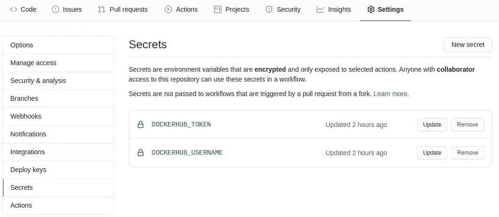

# 使用 GitHub 动作加速数据科学项目中的 CI/CD

> 原文：<https://towardsdatascience.com/using-github-actions-to-speed-up-ci-cd-in-data-science-projects-77d9b1c88228?source=collection_archive---------29----------------------->


照片由[扬西·敏](https://unsplash.com/@yancymin?utm_source=medium&utm_medium=referral)在 [Unsplash](https://unsplash.com?utm_source=medium&utm_medium=referral) 上拍摄

随着关于云计算的最新进展，实现工具变得更加必要，这些工具同时是可扩展的，并且确保执行的可再现性。考虑到这一需求，一些工具应运而生，如 [Docker](https://www.docker.com/) ，它们允许创建应用程序的“配方”，确保同一应用程序的不同版本平等运行。

与虚拟机(VM)不同，虚拟机(VM)通过虚拟机管理程序提供基础架构并模拟处理器和内存，Docker 在整个容器中共享这些资源，使开发人员可以更少地关注基础架构，而更多地关注应用程序的开发。尽管如此，项目和应用程序的容器化减轻了“它在我的机器上运行”的表述，因为它试图确保独立于开发者选择的平台，Docker 容器总是以相同的方式执行。

鉴于容器化的好处不仅限于应用程序的开发，还可以用于其他领域，许多数据科学家开始使用 Docker 来容器化他们的分析、模型训练、仪表板和 API，这不仅可以使项目的交付更容易(因为它减少了出现错误的可能性)，还可以确保一旦发现结果，就可以再次获得。

# CI/CD —持续集成和持续部署

尽管数据科学家生成的许多见解和机器学习模型是有价值的，但当项目被困在不能被其他人使用的个人机器中时，它们无法为它们所插入的业务增加价值。因此，为了确保任何修改都被识别，并且其结果被扩展到其他团队，有持续集成和持续部署(CI/CD)的过程，这允许在项目的初始版本中测试和部署过程的自动化。

许多人可能熟悉 CI/CD 的概念，但是，用于此流程的许多工具都是付费的(例如 [Jenkins](https://www.jenkins.io/) 、 [CircleCI](https://circleci.com/) 和 [TravisCI](https://travis-ci.org/) )，因此仅限于以下人员使用:

*   a)愿意支付这些工具的价格；
*   或者 b)在已经开发了 CI/CD 循环的公司工作。

# GitHub 和 GitHub 操作

GitHub 是一个知名的代码版本平台，拥有超过 4000 万用户和超过 1 亿个存储库，是一个巨大的开源代码来源，可供世界各地成千上万的人使用。

GitHub 于 2019 年创建了 GitHub Actions 工具，旨在支持开源项目的创建，并允许其用户抽象涉及 CI/CD 的流程。它允许用户定义的工作流的自动化，以帮助集成测试、拉请求的验证和许多其他特性。此外，用户使用的动作数量与日俱增，因为许多公司都在寻求开发工具来帮助用户社区。许多这些行动已经允许集成许多流行的工具，如 Docker，AWS CloudFormation，Terraform，以及许多其他可以在[这里](https://github.com/marketplace?type=actions)找到的工具。

尽管 GitHub Actions 只对非私有存储库免费使用，但在考虑使用任何 GitHub 企业工具之前，在私有项目中可以利用不同级别的使用。这打开了一扇门，使得许多开发开源项目的人可以测试他们的工具，并以更加自动化和可扩展的方式传播他们的发现。

# Docker 登录& Docker 构建和推送

与 GitHub 操作一起使用的工具之一是存储库中的登录操作，它允许存储 Docker 映像(如 AWS 的 [Docker Hub](https://hub.docker.com/) 、[ECR](https://aws.amazon.com/pt/ecr/)、GCP 的[GCR](https://cloud.google.com/container-registry))，以及构建这些映像，而无需占用用户的机器。考虑到这些，在 CI 工作流文件中声明了两个操作，可以在这些链接中找到: [docker/login-action](https://github.com/docker/login-action) 和[docker/build-push-action](https://github.com/docker/build-push-action)。

# 将数据科学融入 CI/CD 流程

数据科学领域充满了不同的框架、依赖项和不同的语言，可以根据数据科学家的需求和能力来使用，但其中一个共同的事实是，它们都有可能被容器化过程封装，这有助于确保项目的可重复性。

考虑到这一点，我用来部署 GitHub Actions 自动化工具的例子涉及到使用 R 的 [Shiny](https://shiny.rstudio.com/) 库开发一个 web 应用程序。然而，同样的工作流实现可以用于部署使用 Python 的 [FastAPI](https://fastapi.tiangolo.com/) 开发的 API，即，或任何其他可以封装在 Docker 容器中的框架。

项目可以在这里找到:[paeselhz/ghActionsDockerShiny](https://github.com/paeselhz/ghActionsDockerShiny)。我不会详细介绍应用程序的开发，因为我使用的例子相对简单，没有详细的开发。本文的重点是项目的容器化，以及构建图像并将其存储在 [Docker Hub](http://hub.docker.com/) 中的工作流自动化，以供进一步下载。

# 创建 Dockerfile 文件

对于那些熟悉 Docker 文件及其语法的人来说，它的执行与使用 Docker 在本地开发、构建和运行的项目中的预期是一样的。在其中，我们声明了将用于进一步安装库和依赖项的基本映像，以及项目的配置、文件复制和其他通常可以添加到 Dockerfile 中的步骤。

```
FROM rocker/shiny:4.0.0RUN apt-get update \
  && apt-get install -y \
    libxml2-dev \
    libglpk-dev \
  && install2.r \
    --error \
    dplyr \
    shiny \
    purrr \
    highcharter \
    shinyWidgets \
    shinycssloaders \
    devtools \
    xml2 \
    igraph \
    readr

RUN R -e "devtools::install_github('wilsonfreitas/rbcb')"COPY . /srv/shiny-serverRUN chmod -R 777 /srv/shiny-server
```

这个脚本位于项目根目录中，负责收集已经安装了 Shiny 及其依赖项的映像，并安装将由 r。

# 创建工作流文件

为了让 GitHub Actions 知道工作流自动化需要采取哪些步骤，有必要在项目中创建一个文件，该文件位于。github/workflows/main.yml，文件语法与任何 YAML 文件相同，易于编码。如果用户不想在本地完成这个过程并提交更改，GitHub 本身有一个在线代码编辑器来创建工作流。

在这个文件中声明了一些步骤，例如工作流的名称、将用于部署工作流执行的触发器以及它将负责执行的作业。文件的名称和触发器部分是高度可定制的，用户可以以多种方式对其进行更改，此外，在作业部分，需要几个步骤来完成作业:登录 Docker Hub，配置 BuildX(将用于构建映像的工具)，配置 QEMU(将允许多平台构建的工具)，将构建的映像部署到 Docker Hub，注销并清理机器以确保没有进程仍在运行。

```
# Setting up a Workflow to work with Github Actionsname: ci# Controls to when trigger the GH Action
# Below are configurations to the following triggers:
# - commits at master branch
# - tag commits at the project
# - scheduled to run at 01:00GMT
# The user can also configure triggers at pull requests
# as well as remove branches from triggering GH Actions
on:
  push:
    branches: [ master ]
    tags: [ '*.*.*' ]
  schedule:
    - cron: '0 1 * * *'# Below there is the job configuration to build the image
# and push it to a DockerHub repository
jobs:
  docker:
    runs-on: ubuntu-latest
    steps:
      -
        name: Checkout
        uses: actions/checkout@v2
      -
        name: Prepare
        id: prep
        run: |
          DOCKER_IMAGE=<USER_NAME>/<REPOSITORY_NAME>
          VERSION=noop
          if [ "${{ github.event_name }}" = "schedule" ]; then
            VERSION=nightly
          elif [[ $GITHUB_REF == refs/tags/* ]]; then
            VERSION=${GITHUB_REF#refs/tags/}
          elif [[ $GITHUB_REF == refs/heads/* ]]; then
            VERSION=$(echo ${GITHUB_REF#refs/heads/} | sed -r 's#/+#-#g')
            if [ "${{ github.event.repository.default_branch }}" = "$VERSION" ]; then
              VERSION=edge
            fi
          fi
          TAGS="${DOCKER_IMAGE}:${VERSION}"
          if [[ $VERSION =~ ^[0-9]{1,3}\.[0-9]{1,3}\.[0-9]{1,3}$ ]]; then
            MINOR=${VERSION%.*}
            MAJOR=${MINOR%.*}
            TAGS="$TAGS,${DOCKER_IMAGE}:${MINOR},${DOCKER_IMAGE}:${MAJOR},${DOCKER_IMAGE}:latest"
          elif [ "${{ github.event_name }}" = "push" ]; then
            TAGS="$TAGS,${DOCKER_IMAGE}:sha-${GITHUB_SHA::8}"
          fi
          echo ::set-output name=version::${VERSION}
          echo ::set-output name=tags::${TAGS}
          echo ::set-output name=created::$(date -u +'%Y-%m-%dT%H:%M:%SZ')
      -
        name: Set up QEMU
        uses: docker/setup-qemu-action@v1
      -
        name: Set up Docker Buildx
        uses: docker/setup-buildx-action@v1
      -
        name: Login to DockerHub
        if: github.event_name != 'pull_request'
        uses: docker/login-action@v1
        with:
          username: ${{ secrets.DOCKERHUB_USERNAME }}
          password: ${{ secrets.DOCKERHUB_TOKEN }}
      -
        name: Build and push
        id: docker_build
        uses: docker/build-push-action@v2
        with:
          context: .
          file: ./Dockerfile
          platforms: linux/amd64
          push: ${{ github.event_name != 'pull_request' }}
          tags: ${{ steps.prep.outputs.tags }}
          labels: |
            org.opencontainers.image.title=${{ github.event.repository.name }}
            org.opencontainers.image.description=${{ github.event.repository.description }}
            org.opencontainers.image.url=${{ github.event.repository.html_url }}
            org.opencontainers.image.source=${{ github.event.repository.clone_url }}
            org.opencontainers.image.version=${{ steps.prep.outputs.version }}
            org.opencontainers.image.created=${{ steps.prep.outputs.created }}
            org.opencontainers.image.revision=${{ github.sha }}
            org.opencontainers.image.licenses=${{ github.event.repository.license.spdx_id }}
```

工作流代码几乎没有外部依赖性，假定 Docker 图像名称及其标签的创建在该代码中，然而，它需要一对秘密来登录 Docker Hub，在这种情况下，需要 Docker 使用的用户名和一个令牌来登录 Docker Hub ( [可以在这里生成](https://hub.docker.com/settings/security))。有了用户名和令牌，用户只需进入他们的存储库，在“设置”选项卡中，在“机密”子页中添加令牌，如下图所示:



通过这些步骤，项目应该能够使用 GitHub 动作来执行，从而允许构建、测试和部署过程的自动化。

在本文使用的示例中，最终的映像可以在 Docker Hub [这里](https://hub.docker.com/repository/docker/lhzpaese/ghactions_docker_shiny/general)找到，并通过运行以下命令进行本地测试:

` docker run-p 3838:3838 lhzpaese/GH actions _ docker _ shiny:latest '

## 来源:

本文中使用的许多项目和工具的参考都是以超链接的形式随文本一起添加的。然而，我想离开 Docker 网上研讨会，它是这个项目的灵感来源，由 [metcalfc](https://github.com/metcalfc) 主持，他在会上介绍了用于集成 GitHub Actions 和 Docker 的工具。

感谢您的关注，如有任何问题或建议，请随时通过[https://www.linkedin.com/in/lhzpaese/](https://www.linkedin.com/in/lhzpaese/)和 [paeselhz](https://github.com/paeselhz) 联系我。