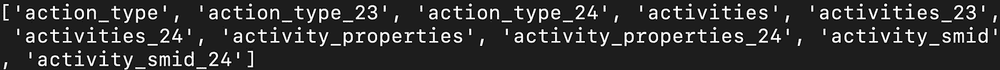
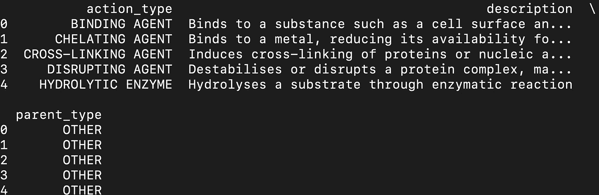
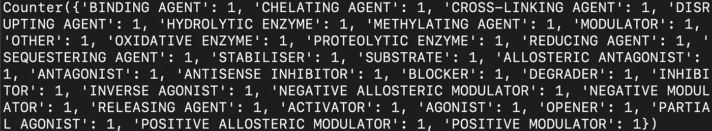
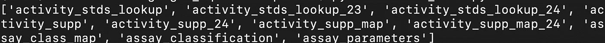
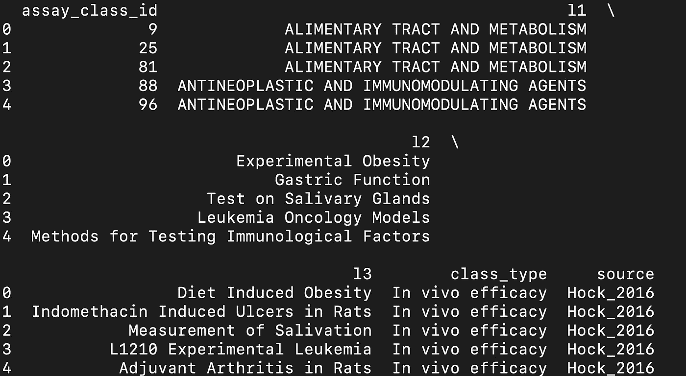
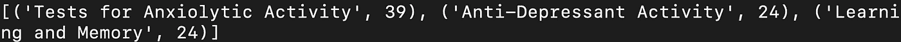
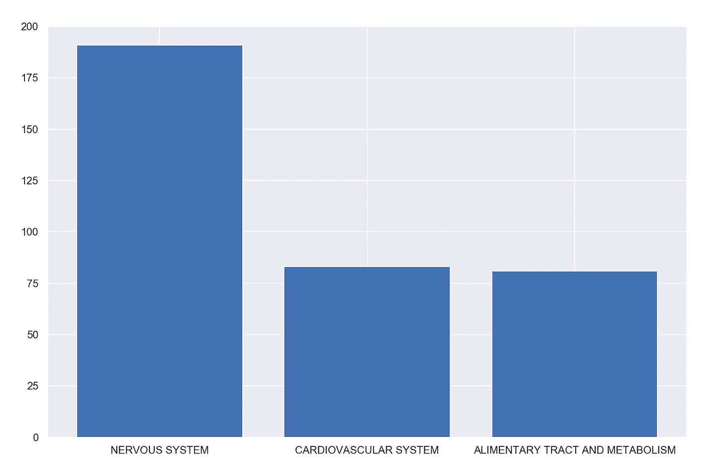
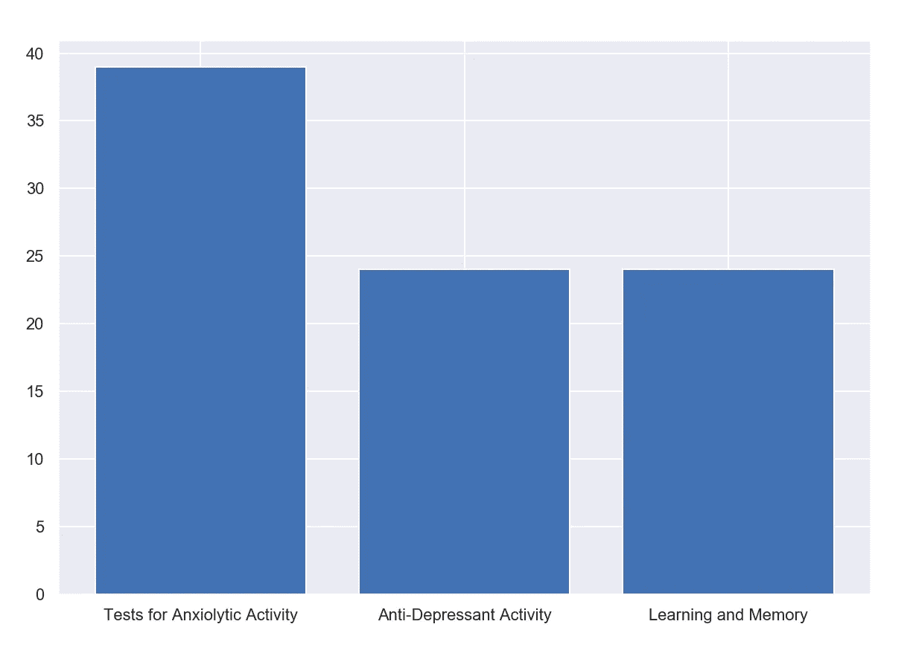

# 使用 Google BigQuery 分析 EBI 小分子数据库的数据

> 原文：<https://towardsdatascience.com/using-google-bigquery-to-analyze-data-from-the-ebi-small-molecules-database-2dcabdc73bc9?source=collection_archive---------32----------------------->

## 分析欧洲生物信息学研究所 CheMBL 数据集


曼努埃尔·盖辛格在[的照片](https://www.pexels.com/photo/interior-of-office-building-325229/)

CheMBL 是一个生物活性分子的药物发现数据库。它汇集了化学、生物活性和基因组学信息，目标是帮助将基因组信息转化为有效的新药。在这篇文章中，我们将对 CheMBL 数据库中的数据样本进行探索性的数据分析。

要访问这些数据，您需要创建一个 Google Cloud 帐户，安装 Google BigQuery 并生成认证凭证。操作说明可以在[这里](https://cloud.google.com/bigquery/docs/bigquery-storage-python-pandas)找到。

我们开始吧！

首先，让我们导入必要的 google 身份验证和 BigQuery 包:

```
from google.oauth2 import service_account
from google.cloud import bigquery
```

接下来，我们需要导入熊猫并将列设置定义为“None”。我们这样做是为了显示所有的列，因为 pandas 默认情况下会截断它们。

```
import pandas as pd
pd.set_option("display.max_columns", None)
```

接下来，我们定义密钥路径、客户端凭证和客户端对象:

```
key_path = "key_path/key.json"credentials = service_account.Credentials.from_service_account_file(
    key_path,
    scopes=["[https://www.googleapis.com/auth/cloud-platform](https://www.googleapis.com/auth/cloud-platform)"],
)client = bigquery.Client(
    credentials=credentials,
    project=credentials.project_id,
)
```

接下来，我们定义数据集引用，其中我们传入数据库的名称“ebi_chembl”和项目的名称“patents-public-data”:

```
dataset_ref = client.dataset("ebi_chembl", project="patents-public-data") 
```

我们可以看看有空的桌子。共有 229 张桌子，但我们将查看前 10 张桌子的名称:

```
columns = [x.table_id for x in client.list_tables(dataset_ref)][:10]
print(columns)
```



让我们看看列表中的第一个元素“action_type”:

```
table_ref = dataset_ref.table('action_type')
table = client.get_table(table_ref)
```

我们可以将结果存储在数据帧中，并打印前五行:

```
df = client.list_rows(table).to_dataframe()
print(df.head())
```



我们可以从 python 中的 collections 模块导入 counter 方法来分析动作类型的分布:

```
from collections import Counter
print(Counter(df['action_type'].values))
```



让我们看看接下来的十张表，看看是否有更详细的信息:

```
columns = [x.table_id for x in client.list_tables(dataset_ref)][10:20]
print(columns)
```



让我们看一下“化验分类”表:

```
table_ref = dataset_ref.table('assay_classification')
table = client.get_table(table_ref)df = client.list_rows(table).to_dataframe()
print(df.head())
```



让我们用计数器来看看“l1”最常见的 3 个值:

```
from collections import Counter
print(Counter(df['l1'].values).most_common(3))
```


对于“l2”:

```
from collections import Counter
print(Counter(df['l2'].values).most_common(3))
```



我们也可以将这些输出可视化。让我们定义一个函数，它将类别字符串作为输入，并显示三个最常见值的条形图:

```
def plot_most_common(category):
    bar_plot = dict(Counter(df[category].values).most_common(3))
    plt.bar(*zip(*bar_plot.items()))
    plt.show()
```

现在让我们用“l1”调用函数:

```
plot_most_common('l1')
```



和“l2”:

```
plot_most_common('l2')
```



在这篇文章中，我们讨论了如何使用 Google BigQuery 访问欧洲生物信息学研究所 CheMBL 数据库。该数据库包含化学，生物活性和基因组信息，可以帮助小分子药物的发现。我们对 action_type 和 assay_classification 表进行了一些基本分析，并生成了一些可视化结果。这篇文章的代码可以在 [GitHub](https://github.com/spierre91/medium_code) 上找到。感谢您的阅读！