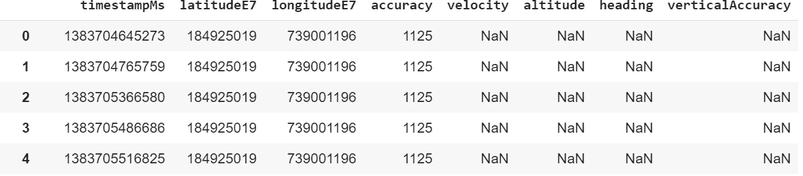
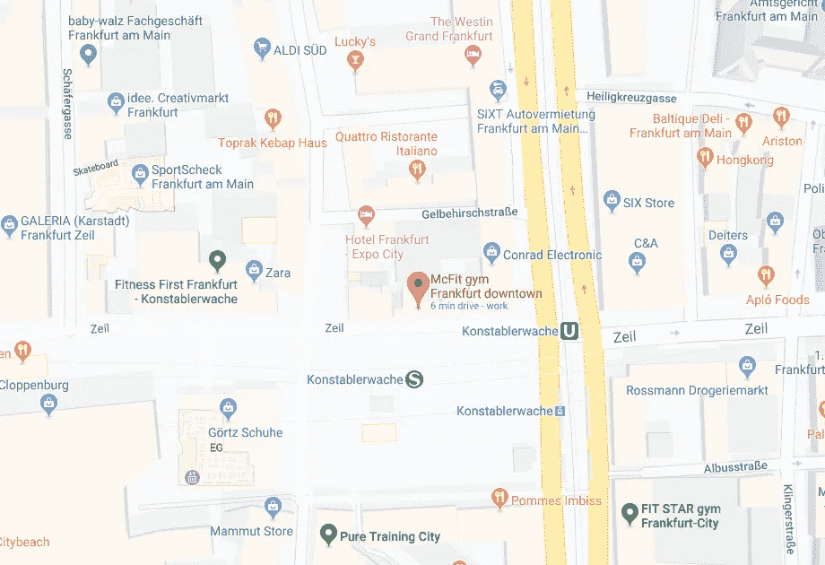
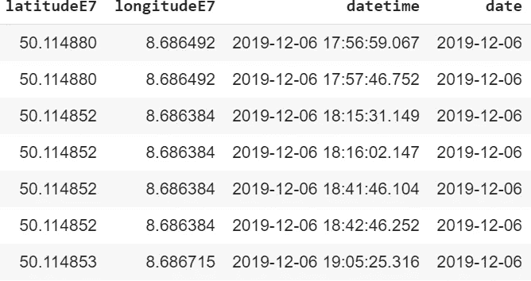
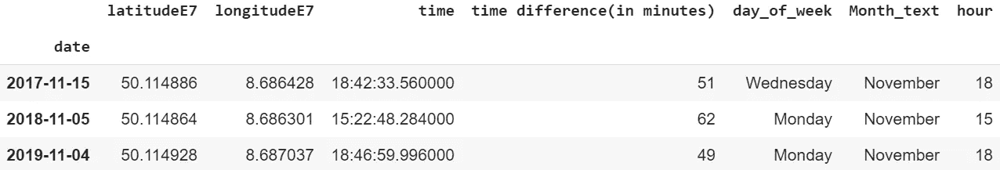
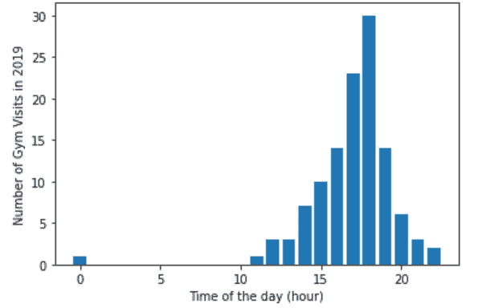
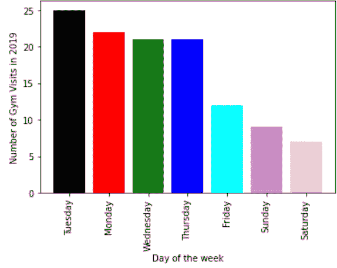
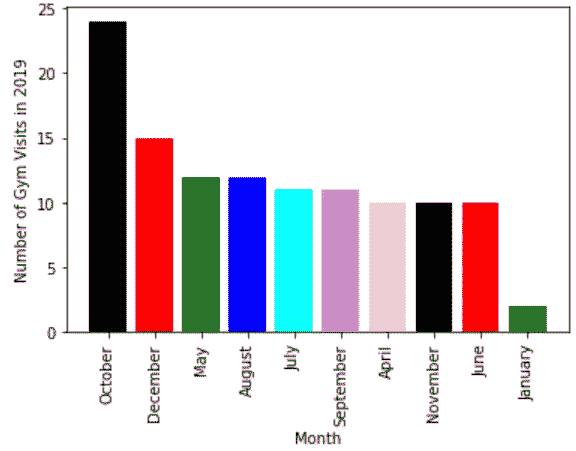
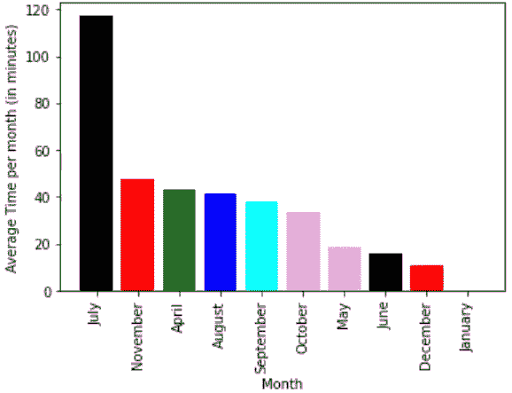

# 使用谷歌位置历史分析健身房访问

> 原文：<https://towardsdatascience.com/using-google-location-history-to-analyze-gym-visits-a8c7c18e0871?source=collection_archive---------28----------------------->

Sebastian Hietsch 在 [Unsplash](https://unsplash.com?utm_source=medium&utm_medium=referral) 上拍摄的照片

## 除了搜索目的地之外，谷歌地图还有其他用途吗

我 2019 年的新年决心之一是更经常地去健身房。作为一个分析数据集的狂热爱好者，我决定利用我一直在收集的位置历史，调查一下去年我在这项工作中的一致性和成效。对于那些不知道的人来说，谷歌记录了你访问过的所有地方(当然，前提是你给予许可！).自从 2013 年我拥有第一部 Android 手机以来，我已经为谷歌分配了存储我的位置历史的权限，因此检索 JSON 中的数据并不困难。使用 Python 和 Matplotlib 来分析数据，我决定看看我去年在遵守决心方面有多成功。

起初，这些数据对我来说没有多大意义。但是一个小小的研究让我了解了错综复杂的数据。这些数据包含了我自 2013 年以来去过的所有地方的纬度、经度和日期。此外，它还包括几个描述“精度”、“速度”、“高度”、“航向”、“垂直精度”的栏目，这些在当前的上下文中对我没有用。因此，第一项任务是把数据整理成我能理解的东西。

来自 JSON 的原始数据帧

除了将“timestampMs”转换为相应的日期和时间，我还删除了“精度”、“速度”、“高度”、“航向”和“垂直精度”列，以创建一个经过处理的数据帧。第二个挑战是瞄准我的健身房的坐标来过滤数据帧。我不得不承认这是分析中最具挑战性的部分之一。纬度和经度是地理坐标系统的一部分，用来确定地球上任何地方的位置。

在谷歌地图上看到的健身房位置

我的健身房由北纬 50° 06 ' 53.5 "和东经 8° 41 ' 12.9 "描述。但是，使用它们，我无法从我的位置历史记录中筛选出与我的健身房相对应的数据点。为了找到一个大概的经纬度范围进行过滤，我把目光对准了谷歌为我 12 月 6 日的锻炼记录的坐标。

为我在 2019 年 12 月 6 日的锻炼处理数据帧

使用与我的健身房相对应的坐标范围，以及相应的日期和时间信息，我终于可以开始了。使用一些数据预处理技巧，为了方便起见，我添加了一些列，这将使分析变得稍微容易一些。使用“日期”列，我将日期和月份信息添加到数据框中。我还添加了我在坐标对上花费的时间，以分钟为单位。

在研究数据以获得进一步的见解之前，我必须解决某些障碍:

1.  并非所有数据都是 100%准确的，因为收集的数据取决于几个因素，包括但不限于持续的互联网连接和手机 GPS 定位。当然没有办法克服这个丢失数据的问题。
2.  数据点有可能会受到附近地区的影响。例如，我在体育馆下面的地铁站等火车也可能被错误地解释为我在体育馆度过的时间。为了解决这个问题，我简单地排除了坐标对持续时间少于 15 分钟的数据点。

现在我已经获得了我需要的必要信息，即日期和时间，我可以更深入地研究这些数据了。

使用熊猫图书馆的 unique()，我确定在去年的 365 天中，我去了健身房 119 次。更深入地说，我决定调查每次锻炼需要多长时间，并研究一天中的时间、一周中的日子和一个月中的趋势。

18:00 似乎是我最喜欢的锻炼时间

那么我在健身房锻炼的平均时间是多少呢？一天中的大部分时间，我要么在大学，要么在语言学校，要么在工作，这可能解释了为什么我锻炼的高峰时间会在 17:00 或 18:00 左右。在假期里，也有几天我会稍微早一点去健身房。还有一个异常点，我 00:00 在体育馆。

一周中的哪一天我更有可能去健身房？星期二！。令人惊讶的是，我最自由的日子是我很少去健身房的日子。然而，作为辩护，大多数周末也是我计划旅行的日子。然而，事后看来，人们可以得出这样的结论:随着时间的推移，我的动力会逐渐减弱。

2019 年每周每天的健身房访问量

查看我每月的访问量也发现了一些有趣的事实。十月是访问量最大的月份。

2019 年每月健身房访问量

然而，当它们被绘制成每次访问所花费的平均时间时，表格完全翻转过来，其中七月名列榜首。七月是夏天来临的时候，宜人的天气加上即将到来的暑假增加了在健身房锻炼的动力。虽然我在 10 月份去健身房的次数增加了，但我忙于应付工作和学校，没有时间在健身房呆很长时间(也降低了温度！).由于考试带来的压力，二月和三月不见了。

2019 年每月在健身房花费的平均时间

健身房的订阅费是每月 15€，去年 119 次，每次大约花费我 2€。不管有没有商业意识，收益远远超过了成本，所以对我来说，这是值得的。

从 2018 年的 20 天到 2019 年的 119 天，我认为去年是一个很大的进步。我后悔没有通过一个应用程序来跟踪我的成长，这可以给我一个关于我的习惯如何影响我的整体健康的整体信息。然而，我已经开始采取措施来整合它们，并希望能够在 2020 年给你一个更好的画面。感谢您的阅读。如果你有任何问题，你一定可以联系我。