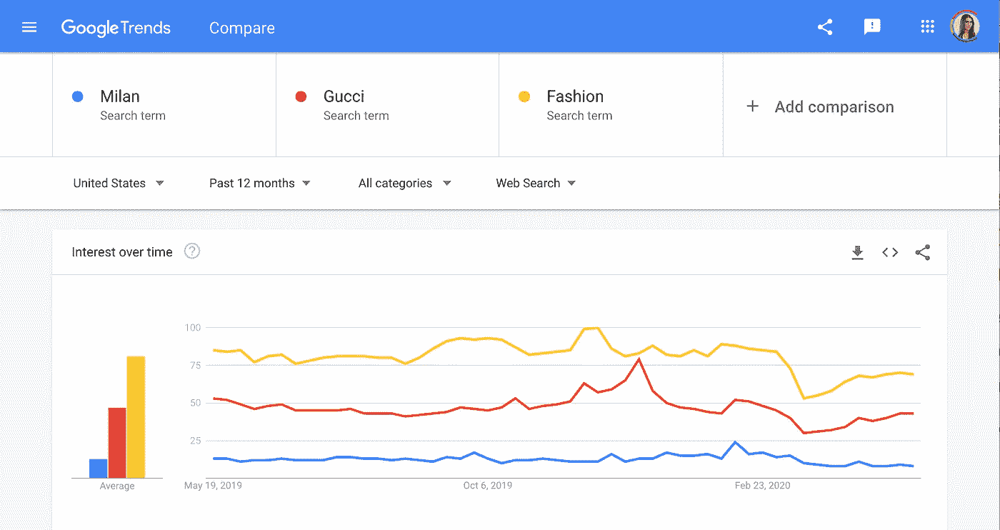

# 大规模使用谷歌趋势

> 原文：<https://towardsdatascience.com/using-google-trends-at-scale-1c8b902b6bfa?source=collection_archive---------20----------------------->



[https://trends.google.com/trends/explore?geo=US&q =古驰米兰，时尚](https://trends.google.com/trends/explore?geo=US&q=Milan,Gucci,Fashion)

## 当你的问题对他们面向公众的网站来说太大时，如何使用谷歌趋势

谷歌趋势是公众对一个话题的兴趣的有力衡量标准，换句话说，就是它的炒作；然而，它的设置方式使得它很难在最简单的应用程序之外使用。在这篇文章中，我们深入研究了 Google Trends 到底在测量什么，并探索了当你的问题超过了面向公众工具的五个主题限制时如何使用它。

# 谷歌趋势到底衡量什么？

Google Trends 给你一个在一段时间内给定搜索词的搜索量的标准化测量。来自他们的常见问题:

> 每个数据点除以它所代表的地理和时间范围的总搜索次数，以比较相对受欢迎程度。否则，搜索量最大的地方总是排名最高。
> 
> 然后，根据一个主题在所有主题的所有搜索中所占的比例，将结果数字在 0 到 100 的范围内进行缩放。— [谷歌趋势常见问题解答](https://support.google.com/trends/answer/4365533?hl=en)

也就是说，对于你搜索中的每一个词，谷歌会找到你的词在每个地区和时间段的搜索量相对于该地区和时间段所有搜索量的比例。它将所有这些指标合并成一个单一的受欢迎程度指标，然后对你的主题进行分级，因此最大的指标被设置为 100。

*简而言之:谷歌趋势并不能准确地告诉你你的主题出现了多少次搜索，但它确实给了你一个很好的代理。*

# 是什么让谷歌趋势变得棘手？

尽管 Google Trends 可以方便地快速把握互联网的脉搏，但服务本身的结构使大规模应用变得困难，原因有二:

## 1.五趋势极限

目前，面向公众的谷歌趋势网站不允许超过五个词的查询。如果你想探索任何真实世界的问题，这显然是有限制的。例如，在民主党初选的早期，你不可能轻易地比较所有主要候选人的受欢迎程度。

## 2.相对度量

对这个限制的明显反应是，“好吧，我就用多重查询”。但是正如我们前面提到的，所有的搜索都被缩放到你的查询中最高容量的主题，所以如果两个不同的查询没有相同的最大主题，它们是不可比较的。

# 怎样才能一次看五个以上的趋势？

最后一句话是关键:

> 如果他们没有相同的最大话题

只要两个查询共享相同的最受欢迎的主题，它们将以相同的方式缩放，因此趋势将是可比较的。接下来，如果你想在谷歌趋势中比较五个以上的主题，你只需要在每个搜索中包含一个控制主题。

例如，在最近的一个项目中，我和我的团队想要比较网飞和亚马逊内容的受欢迎程度。我们浏览了两个平台的最佳内容列表，并找出了每个标题相对于单词“法国”的谷歌趋势指标。

*我们到底是如何决定使用“法兰西”这个词的？*

这有点像菜谱:你想要比你感兴趣的所有条款都更稳定、更安全的东西。

利用领域知识，我知道哪些图书会有特别高的搜索量，所以我寻找一个比我们最受欢迎的图书更受欢迎的词，但不要太受欢迎以至于我会丢失关于不太受欢迎的图书的任何真实信息。例如，“比特币”的搜索量如此之高，以至于许多标题被归一化为零([见我这里的意思](https://trends.google.com/trends/explore?date=today%205-y&geo=US&q=%2Fg%2F11c0rgstc8,%2Fm%2F05p0rrx))。

# 我可以通过编程来实现吗？

是的。

对于流媒体项目，我使用了 Python 库 [pytrends](https://pypi.org/project/pytrends/) ，这是 Google Trends 的一个非官方 API。下面您可以找到一个快速片段来帮助您开始:

```
import pytrends kw_list = ##list of topics I wanted to search
trends = dict()for i in kw_list:
   ##build out query
   pytrends.build_payload([i,'France'], cat=0,timeframe='today 5-y')

   ##save trend to dictionary
   trends[i] = pytrends.interest_over_time()[i]
```

您应该注意到，如果您尝试对多个查询执行此操作，您将会相对较快地达到 Google 的 DoS(拒绝服务)限制，因此您会希望在每个查询之间暂停循环几秒钟。

# 总而言之:

1.  谷歌趋势很好地代表了公众利益
2.  要使多个查询具有可比性，请包含一个在每次搜索中最大的控制项
3.  使用 [pytrends](https://pypi.org/project/pytrends/) 来自动化该过程

使用这种方法，您现在可以回答一些大问题，如:与竞争对手的产品相比，我的产品有多受欢迎，最近的广告活动对不同产品类别的兴趣有没有不同的影响…

*总之:五个字的限制不再是你的了。*