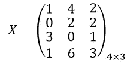

# 基于结构化文档的图卷积神经网络信息抽取

> 原文：<https://towardsdatascience.com/using-graph-convolutional-neural-networks-on-structured-documents-for-information-extraction-c1088dcd2b8f?source=collection_archive---------5----------------------->

## 将结构化文档转换为图形的代码，以及对 GCN 实现的全面调查，以对其中的文本实体进行分类


虽然像 CNN 这样的深度学习解决方案可以有效地捕获欧几里得空间中的数据模式，但越来越多的应用程序以图形的形式表示数据，缺乏网格状的规律性。由于图形可能是不规则的，它们可能具有可变大小的无序节点，并且每个节点可能具有不同数量的邻居，导致诸如卷积之类的数学运算难以应用于图形域。

这种非欧几里德数据的一些例子包括:

*   **蛋白质-蛋白质相互作用数据**其中分子之间的相互作用被建模为图形
*   **引文网络**其中科学论文是节点，引文是单向或双向边
*   社交网络，网络上的人是节点，他们的关系是边

本文特别讨论了在发票和账单等结构化文档中使用图形卷积神经网络(GCNs ),通过学习文本实体之间的位置关系来自动提取有意义的信息。讨论了多种方法以及将文档转换为图形的方法，因为文档本身没有类似图形的布局。

# **什么是图？**

图表表示为:


在哪里，


现在让我们，


表示一个节点，


表示从 v_i 指向 v_j 的一条边。那么，邻接矩阵 *A* 是一个 *n* x *n* 矩阵，


其中 *n* 是图中节点的数量。

此外，图可以具有节点属性，


其中 *X* 是节点特征矩阵，


代表节点 *v* 的特征向量。

以下是一些没有自循环的无向图及其对应的邻接矩阵的图示:


礼貌:mathworld.wolfram.com

这些节点中的每一个还可以具有由特征矩阵表示的节点属性或特征向量:



四个节点中的每一个都具有三维特征向量的示例

在社交网络的真实世界示例中，节点属性可以是关于人(节点)的人口统计信息，并且他们的关系可以是边。请务必阅读[这篇](/graph-theory-and-deep-learning-know-hows-6556b0e9891b)文章，深入了解图表。

# **如何将结构化文档转换成图形？**

当涉及标题和表格等实体时，发票和账单等结构化文档有一定的出现顺序。例如，在大多数发票中，表格位于页眉和页脚之间。此外，总金额通常位于表格的右下角，这是我们希望提取的发票的一个重要实体。这种重复出现的结构信息以及文本属性可以帮助图形神经网络学习邻域表示，并作为结果执行节点分类。

但是我们如何以图形格式获得这样的文档呢？

答案是 OCR 加上几何算法。

**光学字符识别:**

在这一步，我们使用商业上可用的 OCR 引擎，如 [Amazon Textract](https://aws.amazon.com/textract/) 或 [Google Vision API](https://cloud.google.com/vision/docs/ocr) 来生成所谓的文档对象图。

地图中的每个“对象”都是一个文本实体——一个单词或一个句子。在本文的上下文中，我们将对象映射称为具有五列的 [Pandas 数据帧](https://pandas.pydata.org/pandas-docs/stable/reference/api/pandas.DataFrame.html)——xmin、ymin、xmax、ymax、object。

(xmin，ymin)和(xmax，ymax)给出了矩形边界框的坐标，而 Object 列给出了该框内的实际文本。

下面是 GitHub 的一个要点，给出了文档图像的路径和 Google Vision API 实例的端点 URL。

生成“对象图”的 OCR 脚本

**对象映射到图形:**

一旦我们生成了对象图，我们就利用基于可见性的几何算法将对象彼此连接起来，从而形成一个图，其中对象作为*节点*，连接作为*边*。

*几何算法:基于可见性连接对象*

```
*Input*: 
  Object Map*Output*: 
  Graph Dictionary: {source_node: [dest_node_1, dest_node_2, …], ..}
  Text List: Text for each node
```

第一步:从左上角的物体开始。对于地图中的每个对象，迭代所有其他对象。
步骤 2:对于每个物体，向右看。
第三步:如果另一个物体直接可见，建立连接。第四步:对于每个物体，直接看下面。
第五步:如果另一个物体直接可见，建立联系。

输出是字典的形式，因此我们可以使用网络分析的 Python 库 [networkx](https://networkx.github.io/) 来构建一个图。此外，我们返回文本列表，以便使用每个节点的文本作为其特征向量。

下面是 [Python 实现](https://github.com/dhavalpotdar/Graph-Convolution-on-Structured-Documents/blob/7400704346cb9698f6c6b1ad3307d2439d17fa33/grapher.py#L11)。

接下来，我们使用 networkx 为文档创建一个邻接矩阵 *A* 以及一个特征矩阵 *X* ，该矩阵是通过在字符级别对每个文本对象进行计数矢量化而生成的。

下面是同样的[代码](https://github.com/dhavalpotdar/Graph-Convolution-on-Structured-Documents/blob/7400704346cb9698f6c6b1ad3307d2439d17fa33/grapher.py#L520)。

最终结果，我们希望文档看起来像这样:


将发票绘制成图表

# 用于信息抽取的文档图上的卷积

一旦我们有了图表形式的文档，下一步就是将这些数据提供给 GCN。在这里，我们可以从许多 GCN 实现中进行选择，其中最著名的如下所述:

**GraphSAGE —大型图上的归纳表征学习:**
*论文:* [arXiv](https://arxiv.org/abs/1706.02216)
*网站:*[snap.stanford.edu](http://snap.stanford.edu/graphsage/)
*代码:* [GitHub](https://github.com/williamleif/GraphSAGE) *插图:*


归纳表征学习。

**图卷积神经网络半监督分类:** *论文:* [arXiv](https://arxiv.org/abs/1609.02907)
*网站:*[tkipf . GitHub . io](https://tkipf.github.io/graph-convolutional-networks/)
*代码:* [GitHub](https://github.com/tkipf/gcn) *插图:*


具有一阶滤波器的多层 GCN。

> 以下是特别适用于从发票中提取信息的 GCNs 的实现:

**结构化文档中的表格理解:** *论文:* [arXiv](https://arxiv.org/abs/1904.12577)
*描述:*
本文中 GCN 的实现并不严格遵循图卷积的数学定义，而是对于每个节点，将图中连通节点的特征向量简单地与所考虑节点的特征向量串接起来。因此，为每个节点形成新的聚集特征向量，然后简单地通过完全连接的层馈送该向量。

**图形神经网络在发票单据中的表格检测:** *纸张:* [ICDAR](https://priba.github.io/assets/publi/slides/2019_ICDAR_PRiba.pdf) *幻灯片:*[priba . github . io](https://priba.github.io/assets/publi/slides/2019_ICDAR_PRiba.pdf)
*代码:*虽然代码不是作者提供的，但[这里是我的入门代码](https://github.com/dhavalpotdar/Graph-Convolution-on-Structured-Documents)同样。 *插图:*


模型架构概述，P. Riba 等人。

# 实验

所有这些方法都给出了令人鼓舞的结果。例如，下面是一个样本发票的半监督分类方法的输出:


半监督分类的输出

由于半监督学习的范例规定，在学习表示时，标记的和未标记的节点都出现在图中，所以在作为图的单个发票上观察到该输出。

总共有四个类——信息、联系人、表项和其他(未显示)。最初为每个类标记了一组种子节点。然后，GCN 能够从这些初始种子节点中学习未标记节点的表示。

可以通过使用标准 NLP 技术首先识别种子节点，然后将图馈送到网络来实现端到端解决方案。这里最值得注意的特性是能够以非常低的延迟为以前看不见的文档生成节点表示。

# 结论

图卷积神经网络被证明在新的应用中越来越有用，其中数据采用连接主义结构。此外，在结构化文档的情况下，具有空间意义的数据可以适用于图形结构，然后与 gcn 一起使用。

半监督学习可以在静态图上动态使用，以生成节点的表示，而不需要大的训练集。超越非欧几里德数据的普通 CNN 为应用研究的新领域打开了令人兴奋的机会。

[这里](https://arxiv.org/pdf/1901.00596.pdf)是截至 2019 年对图神经网络的全面调查，供进一步阅读。

[达瓦尔·波特达尔](https://medium.com/u/c5d462ada007?source=post_page-----c1088dcd2b8f--------------------------------)是一名数据科学爱好者，拥有人工智能研究的经验。他毕业于 Udacity 的[数据分析师](https://www.udacity.com/course/data-analyst-nanodegree--nd002)和[机器学习工程师](https://www.udacity.com/course/machine-learning-engineer-nanodegree--nd009t)纳米学位，目前在孟买的一家分析初创公司工作。我越来越擅长处理杂乱的数据，并将其转化为有价值的东西。在 [LinkedIn](https://www.linkedin.com/in/dhavalpotdar/) 上与我联系，并查看我的 [GitHub](https://github.com/dhavalpotdar) 以获得更多酷项目。