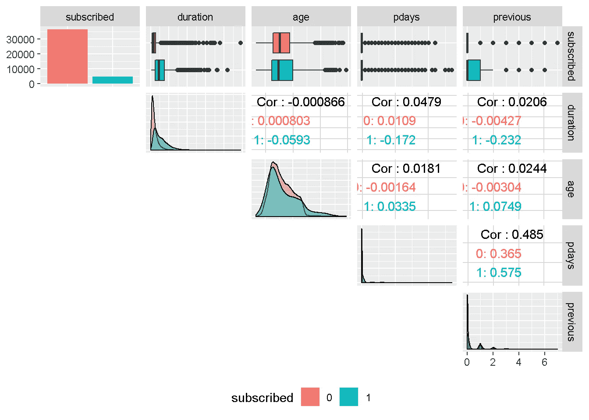

# 拟合多个倾向模型，并选择最佳表现的一个来实现利润优化

> 原文：<https://towardsdatascience.com/using-h2o-and-dalex-to-estimate-the-likelihood-to-purchase-a-financial-product-a53f891f0d1?source=collection_archive---------7----------------------->

## 用 h2o 和 DALEX 评估购买金融产品可能性的案例研究


丹·梅耶斯在 [Unsplash](https://unsplash.com/@dmey503?utm_source=unsplash&utm_medium=referral&utm_content=creditCopyText) 上的照片

在当今时代，利用数据来理解客户行为驱动因素的企业拥有真正的竞争优势。通过有效地分析客户层面的数据，组织可以显著提高其在市场中的表现，并将精力集中在那些更有可能参与的客户身上。

从数据中梳理这种洞察力的一种经过试验和测试的方法是 [**倾向建模**](https://en.wikipedia.org/wiki/Predictive_modelling) ，它结合了以下信息:a **客户的人口统计数据**(年龄、种族、宗教、性别、家庭规模、种族、收入、教育水平)**心理图**(社会阶层、生活方式和个性特征)**参与度**(打开的电子邮件、点击的电子邮件、移动应用程序上的搜索、网页停留时间等)。)、**用户体验**(客户服务电话和电子邮件等待时间、退款次数、平均运送时间)**用户行为**(不同时间尺度上的购买价值、最近一次购买后的天数、报价和转换之间的时间等)。)来估计某个客户档案执行某类行为(例如购买产品)的可能性。

一旦你了解了某个客户与某个品牌互动、购买某个产品或注册某项服务的可能性，你就可以利用这些信息来创造情景，比如最小化**营销支出**，最大化**收购目标**，以及优化**电子邮件发送频率**或**折扣深度**。

# 项目结构

在这个项目中，我正在分析一家银行向现有客户销售定期 a 存款的直接营销活动的结果，以确定哪种类型的特征更有可能让客户做出反应。营销活动基于电话，有时需要与同一个人进行多次联系。

首先，我将进行**广泛的数据探索**，并使用结果和见解为分析准备数据。

然后，我正在**估算模型的数量**，并使用**模型不可知的方法**评估它们的性能和对数据的拟合，这使得**能够比较传统的“玻璃箱”模型和“黑箱”模型**。

最后，我将**拟合一个最终模型**，该模型结合了探索性分析的结果和模型选择的洞察力，并使用该模型**进行收入优化**。

# 数据

```
library(tidyverse)
library(data.table)
library(skimr)
library(correlationfunnel)
library(GGally)
library(ggmosaic)
library(knitr)
library(h2o)
library(DALEX)
library(knitr)
library(tictoc)
```

数据是来自 [UCI 机器学习库](https://archive.ics.uci.edu/ml/datasets)的 [**葡萄牙银行营销**](https://archive.ics.uci.edu/ml/datasets/Bank+Marketing) 集，描述了一家葡萄牙银行机构开展的旨在向其客户销售定期存款/存单的直接营销活动。营销活动基于 2008 年 5 月至 2010 年 11 月期间对潜在买家的电话访问。

我正在使用的数据[**(bank-direct-marketing . CSV**](https://github.com/DiegoUsaiUK/Propensity_Modelling/tree/master/01_data/bank-direct-marketing.csv)**)**是[bank-additional-full . CSV](https://archive.ics.uci.edu/ml/machine-learning-databases/00222/bank-additional.zip)的修改版本，包含 41，188 个带有 21 个不同变量的示例(10 个连续变量，10 个分类变量加上目标变量)。具体来说，目标**订阅**是一个**二进制响应变量**，表示客户是否订阅(‘是’或数值 1)定期存款(‘否’或数值 0)，这使得这成为一个 [*二进制分类问题*](https://en.wikipedia.org/wiki/Binary_classification) 。

这些数据需要一些操作才能变成可用的格式，详情可以在我的网页上找到: [**倾向建模——数据准备和探索性数据分析**。](https://diegousai.io/2020/01/propensity-modelling-data-preparation)在这里，我简单地在我的 GitHub repo 上为这个项目 加载我托管的预清理数据[](https://github.com/DiegoUsaiUK/Propensity_Modelling)

```
data_clean <- 
  readRDS(file = "https://raw.githubusercontent.com/DiegoUsaiUK/Propensity_Modelling/master/01_data/data_clean.rds")
```

# **探索性数据分析**

**虽然是任何数据科学项目不可或缺的一部分，并且对分析的完全成功至关重要，但[探索性数据分析(EDA)](https://en.wikipedia.org/wiki/Exploratory_data_analysis) 可能是一个极其耗费人力和时间的过程。近年来，旨在加速这一过程的方法和库大量涌现，在这个项目中，我将对其中一个“街区上的新孩子”([**correlation funnel**](https://business-science.github.io/correlationfunnel/))进行采样，并将其结果与更传统的 EDA 相结合。**

# **相关通道**

**通过 3 个简单的步骤`correlationfunnel`可以生成一个图表，按照与目标变量绝对相关性的降序排列预测值。漏斗顶部的特征预计在模型中具有更强的预测能力。**

**这种方法提供了一种快速确定所有变量的预期预测能力等级的方法，并给出了任何模型中哪些预测因子应该具有强/弱特征的早期指示。**

```
data_clean %>%  

  binarize(n_bins = 4, # bin number for converting features
           thresh_infreq = 0.01 # thresh. for assign categ.             
                                # features into "Other"
          ) %>% # correlate target variable to features 
  correlate(target = subscribed__1) %>%      # correlation funnel visualisation
  plot_correlation_funnel()
```

****

**放大前 5 个特征，我们可以看到，在以下情况下，某些特征与目标变量(订购定期存款产品)的相关性更大:**

*   **与客户最后一次电话联系的时间是 319 秒或更长**
*   **客户最后一次联系后经过的`days`数量大于 6**
*   **`previous`营销活动的结果是`success`**
*   **就业人数为 509.9 万或更多**
*   **3 个月欧元银行同业拆放利率的值为 1.344 或更高**

****

**相反，漏斗底部的变量，如**星期几**、**住房**和**贷款**。与目标变量相比，变化非常小(即:它们非常接近响应的零相关点)。因此，我不认为这些特性会影响响应。**

****

# **功能探索**

**在这种视觉相关性分析结果的指导下，我将在下一节中继续探索目标和每个预测因素之间的关系。为此，我将寻求优秀的 **GGally** 库的帮助，用`Ggpairs`可视化相关矩阵的修改版本，用 **ggmosaic** 包绘制`mosaic charts`，这是检查两个或更多分类变量之间关系的好方法。**

## **目标变量**

**首先，**目标变量** : `subscribed`显示出**强烈的阶级不平衡**，在**无类别**中有近 89%到**有类别**中有 11%。**

****

**我将在建模阶段通过在 **h2o** 中启用**重新采样**来解决**类不平衡**。这将通过“收缩”主要类别(“否”或“0”)来重新平衡数据集，并确保模型充分检测哪些变量在驱动“是”和“否”响应。**

## **预言者**

**让我们继续看一些数字特征:**

****

**尽管关联漏斗分析显示**持续时间**具有最强的预期预测能力，但它在通话前是未知的(显然在通话后是已知的),并且几乎不提供可操作的洞察力或预测价值。因此，它应该从任何现实的预测模型中被丢弃，并且不会在这个分析中被使用。**

****年龄**的密度图与目标变量相比具有非常相似的方差，并且以相同的区域为中心。基于这些原因，应该不会对**认购**产生太大影响。**

**尽管本质上是连续的， **pdays** 和 **previous** 实际上是分类特征，并且都是强烈右偏的。由于这些原因，需要将它们离散成组。这两个变量也适度相关，表明它们可能捕捉到相同的行为。**

**接下来，我将**银行客户数据**与*马赛克图表*可视化:**

****

**根据*相关渠道*的调查结果，**工作**、**教育**、**婚姻**和**默认**都显示出与目标变量相比的良好变化水平，表明它们会影响响应。相比之下，**住房**和**贷款**位于漏斗的最底部，预计对目标几乎没有影响，因为按“已认购”响应划分时变化很小。**

****默认**只有 3 个“是”级别的观察值，这些观察值将被滚动到最不频繁的级别，因为它们不足以做出正确的推断。**住房**和**贷款**变量的“未知”级别有少量观察值，将被归入第二小类别。最后，工作、教育也将从最不常见水平的分组中受益。**

**继续讨论**其他活动属性**:**

****

**虽然在原则上是连续的，**战役**在本质上是更明确的，并且是强烈右倾的，将需要被离散成组。然而，我们已经从早期的相关性分析中了解到，在任何模型中，这都不是一个强有力的变异驱动因素。**

**另一方面， **poutcome** 是期望具有强预测能力的属性之一。级别的不均匀分布表明将最不常见的级别(**成功**或`scs`)归入另一个类别。然而，联系以前购买过定期存款的客户是具有最高预测能力的特征之一，需要保留不分组。**

**然后，我在看**最后一条联系信息**:**

****

****联系**和**月份**应影响响应变量，因为它们与目标相比都有较好的变化水平。**月**也将受益于最不常见级别的分组。**

**相比之下，**星期几**似乎不会影响响应，因为水平之间没有足够的变化。**

**最后但同样重要的是，**社会和经济属性**:**

****

**与目标变量相比，所有的*社会和经济属性*都显示出良好的变化水平，这表明它们都应该对响应产生影响。它们都显示出**高度的多模态**，并且在密度图中不具有均匀的分布，并且将需要被分箱。**

**同样值得注意的是，除了*消费者信心指数*之外，所有其他社会和经济属性彼此之间都有很强的相关性，这表明只有一个属性可以被包括在模型中，因为它们都在“拾取”相似的经济趋势。**

# **探索性数据分析总结**

*   **使用**相关通道**进行的相关性分析有助于确定所有变量的预期预测能力等级**
*   ****期限**与目标变量的相关性最强，而一些银行客户数据如**住房**和**贷款**的相关性最弱**
*   **但是，**持续时间**将**而不是**用于分析，因为它在调用前是未知的。因此，它提供的可操作的洞察力或预测价值非常少，应该从任何现实的预测模型中丢弃**
*   **目标变量 **subscribed** 显示了强烈的类别不平衡，其中近 89%的**没有变动**，这需要在建模分析开始之前解决**
*   **大多数预测者将受益于最不常见水平的分组**
*   **进一步的特征探索揭示了大多数**社会和经济背景属性**彼此之间有很强的相关性，这表明在最终模型中只能考虑其中的一部分**

# **最终数据处理和转换**

**根据探索性数据分析的结果，我将最不常见的级别组合到“其他”类别中，将除`age`之外的所有变量设置为无序因子( **h2o** 不支持有序分类变量)，并缩短一些分类变量的级别名称，以方便可视化。你可以在我的网页上找到所有细节和完整代码: [**倾向建模——数据准备和探索性数据分析**。](https://diegousai.io/2020/01/propensity-modelling-data-preparation)**

**在这里，我简单地在我的 GitHub repo 上加载最终的数据集托管 [**:**](https://github.com/DiegoUsaiUK/Propensity_Modelling)**

```
data_final <- 
  readRDS(file = "https://raw.githubusercontent.com/DiegoUsaiUK/Propensity_Modelling/master/01_data/data_final.rds")
```

# **建模策略**

**为了坚持合理的项目运行时间，我选择了 **h2o** 作为我的建模平台，因为它提供了许多优势:**

*   **它非常容易使用，你可以立刻**评估几个机器学习模型****
*   **它**不需要通过“二进制化”字符/因子变量来预处理它们**(这是在“内部”完成的)，这进一步减少了数据格式化时间**
*   **它有一个功能，即**处理在数据探索阶段突出显示的类不平衡**——我只是在模型规范中设置了`balance_classes` = TRUE，稍后会详细介绍**
*   ****可以启用交叉验证**，而不需要从训练集中“分割”出一个单独的`validation frame`**
*   ****超参数微调**(也称为网格搜索)可以与多种策略一起实施，以确保运行时间在不影响性能的情况下得到限制**

# **使用 h2o 构建模型**

**我开始用`rsample`创建一个随机的训练和验证集，并将它们保存为`train_tbl`和`test_tbl`。**

```
set.seed(seed = 1975) train_test_split <-
  rsample::initial_split(
    data = data_final,     
    prop = 0.80   
  ) train_tbl <- train_test_split %>% rsample::training() 
test_tbl  <- train_test_split %>% rsample::testing()
```

**然后，我启动一个 **h2o 集群**。我将内存集群的大小指定为“16G”，以帮助加快速度，并关闭进度条。**

```
# initialize h2o session and switch off progress bar
h2o.no_progress() 
h2o.init(max_mem_size = "16G")
```

**接下来，我整理出响应和预测变量集。对于要执行的分类，我需要**确保响应变量是因子**(否则 h2o 将执行回归)。这是在数据清理和格式化阶段解决的。**

```
# response variable
y <- "subscribed"# predictors set: remove response variable
x <- setdiff(names(train_tbl %>% as.h2o()), y)
```

# **拟合模型**

**对于这个项目，我正在估算一个**广义线性模型**(又名弹性网)、一个**随机森林**(其中 **h2o** 指的是*分布式随机森林*)和一个**梯度推进机**(或 GBM)。**

**为了实现对`tree-based`模型(DRF 和 GBM)的网格搜索，我需要建立一个随机网格来**搜索`h2o.grid()`函数的最优超参数**。为此，我从定义要传递给`hyper_params`参数的**搜索参数**开始:**

*   **`sample_rate`用于设置每棵树的行采样率**
*   **`col_sample_rate_per_tree`定义了每棵树的列抽样**
*   **`max_depth`指定最大树深**
*   **`min_rows`确定每片叶子的最小观察次数**
*   **`mtries`(仅 DRF)表示在树的每个节点上随机选择的列**
*   **`learn_rate`(仅适用于 GBM)指定建立模型时模型学习的速率**

```
# DRF hyperparameters
hyper_params_drf <- 
  list(
     mtries                   = seq(2, 5, by = 1), 
     sample_rate              = c(0.65, 0.8, 0.95),
     col_sample_rate_per_tree = c(0.5, 0.9, 1.0),
     max_depth                = seq(1, 30, by = 3),
     min_rows                 = c(1, 2, 5, 10)
   )# GBM hyperparameters
hyper_params_gbm <- 
  list(
    learn_rate               = c(0.01, 0.1),
    sample_rate              = c(0.65, 0.8, 0.95),
    col_sample_rate_per_tree = c(0.5, 0.9, 1.0),
    max_depth                = seq(1, 30, by = 3),
    min_rows                 = c(1, 2, 5, 10)
    )
```

**我还为`search_criteria`参数设置了第二个列表，这有助于管理模型的估计运行时间:**

*   **将`strategy`参数设置为 **RandomDiscrete** ，以便搜索从网格搜索参数中随机选择一个组合**
*   **将`stopping_metric`设置为 AUC，作为提前停止的误差度量——当度量停止改善时，模型将停止构建新的树**
*   **使用`stopping_rounds`,我将指定考虑提前停止前的训练轮数**
*   **我使用`stopping_tolerance`来设置继续训练过程所需的最小改进**
*   **`max_runtime_secs`将每个型号的搜索时间限制为**一小时****

```
search_criteria_all <- 
   list(
      strategy           = "RandomDiscrete",
      stopping_metric    = "AUC",    
      stopping_rounds    = 10,
      stopping_tolerance = 0.0001,
      max_runtime_secs   = 60 * 60
   )
```

**最后，我可以建立模型的公式。请注意，所有模型都有两个共同的参数:**

*   **`nfolds`参数，使**交叉验证**能够在不需要 validation_frame 的情况下执行——例如，如果设置为 5，它将执行 5 重交叉验证**
*   **将`balance_classes`参数设置为*真*，以解决探索性分析期间突出显示的目标变量的不平衡。启用后，h2o 将对多数类进行欠采样或对少数类进行过采样。**

```
# elastic net model 
glm_model <- 
  h2o.glm(
    x               = x,
    y               = y, 
    training_frame  = train_tbl %>% as.h2o(),
    balance_classes = TRUE,
    nfolds          = 10,
    family          = "binomial",
    seed            = 1975
    )# random forest model
drf_model_grid <- 
  h2o.grid(
    algorithm       = "randomForest", 
    x               = x, 
    y               = y,
    training_frame  = train_tbl %>% as.h2o(),
    balance_classes = TRUE, 
    nfolds          = 10,
    ntrees          = 1000,
    grid_id         = "drf_grid",
    hyper_params    = hyper_params_drf,
    search_criteria = search_criteria_all,
    seed            = 1975
    )# gradient boosting machine model
gbm_model_grid <- 
  h2o.grid(
    algorithm       = "gbm",
    x               = x, 
    y               = y,
    training_frame  = train_tbl %>% as.h2o(),
    balance_classes = TRUE, 
    nfolds          = 10,
    ntrees          = 1000,
    grid_id         = "gbm_grid",
    hyper_params    = hyper_params_gbm,
    search_criteria = search_criteria_all,
    seed            = 1975
    )
```

**我通过 *AUC* 分数对基于树的模型进行排序，并从网格中检索主要模型**

```
# Get the DRM grid results, sorted by AUC 
drf_grid_perf <- 
  h2o.getGrid(grid_id     = "drf_grid",
               sort_by    = "AUC",
               decreasing = TRUE)# Fetch the top DRF model, chosen by validation AUC
drf_model <- 
  h2o.getModel(drf_grid_perf@model_ids[[1]])# Get the GBM grid results, sorted by AUC 
gbm_grid_perf <- 
  h2o.getGrid(grid_id     = "gbm_grid",
               sort_by    = "AUC",
               decreasing = TRUE)# Fetch the top GBM model, chosen by validation AUC
gbm_model <- 
  h2o.getModel(gbm_grid_perf@model_ids[[1]])
```

# **性能评价**

**有许多库(比如 *IML* 、 *PDP* 、 *VIP* 和 *DALEX* 等等，但更受欢迎)帮助**机器学习可解释性**、**特性解释**和**一般性能评估**，它们在最近几年都变得越来越受欢迎。**

**有多种方法来解释机器学习结果(即*局部可解释的模型不可知解释*、*部分依赖图*、*基于排列的变量重要性*)，但在这个项目中，我检查了`DALEX`包，该包侧重于**模型不可知的可解释性**，并提供了一种跨具有不同结构的多个模型比较性能的便捷方式。**

**`DALEX`使用的模型不可知方法的一个关键**优势**是**可以在相同的尺度上**比较传统“玻璃箱”模型和黑箱模型**的贡献。然而，由于是基于排列的，它的主要缺点之一**是**不能很好地适应大量的预测变量和大型数据集。****

# **DALEX 程序**

**目前`DALEX`不支持一些更新的 ML 包，如 **h2o** 或 **xgboost** 。为了使它与这样的对象兼容，我遵循了 Bradley Boehmke 在他杰出的研究 [**中阐述的程序，用 DALEX**](https://uc-r.github.io/dalex) 建模可解释性，从中我获得了很多灵感并借鉴了一些代码。**

**首先，数据集需要采用特定的格式:**

```
# convert feature variables to a data frame
x_valid <- 
     test_tbl %>% select(-subscribed) %>% as_tibble()# change response variable to a numeric binary vector
y_valid <-   
     as.vector(as.numeric(as.character(test_tbl$subscribed)))
```

**然后，我创建一个 predict 函数，返回一个数值向量，该向量提取二进制分类问题的响应概率。**

```
# create custom predict function
pred <- function(model, newdata)  {
  results <- as.data.frame(h2o.predict(model, 
                                        newdata %>% as.h2o()))
  return(results[[3L]])
  }
```

**现在，我可以用`explain()`函数将我的机器学习模型转换成 DALEK“解释器”，它充当参数的“容器”。**

```
# generalised linear model explainer
explainer_glm <- explain(
  model            = glm_model, 
  type             = "classification",
  data             = x_valid,
  y                = y_valid,
  predict_function = pred,
  label            = "h2o_glm"
  )# random forest model explainer
explainer_drf <- explain(
  model            = drf_model, 
  type             = "classification",
  data             = x_valid,
  y                = y_valid,
  predict_function = pred,
  label            = "h2o_drf"
  )# gradient boosting machine explainer
explainer_gbm <- explain(
  model            = gbm_model, 
  type             = "classification",
  data             = x_valid,
  y                = y_valid,
  predict_function = pred,
  label            = "h2o_gbm"
  )
```

# **评估模型**

**最后，我准备将**解释器对象**传递给几个 DALEX 函数，这些函数将帮助评估和比较不同模型的性能。考虑到性能指标可能反映模型预测性能的不同方面，在评估模型时评估和比较几个指标**非常重要**使用 DALEX 您可以做到这一点！**

**为了评估和比较我的模型的性能，我从 *Przemyslaw Biecek* 和 *Tomasz Burzykowski* 在他们的书 [**解释性模型分析**](https://pbiecek.github.io/ema/introduction.html) 中使用的框架中获得了灵感，该框架是围绕关键问题构建的:**

*   **1 —模型是否合适？**
*   **2 —这些模型如何相互比较？**
*   **3-哪些变量在模型中很重要？**
*   **4 —单个变量如何影响平均预测？**

# **1 —模型是否合适？**

## **通用模型拟合**

**为了初步了解我的模型与数据的吻合程度，我可以使用简单明了的`model_performance()`函数，它计算选定的模型性能度量。**

```
model_performance(explainer_glm)
## Measures for:  classification
## recall   : 0 
## precision: NaN 
## f1       : NaN 
## accuracy : 0.8914653 
## auc      : 0.7500738
## 
## Residuals:
##          0%         10%         20%         30%         40%         50% 
## -0.48867133 -0.16735197 -0.09713539 -0.07193152 -0.06273300 -0.05418778 
##         60%         70%         80%         90%        100% 
## -0.04661088 -0.03971492 -0.03265955  0.63246516  0.98072521model_performance(explainer_drf)
## Measures for:  classification
## recall   : 0.1700224 
## precision: 0.76 
## f1       : 0.2778793 
## accuracy : 0.9040913 
## auc      : 0.7993824
## 
## Residuals:
##          0%         10%         20%         30%         40%         50% 
## -0.87841486 -0.13473277 -0.07933048 -0.06305297 -0.05556507 -0.04869549 
##         60%         70%         80%         90%        100% 
## -0.04172427 -0.03453394 -0.02891645  0.33089059  0.98046626model_performance(explainer_gbm)
## Measures for:  classification
## recall   : 0.2192394 
## precision: 0.7340824 
## f1       : 0.33764 
## accuracy : 0.9066408 
## auc      : 0.7988382
## 
## Residuals:
##          0%         10%         20%         30%         40%         50% 
## -0.83600975 -0.14609749 -0.08115376 -0.06542395 -0.05572322 -0.04789869 
##         60%         70%         80%         90%        100% 
## -0.04068165 -0.03371074 -0.02750033  0.29004942  0.98274727
```

**基于所有模型可用的指标(**准确性**和 **AUC** )，我可以看到**弹性网**和**梯度提升**的表现大致相当，而**随机森林**紧随其后。AUC 的范围在. 78-.80 之间，而准确性的范围稍窄，为. 89-.90**

## **残留诊断**

**如前一段所示，`model_performance()`还生成残差分位数，可以绘制这些分位数来比较模型间的绝对残差。**

```
# compute and assign residuals to an object
resids_glm <- model_performance(explainer_glm)
resids_drf <- model_performance(explainer_drf)
resids_gbm <- model_performance(explainer_gbm)# compare residuals plots
p1 <- plot(resids_glm, resids_drf, resids_gbm) +
        theme_minimal() +
        theme(legend.position = 'bottom',
              plot.title = element_text(hjust = 0.5)) + 
        labs(y = '')
p2 <- plot(resids_glm, resids_drf, resids_gbm, geom = "boxplot") +
        theme_minimal() +
        theme(legend.position = 'bottom',
              plot.title = element_text(hjust = 0.5)) gridExtra::grid.arrange(p2, p1, nrow = 1)
```

****

**鉴于中值绝对残差，DRF 和 GBM 模型的表现似乎不相上下。查看右侧的残差分布，您可以看到这两个模型的中值残差最低，GLM 的尾部残差数量较多。这也反映在左侧的箱线图中，其中基于树的模型都实现了最低的中值绝对残差值。**

# **2 —这些模型如何相互比较？**

## **ROC 和 AUC**

**[**接收器工作特性(ROC)**](https://en.wikipedia.org/wiki/Receiver_operating_characteristic) 曲线是一种图形化方法，允许可视化针对随机猜测的分类模型性能，这由图上的条纹线表示。该曲线在 y 轴上绘制了真阳性率(TPR ),在 x 轴上绘制了假阳性率(FPR)。**

```
eva_glm <- DALEX::model_performance(explainer_glm)
eva_dfr <- DALEX::model_performance(explainer_drf)
eva_gbm <- DALEX::model_performance(explainer_gbm)plot(eva_glm, eva_dfr, eva_gbm, geom = "roc") +
  ggtitle("ROC Curves - All Models",  
          "AUC_glm = 0.750  AUC_drf = 0.799  AUC_gbm = 0.798") +
  theme_minimal() +
  theme(plot.title = element_text(hjust = 0.5))
```

****

**从 ROC 曲线可以看出两个方面:**

*   **直接阅读:所有模型的表现都比随机猜测要好**
*   ****比较读数**:[**AUC(曲线下面积)**](https://en.wikipedia.org/wiki/Receiver_operating_characteristic#Area_under_the_curve) 总结了 ROC 曲线，可用于直接比较模型性能——完美的分类器 AUC = 1。**

**所有模型的表现都比随机猜测好得多，AUC 达到 0.75-. 80，其中 DRF 的得分最高，为 0.799。**

# **3-哪些变量在模型中很重要？**

## **可变重要性图**

**每种 ML 算法都有自己的方式来评估每个变量的重要性:例如，线性模型参考它们的系数，而基于树的模型则考虑杂质，这使得很难跨模型比较变量的重要性。**

**DALEX 通过置换计算可变重要性度量，这是模型不可知论，并允许在不同结构的模型之间进行直接比较。然而，当可变重要性分数基于排列时，我们应该记住，当特征数量增加时**计算速度会变慢**。**

**我再次将每个模型的“解释器”传递给`feature_importance()`函数，并将`n_sample`设置为 8000，以使用几乎所有可用的观察值。尽管不算过分，总执行时间是**将近 30 分钟**，但这是基于相对较小的数据集和变量数量。不要忘记，计算速度可以通过减少`n_sample`来提高，这对较大的数据集尤其重要。**

```
# measure execution time
tictoc::tic()# compute permutation-based variable importance
vip_glm <- 
     feature_importance(explainer_glm, 
                        n_sample      = 8000,
                        loss_function = loss_root_mean_square) vip_drf <- 
     feature_importance(explainer_drf, 
                        n_sample      = 8000, 
                        loss_function = loss_root_mean_square)vip_gbm <- 
     feature_importance(explainer_gbm, 
                        n_sample      = 8000, 
                        loss_function = loss_root_mean_square) # show total execution time
tictoc::toc()## 1803.65 sec elapsed
```

**现在，我只需将 **vip** 对象传递给一个绘图函数:正如自动生成的 x 轴标签( **Drop-out loss** )所暗示的，变量重要性如何计算背后的主要直觉在于，如果移除所选解释变量的贡献，模型拟合度会降低多少。分段越大，从模型中删除该变量时的损失就越大。**

```
# plotting top 10 feature only for clarity of reading
plot(vip_glm, vip_drf, vip_gbm, max_vars = 10) +
  ggtitle("Permutation variable importance", 
          "Average variable importance based on 8,000 
                                permutations") +
  theme_minimal() +
  theme(plot.title = element_text(hjust = 0.5))
```

****

**我喜欢这个情节，因为它汇集了丰富的信息。**

**首先，你可以注意到，尽管相对权重略有不同，但前 5 个特征对每个模型来说都是共同的，其中`nr_employed`(经济中使用的**)是所有这些特征中唯一最重要的预测因素。这种一致性令人放心，因为它告诉我们，所有模型都在数据中选取相同的结构和交互，并向我们保证这些特征具有强大的预测能力。****

****您还可以注意到 x 轴左边缘的**不同起点**，这反映了三个模型之间 RMSE 损失的差异:在这种情况下,**弹性网**模型具有最高的 RMSE，这表明在残差诊断中较早看到的较高数量的尾部残差可能不利于 RMSE 评分。****

# ****4 —单个变量如何影响平均预测？****

## ****部分依赖曲线****

****在我们确定了每个变量的相对预测能力后，我们可能想要调查它们与所有三个模型的预测反应之间的关系有何不同。**部分相关(PD)图**，有时也称为 *PD 曲线*，提供了一种很好的方法来检查每个模型如何响应特定的预测值。****

****我们可以从最重要的特性`nr_employed`开始:****

```
**# compute PDP for a given variable
pdp_glm  <- model_profile(explainer_glm, 
                          variable = "nr_employed", 
                          type     = "partial")
pdp_drf  <- model_profile(explainer_drf, 
                          variable = "nr_employed", 
                          type     = "partial")
pdp_gbm  <- model_profile(explainer_gbm, 
                          variable = "nr_employed", 
                          type     = "partial")plot(pdp_glm$agr_profiles, 
     pdp_drf$agr_profiles, 
     pdp_gbm$agr_profiles) +
  ggtitle("Contrastive Partial Dependence Profiles", "") +
  theme_minimal() +
  theme(plot.title = element_text(hjust = 0.5))**
```

********

****尽管平均预测权重不同，但所有三个模型都发现，当经济中的就业水平达到 509.9 万(`nInf_5099.1`)时，银行客户更有可能签署定期存款。**弹性网**和**随机森林**都在我们在`correlationfunnel`分析中观察到的`nr_employed`(对**随机森林**不太明显)的 3 个不同级别中发现了完全相同的预测能力层级，其中 **GBM** 稍微有点失调。****

****现在让我们来看看`age`，一个预测器，如果你还记得 EDA，它预计不会对目标变量产生影响:****

********

****我们注意到的一件事是，平均预测(x 轴)的变化范围在年龄谱(y 轴)上相对较浅，证实了探索性分析的发现，即该变量的预测能力较低。此外， **GBM** 和**随机森林**都以非线性方式使用`age`，而**弹性网**模型无法捕捉这种非线性动态。****

****部分依赖图也可以作为一种诊断工具:查看`poutcome`(`previous`营销活动的结果)可以发现 **GBM** 和 **random forest** 在前一个活动的结果成功(`scs`)时正确地获得了更高的签约概率。****

********

****然而，**弹性网**模型未能做到这一点，这可能是一个严重的缺陷，因为在以前的活动中，成功与目标变量有非常强的正相关性。****

****我将以`month`特性结束，因为它提供了一个很好的例子，在这种情况下，您可能希望用行业知识和一些常识来覆盖模型的结果。具体来说， **GBM** 模型似乎表明**3 月**、**10 月**和**12 月**是成功几率更大的时期。****

********

****根据我以前对类似金融产品的分析经验，我不建议银行机构在圣诞节前几周增加直接营销活动，因为这是一年中消费者注意力从这类购买转移的时期。****

# ****最终模型****

****总而言之,**随机森林**是我最终选择的模型:它看起来是三个中更平衡的，并且没有显示出像`month`和`poutcome`这样的变量所看到的一些“奇怪之处”。****

****现在，我可以通过结合探索性分析的结果、模型评估的洞察力以及大量行业特定/常识考虑因素，进一步完善我的模型并降低其复杂性。****

****特别是我的**最终型号**:****

*   ****排除了许多预测能力较低的特征(`age`、`housing`、`loan`、`campaign`、`cons_price_idx`)****
*   ****删除了`previous`，它在 PD 图中显示其 2 个级别之间的差异很小——它也与`pdays`适度相关，表明它们可能捕捉到相同的行为****
*   ****也下降了`emp_var_rate`，因为它与`nr_employed`有很强的相关性，也因为从概念上讲，它们控制着非常相似的经济行为****

```
**# response variable remains unaltered
y <- "subscribed"# predictors set: remove response variable and 7 predictors
x_final <- 
     setdiff(names(train_tbl %>% 
                   select(-c(age, housing, loan, 
                             campaign, previous, 
                             cons_price_idx, emp_var_rate)) %>% 
                           as.h2o()), y)**
```

****对于最终的模型，我使用了与原始随机森林相同的规范****

```
**# random forest model
drf_final <- 
  h2o.grid(
     algorithm       = "randomForest", 
     x               = x_final, 
     y               = y,
     training_frame  = train_tbl %>% as.h2o(),
     balance_classes = TRUE, 
     nfolds          = 10,
     ntrees          = 1000,
     grid_id         = "drf_grid_final",
     hyper_params    = hyper_params_drf,
     search_criteria = search_criteria_all,
     seed            = 1975
   )**
```

****同样，我们通过 AUC 分数对模型进行排序，并检索先导模型****

```
**# Get the grid results, sorted by AUC 
drf_grid_perf_final <- 
  h2o.getGrid(grid_id = "drf_grid_final",
               sort_by = "AUC",
               decreasing = TRUE)# Fetch the top DRF model, chosen by validation AUC
drf_final <- 
  h2o.getModel(drf_grid_perf_final@model_ids[[1]])**
```

# ****最终模型评估****

****为了简单起见，我用同名包中的`vip()`函数可视化变量重要性图，该函数返回每个变量的排名贡献。****

```
**vip::vip(drf_final, num_features = 12) +
  ggtitle("Variable Importance", "") + 
  theme_minimal() +
  theme(plot.title = element_text(hjust = 0.5))**
```

********

****移除`emp_var_rate`使得`education`进入了前 10 名。可以理解的是，变量层次和相对预测能力有所调整和变化，但令人欣慰的是，看到其他 9 个变量在前一个模型的前 10 名中。****

****最后，我将该模型的性能与原始的**随机森林**模型进行比较。****

```
**drf_final %>% 
  h2o.performance(newdata = test_tbl %>% as.h2o()) %>% h2o.auc()## [1] 0.7926509drf_model %>% 
  h2o.performance(newdata = test_tbl %>% as.h2o()) %>% h2o.auc()## [1] 0.7993973**
```

****AUC 只变化了百分之几，这告诉我这个模型保持了它的预测能力。****

# ****关于部分相关图的一个重要观察****

****由于已经熟悉逻辑回归中的优势比，我开始了解同样的直觉是否可以扩展到黑盒分类模型。在我的研究过程中，一个关于 [**交叉验证**](https://stats.stackexchange.com/) 的非常有趣的帖子脱颖而出，它在来自决策树的 [**比值比和随机森林的**](https://stats.stackexchange.com/questions/93202/odds-ratio-from-decision-tree-and-random-forest) 之间画出了一条平行线。****

****基本上，这告诉我们，部分依赖图可以以类似于优势比的方式来定义客户档案的哪些特征影响他/她执行某种类型行为的倾向。****

****例如，`job`、`month`和`contact`等特征将提供关于**谁**、**何时**和**如何**瞄准的上下文:****

*   ****查看`job`会告诉我们，担任*管理员*角色的客户比担任*个体户*角色的客户订阅的可能性大约高 25%。****
*   ****在 10 月*日`month`和 10 月*日`month`与潜在客户取得联系，会比在 5 月*日*取得积极成果的几率增加一倍以上。****
*   ****`contacting`与通过*电话*通话相比，您的客户通过*手机*进行订购的机会增加了近四分之一。****

******请注意，所有最终模型预测值的**部分相关图可以在我的网页上找到:在我的网页上: [**倾向建模——估计几个模型，并使用模型不可知方法比较它们的性能**。](https://diegousai.io/2020/02/propensity-modelling-estimate-compare-models/)****

****有了这样的洞察力，你就可以帮助制定整体营销和沟通计划，把重点放在更有可能订阅定期存款的客户身上。****

****然而，这些都是基于模型级别的解释器，它们反映了一个整体的、聚合的视图。如果您有兴趣了解模型如何对单次观察做出预测(即哪些因素会影响在单个客户级别参与**的可能性)，您可以求助于利用“本地模型”概念的 [**本地可解释模型不可知解释(LIME)**](https://www.oreilly.com/content/introduction-to-local-interpretable-model-agnostic-explanations-lime/) 方法。我将在以后的文章中探讨 LIME 方法。******

# **模型估计和评估综述**

**对于这个项目的分析部分，我选择 **h2o** 作为我的建模平台。h2o 不仅非常易于使用，而且具有许多内置功能，有助于加快数据准备:它处理**类不平衡**而不需要预先建模重采样，自动 __“二进制化”字符/因子 __ 变量，并实现**交叉验证**而不需要从训练集中“分割”出单独的`validation frame`。**

**在建立了一个随机网格来让**搜索最佳超参数**之后，我估计了模型的数量(一个*逻辑回归*、一个*随机森林*和一个*梯度提升机器*)，并使用 **DALEX** 库**通过一系列指标来评估和比较它们的性能**。该库采用了**模型不可知的方法**，使得**能够在相同的规模上比较传统的“玻璃盒子”模型和“黑盒”模型**。**

**我最终选择的模型是**随机森林**，我通过结合探索性分析的结果、从模型评估中收集的洞察力以及大量行业特定/常识考虑因素，进一步完善了该模型。这确保了降低模型的复杂性，而不影响预测能力。**

# **优化预期利润**

**现在我有了我的最终模型，拼图的最后一块是最终的“那又怎样？”这个问题让所有人都有了正确的认识。对客户签署定期存款的概率的估计可用于创建许多优化的场景，从最小化您的**营销支出**，最大化您的**总体收购目标**，到推动一定数量的**交叉销售机会**。**

**在我这样做之前，有几个**内务任务**需要“设置工作场景”和几个重要的概念要介绍:**

*   **阈值和 F1 分数**
*   **精确度和召回率**

# **阈值和 F1 分数**

**该模型试图回答的问题是"*该客户是否在直接营销活动后注册了定期存款？*”而截止值(也称为阈值)是将预测分为`Yes`和`No`的值。**

**为了说明这一点，我首先通过将`test_tbl`数据集传递给`h2o.performance`函数来计算一些预测。**

```
perf_drf_final <- 
    h2o.performance(drf_final, newdata = test_tbl %>% as.h2o()) perf_drf_final@metrics$max_criteria_and_metric_scores## Maximum Metrics: Maximum metrics at their respective thresholds
##                         metric threshold       value idx
## 1                       max f1  0.189521    0.508408 216
## 2                       max f2  0.108236    0.560213 263
## 3                 max f0point5  0.342855    0.507884 143
## 4                 max accuracy  0.483760    0.903848  87
## 5                max precision  0.770798    0.854167  22
## 6                   max recall  0.006315    1.000000 399
## 7              max specificity  0.930294    0.999864   0
## 8             max absolute_mcc  0.189521    0.444547 216
## 9   max min_per_class_accuracy  0.071639    0.721231 300
## 10 max mean_per_class_accuracy  0.108236    0.755047 263
## 11                     max tns  0.930294 7342.000000   0
## 12                     max fns  0.930294  894.000000   0
## 13                     max fps  0.006315 7343.000000 399
## 14                     max tps  0.006315  894.000000 399
## 15                     max tnr  0.930294    0.999864   0
## 16                     max fnr  0.930294    1.000000   0
## 17                     max fpr  0.006315    1.000000 399
## 18                     max tpr  0.006315    1.000000 399
```

**与许多其他机器学习建模平台一样， **h2o** 使用与最大 [F1 分数](https://en.wikipedia.org/wiki/F1_score)相关联的阈值，它只不过是精确度和召回率之间的加权平均值。在这种情况下，阈值@ Max F1 为 **0.190** 。**

**现在，我使用`h2o.predict`函数通过测试集进行预测。预测输出有三列:实际模型预测(`predict`)，以及与该预测相关联的概率(`p0`和`p1`，分别对应于`No`和`Yes`)。如您所见，与当前截止相关的`p1`概率大约为 **0.0646** 。**

```
drf_predict <- 
    h2o.predict(drf_final, 
                newdata = test_tbl %>% as.h2o())# I converte to a tibble for ease of use
as_tibble(drf_predict) %>%
  arrange(p0) %>% 
  slice(3088:3093) %>%
  kable() predict              p0              p1
      1       0.9352865       0.0647135   
      1       0.9352865       0.0647135   
      1       0.9352865       0.0647135   
      0       0.9354453       0.0645547   
      0       0.9354453       0.0645547   
      0       0.9354453       0.0645547
```

**然而， *F1 分数*只是识别截止值的一种方式。根据我们的目标，我们也可以决定使用一个阈值，例如，最大化精度或召回率。**

**在商业设置中，预先选择的阈值@ Max F1 不一定是最佳选择:输入**精度并调用**！**

# **精确度和召回率**

****Precision** 显示模型对误报的敏感程度(即预测客户在*订购*而他/她实际上没有),而 **Recall** 查看模型对误报的敏感程度(即预测客户在*没有订购*而他/她实际上打算这样做)。**

**这些指标**与商业环境**非常相关，因为组织对准确预测哪些客户真正有可能`subscribe` **(高精度)**特别感兴趣，以便他们可以针对这些客户制定广告策略和其他激励措施。与此同时，他们希望尽量减少对被错误归类为`subscribing` **(高召回)**的客户的努力，这些客户反而不太可能注册。**

**然而，从下面的图表中可以看出，当精度变高时，召回率变低，反之亦然。这通常被称为**精确-召回权衡**。**

****

**为了充分理解这种动态及其含义，让我们先来看看**截止零点**和**截止一点**点，然后看看当您开始在两个位置之间移动阈值时会发生什么:**

*   **在**阈值为零** ( *最低精度，最高召回*)时，模型将每个客户分类为`subscribed = Yes`。在这种情况下，你会通过直接营销活动**联系每一个客户**，但是浪费了宝贵的资源，因为还包括了那些不太可能订阅的客户。很明显，这不是一个最佳策略，因为你会招致更高的总体采购成本。**
*   **相反，在**阈值一** ( *最高精度，最低召回*)模型告诉你没有人可能订阅，所以你应该**不联系任何人**。这将为你节省大量的营销成本，但如果你通过直接营销将定期存款通知了那些已经订阅的客户，你将错过他们带来的额外收入。再说一次，这不是最优策略。**

**当移动到一个更高的阈值时，该模型在将谁归类为`subscribed = Yes`时变得更加“挑剔”。因此，你在联系谁的问题上变得更加保守(**精确度更高**)并降低了你的采购成本，但同时你也增加了无法接触到潜在订户的机会(**召回率更低**)，错失了潜在的收入。**

**这里的关键问题是**你停在哪里？**有没有“甜蜜点”，如果有，你如何找到它？嗯，那完全取决于你想达到的目标。在下一部分，我将运行一个迷你优化，目标是**最大化利润**。**

# **寻找最佳阈值**

**对于这个小优化，我实施了一个**简单的利润最大化**，基于与获得新客户相关的一般成本和从所述获得中获得的利益。这可以发展到包括更复杂的场景，但这超出了本练习的范围。**

**为了理解使用哪个临界值是最佳的，我们需要模拟与每个临界点相关的成本效益。这是一个源自**期望值框架**的概念，参见 [*商业数据科学*](https://www.goodreads.com/book/show/17912916-data-science-for-business)**

**为此，我需要两件东西:**

*   ****每个阈值的预期比率** —这些可以从混淆矩阵中检索**
*   ****每个客户的成本/收益** —我需要根据假设来模拟这些**

# **预期利率**

****使用`h2o.metric`可以方便地检索所有分界点的预期比率**。**

```
# Get expected rates by cutoff
expected_rates <- 
  h2o.metric(perf_drf_final) %>%
    as.tibble() %>%
    select(threshold, tpr, fpr, fnr, tnr)
```

# **成本/收益信息**

****成本效益矩阵**是对四种潜在结果的成本和效益的商业评估。为了创建这样一个矩阵，我必须对一个组织在开展**广告主导的采购活动**时应该考虑的**费用和优势**做出一些假设。**

**让我们假设出售定期存款的成本为每位客户 30 英镑。这包括执行直接营销活动(培训呼叫中心代表，为主动呼叫留出时间，等等。)和激励措施，如为另一种金融产品提供折扣，或加入提供福利和津贴的会员计划。银行组织在两种情况下会产生这种类型的成本:当他们正确预测客户将会订阅时(**真肯定**，TP)，以及当他们错误预测客户将会订阅时(**假肯定**，FP)。**

**我们还假设向现有客户出售定期存款的收入为每位客户 80 美元。当模型预测客户会订阅并且他们确实订阅时，组织将保证这一收入流(**真正**，TP)。**

**最后，还有**真否定** (TN)场景，我们正确预测客户不会订阅。在这种情况下，我们不会花任何钱，但也不会获得任何收入。**

**以下是成本情景的简要回顾:**

*   ****真正** (TP) — predict 会订阅，他们确实这么做了:COST:-30；第 80 版**
*   ****误报** (FP) — predict 会订阅，而实际不会:COST:-30；版本 0**
*   ****真负** (TN) — predict 不会订阅，他们实际上也没有:COST:0；版本 0**
*   ****假阴性** (FN) — predict 不会订阅，但他们确实订阅了:COST:0；版本 0**

**我创建了一个函数，使用*阳性案例* (p1)的概率以及与*真阳性* (cb_tp)和*假阳性* (cb_fp)相关联的成本/收益来计算预期成本。这里不需要包括*真阴性*或*假阴性*，因为它们都是零。**

**我还包括之前创建的 **expected_rates** 数据帧，其中包含每个阈值的预期速率(400 个阈值，范围从 0 到 1)。**

```
# Function to calculate expected profit
expected_profit_func <- function(p1, cb_tp, cb_fp) {

    tibble(
        p1    = p1,
        cb_tp = cb_tp,
        cb_fp = cb_fp
        ) %>%

        # add expected rates
        mutate(expected_rates = list(expected_rates)) %>%
        unnest() %>%

        # calculate the expected profit
        mutate(
            expected_profit =   p1    * (tpr * cb_tp) + 
                             (1 - p1) * (fpr * cb_fp)
        ) %>%
        select(threshold, expected_profit)
}
```

# **多客户优化**

**现在为了理解多客户动态是如何工作的，我创建了一个**假设的 10 个客户群**来测试我的功能。这是一个**简化的**视图，因为我将**相同的成本和收入结构应用于所有客户**，但是成本/收益框架可以针对单个客户进行定制，以反映他们单独的产品和服务水平设置，并且可以轻松调整流程，以针对不同的 KPI 进行优化(如*净利润*、 *CLV* 、*订阅数量*等)。)**

```
# Ten Hypothetical Customers 
ten_cust <- tribble(
    ~"cust",   ~"p1",  ~"cb_tp",  ~"cb_fp",
    'ID1001',   0.1,    80 - 30,     -30,
    'ID1002',   0.2,    80 - 30,     -30,
    'ID1003',   0.3,    80 - 30,     -30,
    'ID1004',   0.4,    80 - 30,     -30,
    'ID1005',   0.5,    80 - 30,     -30,
    'ID1006',   0.6,    80 - 30,     -30,
    'ID1007',   0.7,    80 - 30,     -30,
    'ID1008',   0.8,    80 - 30,     -30,
    'ID1009',   0.9,    80 - 30,     -30,
    'ID1010',   1.0,    80 - 30,     -30
)
```

**我使用`purrr`将`expected_profit_func()`映射到每个客户，返回一个按阈值计算的每个客户预期成本的数据框架。这个操作创建了一个嵌套 tibble，我必须通过`unnest()`将数据帧扩展到一个级别。**

```
# calculate expected cost for each at each threshold
expected_profit_ten_cust <- 
  ten_cust %>%
    # pmap to map expected_profit_func() to each item
    mutate(expected_profit = pmap(.l = list(p1, cb_tp, cb_fp), 
                                  .f = expected_profit_func)) %>%
    unnest() %>%
    select(cust, p1, threshold, expected_profit)
```

**然后，我可以想象每个客户的预期成本曲线。**

```
# Visualising Expected Cost 
expected_profit_ten_cust %>%
    ggplot(aes(threshold, expected_profit, 
               colour = factor(cust)), 
               group = cust) +
    geom_line(size = 1) +
    theme_minimal()  +
    tidyquant::scale_color_tq() +
    labs(title = "Expected Profit Curves",
         colour = "Customer No." ) +
    theme(plot.title = element_text(hjust = 0.5))
```

****

**最后，我可以合计预期成本，可视化最终曲线，并突出显示最佳阈值。**

```
# Aggregate expected cost by threshold 
total_expected_profit_ten_cust <- expected_profit_ten_cust %>%
    group_by(threshold) %>%
    summarise(expected_profit_total = sum(expected_profit)) # Get maximum optimal threshold 
max_expected_profit <- total_expected_profit_ten_cust %>%
    filter(expected_profit_total == max(expected_profit_total))# Visualize the total expected profit curve
total_expected_profit_ten_cust %>%
    ggplot(aes(threshold, expected_profit_total)) +
    geom_line(size = 1) +
    geom_vline(xintercept = max_expected_profit$threshold) +
    theme_minimal() +
    labs(title = "Expected Profit Curve - Total Expected Profit",
         caption  = paste0('threshold @ max = ', 
                          max_expected_profit$threshold %>% round(3))) +
    theme(plot.title = element_text(hjust = 0.5))
```

****

**这有一些重要的商业含义。根据我们的*假设的 10 个客户群*，选择优化的阈值`0.092`将产生近 **164** 的总利润，相比之下，与自动选择的`0.190`截止点相关的总利润近 **147** 。**

**这将导致**的额外预期利润，接近每位客户**1.7 英镑。假设我们有大约 **500，000** 的客户群，转换到优化型号可以产生额外的**850，000**的预期利润！**

```
total_expected_profit_ten_cust %>% 
  slice(184, 121) %>%
  round(3) %>%
  mutate(diff = expected_profit_total - lag(expected_profit_total)) %>% 
  kable()threshold     expected_profit_total        diff 
    0.190                   146.821          NA 
    0.092                   163.753      16.932
```

**显而易见，根据企业的规模，潜在利润增长的幅度可能是显著的。**

# **结束语**

**在这个项目中，我使用了一个**公开可用的数据集**来估计银行现有客户在直接营销活动后购买金融产品的可能性。**

**在对数据进行彻底的探索和清理之后，我**估计了几个模型**和**使用 **DALEX** 库比较了它们的性能和对数据的拟合**，该库侧重于**模型不可知的可解释性**。其关键**优势之一**是能够在相同的尺度上比较传统“玻璃箱”模型和黑箱模型**的贡献。然而，由于是基于排列的，它的一个主要缺点**是它不能很好地扩展到大量的预测器和更大的数据集。**

**最后，我用我的**最终模型**实现了一个**多客户利润优化**，它揭示了一个潜在的额外预期利润**每个客户近 1.7**(或者 **85 万**如果你有 50 万客户群)。此外，我还讨论了关键概念，如**阈值和 F1 分数**以及**精确-召回权衡**，并解释了为什么决定采用哪个截止值非常重要。**

> **在探索和清理数据、拟合和比较多个模型并选择最佳模型之后，坚持使用默认阈值@ Max F1 将达不到最终的“那又怎样？”这使得所有的艰苦工作都有了前景。**

****最后一件事**:完成后不要忘记关闭 h2o 实例！**

```
h2o.shutdown(prompt = FALSE)## [1] TRUE
```

# **代码库**

**完整的 R 代码和所有相关文件可以在我的 GitHub profile @ [**倾向建模**](https://github.com/DiegoUsaiUK/Propensity_Modelling) 中找到**

# **参考**

*   **关于使用数据集的原始论文，请参见: [**一种预测银行电话营销成功的数据驱动方法。决策支持系统**](http://repositorium.sdum.uminho.pt/bitstream/1822/30994/1/dss-v3.pdf) ，s .莫罗，p .科尔特斯和 p .丽塔。**
*   **加快**探索性数据分析**参见: [**correlationfunnel 包晕影**](https://business-science.github.io/correlationfunnel/)**
*   **对于技术上严格但实用的机器学习可解释性**请参见布拉德利·伯姆克的 [**模型可解释性与 DALEX**](https://uc-r.github.io/dalex)****
*   **要深入了解用于检查完全训练的机器学习模型并在模型不可知的框架中比较其性能的工具和技术，请参见:P. Biecek，T. Burzykowski**
*   **关于销售预测和产品延期交货**优化**的高级教程，请参见马特·丹乔的 [**预测销售分析:使用机器学习来预测和优化产品延期交货**](https://www.business-science.io/business/2017/10/16/sales_backorder_prediction.html)**
*   ****期望值框架**见: [*商业数据科学*](https://www.goodreads.com/book/show/17912916-data-science-for-business)**

***原载于 2020 年 5 月 1 日*[*https://diegousai . io*](https://diegousai.io/2020/05/propensity-modelling-abridged)*。***