# 使用沙漏网络理解人类姿势

> 原文：<https://towardsdatascience.com/using-hourglass-networks-to-understand-human-poses-1e40e349fa15?source=collection_archive---------5----------------------->

## 一个简单易懂的深入研究沙漏网络背后的人类姿态估计理论

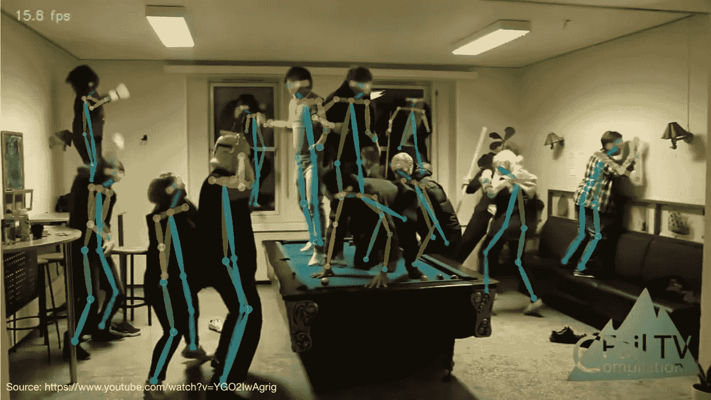

人体姿态估计([来源](https://www.youtube.com/watch?v=pW6nZXeWlGM)

一个男人拿着一把刀向你跑来。你是做什么的？嗯，大多数人心里只会有一个想法:**跑。**嗯，你为什么要跑？因为观察这个男人咄咄逼人的姿态后，你可以断定他是想害你。既然你想活着看到明天，你决定尽可能跑得快。

你怎么能在几秒钟内完成所有这些复杂的分析呢？嗯，你的大脑刚刚做了一件叫做**的人体姿态估计**的事情。幸运的是，由于人类的姿势估计是通过眼睛和大脑的结合来完成的，这是我们可以在计算机视觉中复制的东西。

为了执行人体姿态估计，我们使用一种特殊类型的全卷积网络，称为沙漏网络。该网络的编码器-解码器结构使其看起来像一个沙漏，因此得名“*沙漏网络”。*

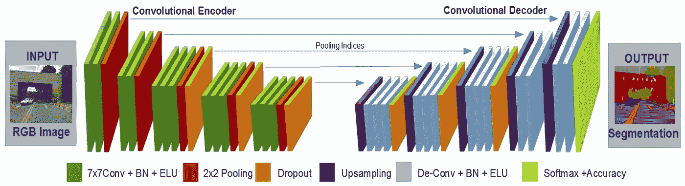

沙漏网络图([来源](https://www.mdpi.com/applsci/applsci-07-00312/article_deploy/html/images/applsci-07-00312-g002.png))。

但是，在我们深入研究网络的本质组件之前，让我们看看这个网络所基于的其他一些深层神经网络。

# 后退一步

在研究沙漏网络之前，您应该熟悉以下网络架构:

## 卷积神经网络(CNN)

*   **重要性:**自动学习与特定对象最对应的特征，从而提高分类精度。

继续学习的资源:[视频](https://www.youtube.com/watch?v=l16RxAmP9QE&list=PLdxQ7SoCLQAMeMPpRvqXJjBSmKey0SdlH)，[课程](https://cs231n.github.io/convolutional-networks/#fc)，[文章](https://www.freecodecamp.org/news/an-intuitive-guide-to-convolutional-neural-networks-260c2de0a050/)

## 剩余网络

*   **重要性**:通过减缓网络梯度在反向传播中的收敛，允许更深的网络。

进修资源:[篇](https://medium.com/@erikgaas/resnet-torchvision-bottlenecks-and-layers-not-as-they-seem-145620f93096)、[篇](/residual-blocks-building-blocks-of-resnet-fd90ca15d6ec)、[篇](/vggnet-vs-resnet-924e9573ca5c)、[篇](/understanding-and-visualizing-resnets-442284831be8)

## 全卷积网络(FCN)

*   **重要性:**用 1x1 卷积代替密集层，允许网络接受不同维度的输入。

进一步学习的资源:[文章](/implementing-a-fully-convolutional-network-fcn-in-tensorflow-2-3c46fb61de3b)、[视频](https://www.youtube.com/watch?v=-lXfsWP7DJ8&t=732s)

## 编码器-解码器网络

*   **重要性:**允许我们通过提取输入的特征并尝试重新创建它来操纵输入(例如。图像分割、文本翻译)

我们将更多地讨论编码器-解码器，因为这基本上就是沙漏网络，但如果你想要一些其他很酷的资源，这里有一些:[视频](https://www.youtube.com/watch?v=1icvxbAoPWc)， [quora 线程](https://www.quora.com/What-is-an-Encoder-Decoder-in-Deep-Learning)，[文章](/human-pose-estimation-with-stacked-hourglass-network-and-tensorflow-c4e9f84fd3ce)， [GitHub](https://github.com/aleju/papers/blob/master/neural-nets/Stacked_Hourglass_Networks_for_Human_Pose_Estimation.md) 。

# 高层的网络

因此，希望您在学习所有这些网络架构时获得了一些乐趣，但是现在是时候将它们结合起来了。

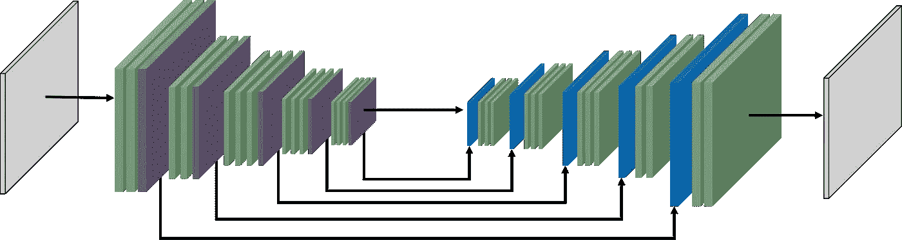

沙漏网络架构([来源](https://miro.medium.com/max/4254/1*l5dwD_BNKu0ltq5M58ZndQ.png))

沙漏网络是一种卷积编码器-解码器网络(意味着它使用卷积层来分解和重建输入)。他们接受一个输入(在我们的例子中，是一个图像)，并通过将图像解构为一个特征矩阵来从这个输入中提取特征。

然后，它采用这个*特征矩阵*并且**将其与具有比特征矩阵更高的空间理解能力(比特征矩阵更好地感知对象在图像中的位置)的早期层**组合。

*   **注意:**特征矩阵具有**低空间理解**，意味着我 *t 并不真正知道物体在图像中的位置*。这是因为，为了能够提取对象的特征，我们必须丢弃所有不是对象特征的像素。这意味着丢弃所有的背景像素，通过这样做，它删除了图像中对象位置的所有知识。
*   通过将特征矩阵与网络中具有更高空间理解能力的早期图层相结合，我们可以更好地了解输入内容(输入内容+输入内容在影像中的位置)。

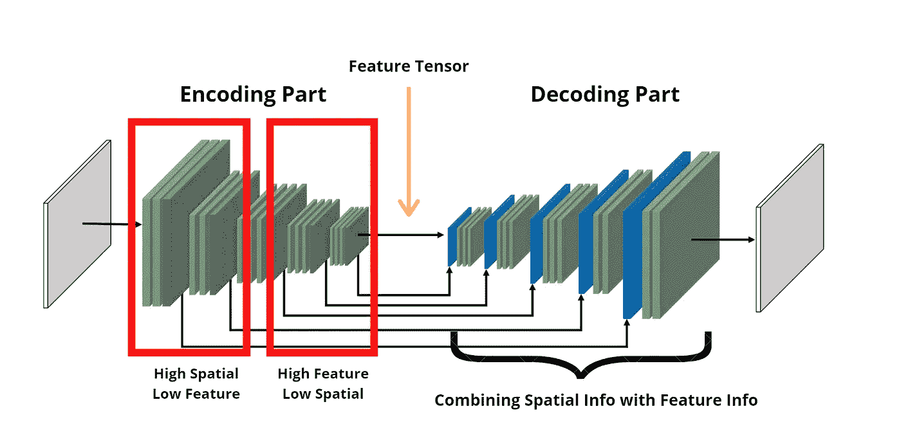

我在 Canva 制作的快速图表。希望有帮助:)

将网络中的早期层传输到后面的层难道没有引起人们的注意吗？**resnet。**残差在整个网络中大量使用。它们用于将空间信息与特征信息结合起来，不仅如此，每个绿色块代表我们称之为 ***瓶颈块*** 的东西。

**瓶颈**是一种新型的残差。我们有 1 个 1X1 卷积、1 个 3X3 卷积和 1 个 1X1 卷积，而不是 2 个 3X3 卷积。这使得计算机上的计算变得容易得多(3×3 卷积比 1×1 卷积更难实现)，这意味着我们可以节省大量内存。

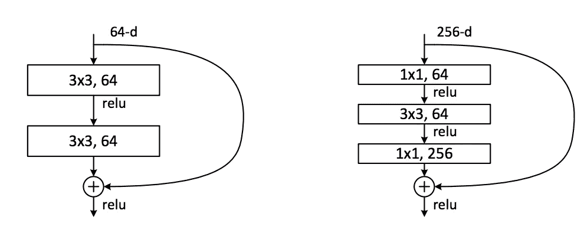

左:剩余层右:瓶颈块([来源](https://miro.medium.com/max/1980/1*j_lC2gsO1Kbia8PIQGHUZg.png)

所以总而言之，

*   **输入**:人物图像
*   **编码**:通过将输入分解成特征矩阵来提取特征
*   **解码**:结合特征信息+空间信息，深入理解图像
*   **输出:**取决于应用程序，在我们的例子中，是关节位置的热图。

# 逐步了解流程

如果我们真的想能够编码，我们需要理解每一层发生了什么，为什么。因此，在这里，我们将分解整个过程，一步一步地进行，以便我们对网络有一个深入的了解(我们只是要回顾沙漏网络的架构，而不是整个培训过程)。

在这个网络中，我们将使用:

*   **卷积层:**从图像中提取特征
*   **最大池层:**消除图像中对特征提取不必要的部分
*   **剩余层:**将层推进网络更深处
*   **瓶颈层:**通过包含更多不太密集的卷积来释放内存
*   [**上采样层**](https://www.youtube.com/watch?v=AqscP7rc8_M) **:** 增加输入的大小(在我们的例子中，使用最近邻技术——观看[视频](https://www.youtube.com/watch?v=AqscP7rc8_M)了解更多)

好了，在深入研究之前，让我们来看看沙漏网络的另一张图。

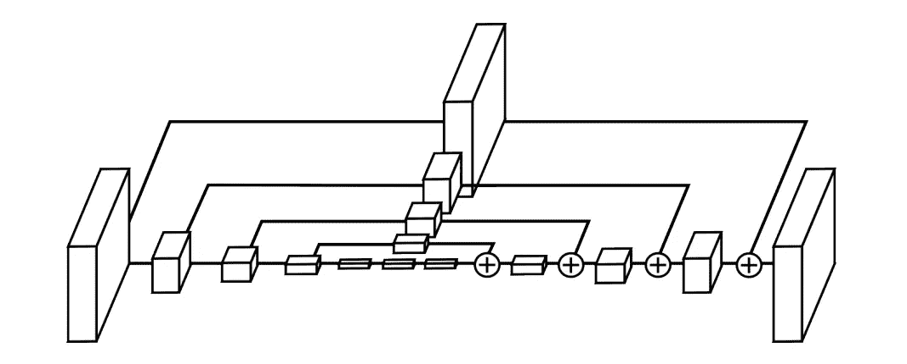

沙漏网络图([来源](https://arxiv.org/abs/1603.06937))

这里我们可以看到一些东西:

*   有两个部分:编码和解码
*   每个部分有 4 个立方体。
*   左边的立方体被传递到右边，形成右边的立方体

所以如果我们展开每个立方体，它看起来像这样:

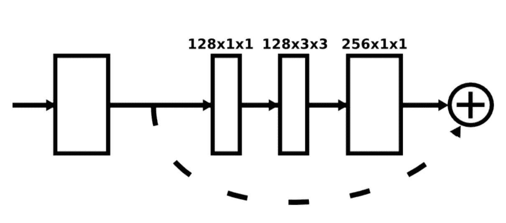

瓶颈层([来源](https://arxiv.org/pdf/1603.06937.pdf))

所以在网络全网图中，每个立方体都是一个瓶颈层(如上图)。在每个池层之后，我们会添加一个瓶颈层。

然而，第一层有点不同，因为它有一个 7X7 卷积(这是架构中唯一大于 3X3 的卷积)。以下是第一层的外观:

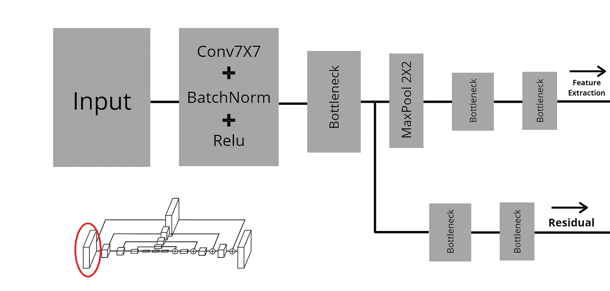

第一层的可视化

这是第一个立方体的样子。首先，输入被传递到与 BatchNormalization 和 ReLu 层结合的 7X7 卷积中。接下来，它被传递到一个瓶颈层，该层复制:一个通过最大池并执行特征提取，另一个仅在稍后的上采样(解码)部分连接回网络。

接下来的立方体(立方体 2、3 和 4)具有彼此相似的结构，但是与立方体 1 的结构不同。下面是其他多维数据集(在编码部分)的样子:

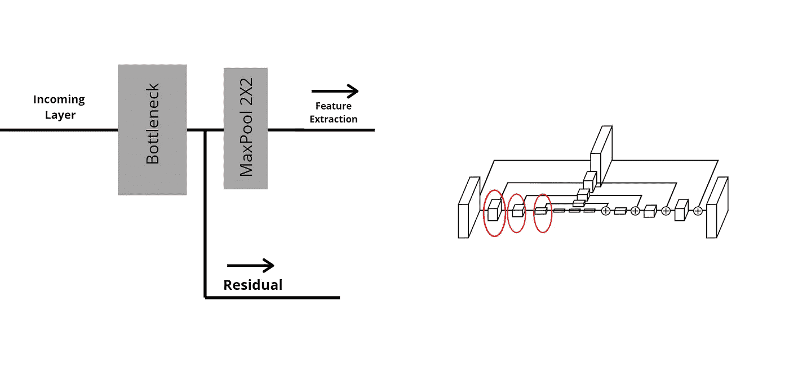

第二、第三和第四层的可视化

这些层要简单得多。先前的输出层被传递到瓶颈层，然后复制到残差层和用于特征提取的层。

我们将重复这个过程 3 次(在立方体 2、3 和 4 中)，然后我们将生成特征地图。

以下是创建要素地图所涉及的图层(此部分是您在整个网络图中看到的三个非常小的立方体):

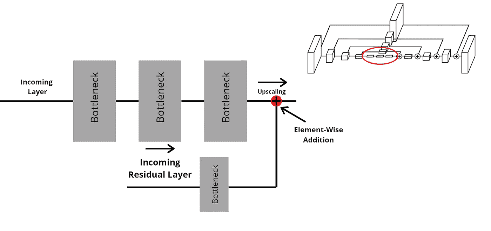

底层的可视化

这是网络中最深的层次。它也是要素信息最高的部分和空间信息最低的部分。在这里，我们的图像被压缩成一个矩阵(实际上是一个张量 T1)，它代表了我们图像的特征。

为此，它通过了所有 4 个编码立方体和底部的 3 个瓶颈层。我们现在准备向上采样。以下是上采样层的外观:

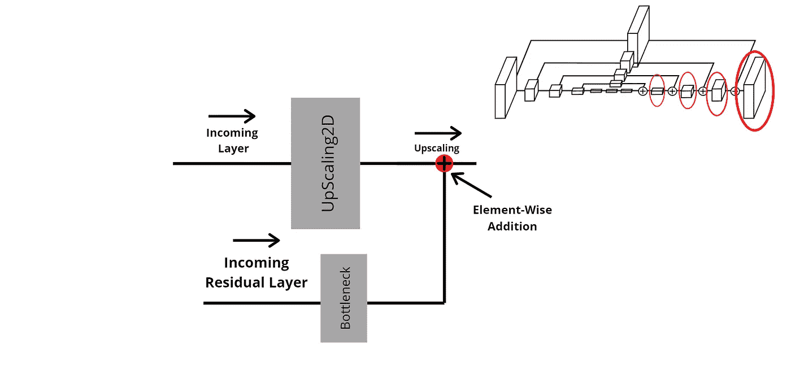

放大图层的可视化

因此，在这里，传入的残差层将通过瓶颈层，然后在其自身(残差层)和上采样特征层(来自主网络)之间执行[元素加法](https://codeforwin.org/ezoimgfmt/secureservercdn.net/160.153.138.219/b79.d22.myftpupload.com/wp-content/uploads/2015/07/matrix-addition.png?ezimgfmt=rs:392x204/rscb1)。

我们将重复这个过程 4 次，然后将最后一层(解码部分的第 4 个立方体)传递到最后一部分，在那里我们确定每个预测的准确度。

*   **注**:这叫**直接监督。**就是你*计算每个阶段末端的损耗而不是整个网络末端的损耗。*在我们的例子中，我们在每个沙漏网络的末端计算损失，而不是在所有网络组合的末端计算损失(因为对于人体姿势估计，我们使用堆叠在一起的多个沙漏网络)。

以下是最终图层的外观:

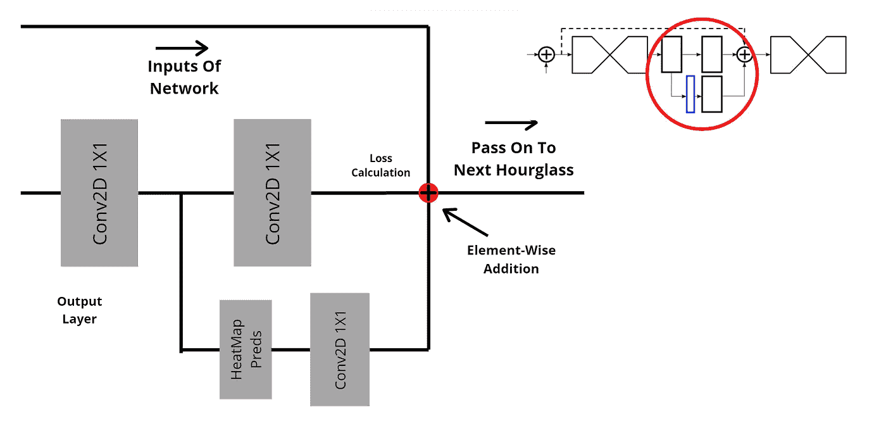

最终网络预测的可视化

这是网络的终点。我们通过卷积层传递最终网络的输出，然后复制该层以产生一组热图。最后，我们在网络的输入、热图和网络的两个输出(一个是预测，另一个是到达下一个网络末端的输出)之间执行元素相加。

## **然后，重复！**

对，就是这样。你刚刚走过了整个沙漏网络。在实践中，我们将一起使用许多这样的网络，这就是标题为*并重复为*的原因。希望这个看似吓人的话题现在可以消化了。在我的下一篇文章中，我们将编写网络代码。

就像我之前提到的，我们将把这个应用到人体姿态估计中。然而，沙漏网络可以用于很多事情，比如语义分割、3d 重建等等。我读了一些关于沙漏网 3D 重建的很酷的论文，我会把它们链接到下面，这样你也可以读读。

总的来说，我希望你喜欢阅读这篇文章，如果你在理解这个概念上有任何困难，请随时通过电子邮件、linkedin 甚至 Instagram (insta:@nushaine)与我联系，我会尽力帮助你理解。除此之外，祝您愉快，编码愉快:)

# 资源

**非常酷的论文**

*   [人体姿态估计](https://arxiv.org/pdf/1603.06937.pdf)
*   [三维人体重建](http://openaccess.thecvf.com/content_ECCVW_2018/papers/11132/Jackson_3D_Human_Body_Reconstruction_from_a_Single_Image_via_Volumetric_ECCVW_2018_paper.pdf)
*   [3D 人脸重建](https://arxiv.org/pdf/1703.07834.pdf)

**牛逼 GitHub Repos**

*   [ethanyanjiali](https://github.com/ethanyanjiali/deep-vision/tree/master/Hourglass)
*   [圆圆里 85](https://github.com/yuanyuanli85/Stacked_Hourglass_Network_Keras/tree/eddf0ae15715a88d7859847cfff5f5092b260ae1)
*   [阿勒居](https://github.com/aleju/papers/blob/master/neural-nets/Stacked_Hourglass_Networks_for_Human_Pose_Estimation.md)