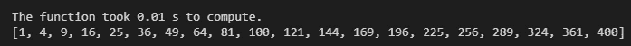
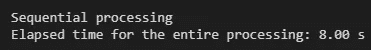
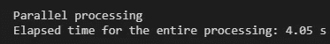
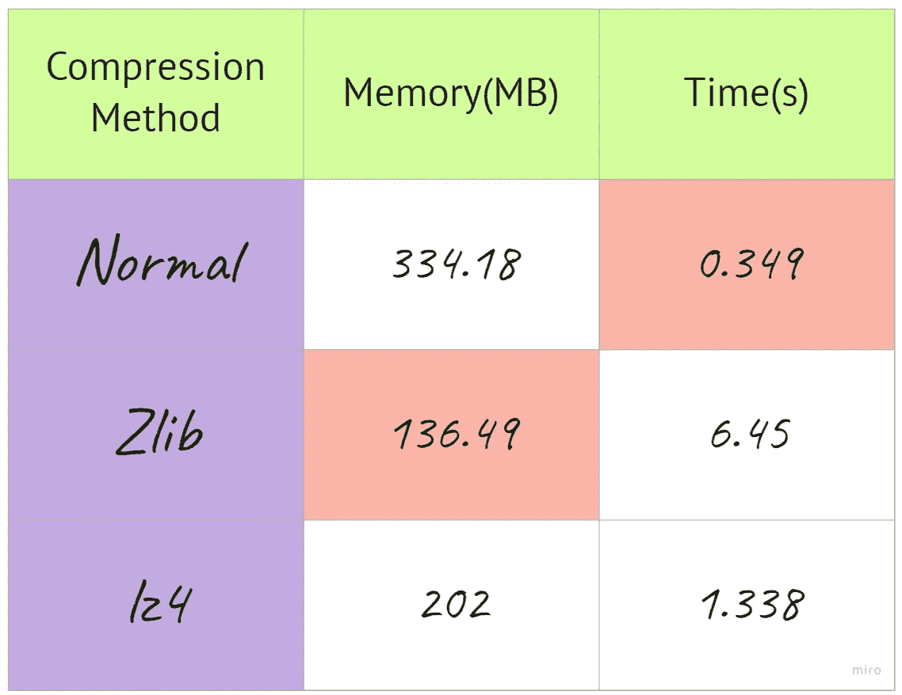

# 使用 joblib 加速 Python 管道

> 原文：<https://towardsdatascience.com/using-joblib-to-speed-up-your-python-pipelines-dd97440c653d?source=collection_archive---------10----------------------->

Marc-Olivier Jodoin 在 [Unsplash](https://unsplash.com?utm_source=medium&utm_medium=referral) 上拍摄的照片

让您的 Python 工作得更快！

## 动机:

随着多个预处理步骤和计算密集型流水线的增加，在某些点上有必要使流程高效。这可以通过删除一些冗余步骤或获得更多内核/CPU/GPU 来提高速度来实现。很多时候，我们专注于获得最终结果，而不考虑效率。我们很少努力优化管道或进行改进，直到耗尽内存或计算机挂起。最终，我们会觉得…

幸运的是，已经有了一个被称为 *joblib* 的框架，它提供了一组工具，使得 Python 中的管道在很大程度上变得轻量级。

## 为什么是 joblib？

将 *joblib* 工具集成为 ML 管道的一部分有几个原因。在他们的[网站](https://joblib.readthedocs.io/en/latest/)上提到了使用它的两个主要原因。然而，我想重新表述一下:

*   能够使用缓存，避免重新计算某些步骤
*   执行并行化，充分利用 CPU/GPU 的所有内核。

除此之外，我推荐 *joblib* 还有其他几个原因:

1.  可以轻松集成
2.  没有特定的依赖关系
3.  节省成本和时间
4.  简单易学

还有其他一些功能也很丰富，如果包含在日常工作中会很有帮助。

## 1.使用缓存的结果

在测试或创建模型时，我们经常需要多次重新运行我们的管道。有些函数可能会被调用多次，使用相同的输入数据，然后再次进行计算。Joblib 提供了一种更好的方法来避免重复计算相同的函数，从而节省了大量的时间和计算成本。比如下面我们举个简单的例子:

如上所述，该函数只是计算一个给定范围内的数字的平方。大约需要 20 秒才能得到结果。现在，让我们使用 *joblib 的内存*函数，定义一个位置来存储缓存，如下所示:

在第一次计算时，结果与之前的大约 20 秒非常相似，因为结果是第一次计算，然后存储到一个位置。让我们再试一次:

瞧啊。提供结果花了 0.01 秒。时间缩短了近 2000 倍。这主要是因为结果已经被计算并存储在计算机的缓存中。*所有功能的效率并不相同！*它可能因所请求的计算类型而有很大不同。但是你肯定会有这种通过缓存来加速管道的超能力！

要清除缓存结果，可以使用一个直接命令:

但是在使用这段代码之前要小心。你可能会毁掉你几周的计算工作。

## 2.并行化

顾名思义，我们可以使用“ *joblib 并行计算任何具有多个参数的指定函数。平行”。*在后台，当使用多个作业(如果指定)时，每个计算不会等待前一个完成，可以使用不同的处理器来完成任务。为了更好地理解，我展示了如何在缓存中运行并行作业。

考虑以下生成的随机数据集:

下面是我们正常顺序处理的运行，其中新的计算仅在先前的计算完成后开始。

对于并行处理，我们设置作业数= 2。作业的数量受限于 CPU 拥有或可用(空闲)的核心数量。

这里我们可以看到使用并行方法处理的时间减少了 ***2x*** 。

> ***注意*** :如果用于计算量较小的函数，使用此方法可能会降低性能。

## 3.倾卸和装载

我们经常需要存储和加载数据集、模型、计算结果等。在电脑上的某个位置来回移动。Joblib 提供了可用于轻松转储和加载的函数:

将数据转储到某个位置的代码

从某个位置加载数据的代码

## 4.压缩方法

当处理较大的数据集时，这些文件占用的空间非常大。使用特征工程，当我们添加更多的列时，文件会变得更大。幸运的是，如今，随着存储变得如此便宜，这不再是一个问题。然而，为了提高效率， *joblib* 提供的一些压缩方法使用起来非常简单:

**a .简单压缩:**

非常简单的就是上面显示的那个。它不提供任何压缩，但却是存储任何文件的最快方法

**b .使用 Zlib 压缩:**

这是一个很好的 3 级压缩方法，实现如下:

**c .使用 lz4 压缩:**

这是另一个很棒的压缩方法，也是已知最快的压缩方法之一，但压缩率略低于 Zlib。我个人认为这是**最好的方法**，因为它是*压缩大小和压缩率之间的一个很好的平衡*。下面是实现它的方法:

将所有内容放在一个表格中，如下所示:

作者创造的形象

## 结束语:

我发现 joblib 是一个非常有用的库。我已经开始将它们集成到我的许多机器学习管道中，并且肯定看到了许多改进。

感谢您抽出时间阅读这篇文章。任何意见/反馈总是很感谢！