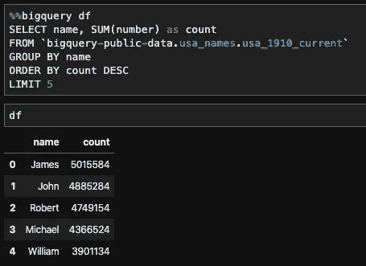

# 使用 Jupyter 笔记本管理您的 BigQuery 分析

> 原文：<https://towardsdatascience.com/using-jupyter-notebook-to-manage-your-bigquery-analytics-c4dc7b2a4113?source=collection_archive---------12----------------------->

如何利用 Jupyter Notebook 更好地管理您的 SQL 查询？


[图片来源](https://www.google.com/url?sa=i&url=https%3A%2F%2Fweb.superquery.io%2Fquery-tabs-bigquery%2F&psig=AOvVaw21JNaUReoM0FoRWlsvrtkp&ust=1582695307200000&source=images&cd=vfe&ved=0CA0QjhxqFwoTCKCV3c796-cCFQAAAAAdAAAAABAD):我们都去过那里…

如果你有打开和不断在一万个 BigQuery 标签页之间切换的困扰，你并不孤单。作为一名数据专业人员，使用 SQL 查询是一项日常任务，如果你没有条理，你会很快淹没在 Chrome 标签中。

幸运的是，您可以使用带有几个软件包的 Jupyter 笔记本，在处理 SQL 查询时会有更加愉快的体验。在这篇文章中，我将详细介绍设置环境的步骤，并将您的工作流程迁移到 Jupyter 笔记本上。无论您是数据分析师、数据工程师还是数据科学家，拥有一个有组织的工作流程将有助于显著提高您的工作效率。

# 环境设置

## 下载并安装 Anaconda

安装 Python 和 Jupyter Notebook 的最快最简单的方法是使用 Anaconda 发行版。你可以按照这里的指示找到在你的操作系统上安装 Anaconda 的指南。


确保将 Anaconda 添加到 PATH 环境变量中。

## 安装谷歌云 Python SDK 并认证

按照谷歌的[指南](https://cloud.google.com/sdk/docs/quickstarts)为你的特定操作系统安装云 SDK。安装并初始化 SDK 后，您应该通过执行以下操作来设置应用程序默认身份验证:

打开终端/Anaconda 提示符/命令行，键入以下内容

```
gcloud auth application-default login
```

会弹出一个浏览器，要求你用谷歌账户登录。登录并选择`Allow`对云 SDK 进行认证。

## 安装 GCP python 库和 pandas_gbq

我们鼓励您为每个项目建立一个单独的环境来安装 python 包。为了简单起见，我将跳过在这里创建不同环境的步骤。

安装以下 Python 包:

```
pip install --user --upgrade google-api-python-client
pip install --user pandas-gbq -U
```

# Jupyter 笔记本中的 SQL 查询

## 打开 Jupyter 笔记本或 Jupyter 实验室

您可以使用以下任一方法从命令行快速启动 Jupyter 笔记本或 Jupyter 实验室实例:

```
jupyter notebook
jupyter lab
```

创建一个 Python 3 笔记本，并确保您选择了之前安装软件包的环境。


## 导入库

```
import pandas as pd
import pandas_gbqfrom google.cloud import bigquery
%load_ext google.cloud.bigquery# Set your default project here
pandas_gbq.context.project = 'bigquery-public-data'
pandas_gbq.context.dialect = 'standard'
```

导入所需的库，就大功告成了！不再有无尽的 Chrome 标签，现在你可以在笔记本上组织你的查询，比默认编辑器有更多的优势。让我们复习一些例子。

## 在单元格查询中

借助`%%bigquery`的魔力，您可以编写如下多行单元格内查询:


您也可以使用`%%bigquery df_name`将结果存储到熊猫数据框中



可以使用`— params`标志在查询中传递参数:


但是，为了提高性能，一定要限制返回行。IPython Magics for BigQuery 的详细文档可以在[这里](https://googleapis.dev/python/bigquery/latest/magics.html)找到。

## 使用 pandas_gbq 库

除了使用 IPython Magics，您还可以使用 pandas_gbq 与 BigQuery 进行交互。


将数据写回 BigQuery 也很简单。您可以运行以下代码:

```
df.to_gbq(df, table_id, project_id = project_id)
```

`pandas_gbq`的文件可以在这里[找到。](https://pandas-gbq.readthedocs.io/en/latest/)

## 使用 Python BigQuery 客户端

```
client = bigquery.Client(project = project_id) 
query = '''
    SELECT name, SUM(number) as count
    FROM `bigquery-public-data.usa_names.usa_1910_current`
    GROUP BY name
    ORDER BY count DESC
    LIMIT 5
'''
client.query(query).result().to_dataframe()
```

这段代码产生的结果与上述方法相同。但是，您可以使用 Python 客户端与 BigQuery 进行更高级的交互。诸如创建表、定义模式、定义自定义函数等。BigQuery Python 客户端的完整文档可以在[这里](https://googleapis.dev/python/bigquery/latest/reference.html#model)找到。

# 结论

在这篇文章中，我介绍了使用 Jupyter Notebook 与 BigQuery 进行更程序化交互的步骤。以下是使用 Jupyter Notebook 查询数据时可以做的一些高级事情:

*   用 Jupyter 笔记本上的 markdown 单元格记录您的代码
*   以 HTML 或 PDF 格式分享您的分析
*   参数化您的查询
*   为您的查询编写单元测试
*   使用 BigQuery Python 客户端将基础设施实现为代码
*   构建一个 ETL 管道。

快乐学习！