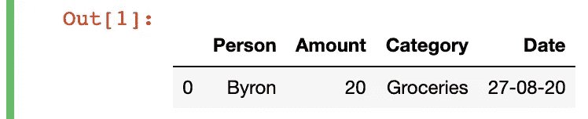

# 使用一行代码写入关系数据库

> 原文：<https://towardsdatascience.com/using-just-one-line-of-code-to-write-to-a-relational-database-3ed08a643c5f?source=collection_archive---------23----------------------->

## PYTHON 和 SQL

## 这将使添加到数据库变得更加容易。


由 Instagram @softie__art 制作的艺术作品

当将数据从 Pandas 数据帧写入 SQL 数据库时，我们将使用`DataFrame.to_sql`方法。虽然您可以执行一个`INSERT INTO`类型的 SQL 查询，但是原生的 Pandas 方法使得这个过程更加容易。

下面是从[熊猫文档](https://pandas.pydata.org/pandas-docs/stable/reference/api/pandas.DataFrame.to_sql.html)中摘录的`DataFrame.to_sql`的完整参数列表:

`**DataFrame.to_sql**` ( *self* ，*name:*[*str*](https://docs.python.org/3/library/stdtypes.html#str)， *con* ， *schema=None* ，*if _ exists:*[*str*](https://docs.python.org/3/library/stdtypes.html#str)*= ' fail '*，*index:*[*bool*](https://docs.python.org/3/library/functions.html#bool)

*为了向您展示这种方法是如何工作的，我们将通过几个例子向费用记录的数据库添加交易。在本文中，我们将使用 SQLite 数据库。`DataFrame.to_sql`与 SQLite 和 SQLAlchemy 支持的其他数据库一起工作。*

*请随意创建您自己的数据库，以便您可以跟进。如果您对创建数据库不熟悉，下面快速介绍一下如何免费设置一个简单的 SQLite 数据库:*

*[](/an-easy-way-to-get-started-with-databases-on-your-own-computer-46f01709561) [## 在自己的计算机上开始使用数据库的简单方法

### 介绍如何使用 SQLite 浏览器来管理自己的数据库。

towardsdatascience.com](/an-easy-way-to-get-started-with-databases-on-your-own-computer-46f01709561) 

在开始之前，不要忘记导入 Pandas 和 SQLite:

```
import sqlite3
import pandas as pd
```

# 用熊猫写数据库

在本练习中，我将在数据库的“Expense”表中插入新行:


示例 SQLite 数据库表

我用以下代码生成了一个示例事务数据框架:

```
data = {'Person': ['Byron'], 'Amount': [20], 'Category': ['Groceries'], 'Date':['27-08-20']}
df = pd.DataFrame.from_dict(data)
```

我们将插入到费用表中的数据帧如下所示:



准备输入新记录时，请确保数据框架中的列名与数据库表中的列名相匹配。

此外，所有操作都需要一个连接参数，您可以将它作为参数提供给`con`。要为 SQLite 数据库这样做，只需准备好这个变量供重用，其中`db`是本地 SQLite 数据库的文件路径。

```
conn = sqlite3.connect(db)
```

现在我们准备好开始了！

## 基本插入(和警告)

对于第一个例子，正如我们承诺的，我们使用下面一行代码:

```
df.to_sql(‘Expenses’, con=conn, if_exists=’append’, index=False)
```

这里，我们将`"Expenses"`作为我们想要写入的 SQLite 数据库中的表名。如前所述，我们还包含了`con=conn`，这样我们就可以连接到相关的 SQL 数据库。

默认情况下，如果一个表不存在，并且您尝试了上面的代码，**一个新的表将在您的数据库中以您指定的名称创建**。如果您想用现有的数据框架创建一个表，这是一种可行的方法。

对于我们的例子，表已经存在，所以我们需要指定应该发生什么。因为我们希望向表中添加新行并保留表中已有的行，所以我们传递`if_exists='append'`，以便将数据帧中的新值插入到数据库表中。确保包括这一点，因为默认行为是`if_exists='fail'`，这意味着代码将**而不是**执行。

我们还传递了`index=False`，因为`index=True`的默认行为是将数据帧的索引作为一列写入数据库表。但是，我们不需要这些信息，因为当我们添加新行时，SQLite 数据库中的“ID”列会自动增加。

自己摆弄这些参数，然后用 DB Browser for SQLite 检查更改，或者打印如下表格:

```
conn.execute("SELECT * FROM Expenses").fetchall()
```


用于检查结果的 SQL 查询的部分输出

## 写入大型数据帧—块大小

在前面的例子中，我们所做的只是将一个包含一行的数据帧插入到数据库表中。然而，对于更大的操作，如果您想写一个有几千行的数据帧，您可能会遇到一些问题。


从[堆栈溢出](https://stackoverflow.com/questions/48440957/cloud-sql-insert-error-when-missing-values-big-file)发出样本

这可能是因为不同数据库的数据包大小限制。如果您的数据帧超过最大数据包大小(即一次发送的数据太多)，将会发生错误，因为默认情况下，所有行都是一次写入的。

您可以通过指定一个`chunksize`来避免这种错误，T8 是您想要一次插入到数据库表中的数据帧中的行数。

例如，如果您有一个包含 2，000 行的表，并且您使用的数据库的最大数据包大小一次只允许 1，000 行，那么您可以将 chunksize 设置为 1，000 来满足该要求。

```
df.to_sql(‘Expenses’, con=conn, index=False, chunksize=1000)
``` 

*我希望这个快速概述对您有用！Pandas 库提供了丰富的功能，可以进行各种各样的数据相关操作，您可以充分利用这些功能。如果您总是使用 SQL 查询或其他 Python 方法向数据库写入数据，那么单行的`DataFrame.to_sql`方法应该会为您提供一种快速而简单的替代方法。*

*如果您正在寻找一种简单的方法来探索和理解您的数据，Pandas 还提供了不同的排序功能来实现这一点:*

*[](/4-different-ways-to-efficiently-sort-a-pandas-dataframe-9aba423f12db) [## 4 种不同的方法来有效地排序熊猫数据帧

### 正确探索、理解和组织您的数据。

towardsdatascience.com](/4-different-ways-to-efficiently-sort-a-pandas-dataframe-9aba423f12db) 

要了解 Pandas MultiIndex 功能，它可用于各种高级数据分析任务，请查看以下内容:

[](/how-to-use-multiindex-in-pandas-to-level-up-your-analysis-aeac7f451fce) [## 如何在 Pandas 中使用 MultiIndex 来提升您的分析

### 复杂数据分析中数据帧的层次索引介绍

towardsdatascience.com](/how-to-use-multiindex-in-pandas-to-level-up-your-analysis-aeac7f451fce)*