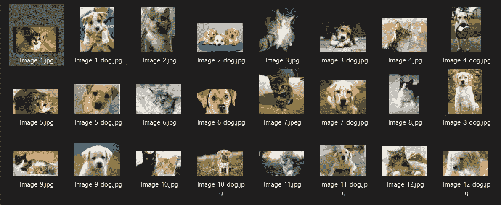
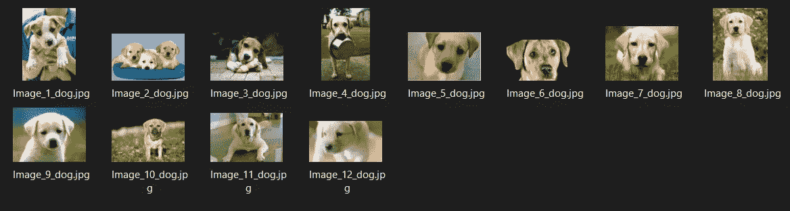
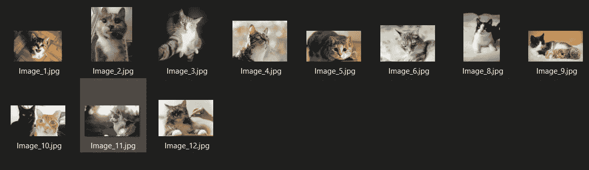
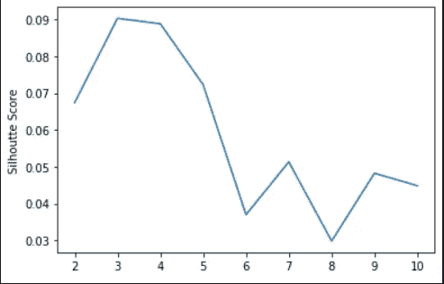
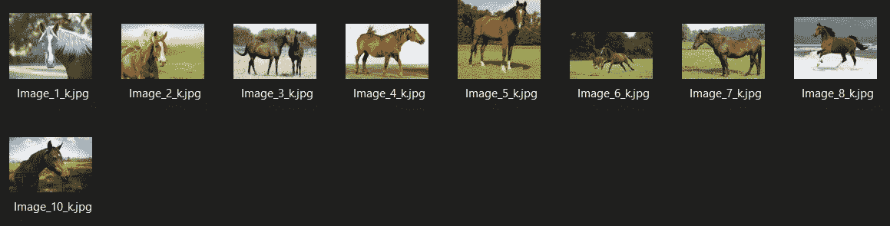

# 利用 K-均值聚类进行图像分离

> 原文：<https://towardsdatascience.com/using-k-means-clustering-for-image-segregation-fd80bea8412d?source=collection_archive---------25----------------------->

## 使用 CNN 和 KMeans 来分离图像。

KMeans 聚类是最常用的无监督机器学习算法之一。顾名思义，它可以用来创建数据集群，本质上是隔离它们。

让我们开始吧。这里我将举一个简单的例子，从一个既有猫和狗的图像的文件夹中分离图像到它们自己的簇中。这将创建两个独立的文件夹(集群)。我们还将介绍如何自动确定 k 的最佳值。

我已经生成了一个猫和狗的图像数据集。



猫和狗的图像。

首先，我们将从导入所需的库开始。

```
import numpy as np
import tensorflow as tf
import matplotlib.pyplot as plt
from sklearn.cluster import KMeans
from sklearn.metrics import silhouette_score
import cv2
import os, glob, shutil
```

然后，我们将从图像文件夹中读取所有图像，并对它们进行处理以提取特征。我们将图像的大小调整为 224x224，以匹配我们的模型的输入层的大小，用于特征提取。

```
input_dir = 'pets'
glob_dir = input_dir + '/*.jpg'images = [cv2.resize(cv2.imread(file), (224, 224)) for file in glob.glob(glob_dir)]paths = [file for file in glob.glob(glob_dir)]
images = np.array(np.float32(images).reshape(len(images), -1)/255)
```

现在我们将在 MobileNetV2(迁移学习)的帮助下进行特征提取。为什么选择 MobileNetV2？你可能会问。我们可以用 ResNet50，InceptionV3 等。但是 MobileNetV2 速度快，资源也不多，所以这是我的选择。

```
model = tf.keras.applications.MobileNetV2(*include_top*=False,
*weights*=’imagenet’, *input_shape*=(224, 224, 3))predictions = model.predict(images.reshape(-1, 224, 224, 3))
pred_images = predictions.reshape(images.shape[0], -1)
```

既然我们已经提取了特征，现在我们可以使用 KMeans 进行聚类。因为我们已经知道我们正在分离猫和狗的图像

```
k = 2
kmodel = KMeans(*n_clusters* = k, *n_jobs*=-1, *random_state*=728)
kmodel.fit(pred_images)
kpredictions = kmodel.predict(pred_images)
shutil.rmtree(‘output’)for i in range(k):
    os.makedirs(“output\cluster” + str(i))for i in range(len(paths)):
    shutil.copy2(paths[i], “output\cluster”+str(kpredictions[i]))
```

这是输出，成功了！它把图像分离出来:

狗:



猫:



还有一件事，我们如何确定一个数据集的 K 值，对于这个数据集，你不知道类的数量。我们可以用侧影法或肘法来确定。这里我们将使用剪影法。这两种方法都应该用来获得最有把握的结果。我们将直接确定 k。

更多关于确定 K 的值:[https://medium . com/analytics-vid hya/how-to-determine-the-optimal-K-for-K-means-708505d 204 EB](https://medium.com/analytics-vidhya/how-to-determine-the-optimal-k-for-k-means-708505d204eb)

让我们将马的图像添加到原始数据集中。我们现在将确定 k 的值。

```
sil = []
kl = []
kmax = 10for k in range(2, kmax+1):
    kmeans2 = KMeans(*n_clusters* = k).fit(pred_images)
    labels = kmeans2.labels_
    sil.append(silhouette_score(pred_images, labels, *metric* =   ‘euclidean’))
    kl.append(k)
```

我们现在将绘制这些值:

```
plt.plot(kl, sil)
plt.ylabel(‘Silhoutte Score’)
plt.ylabel(‘K’)
plt.show()
```



如您所见，K 的最佳值是 3。我们还成功创建了第三个集群:



# 结论

如您所见，KMeans 聚类是一种很好的图像分离算法。有时，我们使用的方法可能不会给出准确的结果，我们可以尝试通过使用不同的卷积神经网络来修复它，或者尝试将我们的图像从 BGR 转换为 RGB。

GitHub 资源库:[https://GitHub . com/hris 1999/Image-Segregation-with-k means/](https://github.com/Hrishi1999/Image-Segregation-with-KMeans/)

感谢阅读！希望你有美好的一天:)