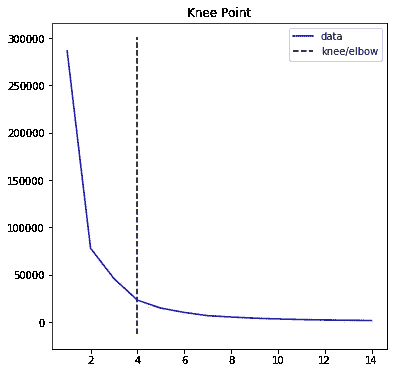

# 使用 K-均值聚类创建支持和阻力:

> 原文：<https://towardsdatascience.com/using-k-means-clustering-to-create-support-and-resistance-b13fdeeba12?source=collection_archive---------21----------------------->


迈克尔·泽兹奇在 [Unsplash](https://unsplash.com/s/photos/ai?utm_source=unsplash&utm_medium=referral&utm_content=creditCopyText) 上的照片

***来自《走向数据科学》编辑的提示:*** *虽然我们允许独立作者根据我们的* [*规则和指导方针*](/questions-96667b06af5) *发表文章，但我们并不认可每个作者的贡献。你不应该在没有寻求专业建议的情况下依赖一个作者的作品。详见我们的* [*读者术语*](/readers-terms-b5d780a700a4) *。*

说到技术分析，支撑和阻力是人们谈论最多的概念。支撑位和阻力位被用作价格壁垒，价格在其中“反弹”。在本文中，我将使用 K-means 聚类算法来找到这些不同的支持和阻力通道，并根据这些见解进行交易。

# 支撑和阻力:

为了理解如何最好地实现某事，我们应该首先理解我们想要实现的事情。


自画支撑位和阻力位。作者图片

支撑位和阻力位，是画在图上的两条线，形成一个通道，价格就在这个通道里。

支持和阻力是由于来自卖方或买方的压力，证券不能再减少或增加的结果。一个很好的经验法则是，价格偏离支撑线或阻力线的次数越多，它再次起作用的可能性就越小。

支撑线和阻力线能很好地洞察进场点和卖点，因为支撑线和阻力线理论上是这段有限时间内的最低点和最高点。

支持和抵制策略的缺点是，它在一段未知的时间内有效，而且线条是主观的，因此容易出现人为错误。

# 计划概念:

K-means 聚类算法查找时间序列数据的不同部分，并将它们分组到定义数量的组中。这个数字(K)可以被优化。然后，每组的最高值和最低值被定义为该组的支持值和阻抗值。

现在我们知道了程序的意图，让我们试着用 Python 重新创建它！

# 代码:

```
import yfinance
df = yfinance.download('AAPL','2013-1-1','2020-1-1')
X = np.array(df['Close'])
```

这个脚本用来访问苹果股票价格的数据。对于这个例子，我们只在收盘价上实现支撑和阻力。

```
from sklearn.cluster import KMeans
import numpy as np
from kneed import DataGenerator, KneeLocator

sum_of_squared_distances = []
K = range(1,15)
for k in K:
    km = KMeans(n_clusters=k)
    km = km.fit(X.reshape(-1,1))
    sum_of_squared_distances.append(km.inertia_)
kn = KneeLocator(K, sum_of_squared_distances,S=1.0, curve="convex", direction="decreasing")
kn.plot_knee()
# plt.plot(sum_of_squared_distances)
```

这个脚本测试不同的 K 值以找到最佳值:


2 的 K 值产生了很长一段时间都不会达到的支撑线和阻力线。


K 值为 9 会产生太常见的支撑和阻力，因此很难做出预测。

因此，我们必须找到 K 的最佳值，在比较 K 值之间的方差时通过肘点来计算。肘点是最大的进步，给定一定的动作。



基于 kneed 库，肘点在 4。这意味着最佳 K 值是 4。

```
kmeans = KMeans(n_clusters= kn.knee).fit(X.reshape(-1,1))
c = kmeans.predict(X.reshape(-1,1))
minmax = []
for i in range(kn.knee):
    minmax.append([-np.inf,np.inf])
for i in range(len(X)):
    cluster = c[i]
    if X[i] > minmax[cluster][0]:
        minmax[cluster][0] = X[i]
    if X[i] < minmax[cluster][1]:
        minmax[cluster][1] = X[i]
```

该脚本查找每个聚类中的点的最小值和最大值。当绘制时，这些线成为支撑线和阻力线。

```
from matplotlib import pyplot as plt
for i in range(len(X)):
    colors = ['b','g','r','c','m','y','k','w']
    c = kmeans.predict(X[i].reshape(-1,1))[0]
    color = colors[c]
    plt.scatter(i,X[i],c = color,s = 1)for i in range(len(minmax)):
    plt.hlines(minmax[i][0],xmin = 0,xmax = len(X),colors = 'g')
    plt.hlines(minmax[i][1],xmin = 0,xmax = len(X),colors = 'r')
```

这个脚本绘制了支撑位和阻力位，以及实际的价格图，这些价格图基于分类进行了颜色编码。不幸的是，我认为颜色是有限的，这意味着可以对数据进行颜色编码的 K 值有限。


这是程序的结果，一组支撑线和阻力线。请记住，当值回落到通道中时，线条是最准确的。此外，最终阻力线将是最不准确的，因为它考虑了最后一个值，而没有考虑任何其他值。

# 我的链接:

如果你想看更多我的内容，点击这个 [**链接**](https://linktr.ee/victorsi) 。