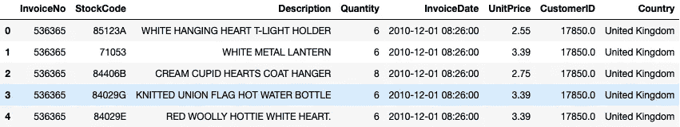
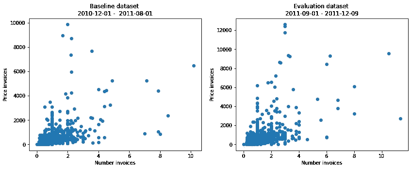
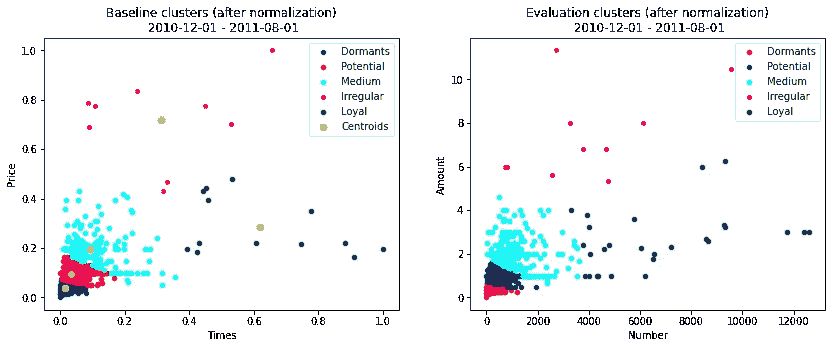
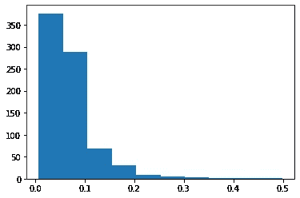
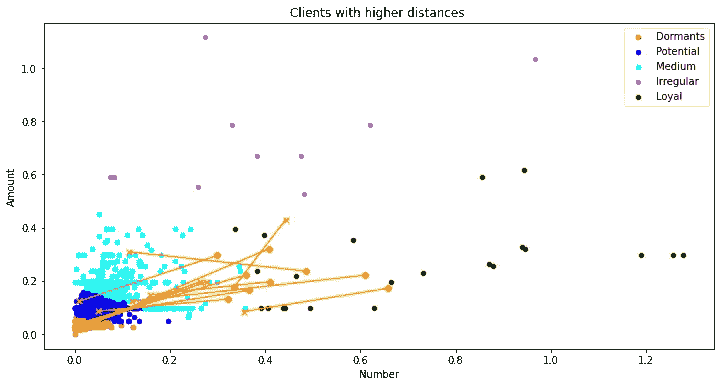

# 使用 K-Means 检测零售店中的变化

> 原文：<https://towardsdatascience.com/using-k-means-to-detect-changes-in-a-retail-store-96af1476dd9f?source=collection_archive---------31----------------------->


迈克·彼得鲁奇在 [Unsplash](https://unsplash.com?utm_source=medium&utm_medium=referral) 上的照片

# 识别消费者行为变化的无监督技术

U 当识别特定时期之间的变化时，受监督的机器学习算法会非常有用。

我将为批发商看一家零售商店。作为一家商店，你可能会期望或可能会瞄准你的客户群中的一些规律性。考虑到这一点，我将解释如何识别在一定时期内购买行为发生变化的客户。这种类型的分析可用于不同的领域。例如，它可以用来瞄准那些购买量较少的客户。在这种情况下，商店可以通过向他们提供折扣来留住他们。

我就不为了岗位而去走一遍整个数据科学的流程了。为了简明扼要，我将跳过这些步骤。如果你想了解更多关于解决业务问题的数据科学过程，看看这篇关于 [CRISP-DM 方法论](/once-again-crisp-dm-methodology-13f02557b632)的帖子。

## 数据

它是一个管状数据集，包含英国零售商店中不同客户的交易。这里是公开的[。](http://archive.ics.uci.edu/ml/datasets/Online+Retail)

它包含材料采购的发票。来自 38 个国家 4372 个不同客户的 541909 张不同发票。



交易时间从 2011 年 12 月到 2012 年 12 月不等。

## 问题

乍一看，该数据集没有给出任何有关客户购买行为发生变化的提示。缺乏标签使得不可能应用监督技术，因为没有任何东西明确他们是哪种类型的顾客。这在一个层面上增加了问题的难度，其中有许多细微差别和未决问题。

在所有的机器学习问题中，对问题有很好的理解对于给出量身定制的解决方案至关重要。根据业务问题的不同，会有许多不同的方法。

## 考虑

我们将根据客户的行为对他们进行分组。为此，我们将使用两个变量，即每月采购频率和货币价值。

在 13 个月的购买活动中，我会比较两个时期的活动。第一个创建行为的基线，第二个评估它。对于前者，我们将使用 8 个月，对于后者，我们将使用 5 个月。它将分别占 60%和 40%的时间。

谈到技术细节，K-Means 是在数据中寻找相似性的好算法。将数据分成 5 组将足够大，但不会大到对微小的变化敏感。

由于商店的目标是增加购买频率或消费金额，因此可以用以下名称对这些群体进行分类:

*   休眠——很少访问，很少花钱。他们可能需要大的刺激来重新激活它们。
*   潜在客户——与最后一组相似，区别在于使他们成为更好的客户的刺激较小。
*   中—普通用户。
*   不定期——他们很少去，但去的时候往往会花很多钱。
*   忠诚——他们经常光顾商店，但不会花很多钱。

根据公司的战略，名称和组号可能会有所不同。数据科学和利益相关者之间的良好沟通和理解对于将业务需求正确转化为模型非常重要。

**K-Means 快速介绍**

这是最著名和最常用的无监督算法。它允许对数据进行分组或分类，这是您自己从未想到过的。此外，K-Means 属于硬聚类算法组，其原因是因为一旦分类完成，数据点就属于一个且仅属于一个组。另一方面，软聚类算法同时将数据分配给不同的组。

K-Means 的工作方式是，给定聚类的数量，它将根据到数据点的距离自动调整所有组的中心，直到算法收敛。一面之词，有不同类型的距离！K-Means 使用欧几里得距离(它是两个数据点之间的几何距离)。

使用 K-Means 的主要问题是算法不能自动计算最佳的聚类数。所以集群的数量取决于要解决的业务问题和屏幕后面的用户。然而，一些技术可以帮助用户估计最适合的聚类数。这被称为肘方法，但它不包括在这篇文章中。

## K-Means 如何有助于检测变化？

在执行一些数据预处理操作后，这就是数据的样子。

```
tx.describe()
```


值得注意的是，两个变量(频率和货币值)都有一些异常值:

*   在价格上，中位数是 136 英镑，平均数是 390 英镑(与 1887 年的标准偏差相当大)。接下来，我将不包括花费超过 20，000 英镑的客户。
*   关于每月的总发票，中位数是每月 1 次访问，平均数是 0.8 次访问(标准偏差为 1.2)。在此之后，每月访问次数超过 15 次的客户将不会包括在分析中。

请注意，根据分析的性质，选择要移除的异常值可能会有所不同。

## 分割数据集

现在，是时候在基线期(8 个月)和评估期(5 个月)之间划分数据集了。这是两个时期的样子:



除了非常相似之外，我们从他们身上没有什么可以得到的。让我们开始分组吧。

## k-表示动手！

如前所述，K-Means 使用欧几里得距离工作，这使得它在变量的尺度不同时很敏感。这是两个变量的情况。我将应用 0 到 1 之间的范围。

```
from sklearn.preprocessing import MinMaxScaler
scaler = MinMaxScaler(feature_range = (0, 1))baseline_norm = pd.DataFrame(scaler.**fit_transform(baseline)**, 
 index = baseline.index, columns = [‘PriceInvoices’,’TotalInvoices’])evaluation = pd.DataFrame(**scaler.transform(evaluation)**, 
                          index = evaluation.index, columns = ['PriceInvoices','TotalInvoices'])
```

现在我们准备应用 K-Means 并看到一些结果:

```
from sklearn.cluster import KMeans**kmeans = KMeans(n_clusters = 5, init = ‘k-means++’, random_state = 1)**
y_kmeans_train = kmeans.**fit_predict(baseline_norm)**
```

关于 K-均值函数参数的几个解释？

*   如前所述，簇的数量被设置为 5。
*   我们使用的初始化方法是 k-means++，它灵活地选择聚类中心，从而加快收敛速度。
*   随机状态用于使算法具有确定性，换句话说，总是返回相同的结果。

下面是应用 K-Means 后两个周期的样子。注意，首先，我用基线数据集运行算法，以创建组。以便以后查看评估数据集中每个数据点的最接近组。

```
y_kmeans_test = kmeans.**predict**(evaluation.values)
```



在计算了从一个群集移动到另一个群集的客户端数量后，有 785 个不同的客户端。这是评估数据集中 40%的客户端。但是，检查集群变化的差异，我们可以看到许多客户端的变化非常小。这是因为许多客户端从一个集群的边缘移动到另一个集群的边缘。我们可以在下一个直方图中看到距离的分布。



为了减少标记的客户端数量，我们可以设置一个阈值，并挑选所有高于该级别的客户端。在我们的例子中，我选择了 0.25，所以它们在图表中是可见的。

最后，这些变化看起来是这样的。黄线是客户端的移动，而 X 标记是第一个位置，dop 是它们结束的位置。



# 结论:

我们已经看到了如何使用机器学习技术来为零售店中的购买行为建模，我们使用 K-Means 实现了这一点。获得的结果可以用于不同的目的，我在这里解释的一个将适合营销目的。它有助于识别转向活动较少的群体的客户(例如，忠诚于中等)。然而，它可以外推到另一种分析。

**缺点和改进** 该分析有一些缺点:

*   分析完成后，客户端可能已经丢失，并且很难重新激活它们。解决这个问题的一个方法是为他们最后一次交易的时间添加一个新的变量，即最近时间。例如，RFM 分析将解决这个问题，将交易的新近性作为一个新的变量添加到分类中。
*   大量的客户都放弃了。软聚类技术，如高斯混合模型(GMMs)将作为 K-均值的替代方法来缓解这一问题。GMMs 将给出数据点属于每个聚类的概率。例如，一个聚类边缘的数据点将有接近两个聚类的 50%-50%的概率。

为了提高模型捕捉变化的性能，K-Means 可以处理尽可能多的变量，并且 K-Means 将按照相同的标准进行分组。然而，增加更多的变量会使可视化更加困难。

**继续学习**

正如我上面刚刚写的几行，你可以探索 RFM 分析，这是一个在业界广泛使用的伟大分析。

您可能想尝试其他非监督技术，如层次聚类或高斯混合模型。它们解决了 K-Means 的主要问题，但是请记住，即使它们解决了 K-Means 的一些问题，它们也有自己的缺点！正如所说，“天下没有免费的午餐”！