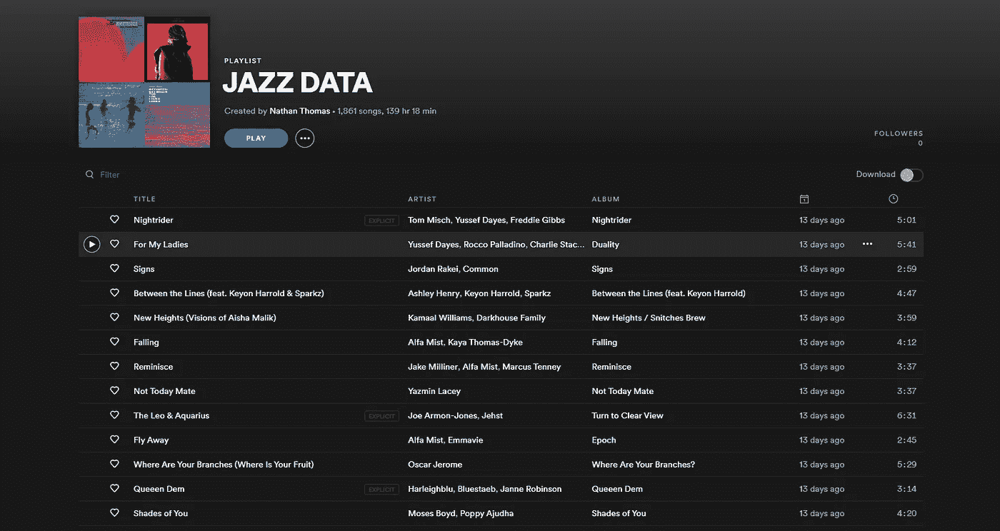
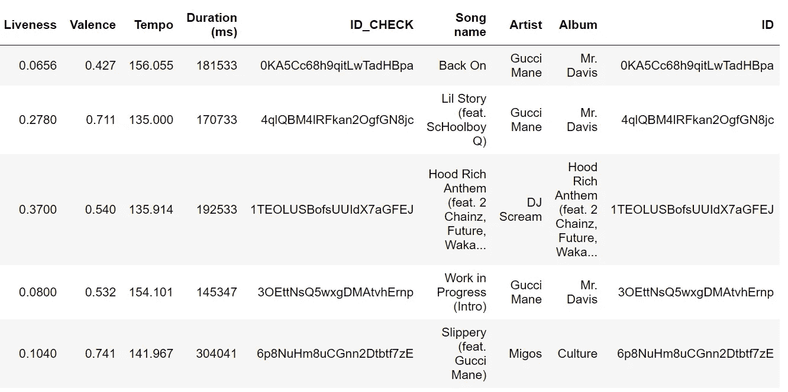
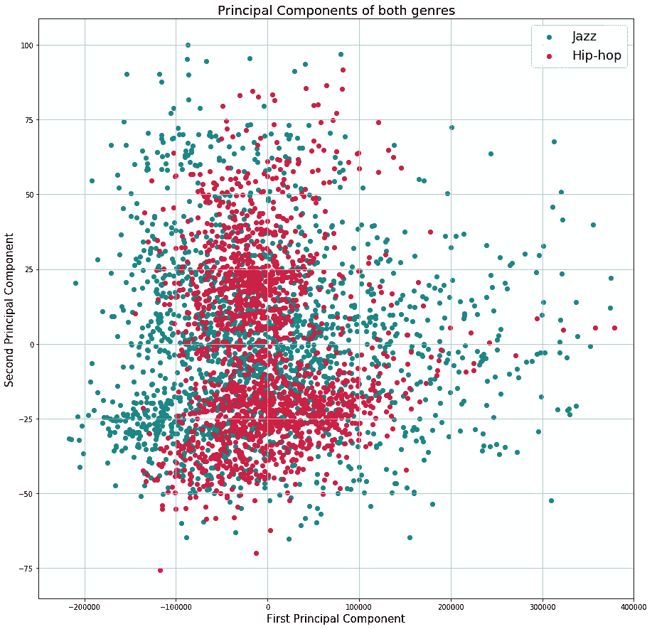
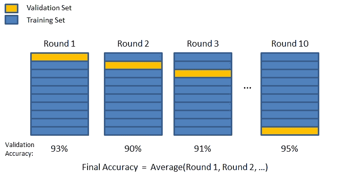
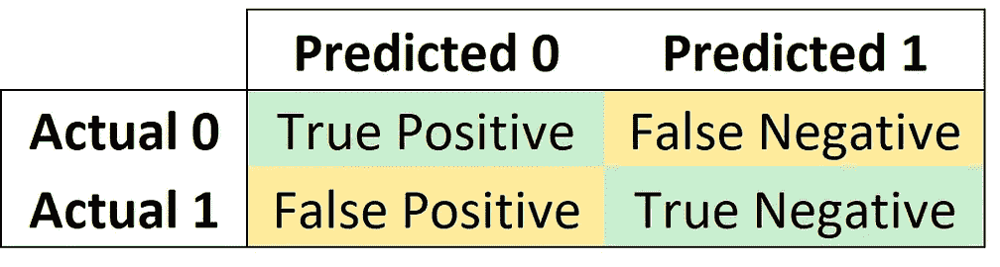
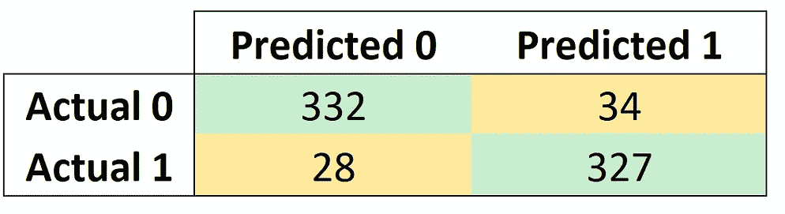

# 使用 k 近邻预测 Spotify 曲目的类型

> 原文：<https://towardsdatascience.com/using-k-nearest-neighbours-to-predict-the-genre-of-spotify-tracks-796bbbad619f?source=collection_archive---------29----------------------->

来源:[约翰·泰克里迪斯](https://www.pexels.com/photo/apps-cellphone-communication-computer-340103/)。

Spotify 是世界上最受欢迎的音频流媒体平台，提供超过 5000 万首歌曲和超过 1.7 亿用户的访问[1]。我们可以找到更多关于数据的方法之一是通过检查歌曲的音频特征。在这篇文章中，我将向你展示如何利用 Spotify 的音频功能、python 和 K-nearest neighbors(一种受监督的机器学习算法)来预测我最喜欢的歌曲的风格。我们开始吧！

# **检索数据**

为了分析这些数据，我在 Spotify 中创建了两个大型播放列表，一个是爵士乐，一个是嘻哈/RnB 音乐，使用的是 Spotify 上每个流派下嵌套的播放列表。每个播放列表都有超过 1800 首歌曲，因此应该提供一个相当好的样本量来应用我们的机器学习算法。以下是爵士乐播放列表的示例:

Spotify 上的自定义聚合爵士播放列表。来源:内森·托马斯。

为了检索数据，我在 Spotify 上设置了一个开发者账户，以获取所需的相关凭证 *(client_id，client_secret)。为了找到如何做到这一点，Spotify 为他们的 web API 提供了很好的文档[2]；我建议你去看看它的入门指南。因此，我设置了一个 API 请求来检索四个因素:歌曲名称、歌曲 ID、专辑和艺术家。*

API 设置。

之后，我检索了每首歌的音频特征。Spotify 有许多音频功能，用于描述每首曲目:*可跳舞性、能量、模式、音调、响度、语速、声音、乐器性、活跃度、效价、速度*和*持续时间* [3]。其中大多数都是不言自明的，除了*模式*和*价*，前者指示音轨是大调还是小调，后者指示音轨值越高听起来越积极。以下是我收集的专栏摘录；这段代码检索每首歌曲的专辑名称:

*输出:*

hip-hop 属性数据帧的提取。

> 我总共收集了约 3000 首歌曲进行分析，平均分为两种风格。

# **数据可视化**

将每个属性的值调整到 0 到 1 之间后，我们可以使用雷达图来查看每个流派的属性分布。

这些图表是交互式的，所以你可以自己随意摆弄图表，看看你能从数据中找到什么关系！

**爵士乐:**

爵士属性雷达图。来源:内森·托马斯。

**嘻哈:**

嘻哈属性雷达图。来源:内森·托马斯。

检查这两个流派的特征的雷达图，似乎爵士音乐通常比嘻哈音乐具有更低的能量，而爵士音乐比嘻哈音乐更像 T2 音乐。嘻哈歌曲也比爵士歌曲更快乐、更乐观。从定性的角度来看，这是有意义的，因为布鲁斯和流畅的爵士乐可以非常柔和，乐器在音轨中占主导地位。

通过**取其主要成分、**或 PCA，这是另一种可视化每种体裁分布的方式。PCA 降低了数据的维度，旨在**提取信号并从数据中去除噪声**。在这里找到更多关于算法[的实际应用，在这里我把它应用到收益率曲线【4】。为了绘制 Spotify 的统计数据，我使用了前两个主要成分，**，它们一起解释了超过 99%的数据:**](/applying-pca-to-the-yield-curve-4d2023e555b3?gi=aa7ee1e4761d)

每个流派的第一和第二主成分散点图。来源:内森·托马斯。

> 这张图再次证实了我们的雷达图分析——在散点图上，嘻哈音乐似乎更加集中和聚集在一起，而爵士歌曲似乎分布更广。

# **使用 kNN 预测流派**

**但是首先:kNN 实际上是做什么的？**

简而言之，K-nearest neighbors 是一种**监督的机器学习技术**【5】，它获取一个数据点，并计算 K 个**标记的**数据点之间的距离，根据它从 K-nearest 数据点获得的票数对该点进行分类。“受监督的”部分意味着我们在测试之前就已经知道这首歌是什么类型的，因此有了标签。

> 例如，如果 k=3 并且三个最近的邻居被分类为 1。爵士乐，2。爵士乐和 3。hip-hop，这导致 2 比 1 的投票支持 jazz，并且新的数据点将被分类为 jazz。使用欧几里得距离计算距离(参见毕达哥拉斯定理[6])。

欧几里德距离方程。克里斯·麦考密克。

> 选择 k 值可能是一个复杂的过程，有几种不同的方法可以找到最佳值。然而，对于这个数据集，我将 k 近似为 n 的平方根。

首先，为了准备我们的数据，我们需要合并每种风格的两个数据帧，随机化这些行，并标记每首歌曲的类别(风格)。对于这个项目，**爵士= 0，嘻哈= 1** 。

这是我们所有歌曲的完整标签样本。

> 标记数据很重要，因为这些标记稍后将用于评估模型的准确性。

接下来，我们需要在训练数据和测试数据之间拆分数据。虽然 **KNN 模型在技术上不需要训练**(因为算法携带所有数据)，但比较训练和测试样本的准确性将是一种方便的感觉检查。

**培训 KNN 模特**

与你可能习惯看到的通常的训练和测试分割不同，最好是**对训练数据使用 k 倍交叉验证**来获得我们的初始预测。这是通过随机移动数据集，然后将其分成 k 个部分(折叠)来实现的。对于这个例子，我选择了 k = 10。因此，k-folds 算法分离出一个折叠，将其用作测试集。其他九个折叠构成了训练数据。然后，将 KNN 模型拟合在训练集上，并在测试集上进行评估，保存评估分数并丢弃模型[7]。这个过程然后重复十次，不同的折叠用作测试集。这导致每个折叠在训练数据中使用九(k-1)次，并且作为测试集使用一次。有关该过程的直观解释，请参见下图:

k 倍交叉验证示例。来源:[丹·奥弗](https://www.researchgate.net/figure/K-fold-10-fold-Cross-Validation-illustration-Accuracy-can-be-any-metric_fig4_301841976)。

这种方法是优越的，因此将数据集一次分割成 80%训练 20%测试分割。这是因为这向我们展示了模型在看不见的数据上表现得有多好。在前一种情况下，存在过度拟合模型的风险。

> 我们可以使用流行的 python 模块 sci-kit learn 来拟合模型:

取交叉验证分数的平均值，**我们的模型在训练集上的准确率为 90%。伟大的结果！**

**将 KNN 模型与测试集相匹配**

有了测试数据，我们就用剩下的值(再来 721 首)。

**性能**

将模型拟合到我们的训练数据，**我们的模型在测试集上的准确率为 91%。**作为感觉检查，这类似于我们的训练集上的准确度分数。我们可以使用混淆矩阵来可视化模型的性能。

混淆矩阵描述了我们的 KNN 分类模型的性能[8]。一个真正的正数告诉我们算法预测的是 1，而实际的类是 1。假阳性告诉我们模型预测的是 1，而实际的类是 0。反过来适用于真否定和假否定。我们的混淆矩阵告诉我们，模型中的错误主要来自假阴性。

KNN 模型的混淆矩阵。来源:内森·托马斯。

所以，成功！我们已经成功创建了一个模型，利用机器学习的力量，以 91%的准确率预测歌曲的风格。

**感谢阅读！**如果您有任何见解，请随时发表评论。包含我用来做这个项目的源代码的完整 Jupyter 笔记本可以在我的 [Github 库](https://github.com/nathanwilthomas/Spotify_KNN/tree/master)上找到。

参考资料:

[1]《每日电讯报》，2020 年。“最佳音乐流媒体服务:苹果音乐、Spotify、YouTube 音乐和亚马逊音乐对比”。可在:[https://www . telegraph . co . uk/technology/0/best-music-streaming-services-apple-music-Spotify-Amazon-music/](https://www.telegraph.co.uk/technology/0/best-music-streaming-services-apple-music-spotify-amazon-music/)获取

[2] Spotify，2020 年。《Web API 教程》。可从以下网址获得:[https://developer . Spotify . com/documentation/we b-API/quick-start/](https://developer.spotify.com/documentation/web-api/quick-start/)

[3] Spotify，2020 年。“获取音轨的音频特征”。可从以下网址获得:[https://developer . Spotify . com/documentation/we b-API/reference/tracks/get-audio-features/](https://developer.spotify.com/documentation/web-api/reference/tracks/get-audio-features/)

[4]托马斯·内森，《走向数据科学》，2020 年。“将主成分分析应用于收益率曲线——艰难之路”。可从[https://towardsdatascience . com/applying-PCA-to-yield-curve-4d 2023 e 555 b 3](/applying-pca-to-the-yield-curve-4d2023e555b3)获取

[5] GeeksforGeeks，2020。“K-最近邻”。可在:[https://www.geeksforgeeks.org/k-nearest-neighbours/](https://www.geeksforgeeks.org/k-nearest-neighbours/)

[6]数学趣味，2017。“毕达哥拉斯定理”。可在:[https://www.mathsisfun.com/pythagoras.html](https://www.mathsisfun.com/pythagoras.html)

[7]机器学习掌握，2019。“k 倍交叉验证的温和介绍”。可在:[https://machinelearningmastery.com/k-fold-cross-validation/](https://machinelearningmastery.com/k-fold-cross-validation/)

[8] GeeksforGeeks，2020 年。《机器学习中的混淆矩阵》。可从以下网址获得:[https://www . geeks forgeeks . org/confusion-matrix-machine-learning/](https://www.geeksforgeeks.org/confusion-matrix-machine-learning/)

[9] S .罗森博格、戴维；彭博，2018。"机器学习基础，第一讲:黑盒机器学习."可在:[https://bloomberg.github.io/foml/#lectures](https://bloomberg.github.io/foml/#lectures)

*免责声明:本文表达的所有观点均为本人观点，与先锋集团或任何其他金融实体无关。我不是一个交易者，也没有用本文中的方法赚钱。这不是财务建议。*