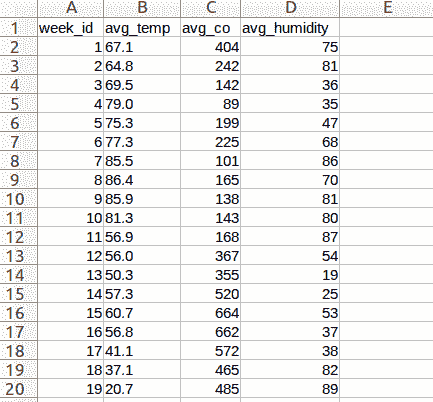

# 使用 Kafka 作为数据湖中的临时数据存储和数据丢失预防工具

> 原文：<https://towardsdatascience.com/using-kafka-as-a-temporary-data-store-and-data-loss-prevention-tool-in-the-data-lake-5472f2b586e?source=collection_archive---------17----------------------->


汤姆·盖诺尔在 [Unsplash](https://unsplash.com/s/photos/lake?utm_source=unsplash&utm_medium=referral&utm_content=creditCopyText) 上的照片

## 探索 Kafka 如何用于存储数据以及作为流媒体应用的数据丢失预防工具

# 介绍

[Apache Kafka](https://kafka.apache.org/) 是一个流媒体平台，允许创建实时数据处理管道和流媒体应用程序。Kafka 对于一系列用例来说是一个优秀的工具。如果您对 Kafka 如何用于 web 应用程序的度量收集的例子感兴趣，请阅读我的[上一篇文章](https://medium.com/@lucio_17231/using-kafka-for-collecting-web-application-metrics-in-your-cloud-data-lake-b97004b2ce31)。

Kafka 是数据工程师工具箱中的一种强大技术。当您知道 Kafka 的使用方式和位置时，您就可以提高数据管道的质量，并更高效地处理数据。在本文中，我们将看一个例子，说明 Kafka 如何应用于更不寻常的情况，如在亚马逊 S3 存储数据和防止数据丢失。如您所知，数据存储的容错性和持久性是大多数数据工程项目的关键要求之一。所以，知道如何以满足这些需求的方式使用卡夫卡是很重要的。

这里我们将使用 Python 作为编程语言。要从 Python 中与 Kafka 进行交互，还需要有一个特殊的包。我们将使用 kafka-python 库。要安装它，您可以使用以下命令:

```
pip install kafka-python
```

# 作为数据仓库的卡夫卡

卡夫卡可以用来存储数据。您可能想知道 Kafka 是关系数据库还是 NoSQL 数据库。答案是，非此即彼。

Kafka 作为一个事件流平台，处理的是流数据。同时，Kafka 可以在删除数据之前存储一段时间。这意味着 Kafka 不同于传统的消息队列，传统的消息队列在消费者阅读完消息后会立即丢弃消息。Kafka 存储数据的时间称为保留时间。理论上，你可以把这个周期设置为永远。Kafka 还可以在持久存储上存储数据，并通过集群内的代理复制数据。这只是使卡夫卡看起来像一个数据库的另一个特征。

那么，为什么 Kafka 没有被广泛用作数据库，为什么我们没有提出这可能是一种数据存储解决方案的想法？最简单的原因是因为 Kafka 有一些特性，这些特性对于一般的数据库来说是不典型的。例如，Kafka 也不提供对数据的任意访问查找。这意味着没有查询 API 可用于获取列、过滤列、将列与其他表连接等等。其实还有一个卡夫卡 StreamsAPI，甚至还有一个 ksqlDB。它们支持查询，非常类似于传统的数据库。但它们就像卡夫卡身边的脚手架。他们充当消费者，在数据被消费后为您处理数据。所以，当我们谈论 Kafka 而不是它的扩展时，这是因为 Kafka 中没有像 SQL 这样的查询语言来帮助你访问数据。顺便说一下，现代的数据湖引擎，比如 Dremio T1，可以解决这个问题。Dremio 支持使用 SQL 与本身不支持 SQL 的数据源进行交互。例如，你可以在 AWS S3 保存 Kafka 流的数据，然后使用 [Dremio AWS edition](https://www.dremio.com/aws/) 访问它。

卡夫卡也专注于用流工作的范例。Kafka 旨在充当基于数据流的应用程序和解决方案的核心。简而言之，它可以被视为大脑，处理来自身体不同部位的信号，并通过解释这些信号让器官工作。Kafka 的目标不是取代更传统的数据库。卡夫卡生活在一个不同的领域，它可以与数据库交互，但它不是数据库的替代品。在 Dremio 的帮助下，Kafka 可以轻松地与数据库和云数据湖存储(如亚马逊 S3 和微软 ADLS)集成。

请记住，卡夫卡具有存储数据的能力，并且数据存储机制相当容易理解。Kafka 存储从第一条消息到现在的记录(消息)日志。使用者从该记录日志中指定的偏移量开始获取数据。这是它看起来的简化解释:


偏移可以在历史中向后移动，这将迫使消费者再次读取过去的数据。

因为 Kafka 不同于传统的数据库，所以它可以用作数据存储的情况也有些特殊。以下是其中的一些:

*   当处理逻辑改变时，从头开始重复数据处理；
*   当一个新系统包含在处理管道中，并且需要从头或从某个时间点开始处理所有以前的记录时。此功能有助于避免将一个数据库的完整转储复制到另一个数据库；
*   当消费者转换数据并将结果保存在某个地方，但出于某种原因，您需要存储数据随时间变化的日志。

在本文的后面，我们将看一个例子，说明 Kafka 如何在与上述第一个用例类似的用例中用作数据存储。

# Kafka 作为防止数据丢失的工具

许多开发人员选择 Kafka 作为他们的项目，因为它提供了高水平的持久性和容错性。这些功能是通过在磁盘上保存记录和复制数据来实现的。复制意味着数据的相同副本位于集群中的几个服务器(Kafka 代理)上。因为数据保存在磁盘上，所以即使 Kafka 集群在一段时间内处于非活动状态，数据仍然存在。由于有了复制，即使代理中的一个或几个集群受损，数据也能得到保护。

数据被消费后，通常会被转换和/或保存在某个地方。有时，在数据处理过程中，数据可能会损坏或丢失。在这种情况下，Kafka 可以帮助恢复数据。如果需要，Kafka 可以提供一种从数据流的开头执行操作的方法。

您应该知道，用于控制数据丢失防护策略的两个主要参数是复制因子和保留期。复制因子显示在 Kafka 集群中为给定主题创建了多少冗余数据副本。为了支持容错，您应该将复制因子设置为大于 1 的值。一般来说，推荐值是三。复制因子越大，Kafka 集群越稳定。您还可以使用这个特性将 Kafka 代理放在离数据消费者更近的地方，同时在地理上远程的代理上拥有副本。

保留期是 Kafka 保存数据的时间。很明显，时间越长，保存的数据就越多，在发生不好的事情时(例如，用户因断电而停机，或者数据库因意外的错误数据库查询或黑客攻击而丢失所有数据等)能够恢复的数据也就越多。).

# 例子

这里有一个例子，说明当数据处理的业务逻辑突然发生变化时，Kafka 的存储能力会非常有帮助。

假设我们有一个收集温度、湿度和一氧化碳(CO)浓度等天气指标的物联网设备。该设备的计算能力有限，因此它所能做的就是将这些指标发送到某个地方。在我们的设置中，设备将向 Kafka 集群发送数据。我们将每秒发送一个数据点，每秒测量一天(换句话说，物联网设备每天收集信息)。下面的图表展示了这一流程:


消费者订阅生产者向其发送消息的主题。消费者然后以指定的方式聚集数据。它在一个月内积累数据，然后计算平均指标(平均温度、湿度和 CO 浓度)。每个月的信息都应该写入文件。该文件只包含一行，值用逗号分隔。以下是该文件的一个示例:


先从《卡夫卡制作人》的创作说起。生产者将位于 *producer.py* 文件中。在文件的开头，我们应该导入我们需要的所有库并创建 *KafkaProducer* 实例，它将与位于 *localhost:9092* 上的 Kafka 集群一起工作:

```
import random
import json
Import time
from kafka import KafkaProducer
producer = KafkaProducer(bootstrap_servers=[‘localhost:9092’])
```

下面您可以看到生成数据并将其发送到 Kafka 集群的代码。在顶部，我们定义了温度、湿度和 CO 浓度的初始值( *prev_temp* 、*prev _ weather*、 *prev_co_concentration* )。计数器 *i* 用于记录索引。对于这个模拟，我们希望生成的值是随机的，但我们也希望避免非常不一致的结果(如在一天内将温度改变 40 度)。所以我们不只是产生随机值。当生成第二天的值时，我们还需要考虑前一天的值。同样，在每次迭代中，我们检查生成的数字是否在可接受的区间内。

```
topic_name = ‘weather’
i = 0prev_temp = round(random.uniform(-10, 35), 1)prev_humidity = random.randint(1, 100)prev_co_concentration = random.randint(50, 1500)while True:i += 1lower_temp_bound = -10 if (prev_temp-5) < -10 else (prev_temp-5)upper_temp_bound = 35 if (prev_temp+5) > 35 else (prev_temp+5)temperature = round(random.uniform(lower_temp_bound, upper_temp_bound), 1)lower_humid_bound = 1 if (prev_humidity-20) < 1 else (prev_humidity-20)upper_humid_bound = 100 if (prev_humidity+20) > 100 else (prev_humidity+20)humidity = random.randint(lower_humid_bound, upper_humid_bound)lower_co_bound = 50 if (prev_co_concentration-100) < 50 else (prev_co_concentration-100)upper_co_bound = 1500 if (prev_co_concentration+100) > 1500 else (prev_co_concentration+100)co_concentration = random.randint(lower_co_bound, upper_co_bound)weather_dict = {“record_id”: i,“temperature”: temperature,“CO_concentration”: co_concentration,“humidity”: humidity}producer.send(topic_name, value=json.dumps(weather_dict).encode())producer.flush()prev_temp = temperatureprev_humidity = humidityprev_co_concentration = co_concentrationtime.sleep(1)
```

在生成当前时间戳所需的所有数据之后，脚本从包含数据的字典中创建了 *weather_dict* 变量。之后，生产者将 JSON 编码的 *weather_dict* 发送到 Kafka 集群的指定主题。我们将当前值赋给相应的变量，这些变量代表来自前一个时间戳的数据。最后，在执行循环的下一次迭代之前，我们等待一秒钟。

现在让我们来研究一下 *consumer.py* 文件。在文件的顶部，我们用几个参数定义了消费者。第一个和第二个参数是订阅主题的名称和 Kafka 服务器所在的 URL。 *auto_offset_reset* 参数定义了发生*offset auto frange*错误时的行为。*‘earliest’*值意味着偏移应该移动到最早的可用记录。因此，所有消息(记录)将在出错后被再次使用。 *consumer_timeout_ms* 参数负责在指定时间段内没有新消息时关闭消费者。 *-1* 值表示我们不想关掉消费者。

您可以在[文档](https://kafka-python.readthedocs.io/en/master/apidoc/KafkaConsumer.html)中阅读关于 KafkaConsumer 的这些和其他参数的更多信息。

```
import json
from kafka import KafkaConsumer
consumer = KafkaConsumer(‘weather’,bootstrap_servers=[‘localhost:9092’],auto_offset_reset=’earliest’,consumer_timeout_ms=-1)
```

让我们转到 *consumer.py* 文件中最重要的部分。开始时，我们定义计数器 *i* 和我们将在一个月中存储数据的列表。在每次迭代中，我们将解码消息(从中提取 *weather_dict* )并将当天的值附加到相应的列表中。如果 *i* 计数器等于 30，我们计算该月指标的平均值。

```
i = 0
month_temperatures = []
month_humidities = []
month_co = []
month_id = 1
for message in consumer:
i += 1
value = message.value.decode()
weather_dict = json.loads(value)
month_temperatures.append(weather_dict[‘temperature’])
month_humidities.append(weather_dict[‘humidity’])
month_co.append(weather_dict[‘CO_concentration’])
if i == 30:
month_aggregation = {‘month_id’: month_id,
‘avg_temp’: round(sum(month_temperatures)/len(month_temperatures), 1),
‘avg_co’: round(sum(month_co)/len(month_co)),
‘avg_humidity’: round(sum(month_humidities)/len(month_humidities))
}with open(‘weather_aggregation.txt’,’a’) as file:data = [str(month_aggregation[‘month_id’]), str(month_aggregation[‘avg_temp’]),str(month_aggregation[‘avg_co’]), str(month_aggregation[‘avg_humidity’])]
file.write(“,”.join(data))
file.write(“,”)i = 0
month_id += 1
month_temperatures = []
month_humidities = []
month_co = []
```

接下来，我们打开文件*weather _ aggregation . txt*并将数据写入其中。数据写在一行中，没有换行。因此，需要读取文件的程序应该知道每 5 个值就是新数据点的开始。

在运行生产者和消费者之前，您应该运行 Kafka 集群。您可以使用以下命令完成此操作(假设您已经安装了 Kafka):

```
sudo kafka-server-start.sh /etc/kafka.properties
```

以下是输出文件的样子:


假设现在时间飞逝，过了一段时间后，业务需求发生了变化。现在我们需要以不同的方式处理天气数据。

首先，按照前面的要求，聚合指标(平均值)应该按周计算，而不是按月计算。其次，我们需要将摄氏温度转换成华氏温度。最后，我们想改变存储逻辑。而不是创建一个*。txt* 文件并将所有数据写入一个文件，我们需要创建一个包含列和行的 CSV 文件。每行应代表一个数据点(一周的数据)。此外，我们希望将相同的数据保存到 AWS S3 存储桶中。

更改代码来实现这些更改不成问题。但是我们之前收集了很多数据，我们不想丢失它们。在理想情况下，我们希望从头开始重新计算所有指标。因此，在结果中，我们需要接收新格式的数据，但要确保它包括我们之前使用不同处理方法的那些时间段。卡夫卡的储存能力会帮助我们。

让我们探索一下我们需要对代码进行的修改(文件 *consumer.py* )。首先，我们需要导入 *boto3* 库，指定 AWS 凭证，并实例化资源(S3)。此外，我们用列表更改了变量的名称，使它们反映了这样一个事实，即它们累积的是每周数据，而不是每月数据。下一个变化是，我们现在查看每第 7 条记录，以便执行聚合(之前我们等待每第 30 条记录)。另外，我们实现了从摄氏温度到华氏温度的转换公式((c * 1.8) + 32)。

```
import boto3
ACCESS_KEY = “<AWS_ACCESS_KEY>”SECRET_KEY = “<AWS_SECRET_KEY>”s3 = boto3.resource(‘s3’, aws_access_key_id=ACCESS_KEY, aws_secret_access_key=SECRET_KEY)i = 0week_temperatures = []week_humidities = []week_co = []week_id = 1for message in consumer:i += 1value = message.value.decode()weather_dict = json.loads(value)week_temperatures.append(weather_dict[‘temperature’])week_humidities.append(weather_dict[‘humidity’])week_co.append(weather_dict[‘CO_concentration’])if i == 7:week_aggregation = {‘week_id’: week_id,‘avg_temp’: round((sum(week_temperatures)/len(week_temperatures) * 1.8), 1)+32,‘avg_co’: round(sum(week_co)/len(week_co)),‘avg_humidity’: round(sum(week_humidities)/len(week_humidities))}if week_id == 1:with open(‘weather_aggregation.csv’,’a’) as file:data = [‘week_id’, ‘avg_temp’, ‘avg_co’, ‘avg_humidity’]file.write(“,”.join(data))file.write(“\n”)with open(‘weather_aggregation.csv’,’a’) as file:data = [str(week_aggregation[‘week_id’]), str(week_aggregation[‘avg_temp’]),str(week_aggregation[‘avg_co’]), str(week_aggregation[‘avg_humidity’])]file.write(“,”.join(data))file.write(“\n”)s3.Object(‘s3-bucket_name’, ‘weather_aggregation.csv’).put(Body=open(‘weather_aggregation.csv’, ‘rb’))i = 0week_id += 1week_temperatures = []week_humidities = []week_co = []
ACCESS_KEY = “<AWS_ACCESS_KEY>”SECRET_KEY = “<AWS_SECRET_KEY>”s3 = boto3.resource(‘s3’, aws_access_key_id=ACCESS_KEY, aws_secret_access_key=SECRET_KEY)i = 0week_temperatures = []week_humidities = []week_co = []week_id = 1for message in consumer:i += 1value = message.value.decode()weather_dict = json.loads(value)week_temperatures.append(weather_dict[‘temperature’])week_humidities.append(weather_dict[‘humidity’])week_co.append(weather_dict[‘CO_concentration’])if i == 7:week_aggregation = {‘week_id’: week_id,‘avg_temp’: round((sum(week_temperatures)/len(week_temperatures) * 1.8), 1)+32,‘avg_co’: round(sum(week_co)/len(week_co)),‘avg_humidity’: round(sum(week_humidities)/len(week_humidities))}if week_id == 1:with open(‘weather_aggregation.csv’,’a’) as file:data = [‘week_id’, ‘avg_temp’, ‘avg_co’, ‘avg_humidity’]file.write(“,”.join(data))file.write(“\n”)with open(‘weather_aggregation.csv’,’a’) as file:data = [str(week_aggregation[‘week_id’]), str(week_aggregation[‘avg_temp’]),str(week_aggregation[‘avg_co’]), str(week_aggregation[‘avg_humidity’])]file.write(“,”.join(data))file.write(“\n”)s3.Object(‘s3-bucket_name’, ‘weather_aggregation.csv’).put(Body=open(‘weather_aggregation.csv’, ‘rb’))i = 0week_id += 1week_temperatures = []week_humidities = []week_co = []
```

其他变化与已处理数据的保存有关。现在我们处理 CSV 文件，如果是第一周，我们将列名写入文件。此外，该脚本在每个数据点后添加一个新的行字符，以便在新的一行中写入有关每周的信息。最后，我们还将 *weather_aggregation.csv* 文件插入到 AWS S3 存储中。桶*S3-桶名*创建较早。

为了从我们的物联网设备生命周期的开始(当它开始向 Kafka 发送数据时)重新计算聚合，我们需要将偏移量移动到消息队列的开始。在 *kafka-python* 中，使用消费者的*seek _ to _ begin()*方法非常简单:

```
consumer.seek_to_beginning()
```

换句话说，如果我们将调用方法放在上面描述的代码之前，我们将偏移量移动到消费者队列的开始。这将迫使它再次读取已经读取和处理过的消息。这证明了一个事实，即当 Kafka 存储消息时，它不会在消费者阅读一次之后删除数据。下面是更新后的消费者生成的 *weather_aggregation.csv* 文件:



这个例子表明，卡夫卡是一个有用的数据存储系统。Kafka 在防止数据丢失方面的优势显而易见。假设我们的消费者所在的服务器停机了一段时间。如果卡夫卡没有数据存储能力，制作者发送的所有信息都会丢失。但我们知道，当消费者再次活着时，它将能够获取 Kafka 集群在消费者停机期间积累的所有消息。使用此功能不需要其他操作。你不需要移动偏移量。它将位于消费者最后一次使用的消息上；它将从停止的地方开始消耗数据。

我们演示的例子很简单，但它让我们明白卡夫卡是多么有用。目前，我们有 CSV 文件，其中包含每周汇总的天气数据。我们可以用它来进行数据分析(例如，看看[将 Tableau 与亚马逊 S3](https://www.dremio.com/tutorials/analyzing-s3-with-tableau/) 教程集成)，创建机器学习模型([使用 ADLS Gen2 数据创建回归机器学习模型](https://www.dremio.com/tutorials/adls-gen2-python-machine-learning/))，或者用于应用程序的内部目的。Dremio 还允许我们加入数据湖中的数据源，并使用 SQL 对其进行处理(即使原始数据源不支持 SQL——参见[合并来自多个数据集的数据](https://www.dremio.com/tutorials/combining-data-from-multiple-datasets/)或[使用 Dremio 和 Python 分析学生成绩数据的简单方法](https://www.dremio.com/tutorials/analyzing-student-performance-with-dremio-python/)教程)。Dremio 是数据工程工具包中的一个有用工具。

# 结论

在本文中，我们探讨了 Kafka 如何用于存储数据，以及如何作为流媒体应用程序的数据丢失预防工具。我们提供了这些特性的概述，列出了它们有用的用例，并解释了为什么 Kafka 不是传统数据库的替代品。我们展示了一个实现了不同的数据处理和转换方法的案例。与此同时，利益相关者希望从一开始就根据我们处理的所有数据的新方法来计算数据处理的结果。有了卡夫卡，这个问题迎刃而解。