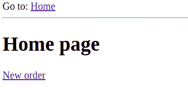
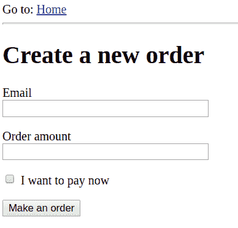
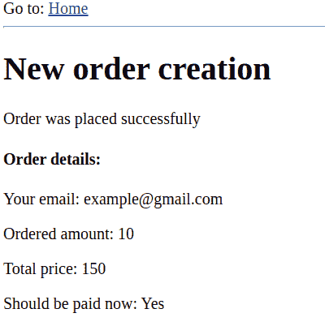
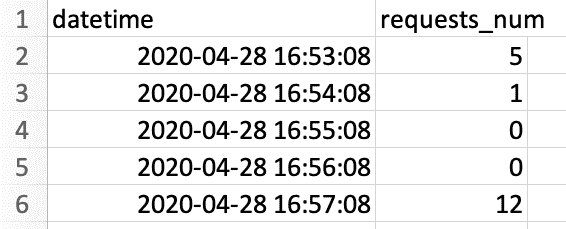
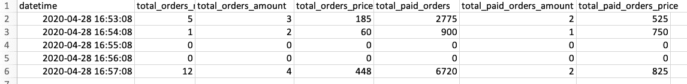

# 使用 Kafka 在云数据湖中收集 Web 应用程序指标

> 原文：<https://towardsdatascience.com/using-kafka-for-collecting-web-application-metrics-in-your-cloud-data-lake-b97004b2ce31?source=collection_archive---------25----------------------->


伊利亚·巴甫洛夫在 [Unsplash](https://unsplash.com/s/photos/web?utm_source=unsplash&utm_medium=referral&utm_content=creditCopyText) 上的照片

## 本文演示了如何使用 Kafka 从 web 应用程序中收集数据湖存储(如亚马逊 S3)的指标。

# 度量收集

指标是反映流程或系统状态的指标(值)。当我们有一系列数值时，我们也可以对趋势或季节性做出结论。总之，度量是过程或系统如何发展的指示器。指标可以由应用程序、硬件组件(CPU、内存等)生成。)，web 服务器，搜索引擎，物联网设备，数据库等等。度量可以反映系统的内部状态，甚至一些真实世界的过程。真实世界指标的示例包括电子商务网站，它可以生成关于任何给定时间段内新订单数量的信息，空气质量设备，它可以收集关于空气中不同化学物质浓度的数据，以及 CPU 负载，这是关于计算机系统内部状态的指标的示例。

可以实时分析收集的指标，也可以存储起来供以后进行批量分析。收集的指标也可以用来训练机器学习模型。

收集指标可能是一个复杂的过程，因为它取决于许多参数和条件。指标的来源产生值，然后这些值或者被传送到云数据湖存储，或者被实时使用。将指标从源交付到存储的方法以及存储的方式可能会因情况而异。

有助于收集指标的工具之一是 Apache Kafka。

# 卡夫卡概述

Apache Kafka 是一个用于构建实时数据处理管道和流应用程序的工具。Kafka 是一个分布式系统，这意味着它可以从几个源作为一个集群运行。Kafka 集群是不同的数据生成器(称为生产者)和数据消费者(称为消费者)使用的中心枢纽。应用程序(桌面、web、移动)、API、数据库、web 服务和物联网设备都是生产者的典型例子。生产者是向 Kafka 集群发送数据的实体。消费者是从 Kafka 集群接收数据的实体。Kafka 集群可以由一个或多个 Kafka 代理组成。

卡夫卡使用主题来组织数据。主题是数据流的类别。主题中的每个数据点都有自己唯一的时间戳、键和值。生产者可以将数据写入特定的主题，而消费者可以订阅所需的主题来接收特定的数据集。Kafka 支持数据复制，即在不同的代理上创建相同数据的副本。这可以防止其中一个代理由于某种原因损坏或中断时数据丢失。

Kafka 是最受欢迎的事件流平台和消息队列之一。许多大公司用它来管理他们的数据管道。以下是卡夫卡提供的几个最重要的优势:

*   可扩展性(由于支持分布式操作)
*   容错
*   持久性
*   快速操作
*   高流通量
*   实时模式以及以批处理模式工作的能力

让我们看看 Kafka 是如何用于收集指标的。

# Kafka 如何用于收集指标

通常，收集指标是实时完成的。这意味着指标的来源不断地生成数据，并可以作为数据流发送。正如我们所知，Kafka 是一个处理数据流的好工具，这就是为什么它可以用于收集指标。

在这个例子中，我们将使用一个简单的 Flask web 应用程序作为生产者。它将向 Kafka 集群发送有关其活动的指标。消费者将是一个 python 脚本，它将从 Kafka 接收指标，并将数据写入 CSV 文件。该脚本将从 Kafka 接收指标，并将数据写入 CSV 文件。Python 应用程序本身可以丰富数据，并将指标发送到云存储。在这一阶段，数据可供一系列同类最佳的数据湖引擎(如 Dremio)查询和处理。

**这里有个小技巧**:如果你想进行度量监控，可以使用 Prometheus、Grafana、Kibana 等工具。管道是相同的:web 应用程序将数据发送到 Kafka 集群中，然后指标应该被交付到前面提到的平台，在那里进行可视化和分析。如果发生某些事件，还可以设置警报和通知。

# 例子

让我们看看卡夫卡帮助下的度量收集的例子。我们将使用 Flask web 应用程序作为度量的来源。使用该应用程序，人们可以创建订单和购买必需品。这是该网站的主页:



非常简单:当用户点击*新订单*按钮时，他们将进入下一页，在那里他们可以下订单。



当用户选中复选框字段时，这意味着他们想立即为订单付款。否则，货物将在信用条件下供应。用户点击*下单*按钮后，进入下一页:



在此页面上，用户可以查看已创建订单的详细信息。这里的新元素是总价，其计算方法是将 1 个单位的价格乘以订购数量。

现在让我们看看应用程序的代码。它有几个文件，包括表格，模板，配置，数据库(SQLite)等。但是我们将只演示在生成和发送指标到 Kafka 集群中起作用的文件。

需要注意的是，对于本文，我们将使用 *kafka-python* 包。它允许我们直接从 Python 代码中使用 Kafka。我们使用以下命令安装它:

```
pip install kafka-python
```

下面，你可以看到来自 *models.py* 文件的代码。这个文件描述了数据库的结构。我们那里只有一张桌子叫做*订单*。它由一个 Python 类表示，其中每个属性都是数据库中的列。但是这个文件最有趣的部分是*send _ order _ info _ to _ Kafka()*函数。

```
import jsonfrom app import dbfrom sqlalchemy import eventfrom kafka import KafkaProducerclass Order(db.Model):id = db.Column(db.Integer, primary_key=True)customer_email = db.Column(db.String(120),nullable=False, default=””)amount = db.Column(db.Integer)total_price = db.Column(db.Integer)is_prepaid = db.Column(db.Boolean, default=False)@event.listens_for(Order, ‘after_insert’)def send_order_info_to_kafka(mapper, connection, target):assert target.id is not Noneproducer = KafkaProducer(bootstrap_servers=[‘localhost:9092’])topic_name = ‘new_orders’order_dict = {“order_id”: target.id,“order_amount”: target.amount,“order_total_price”: target.total_price,“is_paid”: target.is_prepaid}producer.send(topic_name, value=json.dumps(order_dict).encode())producer.flush()
```

这个函数由*event . listens _ for()*decorator(从 *sqlalchemy* 库导入)增强。当关于新订单的记录被插入数据库时，这个装饰器监视事件。当这种情况发生时，该函数创建一个 *KafkaProducer* 实例(指向正在运行的 Kafka 集群所在的 URL)并指定 Kafka *主题的名称* — *new_orders* 。然后，该函数创建消息体。我们想将订单的统计数据发送给 Kafka。这就是为什么对于每个订单，我们都用订单金额、总价以及是否预付的信息来创建字典。然后我们把这个字典转换成 JSON 格式，编码，用生产者的方法 *send()* 和 *flush()* 发送给卡夫卡。因此，每当用户创建新订单时，都会触发该函数。该函数的目的是向 Kafka 集群发送有关已创建订单的信息。

我们希望再收集一组指标——特定时间段内的请求数量。这是监控任何 web 应用程序的一个常见指标。因此，每当有人访问我们网站上的页面时，我们都需要向我们的 Kafka 集群发送通知。下面是我们如何实现这种行为。在文件 *utils.py* 中我们定义了名为*的函数 ping_kafka_when_request()* 。这个函数的主体与我们之前看到的函数非常相似。它创建生产者的实例，定义生产者应该提交消息的主题名称( *web_requests* )，然后使用 *send()* 和 *flush()* 方法发送消息。这个函数稍微简单一点，因为我们不需要为消息创建复杂的主体。每当一个新的请求出现时，我们就发送 *value=1* 。

```
from kafka import KafkaProducerdef ping_kafka_when_request():producer = KafkaProducer(bootstrap_servers=[‘localhost:9092’])topic_name = ‘web_requests’producer.send(topic_name, value=”1".encode())producer.flush()
```

为了使这个函数工作，我们需要在每个页面的视图函数中调用它。这可以在 *routes.py* 文件中完成(参见下面的代码)。有三个函数:( *index()* 、 *create_order()* 、 *order_complete()* )。这些函数中的每一个都负责在网站上呈现页面时执行一些逻辑。最复杂的函数是 *create_order()* 函数，因为它应该处理表单提交和向数据库插入新记录。但是如果我们谈论与 Kafka 的交互，您应该注意到这样一个事实:我们从 *utils* 文件中导入了*ping _ Kafka _ when _ request()*函数，并在每个视图函数内部调用它(在执行该函数中所有剩余的代码之前)。

```
from app import app, dbfrom app.models import Orderfrom flask import render_template, redirect, sessionfrom app.forms import OrderFormfrom .utils import ping_kafka_when_request@app.route(‘/’)def index():ping_kafka_when_request()return render_template(‘index.html’)@app.route(‘/order-new’, methods=[‘GET’, ‘POST’])def create_order():ping_kafka_when_request()form = OrderForm()if form.validate_on_submit():price = 15customer_email = form.email.dataamount = form.amount.datais_prepaid = form.is_paid_now.datatotal_price = amount * priceorder = Order(customer_email=customer_email,amount=amount,total_price=total_price,is_prepaid=is_prepaid)db.session.add(order)db.session.commit()session[‘order’] = {“email”: customer_email,“amount”: amount,“total_price”: total_price,“is_paid”: is_prepaid}return redirect(‘/order-new-complete’)return render_template(‘new_order.html’,title=’Make a new order’, form=form)@app.route(‘/order-new-complete’)def order_complete():ping_kafka_when_request()return render_template(‘new_order_complete.html’,order=session[‘order’])
```

这些是我们建筑的生产者方面。我们解释说，代码需要位于 web 应用程序内部，以便向 Kafka 集群发送指标。现在让我们看看另一面——消费者。

第一个文件是 *consumer_requests.py* 。我们来分块考察一下。在文件的开头，我们导入我们需要的所有包，并创建 Kafka consumer 的实例。我们将应用几个参数，以便它能够按照预期的方式工作。你可以在[文档](https://kafka-python.readthedocs.io/en/master/apidoc/KafkaConsumer.html)中读到它们。最重要的参数是我们希望为消费者订阅的主题名称(web_requests)和指向 Kafka 集群所在服务器的 *bootstrap_servers* 参数。

```
import timeimport threadingimport datetimefrom kafka import KafkaConsumerconsumer = KafkaConsumer(‘web_requests’,bootstrap_servers=[‘localhost:9092’],auto_offset_reset=’earliest’,enable_auto_commit=True,auto_commit_interval_ms=1000,consumer_timeout_ms=-1)
```

接下来，我们需要创建一个函数，它将每分钟轮询 Kafka 集群一次，并处理 Kafka 将返回的消息。该函数的名称是*fetch _ last _ min _ requests()*，您可以在下面的代码示例中看到它。它需要两个参数作为输入。 *next_call_in* 参数显示该函数的下一次调用应该发生的时间(记住我们需要每 60 秒从 Kafka 获取新数据)。不需要 *is_first_execution* 参数。默认情况下，它等于 False。

在函数开始时，我们确定下一次调用该函数的时间(从现在起 60 秒)。此外，我们为请求初始化计数器。然后，如果是第一次执行，我们创建文件 *requests.csv* 并向其中写入一行标题。这个数据集的结构将会很简单。它应该有两列— *日期时间*和*请求数量*。每一行在*日期时间*列中有时间戳，在*请求数量*列中有网站在给定时间内处理的请求数量。

```
def fetch_last_min_requests(next_call_in, is_first_execution=False):next_call_in += 60counter_requests = 0if is_first_execution:with open(‘requests.csv’,’a’) as file:headers = [“datetime”, “requests_num”]file.write(“,”.join(headers))file.write(‘\n’)else:batch = consumer.poll(timeout_ms=100)if len(batch) > 0:for message in list(batch.values())[0]:counter_requests += 1with open(‘requests.csv’,’a’) as file:data = [datetime.datetime.now().strftime(“%Y-%m-%d %H:%M:%S”), str(counter_requests)]file.write(“,”.join(data))file.write(‘\n’)threading.Timer(next_call_in — time.time(),fetch_last_minute_requests,[next_call_in]).start()
```

如果这不是函数的第一次执行，我们将强制消费者轮询 Kafka 集群。您应该将 *poll()* 方法的 *timeout_ms* 参数设置为一个大于零的数字，因为否则，您可能会错过一些消息。如果 *poll()* 方法返回非 void 对象( *batch* )，我们希望遍历所有获取的消息，并且在每次迭代中，将 *count_requests* 变量加 1。然后，我们打开 *request.csv* 文件，生成行(由逗号连接的当前日期时间和 *counter_requests* 值的字符串)，并将该行追加到文件中。

给定函数中的最后一行是定时器设置。我们将三个参数插入到*定时器*对象中。第一个是触发函数(第二个参数)的时间段。这段时间是通过从存储在 *next_call_in* 变量中的时间减去当前时间戳来动态计算的，这是我们在函数开始时计算的。*定时器*对象的第三个参数是带有参数的列表，这些参数应该传递给我们想要执行的函数。我们立即使用其 *start()* 方法启动计时器。

为什么我们需要这样一种微妙的方式来定义下一次函数调用发生的时间呢？难道就不能用更流行的 *time.sleep()* 方法吗？答案是否定的。我们使用这种方法是因为位于函数内部的逻辑的执行需要一些时间。例如，Kafka 集群轮询至少需要 100 毫秒。此外，我们还需要对请求进行计数，并将结果写入文件。所有这些事情都很耗时，如果我们简单地使用 *time.sleep()* 暂停执行，分钟周期将在下一次迭代中漂移。这可能会破坏结果。使用*穿线。Timer* object 是一种稍微不同但更合适的方法。我们不是暂停 60 秒，而是通过减去在函数体内执行代码所花费的时间来计算函数应该被触发的时间。

现在我们可以使用定义的函数了。只需在当前时间前初始化 *next_call_in* 变量，并使用*fetch _ last _ minute _ requests()*函数，将该变量作为第一个参数，将 *True* 标志作为第二个参数(以标记这是第一次执行)。

```
next_call_in = time.time()fetch_last_minute_requests(next_call_in, True)
```

这就是 *consumer_requests.py* 文件的全部内容。但是在执行它之前，您应该运行 Kafka 集群。下面是如何从终端本地完成此操作(假设您已经安装了它):

```
sudo kafka-server-start.sh /etc/kafka.properties
```

现在您可以运行该文件了。然后在你的浏览器中进入网络应用程序(你可以使用命令 *flask run* 运行 Flask 应用程序)并尝试浏览它——访问它的页面。过一会儿，您应该在您的消费者文件所在的文件夹中有文件 *requests.csv* 。该文件可能如下所示(实际数据会有所不同，取决于您访问应用页面的次数):



我们所做的是构建管道，允许我们使用 Kafka 和 Python 收集 web 应用程序指标(请求数量)。

现在我们来看另一个消费者。我们将这个文件命名为 *consumer_orders.py* 。文件的第一部分与前一个文件非常相似。一个区别是我们导入了 *json* 库，因为我们需要处理 json 编码的消息。另一个区别是 Kafka 消费者订阅了*新订单*主题。

```
import jsonimport timeimport datetimeimport threadingfrom kafka import KafkaConsumerconsumer = KafkaConsumer(‘new_orders’,bootstrap_servers=[‘localhost:9092’],auto_offset_reset=’earliest’,enable_auto_commit=True,auto_commit_interval_ms=1000,consumer_timeout_ms==-1)
```

主要函数是*fetch _ last _ minute _ orders()*。与前一个消费者的函数不同的是，这个函数有六个计数器，而不是只有一个。我们希望统计一分钟内创建的订单总数、订购的商品总数、所有订单的总成本、预付订单的数量、预付订单中的商品数量以及所有预付订单的总价。这些指标可能对进一步的分析有用。

另一个区别是，在开始计算上述值之前，我们需要使用 *json* 库解码从 Kafka 获取的消息。所有其他逻辑都与处理请求的消费者相同。应该写入数据的这个文件叫做 *orders.csv* 。

```
def fetch_last_minute_orders(next_call_in, is_first_execution=False):next_call_in += 60count_orders = 0count_tot_amount = 0count_tot_price = 0count_orders_paid = 0count_tot_paid_amount = 0count_tot_paid_price = 0
if is_first_execution:with open(‘orders.csv’,’a’) as file:headers = [“datetime”, “total_orders_num”,“total_orders_amount”, “total_orders_price”,“total_paid_orders_num”,“total_paid_orders_amount”,“Total_paid_orders_price”]file.write(“,”.join(headers))file.write(‘\n’)else:batch = consumer.poll(timeout_ms=100)if len(batch) > 0:for message in list(batch.values())[0]:value = message.value.decode()order_dict = json.loads(value)# all orderscount_orders += 1count_tot_amount += order_dict[“order_amount”]count_tot_price += order_dict[“order_total_price”]if order_dict[“is_paid”]:# only paid orderscount_orders_paid += 1count_tot_paid_amount += order_dict[“order_amount”]count_tot_paid_price += order_dict[“order_total_price”]with open(‘orders.csv’,’a’) as file:data = [datetime.datetime.now().strftime(“%Y-%m-%d %H:%M:%S”),str(count_orders), str(count_tot_amount),str(count_tot_price), str(count_orders_paid),str(count_tot_paid_amount),str(count_tot_paid_price)]file.write(“,”.join(data))file.write(‘\n’)threading.Timer(next_call_in — time.time(),fetch_last_minute_orders,[next_call_in]).start()
```

文件的最后一部分是相同的:获取当前时间并触发上面定义的函数:

```
next_call_in = time.time()fetch_last_minute_orders(next_call_in, True)
```

假设您已经运行了 Kafka 集群，那么您可以执行 *consumer_orders.py* 文件。接下来，进入你的 Flask 应用程序，在几分钟内创建一些订单。生成的 *orders.csv* 文件将具有以下结构:



您可以看到我们的 Python 脚本(尤其是那些处理订单数据的脚本)执行了一些数据丰富。

数据工程师可以定制这个过程。例如，如果应用程序非常大并且负载很高，Kafka 集群应该水平扩展。对于不同的指标，您可以有许多主题，并且每个主题都可以用自己的方式进行处理。可以跟踪新用户注册、用户变动、反馈数量、调查结果等。

此外，您可以设置一些低级指标的集合，如 CPU 负载或内存消耗。基本的管道将是类似的。还值得一提的是，将数据写入 CSV 文件并不是唯一的选择，您还可以利用开放的数据格式，如 Parquet，并将所有这些数据直接放到您的数据湖中。

一旦您收集了指标，您就可以使用 [Dremio](http://www.dremio.com/tutorials) 直接查询数据，以及创建和共享虚拟数据集，这些数据集将指标与数据湖中的其他来源相结合，所有这些都不需要任何副本。

# 结论

在本文中，我们为从 Flask web 应用程序收集指标构建了一个数据管道。Kafka 集群用作数据生产者(部署在 web 应用程序中)和数据消费者(Python 脚本)之间的层。Python 脚本充当从 Kafka 获取指标，然后处理和转换数据的应用程序。给出的示例是基本的，但是您可以根据自己的需要，使用它来构建更复杂、更多样的指标收集管道。然后，您可以使用 Dremio 的[数据湖引擎](http://www.dremio.com)来查询和处理结果数据集。