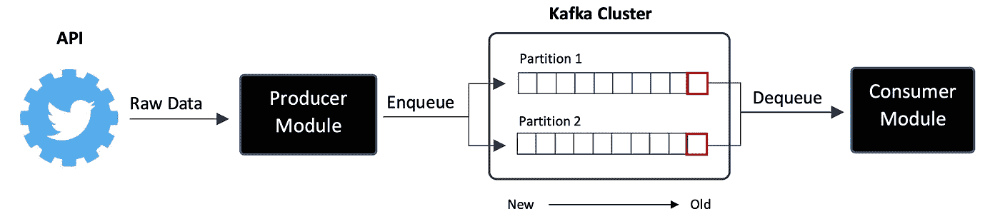
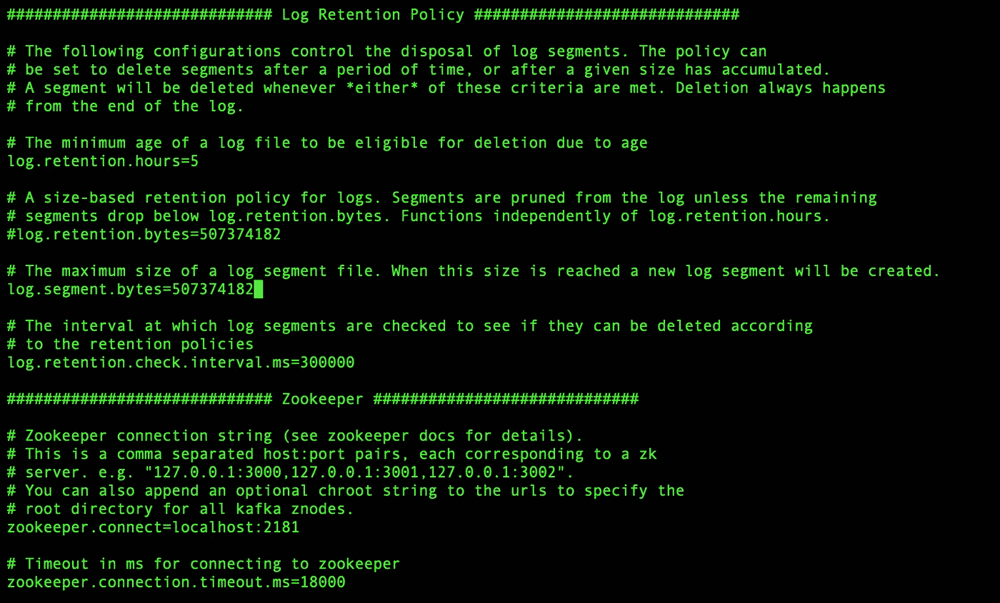

# 使用 Kafka 优化你的 Twitter 流的数据流

> 原文：<https://towardsdatascience.com/using-kafka-to-optimize-data-flow-of-your-twitter-stream-90523d25f3e8?source=collection_archive---------12----------------------->

## 高效处理来自 Twitter 的大数据指南


萨法尔·萨法罗夫在 [Unsplash](https://unsplash.com?utm_source=medium&utm_medium=referral) 上拍摄的照片

我最近在做一个大数据分析项目，在这个项目中，我从 Twitter 上长时间收集了大约 50-60 个热门话题的实时流数据。这个项目严重依赖 Twitter API 进行数据收集，使用 Twitter API 进行数据收集的一个主要限制是，客户端机器必须始终跟上数据流，如果不能，数据流就会断开，相信我，这种情况会经常发生，尤其是在您实时处理大量数据的情况下！在本文中，我将向您展示我的解决方案，通过使用 Kafka 作为消息队列来克服这一限制。

到目前为止，卡夫卡主要有两种风格，一种是阿帕奇基金会的，另一种是合流派的。对于本文，我们将使用合流版本，因为它为我们提供了一个很好的 Python 客户端来与 Kafka 进行交互。

# **入门**

由于网上有很多关于如何从 Twitter 流式传输数据的惊人资源，我不会讨论如何获得您的 Twitter 开发人员帐户并设置 Python 库来从 Twitter 流式传输数据。本文面向已经在使用 Twitter API 进行数据收集并希望优化其数据流的数据科学家/工程师。请注意，这不是一个突破 Twitter 流媒体 API 速率限制的解决方案。

以下是您开始工作所需的物品清单:

1.  Ubuntu 或 Mac OS 驱动的机器
2.  中级 Python 知识，熟悉 JSON
3.  熟悉 Twitter API 和 Tweepy Python 库
4.  融合平台的自我管理版本

## **到底什么是卡夫卡和合流台？**

Kafka 是一个分布式流媒体平台，允许您创建数据流管道，它位于融合平台的核心，该平台包括各种功能，使 Kafka 更易于使用。有关 Kafka 和合流平台的更多详细信息，请参见下面的链接:

 [## 什么是合流平台？汇合平台

### Confluent 提供了业内唯一的企业级事件流平台

文件汇合](https://docs.confluent.io/current/platform.html#cp-platform) 

## **在 Twitter 上使用 Kafka 的好处**

将 Kafka 与您的 Twitter 流一起使用的主要好处之一是容错，因此您将拥有两个模块，而不是拥有一个收集、处理和保存所有内容到 JSON 文件中的 Python 模块。一个称为“生产者”的模块从 twitter 流中收集数据，然后将其作为日志保存到队列中，不做任何处理，另一个称为“消费者”的模块读取日志，然后处理数据，本质上创建了一个解耦的流程。以下是您的数据流外观的高级概述:



图 1.0。卡夫卡如何使用 Twitter

# **汇合平台设置**

首先，你需要去 https://www.confluent.io/download[的合流平台网站，下载合流平台的自我管理版本，并将其保存到你选择的目录中。对于我的 mac，它将在用户目录中。](https://www.confluent.io/download)

## **第一步。设置动物园管理员**

下载完成后，您需要设置 Zookeeper 服务器，它本质上是一个协调器，维护 Kafka 集群中的节点以及其他关键功能。

在您的终端上运行以下命令(请确保使用您的文件目录更新命令):

```
cd file_directory_of_your_choice/confluent-5.5.0/etc/kafkanano zookeeper.properties
```


图 1.1。终端上的 Zookeeper 服务器属性

您可以在这里更改和调整 zookeeper 服务器与 Kafka 集群的交互方式。然而，对于本文，我们将把它保留为默认值。

## **第二步。建立卡夫卡**

现在我们继续设置 Kafka 服务器。在您的终端上运行以下命令:

```
nano server.properties
```



图 1.2。终端上的 Kafka 服务器属性

由于我们使用 Kafka 进行优化，我们将把默认日志保留时间减少到 5 小时，并将日志保留和段字节减少到 507374182。向下滚动到服务器属性配置文件中的日志保留策略部分，并进行以下调整:

```
log.retention.hours=5
log.retention.bytes=507374182
log.segment.bytes=507374182
```

然后，通过确保 Zookeeper 部分中的端口号正确，确保您的 Kafka 服务器能够连接到 Zookeeper 服务器。我们将使用 Zookeeper 服务器的默认设置。

```
zookeeper.connect=localhost:2181
```

## 第三步。启动服务器

现在大部分设置已经完成，我们将开始运行服务器。

**初始化动物园管理员服务器**

```
sudo file_directory_of_your_choice/confluent-5.5.0/bin/zookeeper-server-start file_directory_of_your_choice/confluent-5.5.0/etc/kafka/zookeeper.properties
```

**初始化 Kafka 服务器**

```
sudo file_directory_of_your_choice/confluent-5.5.0/bin/kafka-server-start file_directory_of_your_choice/confluent-5.5.0/etc/kafka/server.properties
```

## 第四步。主题创建和分区配置

Kafka 中的主题本质上是在多个分区中发布日志的类别。所以在我们的例子中，为了让我们的 Python 代码与 Kafka 交互，我们需要分配一个主题名并为该主题配置分区。

运行以下命令来创建和配置 Kafka 主题。

```
sudo file_directory_of_your_choice/confluent-5.5.0/bin/kafka-topics --zookeeper localhost:2181 --create --replication-factor 1 --partitions 2 --topic twitterdata
```

分区和复制因子可以根据您的偏好和配置进行调整。

# Python 代码

**为 Python 安装 Kafka API**

所以在我们开始使用 Python 中的 Kafka 之前，我们需要安装 Python 中的 Kafka 库。在您的终端上运行以下代码:

```
pip3 install kafka
```

**生产商模块代码**

在您的 IDE 上，创建一个名为 producer 的新 Python 模块。在这里，您可以将 Tweepy 的 on_data 函数与 KafkaProducer 一起使用，将原始 twitter 数据输入 Kafka 集群。

**消费模块代码**

创建另一个名为 Consumer 的 Python 模块。该模块将从您的 Kafka 集群中读取原始数据，您可以添加额外的功能，如语言检测、情感分类器，而不用担心流断开，因为现在我们已经基本上解耦了整个 Twitter 流。

# 结论

总之，我们已经创建了一个解耦的 twitter 流，我们本质上将这个流分成两个不同的模块。一个模块用于从 Twitter API 检索数据并将其提供给 Kafka 集群，另一个模块用于从 Kafka 集群读取数据并单独处理数据。这允许我们处理来自 twitter 的原始数据，而不用担心流被断开。