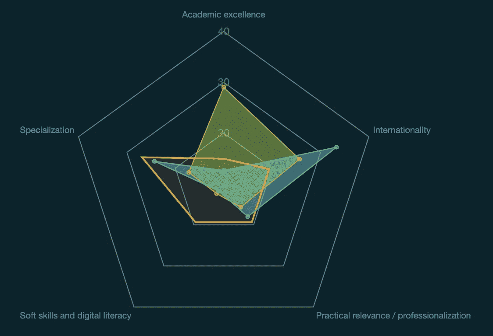
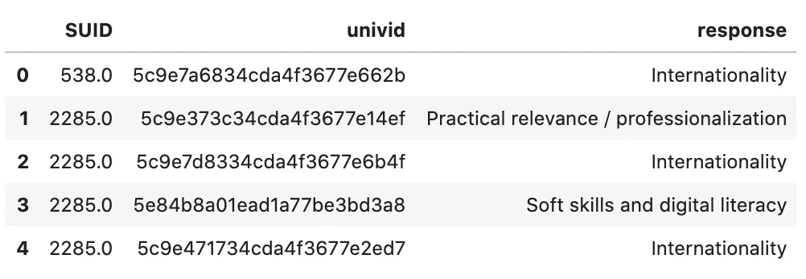
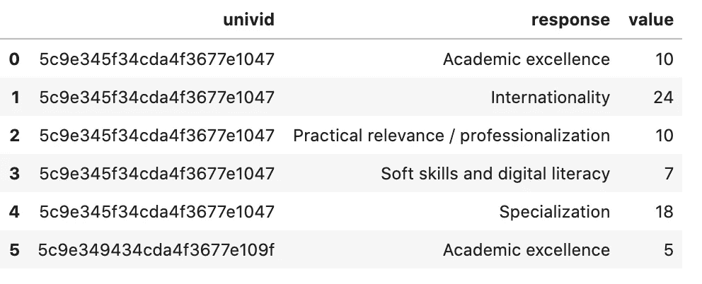
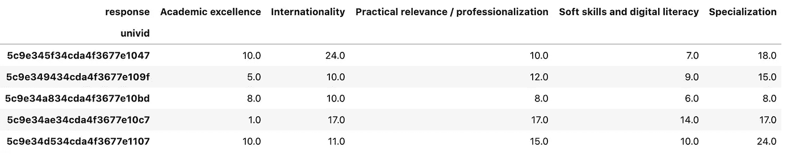
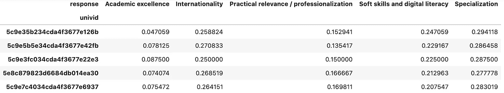
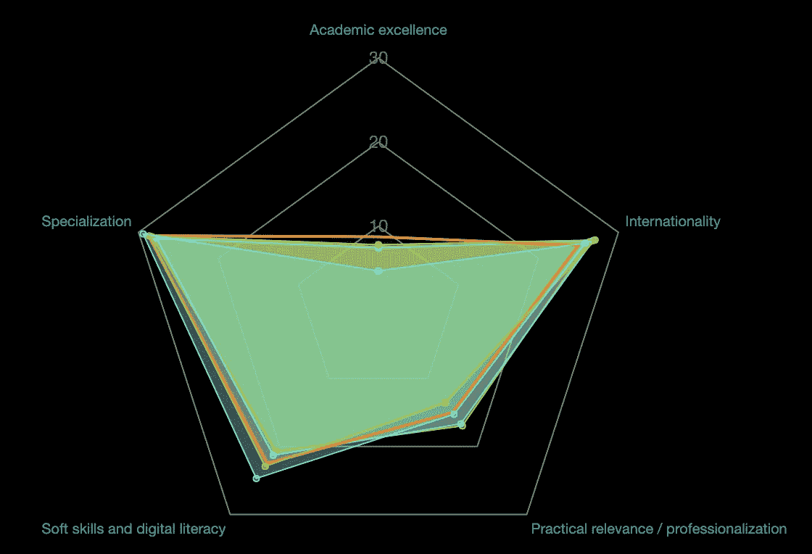
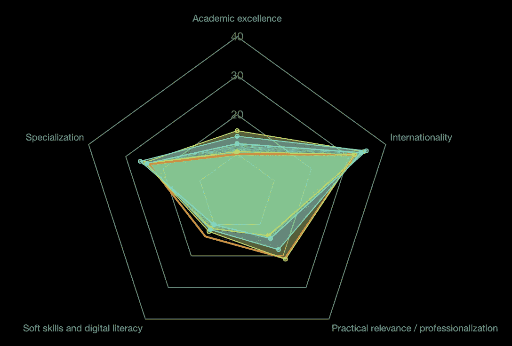

# 使用 KDTree 检测多维数据集中的相似性

> 原文：<https://towardsdatascience.com/using-kdtree-to-detect-similarities-in-a-multidimensional-dataset-4be276dcf616?source=collection_archive---------61----------------------->

## 找到完美匹配的快速简单的方法


艾莉娜·格鲁布尼亚克在 [Unsplash](/s/photos/network?utm_source=unsplash&utm_medium=referral&utm_content=creditCopyText) 上的照片

# 真实生活的例子

大多数数据科学都面向**训练、测试、预测范式**。未来谁不想猜啊！但在某些情况下，需要其他实现，如无监督分类或在现有数据中发现模式。换句话说，如何利用已经拥有的**数据。**

我认为与数据科学的其他分支相比，这个方面有点被忽视了，关于它的文献也更少。因此，这一点点贡献的原因。

故事是这样的:我们的一个客户需要一种方法，根据固定数量的参数为一个给定的实体找到相似的商品(邻居)。实际上，该数据集由人力资源专业人士的投票组成，他们可以将多达 5 种技能归于任意数量的世界大学。这意味着人力资源部的爱德华可以投票选择麻省理工学院作为数字化的好学校，牛津大学作为国际化的好学校，巴黎大学作为软技能的好学校。

我准备了数据，输出了一个蜘蛛网图表，客户可以选择任何机构，并与其他机构进行比较，下面是三所随机大学的例子:



三所大学的投票技能

在这一点上，寻找以同样方式投票的大学似乎很有趣，也许是为了比较他们的行动，研究他们做得好和不好的地方。

数据来自 spss 文件，一行由投票决定，根据我们的简报，输出必须很快，因为它被用作后端服务，具有接近**实时响应**。

经过一些研究之后，我认为最好的处理格式应该是一个 [**KD 树**](https://scikit-learn.org/stable/modules/generated/sklearn.neighbors.KDTree.html) ，因为它具有多维性，并且处理起来相对容易和快速。我不会详细解释什么是 KD 树，但是你可以参考维基百科的文章。

它完全集成到了 [**sklearn**](https://scikit-learn.org/stable/) 模块中，并且非常容易使用，我们将在下面看到。

但首先，让我们做一些准备！

# 数据准备

作为客户的财产，我们的数据集已被匿名化。大学的名字被拿走了，但是价值观是真实的。

我们将从导入库开始:

```
import pandas as pd
from sklearn.neighbors import KDTree
```

*   熊猫将被用来输入和处理我们的数据。对于类似数据库的处理来说，它非常快速和有用
*   sklearn 代表 [scikit-learn](https://scikit-learn.org/stable/) ，最著名的数据分析库之一。它用于分类、聚类、回归等等。我们将从**最近邻居**子库中导入 KDTree

我们已经将 spss 文件转换为 csv 文件，所以我们只需使用 pandas read_csv 方法导入它并显示它的第一行:

```
df = pd.read_csv("[https://bitbucket.org/zeerobug/material/raw/12301e73580ce6b623a7a6fd601c08549eed1c45/datasets/votes_skills_anon.csv](https://bitbucket.org/zeerobug/material/raw/12301e73580ce6b623a7a6fd601c08549eed1c45/datasets/votes_skills_anon.csv)", index_col=0)
df.head()
```



数据集结构

每行对应一个投票，其中:

*   SUID 是投票者的唯一 ID
*   **univid** :机构的唯一标识
*   **响应**:投票技能

例如，这意味着用户#538 投票选择“国际性”作为大学#5c9e7a6834cda4f3677e662b 的一项重要技能。

我们的下一步包括按机构和技能分组(响应)。我们使用优秀的 **groupby** 方法来实现，该方法生成一个 SeriesGroupBy 对象，我们可以用它来计算数据集中相似的(univid，response)对的数量。

```
skills = df.groupby(["univid", "response"])["response"].count().reset_index(name='value')
```

我们使用 reset_index 从 count()函数输出的序列中获取一个 DataFrame，并创建包含该计数的“value”列。这是我们的桌子:



按 univid 和响应分组的相同数据集

即使可读性更好，这种格式对我们的目标也没用。很难区分机构，因为行数是任意的(一些技能可能没有被投票)，并且许多工具最好使用行值而不是列值。

幸运的是，熊猫提供了一个非常强大的交换行列的工具: [**pivot_table**](https://pandas.pydata.org/pandas-docs/stable/reference/api/pandas.pivot_table.html) 。它的论点不言自明，所以我不会进入细节。

```
univSkills = skills.pivot_table(values="value", columns="response", index=["univid"])
univSkills.head()
```



pivot_table 之后的值

我们的数据几乎已经准备好进行处理，但是我们仍然有一个问题:要使**具有可比性**，每一行都必须在相同的范围内，如果我们计算一行中值的总和，各行之间的总和远远不相似:

```
univSkills.sum(axis=1).head()univid
5c9e345f34cda4f3677e1047    69.0
5c9e349434cda4f3677e109f    51.0
5c9e34a834cda4f3677e10bd    40.0
5c9e34ae34cda4f3677e10c7    66.0
5c9e34d534cda4f3677e1107    70.0
```

这是因为像哈佛这样的大学比一些偏远和不知名的大学拥有更多的选票。在其他计算中使用这个参数可能会很有趣，但是对于目前的问题，我们需要去掉那个**差异**。我们通过使用**百分比**而不是**绝对值来遵从。**

所以我们必须对每一行求和，然后将每个值除以这个和。这是在**一行程序**中完成的，然后我们去掉一些 Nan 值来完成数据集的润色。

```
univSkills = univSkills.div(univSkills.sum(axis=1), axis=0)
univSkills.fillna(0, inplace=True )
```

我们的数据集现在是干净的，准备好了，值在相同的范围内，我们可以开始玩一些更有趣的处理。

# 处理数据以查找邻居

因此，我们的算法必须在我们的数据集中检测所有大学中，哪些大学同时具有与我们的 5 个变量最接近的值。我们可以立即想到一个带有嵌套循环的**强力算法**,它会逐值比较，直到找到每个变量的 5 个最接近的值，但这将**远离最佳**,对于我们的应用程序来说不够快！

KD 树算法更加有效，它由数据的**几何方法**组成，通过 n 维空间的后续划分，生成一棵**以允许**复杂查询**快速运行的方式重新组织数据**的树。让我们用这个方法生成一棵树:

```
tree = KDTree(univSkills)
```

我们的树可以被查询了。第一步是选择一所大学开始，例如索引 9 ( `univSkills[9:10]`)的行，我们想要 5 所最近的大学(`k=5`)的结果集，应用于我们的树的“查询”函数将返回 2 个 numpy 数组(`dist, index`)的元组，这将分别是结果的**距离**和**索引**，从最近到最远排序。

```
dist, ind = tree.query(univSkills[9:10], k=5)
```

然后我们可以显示我们的**邻居**的值:

```
univSkills.iloc[ind.tolist()[0]]
```



我们马上注意到**值非常接近**，我们可以用新的雷达图来确认:



5 大学技能对比



另一个例子

你可以尝试不同的开始行，在大多数情况下，雷达图将保持非常相似的形状。

您也可以使用其他 **KDTree 方法变量**，您可以在[文档](https://scikit-learn.org/stable/modules/generated/sklearn.neighbors.KDTree.html#sklearn.neighbors.KDTree.query)中找到它们。让我知道你的实验是否会带来更好的结果。

# 进一步的实验

我认为这个算法还有很多其他的应用。它可以用在**推荐系统**、**约会网站**中，以及通常任何依赖于多维矩阵之间的接近度的处理中

**关系**，例如:通过确定最大距离并将查询函数应用于整个数据集的每一行，我们可以发现看不见的关系，并生成一个类似于 **GraphQL** 的数据库。

由于它的速度、简单性和有效性， **KDTree** 也可以在一些简单的情况下作为复杂得多的库的替代，如 **TensorFlow** 或 **Pytorch** 。我们将在我的 n **ext 文章**中研究这个问题。

瞧啊！我希望这篇文章对某人有用。你可以在这里找到完整的笔记本。不要犹豫，留下你的评论，给我发电子邮件，或者任何问题。