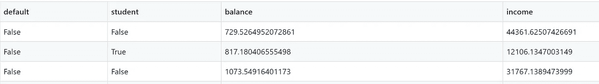

# 使用贷款数据训练和构建分类机器学习应用程序

> 原文：<https://towardsdatascience.com/using-loan-data-to-train-and-build-a-classification-machine-learning-app-174c2f1058e3?source=collection_archive---------55----------------------->

## 构建应用程序以服务分类模型、将应用程序容器化并进行部署的简要指南。

作者:[爱德华·克鲁格](https://www.linkedin.com/in/edkrueger/)和[道格拉斯·富兰克林](https://www.linkedin.com/in/douglas-franklin-1a3a2aa3/)。


照片由 Unsplash 上的纽约公共图书馆拍摄

请点击此处查看该项目中使用的所有代码！

[](https://github.com/edkrueger/python-classification-labs) [## edkrueger/python-分类-实验室

### 在 GitHub 上创建一个帐户，为 edkrueger/python-classification-labs 的开发做出贡献。

github.com](https://github.com/edkrueger/python-classification-labs) 

我们使用 GCP 来编码这个项目，它配置了 Docker。如果您有兴趣了解预配置的云虚拟机，请阅读本文开始学习！

[](/using-gcp-ai-platform-notebooks-as-reproducible-data-science-environments-964cba32737) [## 使用 GCP 人工智能平台笔记本作为可复制的数据科学环境

### 使用预配置的云托管虚拟机解决 Python 和 Jupyter 笔记本电脑的再现性问题。

towardsdatascience.com](/using-gcp-ai-platform-notebooks-as-reproducible-data-science-environments-964cba32737) 

我们的数据来自一本叫做《ISLR》的书。查看这项工作的机器学习和统计信息！

# 问题

我们可以想象一家银行想知道谁是安全的贷款接受者，但是我们如何在只知道一些关于某人的事情的情况下判断他是否值得信任呢？

我们的数据集包含代表具有默认状态的个人的行，以及我们将用来预测默认状态的一些其他信息。换句话说，这就是监督学习。

首先，我们将清理数据，使其更适合分类模型。

# 数据

让我们看看我们的数据。


原始数据

看起来我们有四列和一个索引，包括银行余额、年收入、学生状态和贷款违约状态。可以清理这些数据以更好地适应分类模型，所以让我们做一些更改。

## 数据清理和 EDA

为了清理我们的数据，我们使用 pandas 和一些 lambda 函数来删除索引，并将我们的 yes/no 字符串更改为 True/False 布尔值。

data_cleaning.ipynb

现在我们的干净数据看起来像这样。



在我们为训练模型设置数据之前，让我们最后看一眼熊猫。


EDA 值和数据类型

这里我们用`value_counts()`来看看我们有多少真和假。这让我们看到有多少人拖欠贷款，有多少人没有。值得注意的是，虚假比真实多得多，几乎多 30 倍。这意味着我们的数据包含了更多的非违约者的例子，而不是违约者，这是一种阶级不平衡。

在审查我们的模型指标时，记住样本数据中的这种差异是很重要的。我们可以想象一个**虚拟模型**，它总是猜测错误或无违约，同时它将具有 96.67%的准确率，是一个可怕的模型。要知道我们的模型是否运行良好，我们需要密切关注它何时出错。我们对错误分类感兴趣。

# 预处理

现在，我们将设置我们的笔记本来运行一些机器学习模型。首先，我们要准备将输入模型的变量。

我们的`X`或独立变量将是学生身份、银行存款余额和年收入。这些是我们用来预测个人是否可能违约的变量。

```
X = df[["student", "balance", "income"]].values
```

个人是否拖欠贷款将是我们的 `y`或因变量。

```
y = df["default"].values
```

因此，我们假设我们的三个自变量与因变量之间存在某种因果关系。换句话说，我们假设银行存款余额、收入和学生身份有助于预测某人是否会拖欠贷款。

# 建筑模型

使用我们上面设置的 X 和 y 变量，我们可以建立一些模型并分析它们的度量。然而，首先让我们回顾一下当前问题背景下的模型度量精度和召回率。

## 模型度量:精确度和召回率

我们如何判断哪种模型最有效地解决了这个问题？

**精密**试图回答以下问题:

实际上，有多少比例的肯定识别是正确的？

精确度是对预测违约的**个人和实际违约的**个人的度量。

**回想一下**试图回答以下问题:

*正确识别实际阳性的比例是多少？*

召回衡量被正确分类的**违约个人**的比率。

要全面评估一个模型的有效性，你必须同时检查**精确度和召回率。不幸的是，精确度和召回率经常处于紧张状态。也就是说，提高精度通常会降低召回率，反之亦然。**

请注意，我们想象了一个准确率为 96.67%的虚拟模型，它永远不会说“真”精度和召回允许我们放大模型归类为“真实”的值，以便我们可以看到我们的模型在对我们重要的时候是如何表现的！

每个问题都是不一样的，所以你需要知道对于你的情况，精确和回忆哪个更重要？这将是一个基于价值的决定，你决定哪个成本更高，假阳性或假阴性。

让我们来看看使用 scikit-learn 构建的几个模型。


决策图表

在决策分析中，决策树可以直观、明确地表示决策和决策制定。顾名思义，它使用树状决策模型。

在这里，我们可以看到我们的准确性几乎是我们的虚拟模型，总是说假。这是由于数据集中存在大量错误，即类别不平衡。

当我们观察`cv_recall`和`cv_precision`时，事情变得更加有趣。这些低分数表明该模型很难识别实际的“真实”值，precision 告诉我们，我们的模型预测“违约”的时间只有三分之一左右是正确的回忆告诉我们，当它确实将一个人归类为“真实”时，它只在大约三分之一的情况下是正确的。不是一个很好的模型，


k-最近邻

k-最近邻(KNN)算法是一种简单的监督机器学习算法，可用于解决分类和回归问题。

我们看到我们的准确性略有提高，但我们再次对`cv_recall`和`cv_precision`更感兴趣。我们看到这里的精度更高，这意味着我们的模型预测的“真实”值中，有一半是正确的。这意味着，我们的模型认为会违约的人中，有一半真的会违约。

然而，我们也看到召回率的相应下降。这意味着我们的模型只确定了 15%的“真实”值。当我们说“真”的时候，似乎我们更经常是对的，但是我们也忽略了许多“真”的价值。


随机森林

顾名思义，随机森林由大量单独的决策树组成，这些决策树作为一个整体运行。随机森林中的每一棵特定的树都会产生一个类别预测，拥有最多票数的类别将成为我们模型的预测。该模型的一些实现让每棵树提交一个平均值而不是一个投票，这可以提高准确性。

随机森林背后的基本概念简单而强大——群体的智慧。用数据科学的话来说，随机森林模型如此有效的原因是，大量相对不相关的树作为一个委员会运行，将胜过任何单个的组成树。

我们再一次看到我们的准确度略有提高，但是我们再一次对`cv_recall`和`cv_precision`更感兴趣，与单个 KNN 模型相比，它们在随机森林中都有所提高。我们看到这里的精度稍高，这意味着在我们的模型预测的“真实”值中，有 57%被正确选择。我们看到一个`cv_recall`远高于 KNN，但略低于一个单一的决策树。尽管如此，我们仍然只能用这个模型识别出大约三分之一的“真实”价值。

在这三个模型中，随机森林具有最佳的整体指标，因此我们将继续推进该模型，并将其构建到一个应用程序中。

## 保存您的模型

一旦你决定了一个模型，把它保存为一个. joblib，就像下面我们对随机森林模型所做的那样。

```
dump(rf, "clf.joblib")
```

现在我们已经将贷款分类器保存为. joblib 文件，该文件将出现在我们的目录中。

# 构建应用程序

服务于这个模型的应用程序很简单。我们需要将我们的模型导入到应用程序中，接收 POST 请求并返回模型对该 POST 的响应。

这是应用程序代码。

我们可以看到有一条简单的`/home`路线让我们知道应用程序已经准备好了。我们的`/predict`路线才是真正起作用的。请注意，它使用了一个`POST`从帖子中提取变量，然后将这些变量作为`X_predict`提供给我们的模型。然后，该路径将该模型的响应返回为真或假，并将违约概率返回为浮点数。

一旦我们有了一个可以为我们的模型服务的应用程序，我们需要用 Docker 封装我们的应用程序，这样我们就可以轻松地部署它。

# Docker 和我们的 docker 文件

Docker 是将应用程序投入生产的最佳方式。Docker 使用 docker 文件来构建容器。构建的容器存储在 Google Container Registry 中，可以在这里进行部署。Docker 容器可以在本地构建，并将在任何运行 Docker **的系统上运行。**

以下是用于此项目的 docker 文件:

Dockerfile 文件

# 使用 Docker 进行本地测试

请注意，您需要安装 Docker 才能在本地运行。或者，您可以使用已经配置了 Docker 的云平台(参见本文开头链接的文章)。

`docker build`命令将 docker 文件的每一行视为一个“步骤”,并提供一个终端输出，指示每个步骤何时运行，如上所示。

我们运行命令`docker build . -t loan-classifier`并看到输出确认，即每个步骤都是按顺序完成的。一旦我们的 docker 容器构建完成，我们就可以使用下面的命令在容器中运行应用程序。

```
PORT=8000 && docker run -p 80:${PORT} -e PORT=${PORT} loan-classifier
```


码头运行

看起来我们的容器化应用程序正在本地主机地址上运行。太好了，我们成功建造了码头。现在让我们的应用程序向公众发布。

# Docker 图像和谷歌云注册表

GCP 云构建允许您使用 docker 文件中包含的指令远程构建容器。

一旦我们准备好 docker 文件，我们就可以使用 Cloud Build 构建我们的容器映像。

从包含 Dockerfile 文件的目录中运行以下命令:

```
gcloud builds submit --tag gcr.io/**PROJECT-ID**/**container-name**
```

注意:用您的 GCP 项目 ID 替换项目 ID，用您的容器名称替换容器名称。您可以通过运行命令`gcloud config get-value project`来查看您的项目 ID。

该 Docker 图像现在可在 GCP 集装箱注册处或 GCR 访问，并可通过云运行的 URL 访问。

# 使用 CLI 部署容器映像

如果您更喜欢使用 GUI，请跳过这一部分！

1.  使用以下命令进行部署:

```
gcloud run deploy --image gcr.io/**PROJECT-ID**/**container-name** --platform managed
```

注意:用您的 GCP 项目 ID 替换项目 ID，用您的容器名称替换容器名称。您可以通过运行命令`gcloud config get-value project`来查看您的项目 ID。

2.将提示您输入服务名称和区域:选择您所选择的服务名称和区域。

3.您将被提示**允许未认证的调用**:如果您想要公共访问，响应`y`，并且`n` 限制对同一 google 项目中的资源的 IP 访问。

4.稍等片刻，直到部署完成。如果成功，命令行会显示服务 URL。

5.通过在 web 浏览器中打开服务 URL 来访问您部署的容器。

# 使用 GUI 部署容器映像

现在我们已经在 GCR 存储了一个容器映像，我们已经准备好部署我们的应用程序了。访问 [GCP 云运行](https://console.cloud.google.com/run?_ga=2.112811590.313737761.1591368161-572251819.1590763098&amp;_gac=1.61558494.1591368161.CjwKCAjw2uf2BRBpEiwA31VZj5hm5tgEHH-Ldim6HaH954LjVPoeEdbL9XkMUnSw3yKCOv1UYdvGdRoCzasQAvD_BwE)并点击创建服务，确保按要求设置计费。


选择您想服务的地区，并指定一个唯一的服务名称。然后通过分别选择未经身份验证或经过身份验证，在对应用程序的公共访问和私有访问之间进行选择。

现在我们使用上面的 GCR 容器图像 URL。粘贴 URL 或单击选择并使用下拉列表查找。检查高级设置以指定服务器硬件、容器端口和附加命令、最大请求数和扩展行为。

当您准备好构建和部署时，请单击创建！


从 GCR 选择一个容器图像

您将进入 GCP 云运行服务详细信息页面，在此您可以管理服务、查看指标和构建日志。


服务详情

单击 URL 查看您部署的应用程序！


优秀

恭喜你！您刚刚将一个打包在容器中的应用程序部署到云环境中。

您只需为请求处理过程中消耗的 CPU、内存和网络资源付费。也就是说，当你不想付费时，一定要关闭你的服务！

# 结论

正如我们所看到的，决定一个模型是好是坏有其复杂性和细微差别。请记住，我们已经用简单的数据解决了一个简单的问题。随着问题复杂性的增加，进行 EDA 和分析模型输出变得更加复杂和相关。一旦你有了一个“足够好”的模型，下一步就是为这个模型服务。

快速开发出任何像样的好模型都有巨大的商业和技术价值。拥有人们可以立即使用的东西和部署数据科学家可以稍后调整的软件的价值。部署软件可能是一个挑战，但这是一个越早越好的障碍；尽早部署，经常部署。此外，Docker 等服务简化了部署过程。

我们希望这些内容是有益的；让我们知道你想在软件、开发和机器学习领域了解更多的东西！