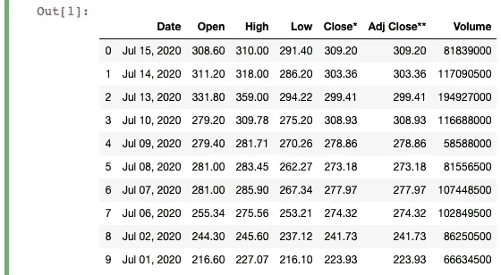
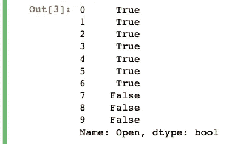
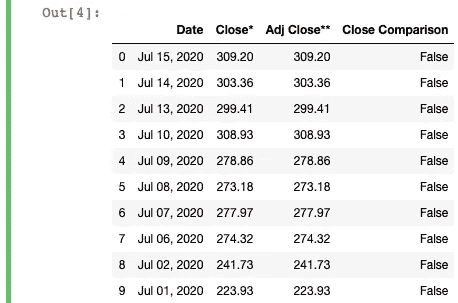
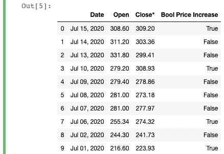
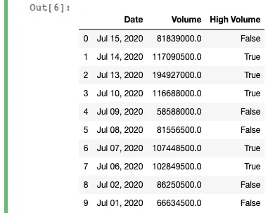
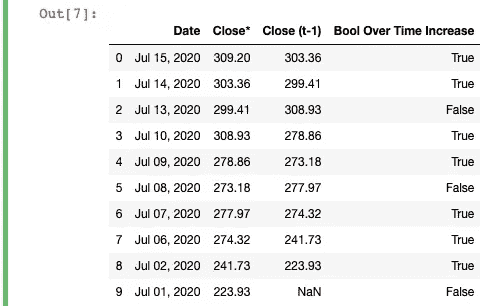
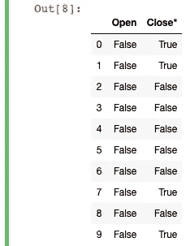

# 使用与熊猫数据框架的逻辑比较

> 原文：<https://towardsdatascience.com/using-logical-comparisons-with-pandas-dataframes-3520eb73ae63?source=collection_archive---------0----------------------->

## tPYTHON

## 标准比较操作符的易于使用的包装器


艺术作品[软 _ 艺术作品](https://www.instagram.com/softie__arts/)

逻辑比较到处使用*。*

*Pandas 库为您提供了许多不同的方法，您可以将数据帧或系列与其他 Pandas 对象、列表、标量值等进行比较。传统的比较运算符(`<, >, <=, >=, ==, !=`)可用于将一个数据帧与另一组值进行比较。*

*但是，您也可以使用包装器来提高逻辑比较操作的灵活性。这些包装器允许您指定用于比较的**轴**，因此您可以选择在行或列级别执行比较。此外，如果您正在使用多索引，您可以指定想要使用哪个**索引**。*

*在本文中，我们将首先快速地看一下与标准操作符的逻辑比较。之后，我们将通过五个不同的例子来说明如何使用这些逻辑比较包装器来处理和更好地理解您的数据。*

*这篇文章中使用的数据来自雅虎财经。我们将使用特斯拉股票价格数据的子集。如果您想继续，请运行下面的代码。(如果你对我用来获取数据的功能感到好奇，请滚动到最底部，点击第一个链接。)*

```
*import pandas as pd# fixed data so sample data will stay the same
df = pd.read_html("[https://finance.yahoo.com/quote/TSLA/history?period1=1277942400&period2=1594857600&interval=1d&filter=history&frequency=1d](https://finance.yahoo.com/quote/TSLA/history?period1=1277942400&period2=1594857600&interval=1d&filter=history&frequency=1d)")[0]df = df.head(10) # only work with the first 10 points*
```

**

*[来自雅虎财经的特斯拉股票数据](https://finance.yahoo.com/quote/TSLA/history?period1=1277942400&period2=1594857600&interval=1d&filter=history&frequency=1d)*

# *与熊猫的逻辑比较*

*可供使用的包装器有:*

*   *`eq`(相当于`==` ) —等于*
*   *`ne`(相当于`!=` ) —不等于*
*   *`le`(相当于`<=` ) —小于或等于*
*   *`lt`(相当于`<` ) —小于*
*   *`ge`(相当于`>=` ) —大于或等于*
*   *`gt`(相当于`>` ) —大于*

*在我们深入包装器之前，让我们快速回顾一下如何在 Pandas 中执行逻辑比较。*

*使用常规比较运算符，将 DataFrame 列与整数进行比较的基本示例如下所示:*

```
*old = df['Open'] >= 270*
```

*这里，我们要查看“Open”列中的每个值是否大于或等于固定整数“270”。然而，如果你尝试运行这个，首先它不会工作。*

*你很可能会看到这个:*

*`TypeError: '>=' not supported between instances of 'str' and 'int'`*

*现在注意这一点很重要，因为当您同时使用常规比较操作符和包装器时，您需要确保您实际上能够比较这两个元素。请记住，在您的预处理过程中，不只是针对这些练习，而是在您分析数据的一般情况下:*

```
*df = df.astype({"Open":'float',
                "High":'float',
                "Low":'float',
                "Close*":'float',
                "Adj Close**":'float',
                "Volume":'float'})*
```

*现在，如果您再次运行原始比较，您将得到这个系列:*

**

*简单的逻辑比较示例*

*您可以看到该操作返回了一系列布尔值。如果您检查原始的 DataFrame，您会看到对于每一行的值是否大于或等于(`>=` ) 270，都应该有相应的“True”或“False”。*

*现在，让我们深入研究如何使用包装器做同样的事情。*

## *1.比较两列是否不相等*

*在数据集中，您会看到有一个“Close*”列和一个“Adj Close**”列。调整后的收盘价被修改以反映潜在的股息和拆分，而收盘价仅针对拆分进行调整。为了查看这些事件是否已经发生，我们可以做一个基本的测试来查看两列中的值是否不相等。*

*为此，我们运行以下命令:*

```
*# is the adj close different from the close?
df['Close Comparison'] = df['Adj Close**'].ne(df['Close*'])*
```

**

*列不等式比较的结果*

*在这里，我们所做的只是调用“Adj Close**”列上的`.ne()`函数，并传递“Close* ”,即我们想要比较的列，作为函数的参数。*

*如果我们看一看产生的数据框架，您会看到我们已经创建了一个新列“Close Comparison ”,如果两个原始 Close 列不同，它将显示“True ”,如果它们相同，则显示“False”。在这种情况下，您可以看到每行上“Close*”和“Adj Close**”的值是相同的，因此“Close Comparison”只有“False”值。从技术上讲，这意味着我们可以删除“Adj Close**”列，至少对于这个数据子集是这样，因为它只包含“Close*”列的重复值。*

## *2.检查一列是否大于另一列*

*我们经常想看看股票价格在一天结束时是否上涨。一种方法是，如果“收盘*”价格高于“开盘价”，则显示“真”值，否则显示“假”值。*

*为了实现这一点，我们运行以下命令:*

```
*# is the close greater than the open?
df['Bool Price Increase'] = df['Close*'].gt(df['Open'])*
```

**

*列大于比较的结果*

*在这里，我们看到，在 2020 年 7 月的前两周，当天结束时的“收盘*”价格比当天开始时的“开盘价”高 4/10 倍。这可能没有那么多信息，因为它是一个很小的样本，但如果你将它扩展到几个月甚至几年的数据，它可以表明股票的整体趋势(上涨或下跌)。*

## *3.检查列是否大于标量值*

*到目前为止，我们只是在比较不同的列。还可以使用逻辑运算符将列中的值与标量值(如整数)进行比较。例如，假设每天的交易量大于或等于 1 亿，我们称之为“高交易量”日。*

*为此，我们运行以下命令:*

```
*# was the volume greater than 100m?
df['High Volume'] = df['Volume'].ge(100000000)*
```

**

*列和标量大于比较的结果*

*这次我们只需传递标量值“100000000”，而不是将一列传递给逻辑比较函数。*

*现在，我们可以看到，在 5/10 天的交易量大于或等于 1 亿。*

## *4.检查列是否大于自身*

*之前，我们比较了每行中的“Open”和“Close*”值是否不同。相反，如果我们将一个列的值与前一个值进行比较，以跟踪一段时间内的增加或减少，那将会很酷。这样做意味着我们可以检查 7 月 15 日的“Close*”值是否大于 7 月 14 日的值。*

*为此，我们运行以下命令:*

```
*# was the close greater than yesterday's close?
df['Close (t-1)'] = df['Close*'].shift(-1)
df['Bool Over Time Increase'] = df['Close*'].gt(df['Close*'].shift(-1))*
```

**

*列大于比较的结果*

*为了便于说明，我包含了“Close (t-1)”列，这样您可以直接比较每一行。在实践中，您不需要添加一个全新的列，因为我们所做的只是将“Close*”列再次传递给逻辑运算符，但是我们还对它调用了`shift(-1)`来将所有的值“上移一”。*

*这里发生的事情基本上是从指数中减去 1，因此 7 月 14 日的值“向上”移动，这让我们可以将其与 7 月 15 日的真实值进行比较。结果，您可以看到 7/10 日的“Close*”值大于前一天的“Close*”值。*

## *5.将列与列表进行比较*

*作为最后一个练习，假设我们开发了一个模型来预测 10 天的股票价格。我们将这些预测存储在一个列表中，然后将每天的“开盘价”和“收盘价*”值与列表值进行比较。*

*为此，我们运行以下命令:*

```
*# did the open and close price match the predictions?
predictions = [309.2, 303.36, 300, 489, 391, 445, 402.84, 274.32, 410, 223.93]
df2 = df[['Open','Close*']].eq(predictions, axis='index')*
```

**

*列和列表比较的结果*

*这里，我们比较了生成的每日股票价格预测列表，并将其与“Close*”列进行了比较。为此，我们将“预测”传递到`eq()`函数中，并设置`axis='index'`。默认情况下，比较包装器有`axis='columns'`，但是在这种情况下，我们实际上想要处理每列中的每一行。*

*这意味着 Pandas 会将列表中的第一个元素“309.2”与第一个值“Open”和“Close*”进行比较。然后，它将移动到列表中的第二个值和数据帧的第二个值，依此类推。请记住，列表和数据帧的索引都是从 0 开始的，因此，对于第一个数据帧列值，您将分别查看“308.6”和“309.2”(如果您想要仔细检查结果，请向上滚动)。*

*基于这些任意的预测，您可以看到在“Open”列值和预测列表之间没有匹配。“Close*”列值和预测列表之间有 4/10 匹配。*

*我希望您发现这个关于熊猫使用包装器进行逻辑比较的非常基本的介绍很有用。请记住，只比较可以比较的数据(即不要尝试将字符串与浮点数进行比较)，并手动复查结果，以确保您的计算产生了预期的结果。*

*往前走，比较一下！*

```
***More by me:** - [2 Easy Ways to Get Tables From a Website](/2-easy-ways-to-get-tables-from-a-website-with-pandas-b92fc835e741?source=friends_link&sk=9981ddaf0785a79be893b5a1dd3e03dd)
- [Top 4 Repositories on GitHub to Learn Pandas](/top-4-repositories-on-github-to-learn-pandas-1008cb769f77?source=friends_link&sk=d3acc38062490a86ecb46875342224e6)
- [An Introduction to the Cohort Analysis With Tableau](https://medium.com/swlh/how-to-group-your-users-and-get-actionable-insights-with-a-cohort-analysis-b2b281f82f33?source=friends_link&sk=8b672c3feb79e194804f2a1c33660e19)
- [How to Quickly Create and Unpack Lists with Pandas](/how-to-quickly-create-and-unpack-lists-with-pandas-d0e78e487c75?source=friends_link&sk=32ea67b35fe90382dc719c1c78c5900c)
- [Learning to Forecast With Tableau in 5 Minutes Or Less](/learning-to-forecast-effectively-with-tableau-in-6-minutes-or-less-3d77a55930a0?source=friends_link&sk=9abdfd7533ee9a31ab8a036413450059)*
```