# 使用逻辑回归从基础创建二元和多类分类器

> 原文：<https://towardsdatascience.com/using-logistic-regression-to-create-a-binary-and-multiclass-classifier-from-basics-26f5e1e92777?source=collection_archive---------14----------------------->

## 使用 Python 生成梯度下降优化的二元和多类分类器


照片由[乔恩·泰森](https://unsplash.com/@jontyson?utm_source=unsplash&utm_medium=referral&utm_content=creditCopyText)在 [Unsplash](https://unsplash.com/s/photos/choices?utm_source=unsplash&utm_medium=referral&utm_content=creditCopyText) 上拍摄

随着数据科学和机器学习成为工业和学术研究中许多领域不可或缺的一部分，掌握这些技术的基本知识对于识别数据趋势非常有用，尤其是在数据集规模快速增长的情况下。有了实验科学的背景，线性回归看起来总是相当直观，因为我们经常将实验数据与理论模型进行拟合，以提取材料属性。然而，制作一个分类器(*即*根据之前的几个指标预测 A 队是否会击败 B 队)，在我做了一些阅读之前，我并没有使用过或者有太多的经验。在本文中，我希望简洁地描述如何使用逻辑回归从头开始创建一个分类器。在实践中，您可能会使用诸如`scikit-learn`或`tensorflow`之类的软件包来完成这项工作，但是理解一些底层的方程和算法对于了解“幕后”发生了什么非常有帮助。

本文中的大部分工作都受到了吴恩达教授的 Coursera 上的机器学习课程的启发。

本文中的所有代码我们都将使用 Python，所以让我们导入我们将需要的所有包:

# **我们如何进行离散预测？**

做离散预测是我们一直在做的事情，可能甚至没有过多考虑如何做。例如，你正在餐馆看菜单——你阅读不同菜单项的描述，记住你最近阅读的食物评论中的一些提示，可能会问服务员几个问题，并对你想点什么做出谨慎的决定。如果你从未在这家餐馆吃过饭，你实际上是在根据你认为你会喜欢的东西做出明智的预测。

为了在我们的预测算法中实现类似的行为，一个很好的起点是选择一个数学函数，它本质上给出一个二进制输出或 0 或 1。为此，我们可以使用**逻辑**或 **sigmoid** 函数，其形式如下:

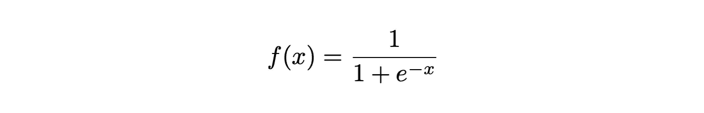

我们可以用 Python 编写这个函数，并将其绘制如下:

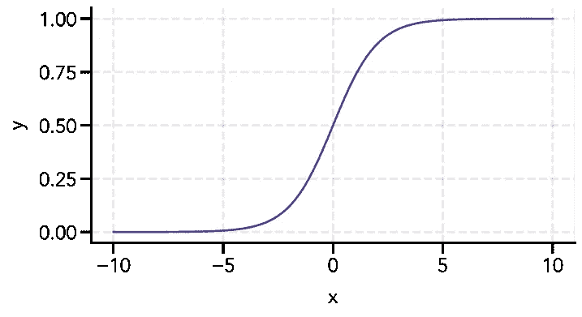

如图所示，在 x = 0 附近，sigmoid 函数从接近 0 的输出快速变为接近 1 的输出。由于输出值关于 y = 0.5 是对称的，我们可以以此作为做出决策的阈值，其中 y ≥ 0.5 输出 1，y < 0.5 outputs 0.

To see this in action, let’s train some data!

# **产生数据**

我们的场景如下——我们正在构建一个简单的电影推荐系统，该系统考虑了 0 到 5 之间的平均用户评分(所有用户)和 0 到 5 之间的平均评论家评分。然后，我们的模型应该基于我们的输入数据生成一个决策边界，以预测当前用户是否会喜欢这部电影，并向他们推荐这部电影。

我们将对 100 部电影进行随机用户和评论家评分:

现在，让我们生成分类—在这种情况下，要么用户喜欢这部电影(1)，要么不喜欢(0)。为此，我们将使用以下决策边界函数。我们将该等式的右侧设为 0，因为它定义了逻辑函数何时等于 0.5:

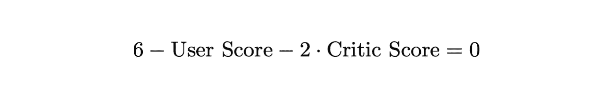

请注意，在真实的数据集中，您不知道决策边界的函数形式是什么。出于本教程的考虑，我们正在定义一个函数，并向它添加一些噪声，以便分类不是“完美的”。

现在，我们可以绘制初始数据，其中橙色圆圈代表用户喜欢的电影，蓝色圆圈代表不喜欢的电影:

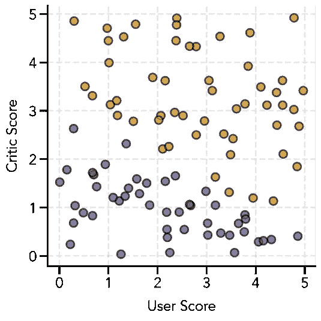

# **决定决策边界的质量**

为了确定我们的决策边界有多好，我们需要为错误的预测定义一个惩罚，这将通过创建一个成本函数来实现。我们的预测如下:

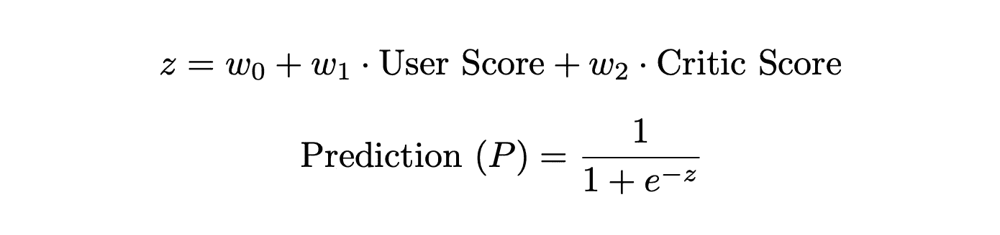

当 *P* ≥ 0.5 时，我们输出 1，当 *P* < 0.5 时，我们将输出 0，其中 w₀、w₁和 w₂是我们正在优化的权重。

为了惩罚错误的分类，我们可以利用对数函数，因为 log(1) = 0 和 log(0) → -∞。我们可以用它来创建如下两个罚函数:


我们可以将它可视化，以便更清楚地看到这些罚函数的效果:

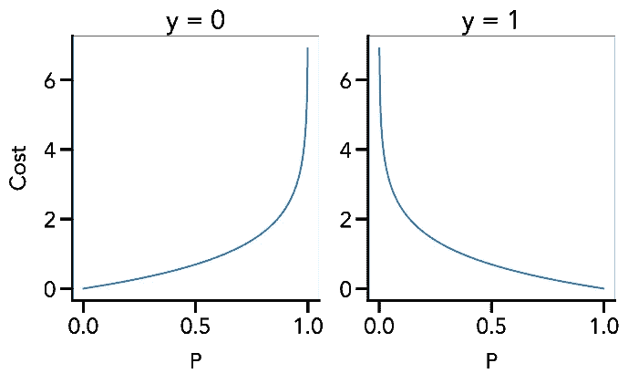

利用我们的*输出* ( *y* )将为 0 或 1 的事实，我们可以在一个包含两种情况的表达式中优雅地组合这两个罚函数:

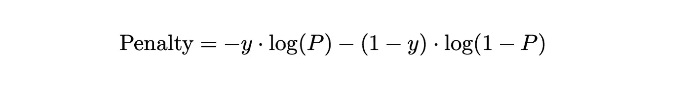

现在，当我们的输出为 1，并且我们预测接近 0(第一项)时，我们会招致一个陡峭的惩罚——类似地，当我们的输出为 0 并且我们预测接近 1(第二项)时，也会发生相同的情况。

我们现在可以把我们的罚函数推广到 *m* 个训练例子——第 *i 个*训练例子的标签用( *i* 表示)。我们还将总成本除以 *m* 得到平均惩罚(就像线性回归中的均方误差)。这个最终表达式也被称为**成本函数**。我们将我们的两个特征(用户评分和评论家评分)称为 x₁和 x₂.

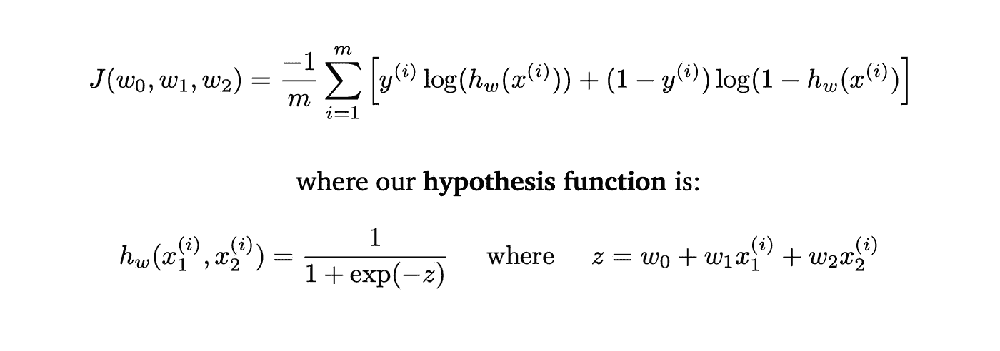

# **最小化成本**

为了找到最优决策边界，我们必须最小化这个成本函数，我们可以使用一种叫做 [**梯度下降**](https://en.wikipedia.org/wiki/Gradient_descent) 的算法来实现，这种算法本质上做两件事:(1)通过计算成本函数的梯度来找到最大下降的方向，(2)通过沿着这个梯度移动来更新权重值。为了更新权重，我们还提供了一个 [**学习率**](https://en.wikipedia.org/wiki/Learning_rate)**【α】**，它决定了我们沿着这个梯度移动了多少。在选择学习率时有一个权衡——太小，我们的算法需要太长时间才能收敛；太大，我们的算法实际上会发散。关于梯度下降和学习率的更多信息可以在链接文章中找到。因此，对于每个权重，我们有以下更新规则:

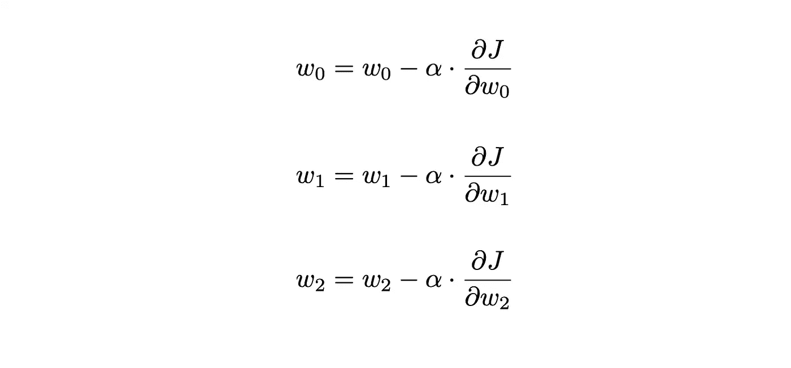

谜题的最后一块是计算上面表达式中的偏导数。我们可以使用微积分中的链式法则将它分解如下:

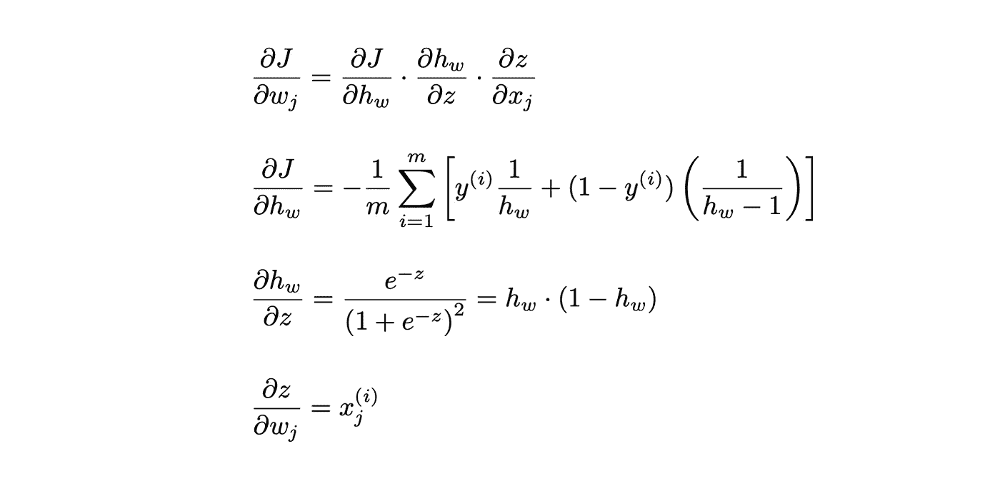

现在，我们可以把它们放在一起得到下面的梯度表达式和梯度下降更新规则:

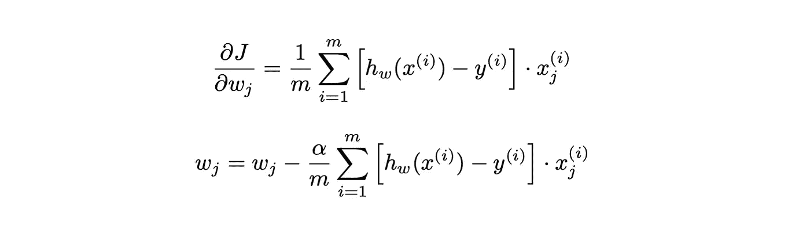

我们现在可以初始化我们的变量来最小化成本函数。

# **初始化变量**

上面所有的梯度下降运算都有利于使用矩阵乘法和线性代数。首先，我们如下初始化变量:

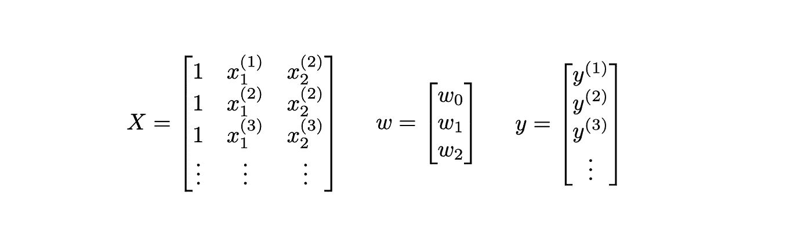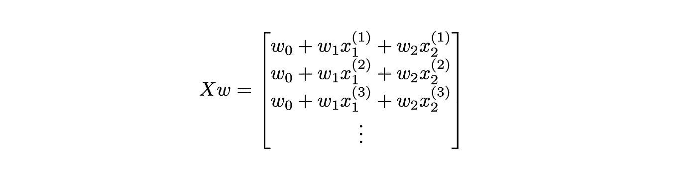

我们现在可以如下重写用于权重的成本函数、梯度和更新函数的两个早期表达式，其中上标 T 表示矩阵的转置:

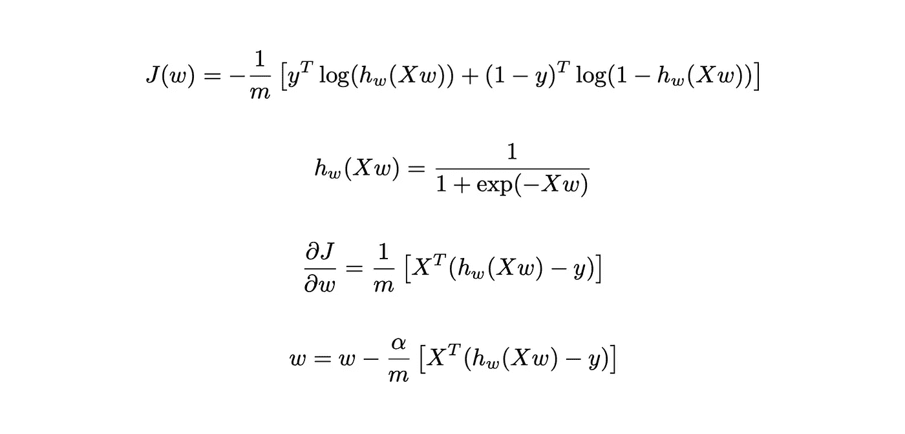

我们的变量可以初始化如下(我们将设置所有的权重等于 0 开始):

既然长长的数学之墙已经过去了，让我们来训练我们的分类器模型吧！

# **训练我们的模型**

我们必须首先为成本函数和梯度下降更新定义函数。以下函数计算成本和梯度值，并返回两者:

当定义梯度下降函数时，我们必须添加一个名为`num_iters`的额外输入，它告诉算法在返回最终优化权重之前要进行的迭代次数。

现在，在做了所有这些艰苦的工作之后，下面的线训练我们的模型！

```
J, w_train = gradient_descent(X, y, w, 0.5, 2000)
```

在真实的情况下，我们会拆分我们的训练数据，以便交叉验证和测试我们的模型，但是出于本教程的目的，我们将使用所有的训练数据。

为了确保我们在每次迭代中降低成本函数的值，我们可以绘制如下图:

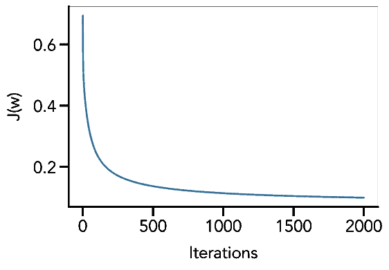

现在是关键时刻——我们可以画出我们的决策界限。我们将在原始图上覆盖它的方法是定义一个点网格，然后使用我们训练的权重计算 sigmoid 函数的预测值。然后我们可以画出预测值等于 0.5 的等高线。

Et，瞧！

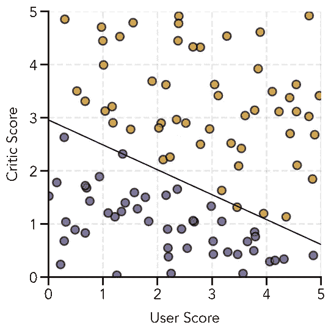

我们现在可以编写一个函数，根据这个训练好的模型进行预测:

现在，让我们对新的例子做一些预测:

```
X_new = np.asarray([[1, 3.4, 4.1], [1, 2.5, 1.7], [1, 4.8, 2.3]])
print(predict(X_new, w_train))>>> [[1.]  
     [0.]  
     [1.]]
```

# **多类分类**

现在我们已经完成了制作二元分类器的所有艰苦工作，将它扩展到更多的类是相当简单的。我们将使用一种称为 [**一对一分类**](https://en.wikipedia.org/wiki/Multiclass_classification#One-vs.-rest) 的策略，其中我们为每个不同的类训练一个二元分类器，并选择具有 sigmoid 函数返回的最大值的类。

让我们以二进制示例中的模型为基础，这一次用户可以给一部电影打 0 星、1 星或 2 星的分数，我们试图根据用户和评论家的分数来确定决策界限。

首先，我们再次生成数据，并应用两个决策界限:

我们的数据集如下所示，其中**蓝色圆圈代表 0 星，橙色圆圈代表 1 星，红色圆圈代表 2 星**:

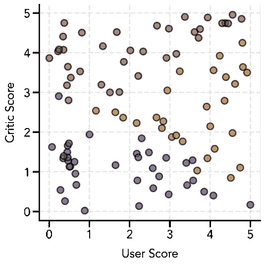

对于我们训练的每个二元分类器，我们需要重新标记数据，以便我们感兴趣的类的输出设置为 1，所有其他标签设置为 0。例如，如果我们有 3 组 A (0)、B (1)和 C (2)，我们必须制作三个二元分类器:

(1) A 设置为 1，B 和 C 设置为 0

(2) B 设置为 1，A 和 C 设置为 0

(3) C 设置为 1，A 和 B 设置为 0

我们有一个为每个分类器重新标记数据的函数:

现在，我们进行与前面的二进制分类部分相同的模型训练，但是分三次进行:

这一次绘制决策界限稍微复杂一些。我们必须为每个经过训练的分类器计算网格*中每个点的预测值。然后，我们选择每个点的最大预测值，并根据哪个分类器产生了该最大值来分配其各自的类别。我们选择绘制的等高线是 0.5(0 到 1 之间)和 1.5(1 到 2 之间):*

经过大量的预期，这里是我们训练有素的决策界限！


最后，我们来做一个预测函数。为此，我们将使用一个小技巧——我们将对每个示例中的每个分类器进行预测。然后，我们将把每组预测作为一个新列追加到预测矩阵中。然后，通过沿着每一行选择具有最大值的列索引，我们自动得到分类器标签！

```
X_new = np.array([[1, 1, 1], [1, 1, 4.2], [1, 4.5, 2.5]])
print(predict_multi(X_new, [w_class1, w_class2, w_class3]))>>> [[0]  
     [2]  
     [1]]
```

在那里！一个完全从零开始的多类分类器！

# **结束语**

感谢阅读！这篇文章只是触及了逻辑回归和分类的表面，但是我希望你喜欢它。展示的例子可以在[这里](https://github.com/venkatesannaveen/machine-learning-basics)找到。我再次感谢吴恩达在 Coursera 上教授的机器学习课程给了我这篇文章很多灵感。