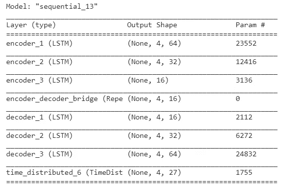

# 对多维时间序列数据使用 LSTM 自动编码器

> 原文：<https://towardsdatascience.com/using-lstm-autoencoders-on-multidimensional-time-series-data-f5a7a51b29a1?source=collection_archive---------4----------------------->

埃菲社在 [Unsplash](https://unsplash.com?utm_source=medium&utm_medium=referral) 上拍摄的照片

## 实践中的深度学习

## 演示如何使用 LSTM 自动编码器分析多维时间序列

在本文中，我将展示一个非常有用的模型来理解时间序列数据。我已经将这种方法用于无监督的异常检测，但它也可以用作通过降维进行预测的中间步骤(例如，对潜在嵌入层和完整层进行预测)。

简而言之，这种方法**将一个多维序列**(想想多个计数的窗口时间序列，来自传感器或点击等)**压缩成一个表示该信息的单一向量**。有了有效的编码器/解码器，我们可以使用潜在向量作为多层感知器的输入，或者作为更大的多头网络中的另一组特征。

我不打算讨论 LSTMs 或自动编码器的细节。对于这些信息，我强烈推荐以下文章:

 [## LSTM 和 GRU 的图解指南:一步一步的解释

### 嗨，欢迎来到长短期记忆(LSTM)和门控循环单位(GRU)的图解指南。我是迈克尔…

towardsdatascience.com](/illustrated-guide-to-lstms-and-gru-s-a-step-by-step-explanation-44e9eb85bf21)  [## 应用深度学习-第 3 部分:自动编码器

### 概观

towardsdatascience.com](/applied-deep-learning-part-3-autoencoders-1c083af4d798) 

当我们从潜在向量中重建原始时间序列时，通常会有一定程度的误差。对于训练有素的编码器/解码器，该误差可以提供很多信息。

对于异常检测，我们会查看误差的大小。 ***幅度*** 让我们了解输入时间序列的 ***不规则性*** 。我们可以用这个作为识别异常的代理。

# 数据

我使用了一组我在以前的文章中用过的数据(链接如下):

 [## 用 XGBoost 和 Gini 杂质计算特征的重要性

### 使用 XGBoost 回归识别重要特征

samsachedina.medium.com](https://samsachedina.medium.com/calculating-a-features-importance-with-xgboost-and-gini-impurity-3beb4e003b80) 

这些数据是 2020 年 10 月 26 日交易时段的分笔成交点数据。每一个分笔成交点代表一个价格变化，或者是证券的收盘价、买价或卖价。订单簿数据被快照并在每个分笔成交点返回。订单簿可能会“偏离分笔成交点”波动，但只有在产生分笔成交点时才会被记录，这样可以进行更简单的基于时间的分析。

下面是一个记录示例:

我们有一个时间字段、我们的定价字段和“md_fields”，它们代表以不同于当前要价/出价的价格增量卖出(“要价”)或买入(“出价”)的需求。

# 模型

我将创建一个“堆叠”自动编码器。数据被重新整形，允许我通过超参数调整来优化窗口大小。

查看我如何通过函数“generate_datasets_for_training”返回 train_x、train_y、test_x 和 test_y 的示例

模型从一个**编码器**开始:首先是输入层。输入图层是 LSTM 图层。接着是另一个较小尺寸的 LSTM 层。然后，我获取从第 2 层返回的序列——然后将它们提供给一个重复向量。重复向量获取单个向量，并以某种方式对其进行整形，以允许其被馈送到我们的**解码器**网络，该网络与我们的编码器对称。 ***注意，不一定要对称，但这是标准做法。***

我们的最后一层是一个时间分布的密集层，它产生一个类似于我们输入的序列。

最后，我们计算基于原始输入的均方误差损失:由我们的最终层产生的序列和原始输入序列之间的误差。最小化这成为我们网络学习的优化过程。

这是我们最后的网络

请注意，中间层是一个重复向量，它获取 encoder_3(我们的潜在表示)的输出，并在我们的回看窗口中重复它的步数。

如果我们需要(1，4)的潜在表示，我们只需将编码器层压缩成那个形状。要压缩一个时间序列窗口，我们需要做的就是从最后一个编码层提取输出。

看到这个要点的例子，如何建立！

这是将时间序列数据表示为密集潜在表示的基本介绍。

我希望你喜欢这篇文章！

如果你喜欢这个，你可能会喜欢:

 [## 约洛夫 4 十分钟后

### 在 10 分钟内获得视频注释

medium.com](https://medium.com/the-innovation/yolov4-in-10-minutes-715f016bcf42)