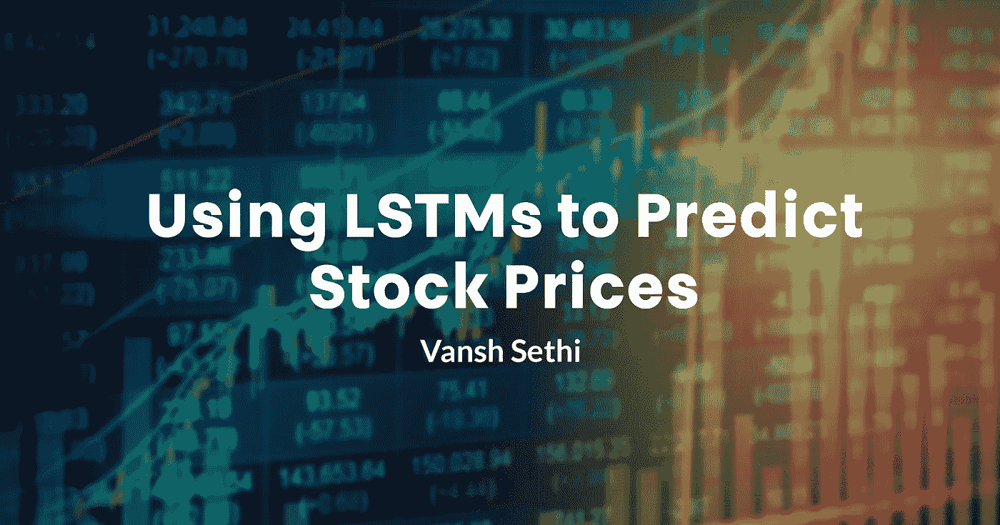
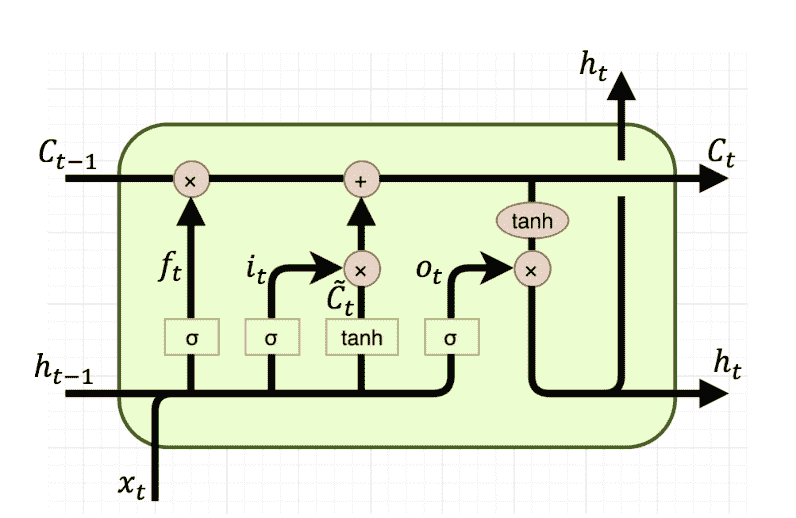
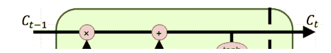
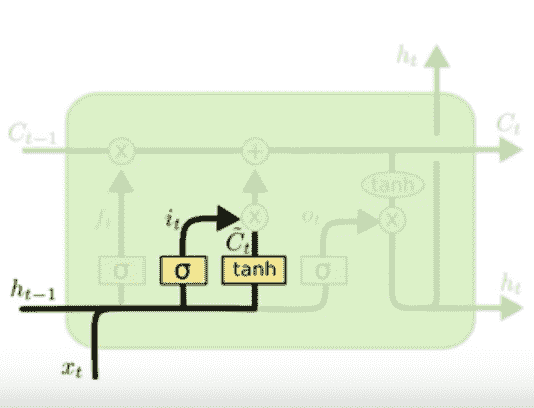
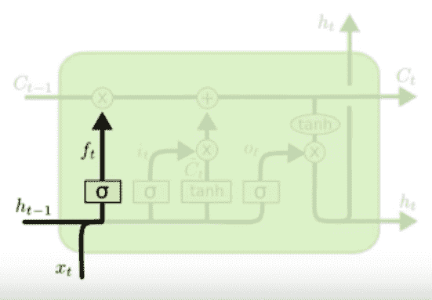
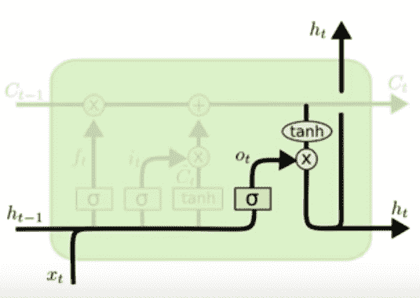
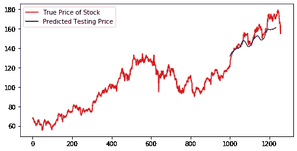

# 使用 LSTMs 预测股票价格

> 原文：<https://towardsdatascience.com/using-lstms-to-predict-stock-prices-a9965dfec2c9?source=collection_archive---------23----------------------->

## 利用长短期记忆网络来赚钱



## 面对现实吧。我们是哑巴。

一只被蒙住眼睛的猴子比任何人都能更好地管理投资组合。不，我是认真的。无数研究表明，猴子在股票市场上一直跑赢人类。据称，一只猴子在一个季度内创造的利润比纽约证券交易所的交易员多 8 倍。一只毫无线索的灵长类动物如何打败华尔街所谓的“天才”？答案，**狗屎运**。


人类一直试图衡量和预测股票价格，使用花哨的统计数据和趋势来计算。但事实是，人类无法理解影响股价的不同变量。我们无法综合一家公司的声誉、他们已经宣布和正在进行的项目、业绩记录、过去的股市数据，并将所有这些因素综合起来，以便在股市上做出明智的决策。我们不能考虑一家公司曾经存在的每一个变量和统计数据。但是，电脑可以。更具体地说，神经网络正是为此而设计的。

# 长短期记忆网络

数学意义上的神经网络是一个可微分函数，它接受输入并计算输出。本质上，它是你的标准 f(x ),但不是只有一个变量“x ”,而是有 1，000，000 个 x 或参数。我们的目标是优化这些参数，因为这样我们就可以输入任何输入并得到想要的输出。简而言之，这些都是神经网络，但是 LSTM 有一些特殊的性质。



*别急，我来分解一下*

长短期记忆神经网络由 LSTM 单元或细胞组成。这些单元进行特殊的计算，并将它们的输出作为输入传递给下一个单元。简而言之，LSTM 的主要目标是考虑之前传入输出的数据。像时间序列数据或股票市场数据这样的东西依赖于它自己过去的版本，使用 LSTM，它记住过去并试图预测未来。它是这样工作的。

## 数据是如何传播的

在股票市场数据和通常依赖于过去自身迭代的数据中，不同时间的数据是不同的。在某个时间，一块数据是 x。这被称为时间步长，数据被输入到一个 LSTM 单元分解成相应的时间步长。例如，第三 LSTM 单元采用第三时间步的数据或 X3。

> 快速批注: ***t-1*** 表示最后一个 LSTM 单元格的值， ***t*** 是当前 LSTM 单元格的输出。

## 细胞状态



细胞状态

C 的符号表示 LSTM 的单元状态。单元状态是通过每个单元自身路径传递的值的向量。当前单元可以在其计算中使用该单元状态，或者完全改变单元状态。正因为如此，细胞状态向量充当了神经网络的长期记忆部分。这是因为它与每个 LSTM 单位相互作用，因此在计算下一个单位的产量时可以将每个单位考虑在内。这就是 LSTM 长期记忆的来源。

## 输入门



输入门

输入门接收最后一个单元的隐藏状态( *ht-1)* 的输出和带标签的数据输入(Xt)，并使用该信息来查看单元状态是否应该改变。它首先将数据输入和隐藏状态相乘，创建一个新的值向量。然后，它取这个向量的 sigmoid 和双曲线正切函数，并将这些结果相乘。如果乘积高于某个经过训练的参数，它就会被添加到细胞状态中，本质上是让细胞状态记住这个重要的信息。如果它没有被添加到单元状态，那么它可以被认为对网络的长期记忆不重要。简而言之，输入门决定了信息对长期而言是否重要。

## 忘记大门



遗忘之门

遗忘门接收前一时间步(ht-1)的隐藏状态输出和当前时间步(Xt)的数据输入。然后将它们相乘，并对其应用 sigmoid 激活。如果输出高于某个经过训练的参数，则单元状态完全重置为 0，基本上忘记了它的长期记忆。这就是为什么它被称为遗忘之门，因为它有能力忘记到目前为止所学的一切。这有助于时间序列预测，因为一条数据将作为当前趋势的重置，LSTM 需要将这一因素考虑在内。然而，LSTM 人很少能通过遗忘之门。

## 输出门



输出门

输出门为下一个单元(ht)准备下一个隐藏状态向量。它将最后一个隐藏状态向量和输入数据考虑在内，并对其应用一些函数。这是神经网络的短期记忆方面，因为它将新信息传播到下一个细胞。

请注意所有三个门是如何一起创建单元状态的。在所有单元结束时，细胞状态通过致密层传递，致密层理解所有长期记忆和关于数据的重要信息，以创建下一时间步的预测。一切都导致了这个细胞状态的产生，它是 LSTM 的心脏。训练 LSTM 网络是为了确保长期信息能够持续到最后。现在您对 LSTMs 有了很好的理解，让我们看看我是如何将它们应用于股票市场数据的。

# 股票市场预测者

[*使用 Tensorflow 和 Keras 创建。](https://colab.research.google.com/drive/1wWCZK1IalVoc0JThyDktRKTDbkNkgJzi)

## 数据

这个项目使用的数据是苹果公司过去 5 年的股票价格。它被分解成每个 10 分钟的时间步长。神经网络需要样本来训练，需要有标签的数据，所以数据是以特定的方式输入的。输入是 50 个时间步长，标签(这是神经网络试图预测的)是第 51 个时间步长。神经网络尝试预测下一时间步的价格，并相应地创建数据来训练神经网络。

## 建筑

惊喜惊喜！这个神经网络我用了很多 LSTMs。每个 LSTM 中有 96 个单元，并将单元状态作为输入返回给下一个 LSTM。最后，它有 2 个密集层，接收 LSTM 层的输出并理解它。最后一个密集层里面有一个节点，表示输出一个数字，下一个时间步的预测值。它有超过一百万个可以优化的参数。脱落层用于确保神经网络不仅仅是记忆数据和输出。我知道，所有这些工作只是为了找到下一个时间步的下一个值。

```
model = Sequential([layers.LSTM(units=96, return_sequences=True, input_shape=(50,1)),layers.Dropout(0.2),
layers.LSTM(units=96, return_sequences=True),layers.Dropout(0.2),
layers.LSTM(units=96, return_sequences=True),layers.Dropout(0.2),
layers.LSTM(units=96, return_sequences=True),layers.Dropout(0.2),
layers.LSTM(units=96, return_sequences=True),layers.Dropout(0.2),
layers.LSTM(units=96),layers.Dropout(0.2),
layers.Dense(1)
])
```

## 培养

使用流行的 Adam 优化器和 MSE 损失函数来训练该模型。损失函数是模型执行得有多差，优化器找到函数的最小值，这是网络的最佳参数。跑了 100 多个纪元，达到亏损< 0.00001 (it performs pretty good).

## The Results are In

So these are few examples of stocks it was used to predict. The blue shows the predicted price and the red shows the actual price.



On Randomly Generated Stock Data

Overall, the model works decently well… but that doesn’t mean you should use this on the stock market. The stock market is very volatile and this model only uses past trends of a stock to predict the next.

## **参考文献**

【https://colah.github.io/contact.html 

[https://unsplash.com/photos/Z05GiksmqYU](https://unsplash.com/photos/Z05GiksmqYU)