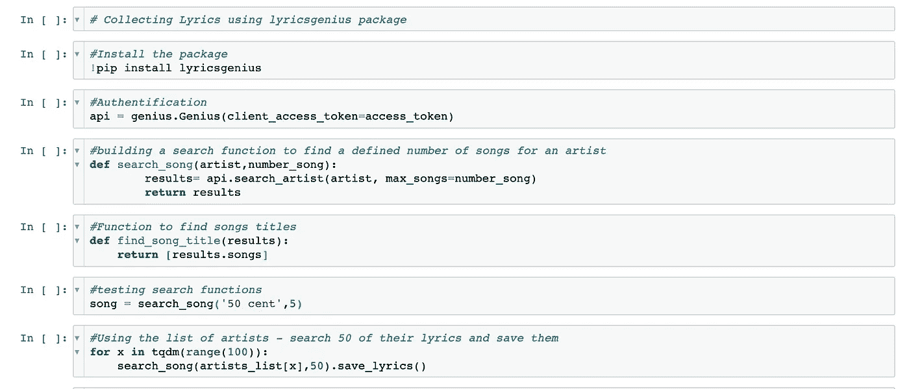
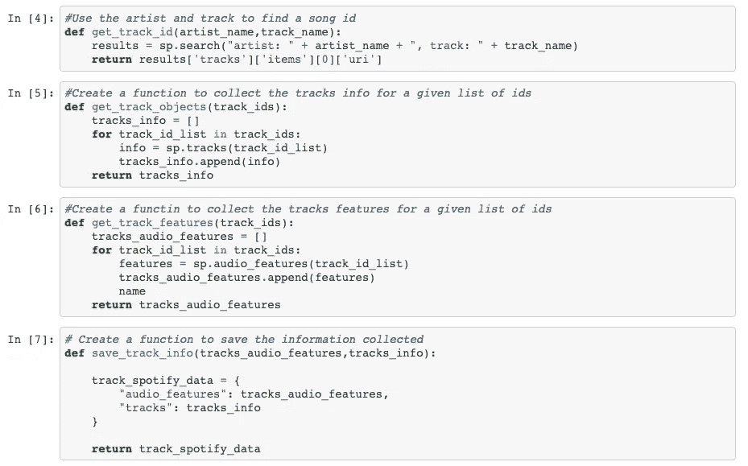
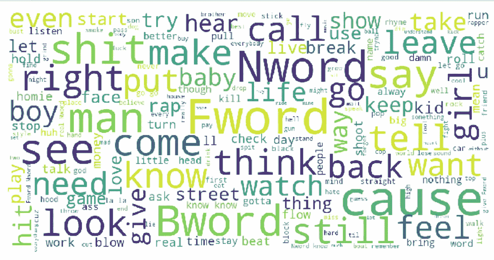
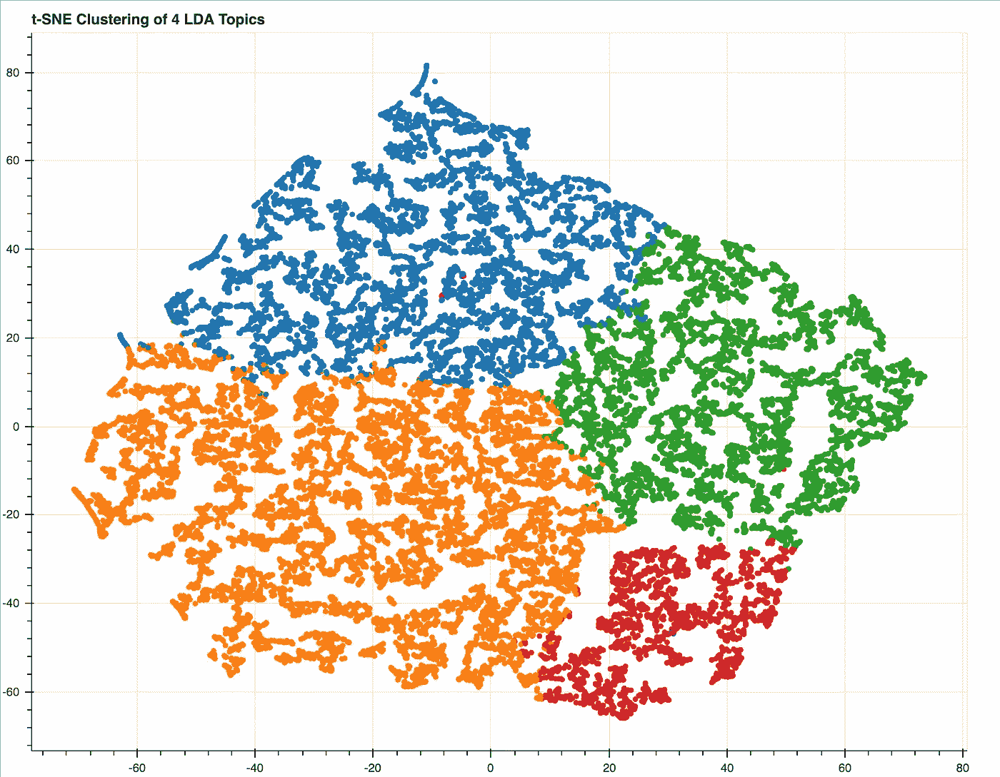
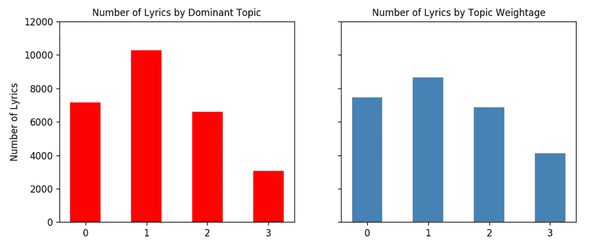
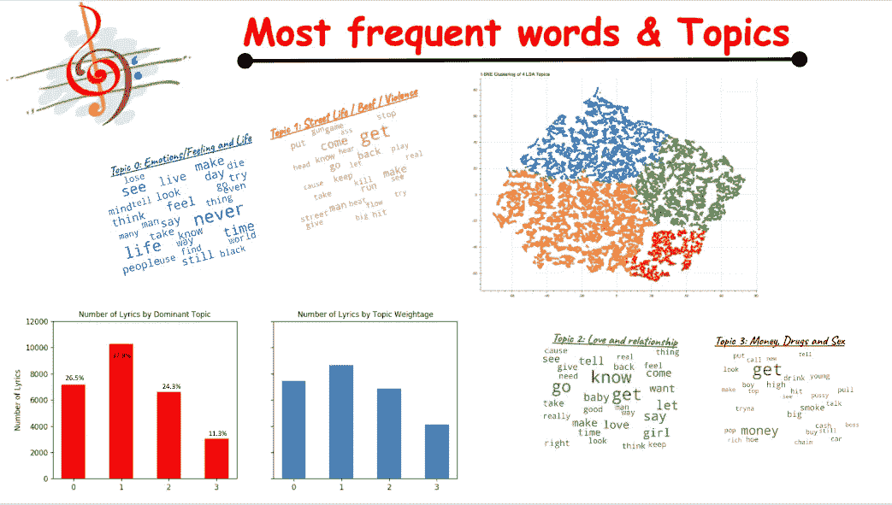
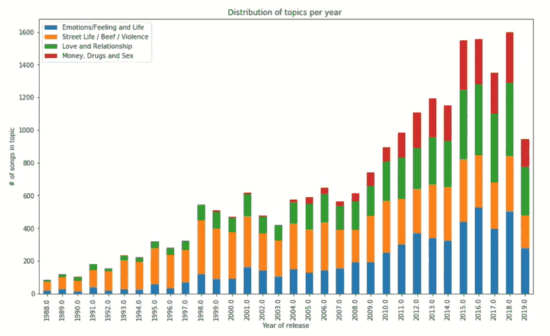
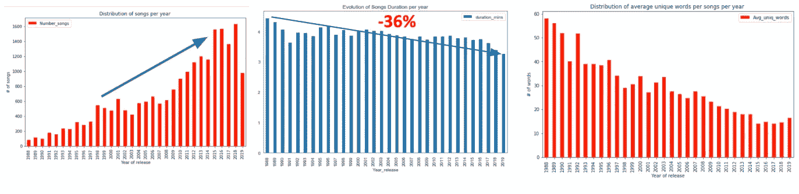

# 基于机器学习和人工智能的嘻哈歌曲分析

> 原文：<https://towardsdatascience.com/using-machine-learning-and-ai-to-understand-hip-hop-songs-evolution-e819c2a5172d?source=collection_archive---------26----------------------->

## 我如何将自然语言应用到嘻哈歌词中，以找到不同的主题

由于我从小就开始听嘻哈音乐，所以我不得不处理与这种音乐类型相关的不同意见。对于一些人来说，所有的说唱歌曲都接近同一个主题，都是相似的。其他人会争论他们的顶级说唱歌手，想证明他们比我强。虽然我想用数据科学来展示我最喜欢的说唱歌手是如何在很大程度上为游戏做出贡献的，但我去年从事这个项目的目的是对抗流行观点，并使用机器学习来找到嘻哈歌曲的主题和类别。

# 我的数据

我想获得尽可能多的相关数据。我不想把任何有实力的艺术家排除在项目之外。利用美汤，我收集了来自[ranker.com](http://www.ranker.com)的 814 名说唱歌手名单；我很确定我抓住了 1979 年的大多数说唱歌手。我甚至惊讶地发现了沙奎尔·奥尼尔。:)

下一步是收集所有说唱歌手的歌词。我使用了[约翰·W·米勒](https://www.johnwmillr.com/)的精彩的[歌词天才包](https://github.com/johnwmillr/LyricsGenius)来访问天才歌词 API。你可以查看他的回购协议了解更多信息。

因为我有艺术家——我创建了一个功能来搜索他们的歌曲！还有—随用随存！

最后，我必须连接到 Spotify 的 API 来获取关于这首歌的信息(长度、流行度、效价、节奏、可跳性等等。).因为我已经有了歌词和艺术家的名字，所以我创建了一个函数来获取每个组合的音轨 id 和音频特性:音轨、艺术家。我结尾的歌比歌词少；例如，在我做这个项目的时候，所有 Jay-Z 的歌曲在 Spotify 上都不可用。

用于收集 Spotify 音频特征的函数！

我将避免描述清理数据的麻烦。json 到字典，或删除非英文歌曲。经过收集和清理，我只剩下 Spotify 的 55k+歌词和 27k+歌曲功能。

# 主题建模

我不打算在这篇文章中进行探索性的分析。然而，在编辑所有歌词时，对顶部的词有一个想法将是有趣的。下图清楚地显示了大多数人是如何看待嘻哈歌曲的。很多脏话——我不得不做大量的清理工作，将一些单词归入“F”类；n '或 B '字——一些确实很常见但不一定翻译出嘻哈精髓的世界(*女孩* ' / ' *homie* ' / ' *男孩* ' / ' *街*'在字云里很容易看出来)

我妈是怎么听说唱歌曲的！！！

相反，我将自然语言处理(NLP)应用于歌词，以挑战词云结果。主要目的是在歌曲中寻找不同的主题。我采用了潜在的狄利克雷分配(LDA)。

什么是潜在狄利克雷分配？这是一种自动发现句子包含的主题的方式。这是一个语料库的生成概率模型。更详细地说，LDA 将文档表示为主题的混合的**，这些主题以一定的概率吐出单词。**

我期待从歌词中找到话题——经过清理和准备。我们必须记住，LDA 将以概率呈现不同的主题，但作为一名数据科学家，我的工作是定义每个主题。最后，每个歌词将根据较高的权重分配给一个主题。

我的 4 个主题的丰富多彩的表现！！

为了从 LDA 的结果中获益，我必须知道每个主题所涉及的内容。自发的方法是检查每个主题下的歌曲，并尝试在他们谈论的内容中找到相似之处。由于歌词的数量，这将会造成时间混乱，并且效率低下，因为这将需要另一个主题建模:)

主题 1 中超过 10k 的歌词—阅读歌词来理解主题不是一个好主意！

为了给出每个主题的名称，我分析了每个主题的前 30 个单词和一个代表性文本。我对 hip hop 帮助的了解(领域专长 yayyyy)——我将 4 个主题命名如下:

**话题 0** :情感——感觉与生活

**话题 1** :街头生活——牛肉和暴力(*有点期待*)

**话题二**:爱情和关系(*各自为政*

话题三:金钱、毒品和性

回顾-我在 2019 年 10 月熨斗学校科学展上的演示幻灯片

## 多年来的说唱

当主题建模的结果听起来不错时，我开始分析这些年来主题的演变。令人惊讶的是，在 2004 年前后，与“金钱/毒品/性”相关的歌曲有所增加。

90 年代左右的主要话题是“街头生活/牛肉/暴力”,它被解释为帮派之间或针对警察的明知故犯的争吵，或著名的西海岸对东海岸的对抗。然而，在 90 后，我们发现随着时间的推移，与“钱”相关的话题有了更好的分配。我认为这与音乐产业有关——艺术家必须创作(给歌迷他们想要的)来达到销售。

通过观察其他年度趋势，令人惊讶地发现了对音乐演变的更好描述。

更多作品——更少的单词和更短的歌曲！！！流式宝宝；)

上面的三幅图显示了产量是如何增加的。随着艺人发行更多单曲，新艺人很容易被发现，制作的歌曲数量也在增加。然而，歌曲的长度变得越来越短，歌曲中使用的词也越来越少。在一张专辑中塞进更多短小的歌曲比放一堆长歌更有利可图。

有了在线流媒体，艺术家不需要创作他们需要的热门歌曲。这种模式基于观点或倾听给他们报酬。因此，艺术家最好创作 50 首 2 分钟的歌曲，而不是像 CD 或磁盘时代那样创作 20 首每首 5 分钟的歌曲。我有点夸张，但你明白我的意思。虽然流媒体网站损害了艺术家的利益，因为它从他们的总销售额中扣除了一部分，但艺术家通过这种方式获得了更多的浏览量，并且仍然从订阅、广告和访问中获得版税。

我对这个项目很感兴趣，因为它结合了我的两个爱好:数据和音乐。我很乐意分享我从 EDA 中收集的两种不同类型的数据的更多发现。

想讨论就随便伸手！！！我的用户名是@fabricemesidor everywhere！！！

## 参考资料:

 [## 潜在狄利克雷分配简介

### 假设你有下面这组句子:我喜欢吃西兰花和香蕉。我吃了一根香蕉和菠菜…

blog.echen.me](https://blog.echen.me/2011/08/22/introduction-to-latent-dirichlet-allocation/)  [## 在线音乐流媒体对音乐产业的影响

### 音乐产业的经济在最近几年已经完全改变了，因为实体拷贝和在线销售…

globaledge.msu.edu](https://globaledge.msu.edu/blog/post/54474/effects-of-online-music-streaming-on-the)  [## 是什么让一些 blink-182 歌曲比其他歌曲更受欢迎？第 1 部分-数据科学等。

### 在我上小学的一年圣诞节，我的隔壁邻居从圣诞老人那里得到了一个游戏方块，他…

jdaytn.com](http://jdaytn.com/posts/download-blink-182-data/)