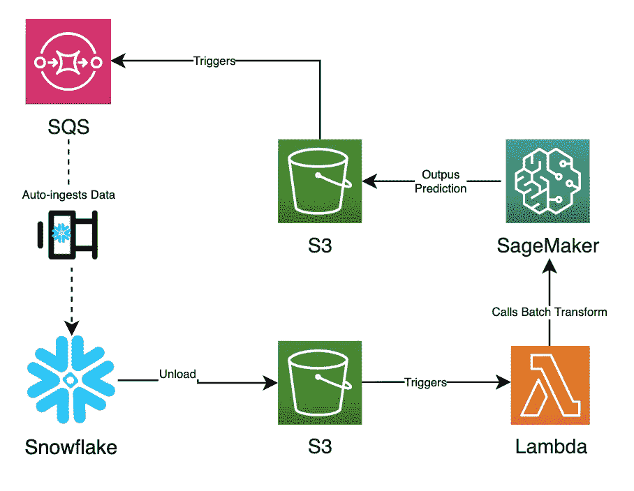
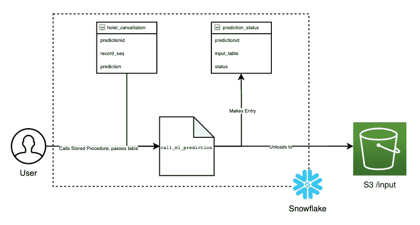
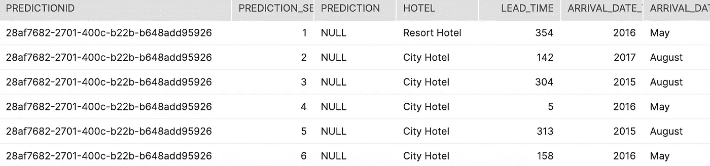
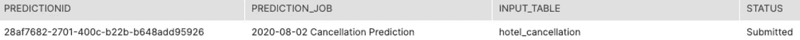
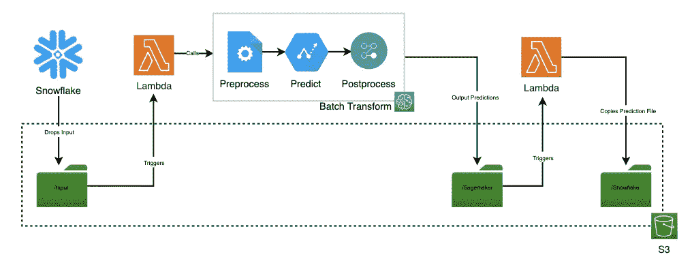
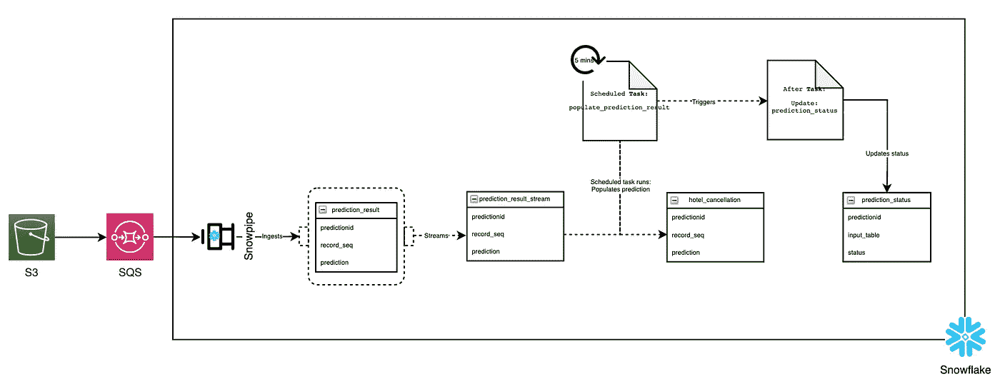
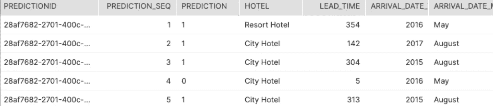
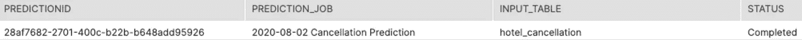

# 如何使用机器学习模型直接从雪花中进行预测

> 原文：<https://towardsdatascience.com/using-machine-learning-models-to-make-prediction-directly-from-snowflake-2471b2f71b68?source=collection_archive---------38----------------------->

## 使用雪花存储过程、Snowpipe、流和任务，允许用户通过 SQL 调用机器学习推理

图片来源: [kennyzhang29](https://unsplash.com/@kennyzhang29) 来自 [Unsplash](https://unsplash.com/photos/5LyYqPEv8w0)

通常，我们会面临这样的场景(最近我也是)，数据科学家部署的模型按计划运行，无论是每小时一次、每天一次还是每周一次…您都明白这一点。然而，有时需要超出计划的结果来为会议或分析做出决策。

也就是说，有几种方法可以得到超出计划的预测…

## 获得超出计划的预测

1.  用户可以使用一个笔记本实例，连接到数据存储，将数据卸载到 S3，引用数据进行预测，并将结果复制回数据存储。
2.  开发人员可以构建一个模型托管 API，其中用户可以使用数据存储来提取数据，并发布到托管 API 上进行预测。
3.  构建一个管道，允许用户使用 SQL 调用批处理预测来直接卸载数据。

因此，即使 Data Scientist & Co 可以为其他人实现一个批量预测应用程序，用于计划外的情况，也可以直观地让非技术用户更接近模型本身，并赋予他们从 SQL 运行预测的能力。

## 弥合在雪花上运行预测和 SQL 之间的差距

受亚马逊 Aurora 机器学习的启发，我花了几天时间思考如何弥合这一差距，并构建了一个架构，允许非技术用户舒适地使用 SQL 执行批量预测。这都是在 Snowflake 中使用存储过程、Snowpipe、流和任务以及 SageMaker 的批量预测作业(Batch Transform)来创建批量推理数据管道。

# 雪花机器学习-建筑设计

建筑结构图

1.  用户以所需的格式将数据卸载到 S3，这将触发 Lambda。
2.  调用 SageMaker 批处理转换作业是为了使用训练好的模型对数据进行批处理预测。
3.  预测的结果被写回到 S3 桶中
4.  SQS 被设置在 S3 桶上，以将预测结果自动摄取到雪花上
5.  一旦数据到达雪花，流和任务被调用。

# 卸载到 S3 —使用存储过程

S3 卸货流程图

## 创建输入表

为了让用户调用 Batch Transform，用户需要创建一个包含模型数据和强制字段的输入表，`predictionid`是作业的 uuid，`record_seq`是到达输入行的唯一标识符，一个空的`prediction`列是感兴趣的目标。

输入数据:酒店 _ 取消

## 卸到 S3

`call_ml_prediction`存储过程接受一个用户定义的作业名和输入表名。调用它会将文件(使用`predictionid`作为名字)卸载到`/input`路径的 S3 桶中，并在`prediction_status`表中创建一个条目。从那里，将调用批处理转换来预测输入的数据。

*为了确保不提交多个请求，一次只能运行一个作业。为了简单起见，我还确保只有一个文件被卸载到 S3 上，但是 Batch Transform 可以处理多个输入文件。*

预测状态表

# 预测—使用 SageMaker 批量转换

触发批量转换的流程图

## 触发 SageMaker 批量转换

一旦数据被卸载到 S3 存储桶`/input`，Lambda 就会被触发，从而调用 SageMaker 批处理转换来读入输入数据并将推理输出到`/sagemaker`路径。

*如果您熟悉批量转换，您可以根据自己的喜好为输出预测文件设置 input_filter、join 和 output_filter。*

## 批量转换输出

一旦批量转换完成，它就将结果作为`/sagemaker`路径中的`.csv.out`输出。另一个 Lambda 被触发，它将文件复制并重命名为`.csv`到`/snowflake`路径，在那里 SQS 被设置为 Snowpipe 自动摄取。

# 结果——雪管、流和任务的使用

将数据绘制成雪花的流程图

## 通过雪管摄入

一旦数据被放到`/snowflake`路径上，它就通过 Snowpipe 被插入到`prediction_result`表中。为简单起见，由于 SageMaker 批处理转换保持了预测的顺序，因此行号被用作连接到输入表的标识符。您可以在批处理转换本身中执行后处理步骤。

## 数据流和触发任务

在 Snowpipe 传送数据后，在`prediction_result`表上创建了一个流，它将填充`prediction_result_stream`。这个流，确切地说是`system$stream_has_data('prediction_result_stream`，将被调度任务`populate_prediction_result`用来调用存储过程`populate_prediction_result`来填充`hotel_cancellation`表上的预测数据，前提是有一个流。唯一标识符`predictionid`也被设置为任务会话变量。

批量转换的结果

## 完成工作

在作业结束时，并且在`populate_prediction_result`完成之后，使用系统任务会话变量，下一个任务`update_prediction_status` 将预测状态从*提交*更新为*完成*。这就结束了整个“使用 SQL 运行批量预测”管道。

更新的预测状态

# 做得更好

Snowflake 通过 Snowpipe、Streams、Stored Procedure 和 Task 提供了强大的功能，创建了一个可用于不同应用程序的数据管道。当与 SageMaker 结合使用时，用户将能够直接从雪花发送输入，并与预测结果进行交互。

尽管如此，还是有一些愿望清单项目可以改善整体体验，那就是:

1.  对于雪花:手动触发，或在 Snowpipe 摄取完成后触发任务的能力。这将保证任务向上完成流。
2.  对于管道:能够从 AWS 端更新雪花的状态，让用户知道批量转换的进度

我希望你觉得这篇文章有用，并喜欢阅读。

# 关于我

> 我喜欢写中型文章，并与大家分享我的想法和学习。我的日常工作包括帮助企业构建可扩展的云和数据解决方案，以及尝试新的食物食谱。请随时与我联系，随便聊聊，只要让我知道你来自媒体
> 
> — [李帝努·亚玛](https://www.linkedin.com/in/cyamma/)