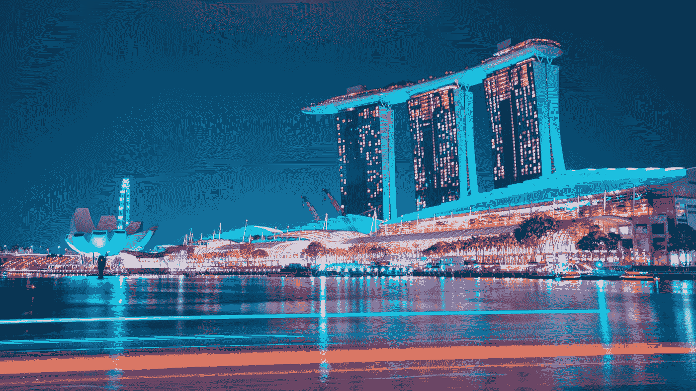
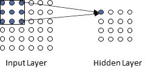
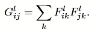

# 使用机器学习将您的图像转换为 Vaporwave 或其他艺术风格

> 原文：<https://towardsdatascience.com/using-machine-learning-to-convert-your-image-to-vaporwave-or-other-artistic-styles-df6fb9aa60e0?source=collection_archive---------27----------------------->

**TL；DR:** 这篇文章介绍了一种流行的机器学习算法的机制，这种算法被称为神经风格转移(NST)，它能够将你选择的任何图像转换为你最喜欢的艺术风格。该算法是著名的卷积神经网络的直接应用，并且巧妙地将问题框架化为对两个损失项的优化。凭借其简洁的公式，该算法提供了一种简单的方法来实现一个有趣的图像转换器(想想 DeepArt 或 Prisma)。深度学习中的任何主题都是巨大的，本文仅简要介绍 NST 算法。虽然它的续集将处理算法的实现怪癖和一些其他有趣的应用，但现在让我们获得算法背后的一些直觉，并享受玩它的乐趣。

[庞](https://unsplash.com/@yuhao?utm_source=medium&utm_medium=referral)在 [Unsplash](https://unsplash.com?utm_source=medium&utm_medium=referral) 上拍照

# 问题设置

我们的目标很明确:让一个图像 S 采用另一个图像 t 的风格。在这一点上，这个目标可能听起来有点高，你可能会有一些合理的问题，例如我们如何在神经网络中表示一个图像，以及我们如何量化风格，这些将在下面的部分中得到适当的回答。

## 数字表示

简单来说，一幅图像被表示为一个张量，可以认为是一个矩阵的推广。例如，大小为 512*512 的彩色图像将被表示为大小为 512*512*3 的张量(3-D 矩阵),数字 3 来自于任何颜色都可以被编码为 R-G-B 值的元组的事实，每个值的范围从 0 到 255。这个矩阵将在以后用作算法的输入。

## 卷积神经网络基础

由于该算法建立在卷积神经网络(CNN)架构上，因此事先澄清一些关于它的观点是有帮助的。

CNN 中与我们的任务相关的两个最重要的构件是卷积层和池层。我们首先来看看卷积层的内部工作原理。

那么我们如何从输入层到第一个卷积层呢？让我们看看下图:

在上图中，位于左上角的大小为 3*3*3 的子矩阵(为便于说明，此处仅显示了两个维度)将通过一个相同大小的滤波器，该滤波器通过对子矩阵应用卷积运算来转换子矩阵，其结果成为卷积层左上角神经元的激活。

但是什么是过滤器呢？现在你可以把它理解为一种识别描述图像的某些特征的方法:直角、曲率、纹理等。它通过将自身与输入子矩阵进行卷积来实现这一点。要获得更全面的治疗，请遵循维基百科页面中的提示。

将过滤器向右滑动一个像素，我们得到以下结果:

该滤波器将应用于每个 3*3*3 子矩阵，我们将有我们的第一个完整的卷积层。

您可以检查一下，如果我们对上述大小为 6*6*3 的输入矩阵使用大小为 3*3*3 的滤波器，那么得到的卷积层大小将为 4*4*1。然而，一般来说，滤波器的数量大于 1，这意味着我们可能要应用几个不同的滤波器，以便将输入矩阵转换为第一个卷积层。想象一下，我们将从 4 个不同的过滤器得到的大小为 4*4*1 的矩阵堆叠在彼此的顶部；我们将最终得到一个大小为 4*4*4 的卷积层，它又会成为下一层的输入，无论是另一个卷积层还是池化层。**注意，在计算机视觉行话中，每个大小为 4*4*1 的滤波器输出可以称为一个特征图；因此，这里我们有 4 个特征地图。**

池层的机制可以理解为降维。在下图中，池层的作用是将下一层中任何大小为 2*2 的子矩阵减少到 1*1。进行这种下采样的流行方法包括取最大值或平均值。

一般来说，CNN 的架构将包括卷积层和池层的交替。典型架构的示例如下:

VGG19 架构，一般用于神经风格转移，此处采用自[的](https://www.researchgate.net/publication/325137356_Breast_cancer_screening_using_convolutional_neural_network_and_follow-up_digital_mammography)

# 神经风格转移(NST)算法

清楚了基本原理之后，让我们开始研究算法的细节。

NST 利用了上面说明的 VGG19 神经网络，不包括右端的三个全连接层，它已经过预训练，可以使用 ImageNet 数据集执行对象识别。VGG19 附带了 PyTorch 和 TensorFlow 等流行的深度学习框架，因此您不需要实际自己实现它。

让我们回顾一下迄今为止我们所掌握的情况。我们有预先训练的 VGG19 CNN，一个图像矩阵 *S* 被转换成图像矩阵 *T* 的样式，以及在网络的每个中间层的中间图像矩阵*S’*(可以将*S’*的初始值设置为白噪声，或者简单地设置为 *S* )。

下一步是将整个问题公式化为优化任务。NST 将其分解为两个损失函数之和的最小化，即内容损失和风格损失。让我们开始吧。

乔纳森·福门托在 [Unsplash](https://unsplash.com?utm_source=medium&utm_medium=referral) 上的照片

**直观上，内容损失量化了我们在某一层的中间图像与内容图像之间的距离。**因此在每一层 *l* ，我们将*S’*的当前状态表示为 *x* ，将原始图像表示为 *p* ，并且进一步我们还有 *x* 的特征图，表示为 *F* ，以及 *p* 的特征图，表示为 *P* 。因此，层 *l* 处的内容损失简单地为:

在层 l，我们对 F 和 P 之间的平方误差求和，对所有特征图在 I 上循环，对给定特征图中的所有单元在 j 上循环

为了得到总的内容损失，简单地对所有层的项求和。

现在让我们来看看风格的丧失。这里，风格可以被宽泛地定义为不同特征地图之间的相关性。对于我们的中间图像 *x* ，让我们定义 *G* :

这一项表示在层 l 的两个特征图 I 和 j 之间的相关性。求和是在所有特征图单元上进行的。

类似地，我们可以为原始内容图像 *p* 定义一个矩阵 *A* 。那么我们在层 *l* 的风格损失可以定义为:

n 和 M 表示层 l 处的特征地图的数量和任何给定特征地图的大小

对所有层求和，我们得到总风格损失:

在实际操作中，上面的权重项 w 可以设置为所有层都相等:1/(层数)，或者你可以根据[原论文](https://www.cv-foundation.org/openaccess/content_cvpr_2016/papers/Gatys_Image_Style_Transfer_CVPR_2016_paper.pdf)进行更精细的决策。

最终，总损失函数是内容损失和样式损失的加权和:***a*L(内容)+ b*L(样式)*** ，使用您最喜欢的优化器在每一层对 F(i，j)进行最小化。**最终的 *F* 矩阵将是你的结果图像。**

# 结果

PyTorch 提供了一些神经类型转换的示例代码，非常容易理解和实验。有关实施的更多信息，请参考下面的进一步阅读部分。

**请注意，在将输入图像和样式图像提供给 PyTorch 实现之前，您需要使它们具有相同的大小。**

现在是有趣的部分:作为乔尔乔·德·契里柯的粉丝，我做了以下实验，试图将他的作品变成类似蒸汽波的风格:

左:乔尔乔·德·契里柯。爱情之歌；右图:vaporwave 股票图像

使用左边作为内容输入图像，右边作为样式图像，我们得到如下结果:

同样，德·基里科的另一幅杰作具有与现代插画不同的化学风格:

左:乔尔乔·德·契里柯。一条街的神秘和忧郁；右:盖娜浩史。*南部高速公路*

这给出了以下结果:

请按照下面的指示探索进一步的神经风格转换，并通过将它们转换成一些意想不到的风格来赋予您的照片或图像新的生命。

# 进一步阅读

[[1]使用卷积神经网络的图像风格转移](https://www.cv-foundation.org/openaccess/content_cvpr_2016/papers/Gatys_Image_Style_Transfer_CVPR_2016_paper.pdf)

[2][https://papers with code . com/paper/a-neural-algorithm-of-artistic-style](https://paperswithcode.com/paper/a-neural-algorithm-of-artistic-style)

【3】[使用 PyTorch 的神经转移](https://pytorch.org/tutorials/advanced/neural_style_tutorial.html)