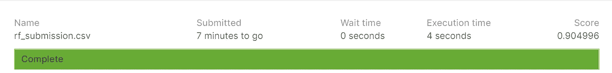

# 使用机器学习来检测欺诈

> 原文：<https://towardsdatascience.com/using-machine-learning-to-detect-fraud-f204910389cf?source=collection_archive---------7----------------------->


马克斯·本德在 [Unsplash](https://unsplash.com?utm_source=medium&utm_medium=referral) 上的照片

## 端到端机器学习项目的开始

## 内容

介绍

欺诈检测问题

数据

构建框架

## 介绍

机器学习是人工智能(AI)的一个子集，它为系统提供了自动学习和根据经验进行改进的能力，而无需显式编程。也就是说，我们(人类)有可能向计算机提供大量数据，让计算机学习模式，以便它可以学习如何在面临新的情况时做出决定——当我发现这一见解时，我立即知道世界即将改变。

> 它揭示了**欺诈**正在花费全球**经济** 3.89 万亿，损失在过去十年中上升了 56%。— [克罗英国](https://www.crowe.com/uk/croweuk/insights/financial-cost-of-fraud-2019#:~:text=The%20latest%20data%20from%20around%20the%20world&text=It%20reveals%20that%20fraud%20is,56%25%20in%20the%20past%20decade.)

作为一名欺诈的受害者，想出办法来防止这种事情再次发生在我身上(以及其他任何人身上),这基本上促使我进入了一个与我习惯的领域完全不同的领域。

## 欺诈检测问题

在机器学习术语中，诸如欺诈检测问题之类的问题可以被框定为分类问题，其目标是预测离散标签 0 或 1，其中 0 通常暗示交易是非欺诈性的，1 暗示交易似乎是欺诈性的。

因此，这个问题要求从业者建立足够智能的模型，以便能够在给定各种用户交易数据的情况下准确地检测欺诈性和非欺诈性交易，这些数据通常是匿名的，以保护用户隐私。

由于完全依赖基于规则的系统不是最有效的策略，机器学习已经成为许多金融机构解决这一问题的方法。

使这个问题(欺诈检测)如此具有挑战性的是，当我们在现实世界中对其建模时，发生的大多数交易都是真实的交易，只有非常小的一部分是欺诈行为。这意味着我们要处理不平衡数据的问题——我关于[过采样和欠采样](/oversampling-and-undersampling-5e2bbaf56dcf)的帖子是处理这个问题的一种方法。然而，对于这篇文章，我们的主要焦点将是开始我们的机器学习框架来检测欺诈——如果你不熟悉构建自己的框架，你可能想在完成这篇文章之前通读一下[结构化机器学习项目](/structuring-machine-learning-projects-be473775a1b6)。

[](/oversampling-and-undersampling-5e2bbaf56dcf) [## 过采样和欠采样

### 一种不平衡分类技术

towardsdatascience.com](/oversampling-and-undersampling-5e2bbaf56dcf) [](/structuring-machine-learning-projects-be473775a1b6) [## 构建机器学习项目

### 构建 ML 项目的模板指南

towardsdatascience.com](/structuring-machine-learning-projects-be473775a1b6) 

## 数据

这些数据是由 IEEE 计算智能学会(IEEE-CIS)的研究人员收集的，目的是预测在线交易欺诈的概率，如二进制目标(T0)所示。

> **注**:本次比赛的数据部分是从 [Kaggle 数据](https://www.kaggle.com/c/ieee-fraud-detection/data)部分复制而来。

数据被分成两个文件`identity`和`transaction`，由`TransactionID`连接。并非所有交易都有相应的身份信息。

**分类特征—交易**

*   `ProductCD`
*   `card1` - `card6`
*   `addr1`，`addr2`
*   `P_emaildomain`
*   `R_emaildomain`
*   `M1` - `M9`

**分类特征—同一性**

*   `DeviceType`
*   `DeviceInfo`
*   `id_12` - `id_38`

`TransactionDT`特性是给定参考日期时间的时间增量(不是实际的时间戳)。

你可以从竞赛主持人的[这篇帖子中了解更多数据。](https://www.kaggle.com/c/ieee-fraud-detection/discussion/101203)

**文件**

*   train _ {事务，身份}。csv —训练集
*   测试 _ {事务，身份}。csv —测试集(您必须预测这些观察的`isFraud`值)
*   sample_submission.csv —格式正确的示例提交文件

## 构建框架

处理任何机器学习任务的第一步是建立一个可靠的[交叉验证](/cross-validation-c4fae714f1c5)策略。

[](/cross-validation-c4fae714f1c5) [## 交叉验证

### 验证机器学习模型的性能

towardsdatascience.com](/cross-validation-c4fae714f1c5) 

> **注意**:该框架背后的总体思想正是来自 Abhishek Thakur — [Github](https://github.com/abhishekkrthakur/mlframework)

当面临不平衡数据问题时，通常采用的方法是使用`StratifiedKFold`，它以这样一种方式随机分割数据，即我们保持相同的类分布。

我实现了创建折叠作为`preprocessing.py`的一部分。

这段代码合并来自训练和测试集的身份和事务数据，然后重命名`merged_test`数据中的列名，因为 id 列使用“-”而不是“_”—这将在我们稍后检查以确保我们在测试中有完全相同的列名时导致问题。接下来，我们将名为`kfold`的列添加到我们的训练数据中，并根据它所在的文件夹设置索引，然后保存到一个 csv 文件中。

你可能已经注意到我们导入了`config`,并把它作为各种事物的路径。所有的配置都是另一个脚本中的变量，这样我们就不必在不同的脚本中重复调用这些变量。

在处理机器学习问题时，以允许快速迭代的方式快速构建管道非常重要，因此我们将构建的下一个脚本是我们的`model_dispatcher.py`，我们称之为分类器，而`train.py`是我们训练模型的地方。

先说`model_dispatcher.py`

这里，我们简单地导入了一个[逻辑回归](/algorithms-from-scratch-logistic-regression-7bacdfd9738e)和[随机森林](/random-forest-overview-746e7983316)，并创建了一个字典，这样我们就可以通过运行逻辑回归模型的`models["logistic_regression"]`将算法调用到我们的训练脚本中。

列车脚本如下…

希望你可以阅读代码，但如果你不能，总结一下发生了什么，我们将训练数据设置为列`kfold`中的值，这些值等于我们通过的测试集的倍数。然后，我们对分类变量进行标签编码，并用 0 填充所有缺失值，然后在逻辑回归模型上训练我们的数据。

我们得到当前折叠的预测，并打印出 [ROC_AUC](/comprehension-of-the-auc-roc-curve-e876191280f9) 。

[](/comprehension-of-the-auc-roc-curve-e876191280f9) [## 理解 AUC-ROC 曲线

### 深入了解 AUC-ROC…

towardsdatascience.com](/comprehension-of-the-auc-roc-curve-e876191280f9) 

> **注意**:就目前情况来看，代码不会自己运行，所以当我们运行每个 fold 时，我们必须传递 fold 和 model 的值。

让我们看看我们的逻辑回归模型的输出。

```
### Logistic Regression # Fold 0 
ROC_AUC_SCORE: 0.7446056326560758# Fold 1
ROC_AUC_SCORE: 0.7476247589462117# Fold 2
ROC_AUC_SCORE: 0.7395710927094167# Fold 3
ROC_AUC_SCORE: 0.7365641912867861# Fold 4
ROC_AUC_SCORE: 0.7115696956435416
```

这些都是相当不错的结果，但让我们使用更强大的随机森林模型，看看我们是否可以改进。

```
### Random Forest# Fold 0 
ROC_AUC_SCORE: 0.9280242455299264# Fold 1
ROC_AUC_SCORE: 0.9281600723876517# Fold 2
ROC_AUC_SCORE: 0.9265254015330469# Fold 3
ROC_AUC_SCORE: 0.9224746067992484# Fold 4
ROC_AUC_SCORE: 0.9196977372298685
```

很明显，随机森林模型产生了更好的结果。让我们向 Kaggle 提交一份最新报告，看看我们在排行榜上的排名。这是最重要的部分，为此我们必须运行`inference.py`。

> **注意**:提交给 Kaggle 的过程超出了本次讨论的范围，因此我将在排行榜上公布评分模型及其表现。



鉴于这一分数被转换为 Kaggle 的私人排行榜(因为这是公共排行榜上的分数)，我们在 Kaggle 的私人排行榜上的排名是 3875/6351(前 61%)。虽然，从 Kaggle 的角度来看，这看起来不太好，但在现实世界中，我们可能会根据任务来决定这个分数。

然而，这个项目的目标不是想出最好的模型，而是创建我们自己的 API，我们将在后面的帖子中回来。

为了构建快速迭代的快速管道，我们拥有的代码是可以的，但是如果我们想要部署这个模型，我们必须做大量的清理工作，以便我们遵循[软件工程最佳实践](/data-scientist-should-know-software-engineering-best-practices-f964ec44cada)。

[](/data-scientist-should-know-software-engineering-best-practices-f964ec44cada) [## 数据科学家应该知道软件工程的最佳实践

### 成为不可或缺的数据科学家

towardsdatascience.com](/data-scientist-should-know-software-engineering-best-practices-f964ec44cada) 

## 包裹

检测欺诈在现实世界中是一个非常常见且具有挑战性的问题，提高准确性对于防止在商店进行真实交易时客户卡被拒绝的尴尬非常重要。我们已经建立了一个非常简单的方法，使用分类变量的标签编码，用 0 填充所有缺失值，以及一个随机森林，没有任何调整或方法来处理数据中的不平衡，但我们的模型仍然得分很高。为了改进模型，我们可能希望首先查看随机森林模型中的重要特征，并删除不太重要的特征，或者我们可以使用其他更强大的模型，如光梯度增强机器和神经网络

> **注意**:在写这个脚本的时候，模块不是最好的，但是它的格式允许我快速迭代。在未来的工作中，我计划将这个模型作为 API 部署在云服务器上。

让我们继续 LinkedIn 上的对话…

[](https://www.linkedin.com/in/kurtispykes/) [## Kurtis Pykes -人工智能作家-走向数据科学| LinkedIn

### 在世界上最大的职业社区 LinkedIn 上查看 Kurtis Pykes 的个人资料。Kurtis 有两个工作列在他们的…

www.linkedin.com](https://www.linkedin.com/in/kurtispykes/)