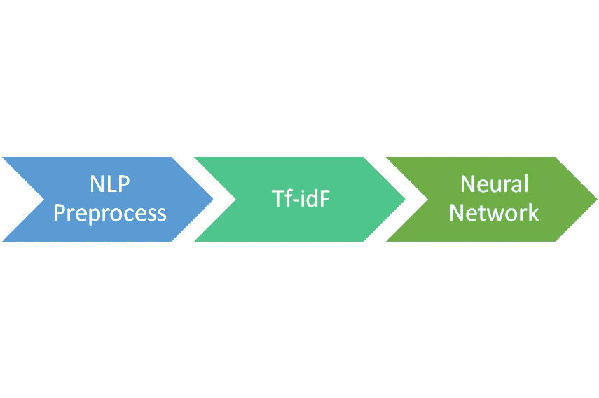
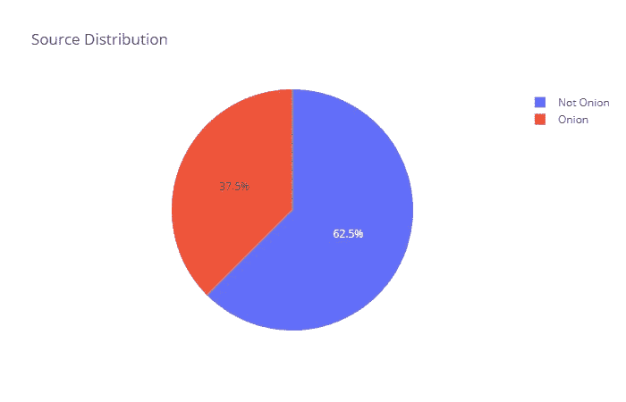
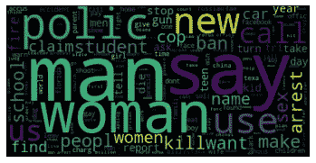
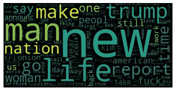
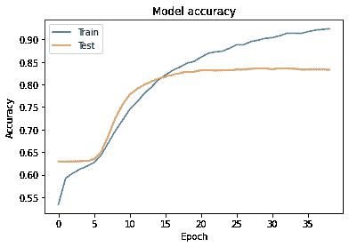
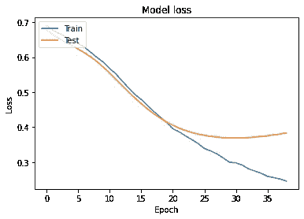
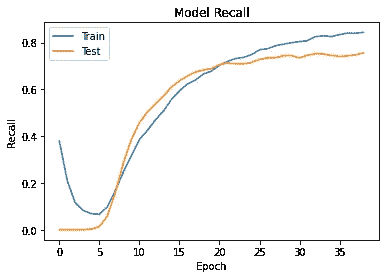
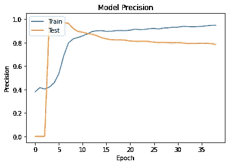

# 使用机器学习来区分什么是真实的，什么不是

> 原文：<https://towardsdatascience.com/using-machine-learning-to-distinct-whats-real-and-what-is-not-9c1c74f73c8c?source=collection_archive---------42----------------------->

## 超现实世界中假新闻检测的神经网络方法


照片由 [Unsplash](https://unsplash.com?utm_source=medium&utm_medium=referral) 上的 nij wam Swargiary 拍摄

这篇文章是作为 2020 年后变得越来越不现实的想法出现的。这个世界正变得越来越陌生，我们从互联网上的各种来源接收到越来越多的信息，其中一些充其量是不诚实的。知道你读到的是假的还是真正离奇和令人震惊的能力变得越来越难。距离美国大选还有不到一个月的时间，能够从假新闻中辨别出真实是很重要的。

我将尝试使用一种机器学习(ML)技术来将标题分类为虚假与否，并将其与人类进行比较。

## 人类探讨

我认为我们应该从实验开始。我会用两个标题，一个来自一篇假文章(来自洋葱)，另一个来自一篇真正的文章。

答案并不明显，遗憾的是，这并不是唯一的例子。你可以在文末找到答案但是不要宠坏自己。

我决定再做一个小实验。我选了六个头条(三假三真)。然后我上了 Instagram，在我的粉丝中做了一个民意调查。我知道，这个样本不仅仅是有偏见的，因为它只代表了我的朋友，尽管如此，它仍然是一个指标。

人类集体知识的成功率(准确率)为 **0.5** 。实际上比扔硬币和依靠纯粹的运气好不了多少。

让我们看看“机器”将会如何表现。

## 机器学习方法

GitHub 的一名用户从两个来源收集数据，一个是“假”新闻(来自《洋葱》),另一个是真实但怪异的新闻。

“假”标题来自《洋葱新闻》。对于那些不知道“洋葱”的人来说，这是一个美国恶搞网站，以讽刺的口吻报道真实和虚构的事件，模仿真实的新闻机构。不是想骗人，是想娱乐人。所以，这不完全是坏的假新闻，我们只是使用这个数据集，因为我们知道我们可以很容易和客观地将它们归类为假的。

真正的标题来自一个名为 [r/NotTheOnion](https://www.reddit.com/r/nottheonion/top/?t=all) 的子编辑，它包含了来自真实世界的各种超现实的标题，用户可能会将其误解和/或希望为洋葱新闻。

该数据集被广泛使用，并且有很多实验在数据上完成，其中一些比我的更准确。

我决定实现一种不同于我在网上作为辅助项目找到的技术，来提高我的 NLP(自然语言处理)技能。



工艺管道

在对数据进行预处理后，我制作了一个 Tf-idF 并训练了一个神经网络来对新闻进行分类。

但是首先让我们对数据集有一些基本的了解。

我们有 24k 个标题，其中 62.5%为非洋葱文章，37.5%为洋葱文章。



让我们更深入地了解这个项目的技术方面。**如果你不感兴趣，就直接跳到结果里。**

对于该项目，我们将需要以下进口

```
from sklearn.feature_extraction.text import TfidfVectorizer
from sklearn.model_selection import train_test_split
from sklearn import metrics
from sklearn.model_selection import GridSearchCV
from sklearn.model_selection import StratifiedKFold
from sklearn.model_selection import cross_val_score
from sklearn.model_selection import cross_validatefrom keras.wrappers.scikit_learn import KerasClassifier
from keras.layers import  Dropout, Dense
from keras.models import Sequential
from keras import backend as K
import tensorflow as tf
import plotly.graph_objects as goimport matplotlib.pyplot as plt
import plotly.express as px
import numpy as np
import pandas as pd
import nltk
import re
from wordcloud import WordCloudnltk.download('punkt')
nltk.download('stopwords')
ENG_SW = set(nltk.corpus.stopwords.words('english'))
```

现在我们应该开始数据的预处理。对于这一部分，我们将使用 NLTK 套件。

首先，我们只保留小写字母数字字符，并丢弃特殊字符。然后，我们开始一个过程，在这个过程中，我们对单词进行标记，然后清除无用的单词，最后我们对单词进行词干处理。这是一个标准的 NLP 过程，NLTK 可以很容易地帮助我们完成。

```
df = pd.read_csv("onion-or-not.csv") def prepossessing(df):df["text"] = df["text"].apply(lambda x : x.lower())df["text"] = df["text"].apply(lambda x :  re.sub('[^a-zA-z0-9\s]','',x))df["text_list"] = df["text"].apply(lambda x : nltk.word_tokenize(x))df["cleaned_list"] = df["text_list"].apply(lambda x: [word for word in x if word not in ENG_SW])df["stemmed_cleaned_list"] = df["cleaned_list"].apply(lambda x : [nltk.PorterStemmer().stem(i) for i in x])df['text_edited'] = df['stemmed_cleaned_list'].apply(lambda x : " ".join(x))return df['text_edited']df_X = prepossessing(df)
df_Y = df['label']
```

现在我们已经完成了基本的文本预处理，在进行下一步之前，让我们可视化两个标签的单词云。



不是洋葱



洋葱

下一步是分割数据集并生成数据的[TF–IDF](https://en.wikipedia.org/wiki/Tf%E2%80%93idf)。

```
X_train, X_test, y_train, y_test = train_test_split(df_X, df_Y, test_size=0.25, random_state=seed)print(X_train.shape, y_train.shape)
print(X_test.shape, y_test.shape) vectorizer_x = TfidfVectorizer()X_train_tfidf = vectorizer_x.fit_transform(X_train).toarray()
X_test_tfidf = vectorizer_x.transform(X_test).toarray()
```

在我们有了 tf-idf 之后，我们将继续我们的模型。

数据集很简单，因此我们将构建一个小型的基本模型。

```
def Build_Model_DNN_Text(shape, optimizer='Adam', nLayers= 1, neurons=16, dropout=0.85):"""Build_Model_DNN_Tex(shape, nClasses,dropout)Build Deep neural networks Model for text classificationShape is input feature space"""model = Sequential()# number of hidden layersmodel.add(Dense(64,input_dim=shape,activation='elu'))model.add(Dropout(dropout))for i in range(0, nLayers):model.add(Dense(neurons,input_dim=neurons,activation='elu'))model.add(Dropout(dropout))model.add(Dense(1, activation='sigmoid'))model.compile(loss='binary_crossentropy',optimizer=optimizer,metrics=['accuracy',tf.keras.metrics.AUC(),tf.keras.metrics.Precision(),tf.keras.metrics.Recall()])return model
```

然后我们训练我们的模型

```
model_DNN = Build_Model_DNN_Text(X_train_tfidf.shape[1])history = model_DNN.fit(X_train_tfidf, y_train,validation_data=(X_test_tfidf, y_test),epochs=100,batch_size=4096,verbose=2,callbacks=[tf.keras.callbacks.EarlyStopping(monitor='val_accuracy', mode = "max", patience=10)])
```

## 结果

我们训练的结果



模型精度图



模型损失图



模型回忆图



模型精度图

让我们运行我的 Instagram 实验的标题，看看它与人群相比如何。

```
titles = [{"text" : "Coronavirus homeschooling: 77 percent of parents agree teachers should be paid more after teaching own kids, study says", "label" : 0},{"text" : "Police Department Celebrates Fourth Of July By Using Fireworks For Crowd Control ", "label" : 1},{"text" : "ICE Director: ICE Can't Be Compared To Nazis Since We're Just Following Orders", "label" : 0},{"text" : "Hackers Obtain Data Of 45 Million Target Customers Revealing What They’ve Done In Store Bathrooms", "label" : 1},{"text" : "US Military Could Lose Space Force Trademark to Netflix Series", "label" : 0},{"text" : "Trump Blames China For Acting Too Late In Coordinating U.S. Coronavirus Response", "label" : 1}]exp = pd.DataFrame(titles, columns=['text','label'])exp_x = prepossessing(exp)exp_x_tfidf = vectorizer_x.transform(exp_x).toarray()model_DNN.evaluate(exp_x_tfidf, exp['label'])
```

我们评价的准确率比人群好 0.83。

## 结论

我们实现了一个基本模型，得到了一些下降结果，比人类实验更好。如果我们有更大的数据集和更好的技术，我们可以轻松达到 90%以上的准确率。感谢您抽出宝贵的时间，并且**我很乐意讨论任何反馈**。

该项目的 GitHub 可以在[这里](https://github.com/ilias1111/onion-or-not)找到。

## 页（page 的缩写）S

不是洋葱

[](https://thehill.com/homenews/administration/353355-trump-dedicates-golf-trophy-to-puerto-rico-hurricane-victims) [## 特朗普将高尔夫奖杯献给飓风受害者

### 特朗普总统周日将一座高尔夫奖杯献给了最近席卷德克萨斯州的强大飓风的受害者…

thehill.com](https://thehill.com/homenews/administration/353355-trump-dedicates-golf-trophy-to-puerto-rico-hurricane-victims) 

洋葱

[](https://www.theonion.com/house-censures-ocasio-cortez-for-using-sexist-slur-on-f-1844498607) [## 众议院指责奥卡西奥-科尔特斯在国会发言时使用性别歧视的诽谤

### 华盛顿——众议院投票通过了一项谴责这位新生的女议员行为的决议

www.theonion.com](https://www.theonion.com/house-censures-ocasio-cortez-for-using-sexist-slur-on-f-1844498607)