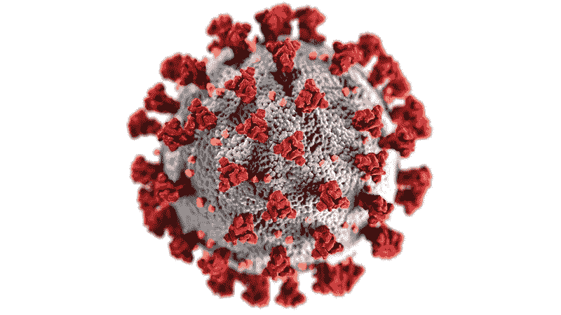
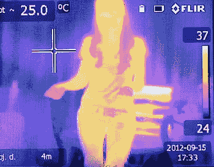

# 利用机器学习对抗冠状病毒

> 原文：<https://towardsdatascience.com/using-machine-learning-to-fight-the-coronavirus-7543c3d2381a?source=collection_archive---------32----------------------->

机器学习已经成为一项强大的技术，推动了医疗保健、机器人、数据挖掘、网络安全等领域的进步。最近，深度学习技术的出现使得开发更复杂的架构和新的探索领域成为可能——自然语言处理、计算机视觉等。

新型冠状病毒(冠状病毒)疫情最近肆虐全球，已造成超过 100 万病例( [*来源*](https://www.arcgis.com/apps/opsdashboard/index.html#/bda7594740fd40299423467b48e9ecf6) )。运输系统和机场在识别冠状病毒病例时遇到了特别的困难([T5 来源 T7)。几个潜在阳性的个体也可能是无症状的，并且可能表现出很少或没有冠状病毒的症状，尽管是携带者。这些人可能会影响其他人，这些人出现并发症的风险更高，最终可能需要医院护理和通过通气进行重症监护(](https://www.tsa.gov/coronavirus) [*来源*](https://www.sfchronicle.com/health/article/Asymptomatic-transmission-is-driving-the-15177695.php) )。目标是通过最经济的方法限制病例数量和传染病的传播，因为这将降低医院的处理能力。

解决病毒问题的一个关键方法是在分子水平上分析其复制周期。构建冠状病毒疫苗的过程需要对冠状病毒的复制进行分子抑制。我们从描述新型冠状病毒的复制周期开始。病毒首先与宿主细胞的 ACE2 受体结合。然后病毒进入细胞，并开始将其病毒 RNA 释放到细胞中。这种病毒 RNA 基因组最初被翻译成特殊的 pp1a 蛋白(多聚蛋白 1a)。这些蛋白质然后被蛋白水解成复制酶，基因组的其余部分被转录成亚基因组 mRNAs。这些 mRNAs 然后被翻译成病毒的特定功能蛋白(刺突蛋白、膜蛋白等。).这些功能性蛋白质在能区室中加工后自我组装，并通过胞吐作用释放。这种复制过程使病毒得以迅速传播，并表明它会在患者的呼吸系统和免疫系统中引起许多健康问题。

新型冠状病毒粒子([来源](https://www.rawpixel.com/image/2288510/free-image-medical-pandemic-covid) — CCO 公共领域使用)

如上所述，目前阻止病毒传播的生物医学努力试图通过限制特定酶继续复制过程的能力，在分子水平上抑制病毒。这些努力特别耗时，并且需要对分子进行密集的生化密度泛函理论(DFT)模拟。因此，我们目前只能试图在未来几个月内限制该病毒的传播，因为该病毒的生物分子实验和抑制性研究需要时间来处理。为了了解谁在瞬间感染了病毒并限制感染，我们必须关注有症状的个体，并能够限制其传播，以减少有症状和无症状的新个体的数量。

热成像技术是一种关键的方法，可以用来帮助辨别谁感染了病毒，谁开始出现症状。热成像属于热成像科学领域。这些相机检测红外辐射，并通过不同的颜色表达不同水平的辐射。热辐射与温血动物的体温升高直接相关。下面给出了热成像的一些例子。

人体热成像([来源](https://www.pxfuel.com/en/free-photo-jhjqv) — CCO 公共领域使用)

如果患者在感染病毒的早期阶段开始出现发烧的迹象，这将导致体温上升，并随后发烧。在热成像相机上，我们会看到有症状的病毒携带者上半身有更多的辐射(更残忍的红色)。

机器学习作为模式识别的最前沿方法已经变得无处不在，因此应该可以将数据集插入特定的机器学习算法中，并实现对发烧(可能还有病毒)个体的系统分类。目前，在交通、商业和贸易的主要公共中心，在不造成更多感染的情况下为所有人部署检测是非常低效和昂贵的。通过使用远距离相机，利用热成像扫描通过某个区域的个人，我们可以了解谁可能发烧，谁可能没有发烧。这将全部基于实时处理输入数据的机器学习算法。

可能对该问题有用的一些示例算法包括朴素贝叶斯机器学习(概率)、支持向量机、K-最近邻和随机森林模型。有趣的是，我们可以在这种情况下直接应用计算机视觉。计算机视觉是深度学习的一个子集，它利用图像或视频输入，通过深度神经网络提取特征并进行分类。下面给出一个深度卷积神经网络的例子。

卷积神经网络(来源: [Sumit Saha](/a-comprehensive-guide-to-convolutional-neural-networks-the-eli5-way-3bd2b1164a53)

总之，我们可以利用计算机科学和机器学习的力量，朝着恢复疫情之后的世界迈出一步。许多开源代码和数据集已经在网上开发出来，一些研究小组已经开始开发信息学算法来检测冠状病毒。像下面这样的算法使用 CT 扫描数据来模拟感染病毒的风险。(例如。[https://www . medrxiv . org/content/10.1101/2020 . 02 . 14 . 20023028 v3](https://www.medrxiv.org/content/10.1101/2020.02.14.20023028v3)

在过去的几年中，医学科学与信息学技术的结合势不可挡，医学成像、基因组学和肿瘤学等领域也因计算机科学的进步而发生了转变。通过信息学成像和分子化学为今天的冠状病毒做准备也将在未来帮助我们。

***编者按:*** [*走向数据科学*](http://towardsdatascience.com/) *是一份以数据科学和机器学习研究为主的中型刊物。我们不是健康专家或流行病学家，本文的观点不应被解释为专业建议。想了解更多关于疫情冠状病毒的信息，可以点击* [*这里*](https://www.who.int/emergencies/diseases/novel-coronavirus-2019/situation-reports) *。*