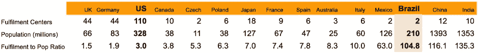

# 使用机器学习寻找亚马逊的下一个履行中心

> 原文：<https://towardsdatascience.com/using-machine-learning-to-find-amazons-next-fulfillment-center-2a7b44cc4663?source=collection_archive---------92----------------------->

## [现实世界中的数据科学](https://medium.com/towards-data-science/data-science-in-the-real-world/home)

## 假设:巴西。但是具体在哪里呢？

亚马逊应该在哪里建立下一个履行中心？我们可以利用机器学习来帮助回答这个问题。


图片来自谷歌地图

首先，让我们定义业务案例:

*   履行中心的一个主要目的是实现亚马逊的核心价值主张:快速 delvery。这意味着对于客户来说，位于中心位置非常重要。
*   据估计，2020 年，亚马逊拥有美国电子商务市场份额的近 44%，第二大竞争对手的份额为 7%。让我们放眼美国之外，发掘尚未开发的全球市场机会。
*   让我们从现有的亚马逊国家中进行选择，以利用基础设施和法规遵从性。


图片来自维基百科

接下来，让我们探讨亚马逊履行中心与全国人口的比率。比率越小，中心需要担心的客户就越少，交付速度就越快。



2020 年 5 月从维基百科提取的数据

例如，亚马逊美国目前的比例是每 300 万人有 1 个履行中心。这意味着旧金山湾区中心的 1 个履行中心使亚马逊能够在当天完成购物项目并开车送货。

看上面的数据，哪个国际国家的增长潜力最大？巴西似乎是一个不错的选择:它的总中心数量最少，人口最多，每 1.05 亿人有 1 个中心，也是亚马逊最近宣布扩张和感兴趣的地方。

假设这些都是正确的因素，那么巴西到底在哪里呢？我们可以使用机器学习 k-means 聚类来识别潜在位置。从结论开始，这里是潜在的位置。


小圆圈代表巴西所有的 387 个城市。橙色的大圆圈代表 10 个集群的质心，这是潜在的履行中心位置。

下面是获得结果的代码:

```
# Import libraries
import pandas as pd
from sklearn.cluster import KMeans
import plotly.graph_objects as go# Load and explore data of world cities from [https://simplemaps.com/data/world-cities](https://simplemaps.com/data/world-cities)
data = pd.read_csv('Data/worldcities.csv')
data.head()
```


```
# Find how many cities in Brazil
data.loc[data.country == 'Brazil'].count()# Filter data to only have Brazil
brazil = data[data.country.isin(['Brazil'])]
print(brazil.shape)
brazil.head()
```


```
# Use k-means to find clusters 
brazil2 = brazil[['lat', 'lng']]
kmeans = KMeans(n_clusters = 10)
kmeans.fit(brazil2)
y_means = kmeans.predict(brazil2)
centers = kmeans.cluster_centers_# Plot on map
fig = go.Figure(data = go.Scattergeo(
    lon = brazil2['lng'],
    lat = brazil2['lat'],
    mode = 'markers',
    marker = dict(
        size = 3,
        opacity = 0.8,
        reversescale = True,
        autocolorscale = True,
        symbol = 'circle',
        line = dict(
            width = 1,
            color = ['rgba(102, 102, 102)']
        ),
        cmin = 0,
        color = y_means,
        colorbar_title = "City Clusters"
    )
))fig.add_trace(go.Scattergeo(
    lon = centers[:,1],
    lat = centers[:,0],
    mode = 'markers',
    marker = dict(
        size = 8,
        line = dict(
            width = 1,
            color = 'orange'
        ),
        color = 'orange',
    )
))fig.update_layout(
    title = "Brazil City Clusters and Centroids ",
    geo = dict(
        scope = "south america",
        showland = True,
    )
)# Print to new page: fig.write_html('first_figure.html', auto_open=True)
fig
```


小圆圈代表巴西所有的 387 个城市。橙色的大圆圈代表 10 个一组的质心，这是潜在的履行中心位置。

如果我们将聚类数增加到 25，我们会得到这样的结果:


从 plot ly(plotly.com/python/scatter-plots-on-maps)生成的地图图像

为了达到与亚马逊美国相同的履行中心比率，亚马逊巴西将需要 70 个中心。我们可以在聚类中加入其他因素，如人口变量。

```
# Use k-means to find clusters 
brazil2 = brazil[['lat', 'lng', '**population**']]
kmeans = KMeans(n_clusters = **70**)
kmeans.fit(brazil2)
y_means = kmeans.predict(brazil2)
centers = kmeans.cluster_centers_
```

我们会得到这个:


接下来的步骤:
从这里开始，我们应该利用领域知识来更好地了解客户人口统计、电子商务采用、基础设施等。这只是一个初步的假设，需要更深入更精细的分析。你可以在这里看到完整的代码:[github.com/allenjiang/mona-lisa-ai](http://github.com/allenjiang/mona-lisa-ai)。


图片来自维基百科