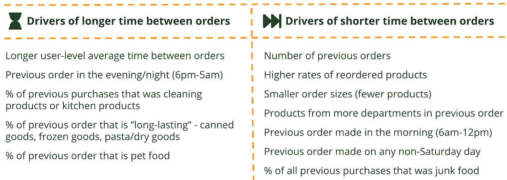
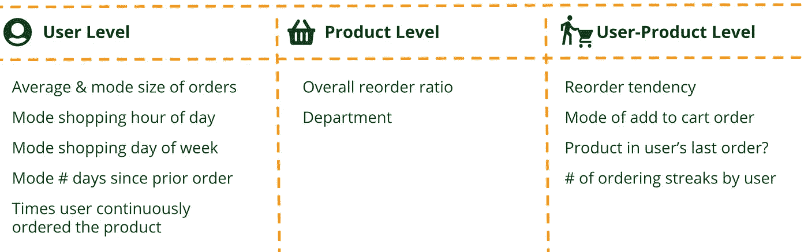

# 使用机器学习提高客户保持率

> 原文：<https://towardsdatascience.com/using-machine-learning-to-improve-customer-retention-ee742087a3fd?source=collection_archive---------28----------------------->

来源: [GenHQ](https://genhq.com/americans-no-longer-want-one-stop-grocery-shopping/)

## 将购物车放入 Instacart

> 本博客由 Nicki (Nicola) Kornbluth、Daniel Moskowitz、Sanchya Sahay 和 Metika Sikka 为哥伦比亚大学商业分析项目的一门*商业分析*课程撰写。

当我们在 2020 年 1 月开始这个项目时，在线杂货似乎是一个令人兴奋的研究行业。几十年来,[食品杂货业一直保持着年增长率(即使是在经济衰退时期),网上食品杂货的市场份额也在不断增长。此外，由于习惯驱动的消费者行为和无与伦比的数据访问，在线杂货数据似乎是预测分析的一个很好的候选对象。](https://www.statista.com/statistics/197626/annual-supermarket-and-other-grocery-store-sales-in-the-us-since-1992/)

gifs.com 制作的 GIF

我们一点也不知道，这个行业将会发生前所未有的变化:

虽然下面的发现可能无法解释当前的购物行为，但我们的分析侧重于保留营销策略，这将是在线杂货店大流行后计划的关键。

在疫情之前，杂货商的大部分增长来自家庭支出的增加，而不是新人们的支出。平均而言，大多数家庭每周至少购买一次食品杂货。

这告诉我们，要取得成功，网上杂货店需要他们的客户建立一种习惯，而且要快。虽然收购在零售业中总是一个因素，但在杂货业中，增长依赖于留住你的客户并增加他们的终身价值。

我们从业内最大的参与者之一— *Instacart 的角度来探讨这个问题。*下面描述的所有分析都利用了*[*insta cart 在线杂货购物数据集 2017*](https://www.instacart.com/datasets/grocery-shopping-2017) *。”**

**

****insta cart 在线杂货购物数据集 2017*** 的结构*

*对数据的初步观察证实了我们的怀疑:许多顾客只下了几笔订单，但忠诚者的尾巴很长。我们希望能帮助长出这条尾巴。*

**

**资料来源:2017 年 Instacart 在线杂货购物数据集**

*我们将精力集中在两个方面:*

*   ***减少订单之间的时间。**通过让顾客更频繁地购物，我们希望增加他们的订单数量，并成为他们的固定购物点。*
*   ***理解和促进再订购行为。**重新排序是习惯的关键标志，所以我们想要培养这种行为。*

**

*来源: [GIPHY](https://gph.is/g/ZYmmVAZ)*

# *缩短订单之间的时间*

*通过减少订单之间的时间，Instacart 可以确保它从用户的杂货预算中获得越来越多的份额。*

*为此，我们创建了一个模型来预测用户下一次购物的时间。通过找到导致更频繁订单的因素，Instacart 可以鼓励用户采取类似的行为。他们还可以更好地把握营销信息的时机，在顾客与竞争对手购物之前赢回顾客。*

## ***车型***

*我们创建了许多功能来更好地了解用户的购物模式。这些分为三类:最近的订单、购物者类型的“标志”和累积行为。*

**

*我们对订单时间的驱动因素感兴趣，所以我们想要一个易于解释的模型。在快速浏览了决策树之后，我们把精力集中在线性回归上。我们的平均误差是 4.29，这意味着我们通常能够在半周内确定用户的下一个订单。*

*更重要的是，我们学到了一些有趣的见解。例如，购买餐具室商品的用户倾向于在他们的订单之间有更长的时间，而在早上或工作日订购的用户倾向于订购得更快。*

**

## ***建议***

*基于这些见解，我们建议 Instacart 采取以下措施来提高订单频率:*

*   *专注于推动工作日早上的订单*
*   *取消前几个订单的最小订单量，以培养习惯*
*   *尝试向用户介绍新的部门*
*   *在营销材料中突出冲动购买*

# *预测重新排序行为*

*网上杂货商长期以来一直在宣传方便的信息。不幸的是，这种优势也是他们最大的弱点——客户经常在平台之间切换，选择最有效的平台。这意味着建立品牌忠诚度很难，但却是留住客户的关键。*

**

**来源:* [*广告世界*](https://www.adsoftheworld.com/media/outdoor/instacart_swipe_it_in_the_bag)*[*亚马逊*](https://www.adsoftheworld.com/media/outdoor/instacart_swipe_it_in_the_bag)*[*设计隐蔽*](http://designcovert.com/content/freshdirect-brand-launch-banners/)***

***在杂货店购物的忠诚度很大程度上是基于习惯，所以促进重新订购是我们努力的一个很好的地方。***

***为了实现这一目标，我们建立了一个模型，预测用户在下一次购物车中重新订购他们之前购买的任何商品的概率，以便 Instacart 可以更好地服务客户，并在客户生命周期的早期建立忠诚度。***

## *****型号*****

***对于这个模型，我们创建了一个约 850 万行的用户-产品级矩阵。我们还开发了一组新的 27 个特性，包括产品级、用户级和用户-产品级。由于数据集的规模很大，为了提高效率，我们转向 Google Cloud 在虚拟机上运行 R。***

******

***我们尝试了几种不同的技术来构建这个模型。因为我们的数据集是不平衡的，所以我们将性能与 F1 分数进行了比较。在此基础上，我们的最佳模型是针对不平衡类调整的随机森林和 XGBoost 树。***

******

***然而，由于集合模型的结果很难解释，我们在 Log-Lasso 中寻找一些帮助。这些系数向我们展示了每个特征*如何直接*影响结果。我们从我们的集合模型中用可变的重要性将它分层，以推断驱动和阻止重新排序的特征。***

******

## ***应用程序***

***Instacart 可以利用该模型的预测:***

*   *****产品订阅**:关注最有可能再次订购产品的用户，并以较低的价格提供订阅服务，以确保留住客户。***
*   *****库存管理**:根据再订购行为向合作商店提供需求预测。***
*   *****有针对性的营销**:利用这些预测进行营销，向重新订购产品的可能性中高的用户发送促销信息。在营销中加入补充产品。***
*   *****提高利润:**为再订购概率高的人群推荐和推广高利润替代品。***

******

***来源: [GIPHY](https://giphy.com/gifs/superstore-fw2LNzndEtIytKbDqU)***

# ***TL；速度三角形定位法(dead reckoning)***

***对网上杂货店来说，留住顾客一直是关键，但后疫情时代，这将决定他们生意的成败。我们使用多种机器学习工具来帮助 Instacart 通过专注于减少订单之间的时间和培养再订购行为来吸引和留住他们的客户。(或者像我们在这个项目中的口头禅一样，“搅拌黄油，而不是顾客。”)***

> ***你可以在我们的 GitHub repo 上看到这个项目的代码和演示:【https://github.com/dsm2173/instaCART***