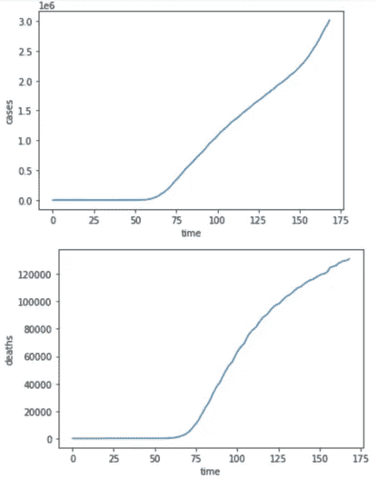
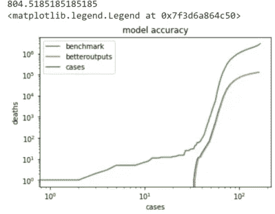
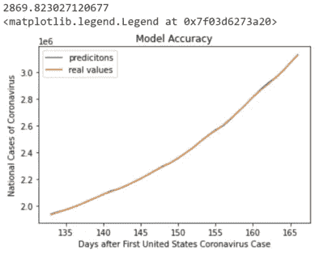
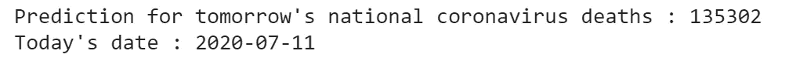

# 使用机器学习预测新冠肺炎的增长

> 原文：<https://towardsdatascience.com/using-machine-learning-to-model-the-growth-of-covid-19-2f3b0af304bb?source=collection_archive---------27----------------------->

## 用数据科学对抗冠状病毒


由 [Unsplash](https://unsplash.com?utm_source=medium&utm_medium=referral) 上的[融合医学动画](https://unsplash.com/@fusion_medical_animation?utm_source=medium&utm_medium=referral)拍摄的照片

***编者按:*** [*走向数据科学*](http://towardsdatascience.com/) *是一份以数据科学和机器学习研究为主的中型刊物。我们不是健康专家或流行病学家，本文的观点不应被解释为专业建议。想了解更多关于疫情冠状病毒的信息，可以点击* [*这里*](https://www.who.int/emergencies/diseases/novel-coronavirus-2019/situation-reports) *。*

# 背景

新冠肺炎，由新型冠状病毒病毒引起的疾病，已经用了 2020 年的时间，在六个月内，已经导致美国超过 13 万人死亡。由于过去几个月大多数州宣布封锁迫使许多数据科学家呆在室内，该社区的成员正在寻找为抗击冠状病毒做出贡献的方法。虽然有许多研究正在进行，试图通过预测蛋白质结构或通过非侵入性程序(如 CT 扫描)对冠状病毒的病例进行分类来寻找冠状病毒的疫苗，但还没有许多旨在直接模拟冠状病毒生长的公共模型。

然而，肯定有模型的应用，旨在直接模拟冠状病毒的生长。虽然这些模型可以用来帮助城市制定关于锁定和重新开放某些业务的政策，但它们也可以通过帮助医院预测他们在给定特定数据的情况下第二天所需的资源，对医院极其有益。例如，医院可以根据对冠状病毒病例的本地预测和之前所需床位或医生数量的数据，预测第二天需要的床位或医生数量。

# 问题陈述

我的目标是开发能够合理预测第二天冠状病毒生长的公共模型。这个目标可以分为两个部分:

1.  建立一个模型，根据前 n 天的冠状病毒病例数和死亡数预测第二天的冠状病毒病例数。
2.  建立一个模型，根据过去 k 天的冠状病毒病例数和死亡数预测第二天的冠状病毒死亡数。

虽然在对我的模型进行严格测试后，我知道 n 和 k 应该是相同的值，但当我第一次定义这个问题时，我假设 n 和 k 可以是不同的数字，以便不限制改进我的单个模型的可能性。

# 数据集

由于冠状病毒的增长一直是公众感兴趣的话题，而不仅仅是数据科学家或利基商业部门，因此不难找到这一话题的数据。我选择使用新冠肺炎数据库下纽约时报 Github 中的美国国家数据，因为它每天更新，而且非常容易下载。它也不包含丢失的值，所以数据预处理很简单。该数据集包含三列，分别是日期、冠状病毒病例总数和自 2020 年 1 月 21 日以来冠状病毒死亡总数。

包含我在这个项目中使用的数据集的存储库可以在[这里](https://github.com/nytimes/covid-19-data)找到，并且我从该存储库中使用的确切 csv 文件可以在[这里](https://github.com/nytimes/covid-19-data/blob/master/us.csv)找到。

# 数据预处理

一旦我们下载了我们的数据，制作一些图来理解数据是一个好习惯。通过这个简单的过程，我们可以看到我们的数据是否具有季节性，并为我们提供一些指导，说明对于这个回归问题应该考虑什么模型。让我们来看看全国冠状病毒病例和死亡人数随时间变化的曲线图。



美国冠状病毒病例和死亡时间图。

从上面的图表中我们可以看出，全国冠状病毒病例和死亡总数以不同的速度持续增加，这表明使用自回归模型是合理的。由于两个图形的形状都指示病例和死亡之间的某种关系，因为两个图形具有相似的形状，所以使用病例数和死亡数作为输入来预测下一天的病例数或死亡数是合理的。

既然我们已经决定了我们的模型将使用什么样的输入和输出，那么是时候创建那些输入和输出了。让我们来看看创建这些的代码段。

```
#df is a dataframe that contains a list of dates, cases, and deaths
#inputs are a list of COVID-19 cases
#outputs are a list of COVID-19 deaths
past = 5
s = (len(inputs) , past  * 2)
betterinputs = np.zeros(s)
betteroutputs = np.zeros(len(inputs))
for i in range(len(inputs) - past):
  temp = np.zeros(past * 2)
  temp[0 : past] = inputs[i : i+ past]
  temp[past:] = outputs[i : i + past]
  betterinputs[i] = temp
  betteroutputs[i] = inputs[i+past] #when predicting cases
  #use betteroutputs[i] = outputs[i+past] when predicting deathsbetterinputs = betterinputs[0:len(df) - past]
betteroutputs = betteroutputs[0:len(df) - past]
```

一旦我们创建了输入和输出数组，将数据分成训练集和测试集是很重要。这种划分让我们可以测试我们的模型有多好，以及它的泛化能力有多强。让我们看看下面创建这个训练和测试分割的代码。

```
split = int(0.8*len(betterinputs))
X_train, X_test, y_train, y_test = betterinputs[:split], betterinputs[split:], betteroutputs[:split], betteroutputs[split:]X_train = np.expand_dims(X_train, axis=2)
X_test = np.expand_dims(X_test, axis=2)
```

# 模型

## 基准

既然我们已经有了可以输入到机器学习模型中的输入和输出，现在是时候开发一个基准模型作为健全性检查，以确保我们不会不必要地使事情过于复杂。我使用的基准模型是输出今天的病例数或死亡数，作为明天的病例数或死亡数的预测值。这是一个适合这项任务的基准模型，因为尽管全国冠状病毒死亡和病例的总数很大，但全国冠状病毒死亡和病例的变化相对较小。让我们看看如何创建我们的国家冠状病毒死亡人数和输出的基准模型，并可视化其准确性。

```
benchmark = []
for i in range(1, len(betteroutputs)):
  benchmark.append(betteroutputs[i])
sum = 0
for i in range(len(betteroutputs) - 1):
  sum += abs(float(betteroutputs[i]) - float(benchmark[i]))
print(sum / float(len(benchmark)))from matplotlib import pyplot as plt
plt.semilogy(benchmark, label = "benchmark")
plt.semilogy(betteroutputs , label = "betteroutputs")
plt.semilogx(inputs, label = "cases")
plt.title('model accuracy')
plt.ylabel('deaths')
plt.xlabel('cases')
plt.legend()
```



此图像表示上面代码段的输出。

从上图中我们可以看到，我们的简单基准模型预测的平均死亡人数非常接近病例总数的真实值。在超过 100，000 例总死亡的范围内，804.5 例死亡的平均值表明误差小于 0.8%，这通常被认为是非常好的。全国冠状病毒病例数的同一基准模型平均约为 40，000 例，这表明误差不到 2%。虽然应该有一种方法来开发更好地模拟新冠肺炎增长的模型，但这些基准模型可以用来消除其他更多参数和复杂的体系结构。

## 里脊回归

虽然我试图使用 Tensorflow 的序列模型和默认的内核正则化和激活函数“relu”来创建几个 MLP，以模拟全国冠状病毒死亡和病例的数量，但我的模型在大多数情况下的表现都比基准差。当我减少 MLP 的层数并最终达到一个单一的密集层时，我的模型的表现仍然比基准测试差。正是在这一点上，当我意识到 L2 正则化可能是非常有益的，我把我的模型结构转换为岭回归。L2 正则化，也称为岭惩罚，强制机器学习模型中的参数较小，因为随着参数增加，损失增加，这种正则化通常用于降低模型过拟合的可能性。一旦我更改了我的模型以包含这种正则化，我的模型的表现明显优于基准模型，尤其是在案例预测方面。让我们看看我的两个模型的训练代码。

```
from sklearn.linear_model import RidgeCV
model = RidgeCV(cv=2)
model.fit(X_train, y_train)
```

既然我的模型已经适合训练数据，现在是时候预测全国冠状病毒病例和死亡人数的测试数据。我选择通过计算冠状病毒病例和死亡的平均数来衡量我的模型的误差。下面是预测全国冠状病毒病例和死亡的测试数据的代码段，根据上述指标计算误差，并绘制预测值和实际值的比较图。

```
predict = model.predict(X_test)
print("{}".format(np.linalg.norm(predict - y_test, 1)/len(y_test)))plt.title("Model Accuracy")
plt.plot( days, predict, label = "predicitons")
plt.plot( days, y_test,  label = "real values")
plt.xlabel("Days after First United States Coronavirus Case")
plt.ylabel("National Cases of Coronavirus")
plt.legend()
```



这是冠状病毒病例预测器的上述代码段的输出。

正如我们从上述代码段的输出中看到的，案例的模型预测平均只偏离真实值 2，869，这表明误差不到 0.2%，比我们的案例基准精确 10 倍，并且被普遍认为是非常好的。同一个模型输出的实际死亡人数平均误差为 489 人，误差约为 0.4%，几乎是我们死亡人数基准的两倍。

## 未来预测

既然我们已经使用该模型之前未见过的输入预测了冠状病毒死亡和病例，并且知道该模型可能基于其对测试数据的预测的误差而具有潜力，那么最终是时候为未来数据创建预测了。让我们看看创建输入数据的代码和对明天全国冠状病毒病例或死亡的预测。我还包括输出日期，以提供我预测结果的参考。

```
from datetime import date
size = (2 , past  * 2)
finalInput = np.zeros(size)
temp = np.zeros(past * 2)
temp[:past] = inputs[-past:]
temp[past:] = outputs[-past:]
finalInput[0] = temp
finalInput[1] = tempfuturePrediction = model.predict(finalInput)
futurePrediction = futurePrediction[0]
print("Prediction for tomorrow's national coronavirus deaths : " + str(int(futurePrediction)))print("Today's date : " + str(date.today()))
```



我希望我的模型能很好地预测明天！

**注意**:虽然我的模型有办法提前一天以上预测全国冠状病毒病例和死亡人数(通过更改输入标签或使用第二天死亡人数和病例数的预测作为全国冠状病毒死亡人数或病例数的第二天模型的输入)，但我的模型只打算提前一天预测，这样效果最好。

# 模型缺陷和后续步骤

虽然我的模型目前对第二天冠状病毒病例和死亡人数的预测相当好(从其测试准确性可以看出)，但我的模型存在一些缺陷。首先，我的模型具有线性系数，因此很自然，我的模型对当前的线性数据预测得非常好。然而，如果全国冠状病毒病例和死亡人数没有继续呈现线性关系，我的模型可能不会那么准确，而这正是最需要像我这样的模型的时候。然而，虽然我不确定如何使用相同的架构来极大地改进这个模型，但我相信我可以尝试一些其他方法来改进我的模型:

1.  我想测试使用 L2 核正则化的 MLP 是否比我的岭回归模型表现得更好；该模型还能够预测冠状病毒病例和死亡的非线性关系。
2.  我想在另一个疫情上使用迁移学习开发一个模型，并将其与我的岭回归进行比较；这也将解决我当前模型只有线性系数的问题。该模型在预测未来多天的死亡和病例方面也应该更加准确，并且还可以用于模拟冠状病毒病例和死亡总数的下降。

虽然我试图开发这些模型来与我的原始模型进行比较，但我希望我现有的模型可以用作当地医疗保健系统和决策者的 24 小时规划工具。虽然我使用国家数据创建了我当前的模型，但我相信它可以很容易地使用县或州的数据进行调整，以满足某个机构的特定需求。

# 最后…

谢谢你一路看完博客！我很乐意听到任何关于我的分析或项目的评论。您可以在我的 [github](https://github.com/anaiy2004/COVID-19-Forecasting) 上找到并下载我的项目的完整笔记本。

欢迎在下面留言，或者通过我的电子邮件 *anaiysomalwar* 和 *gmail* dot *com* 联系我。