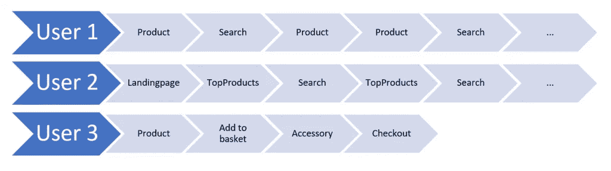
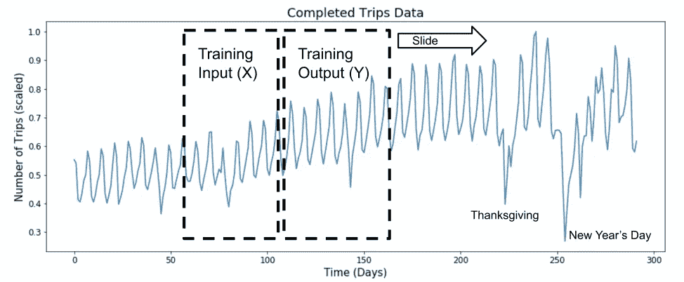
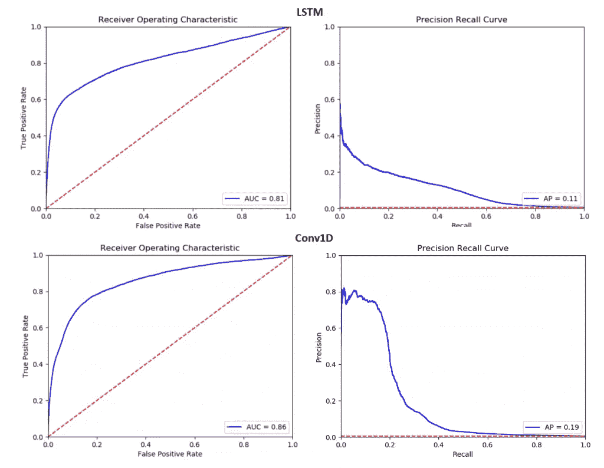

# 使用机器学习个性化用户体验

> 原文：<https://towardsdatascience.com/using-machine-learning-to-personalize-user-experience-f5b6abd65602?source=collection_archive---------21----------------------->

## 如何在 TensorFlow 2 中使用神经网络预测客户意图


图片由斯蒂芬·道森拍摄

电子商务网站，比如有很多用户的店铺和平台，都是为了满足客户的需求而设计的。通常，网站对每个客户的行为都是一样的。然而，这种“一刀切”的方法并不总能满足所有情况的需要。了解顾客的意图有助于改善旅程，例如走捷径或提供建议，并使之成为更好的整体体验。本文展示了如何使用现有的客户行为数据来创建一个能够预测意图的机器学习模型。

# 数据保密

我个人不喜欢像谷歌和脸书这样的广告技术公司大量关注在线活动。尽管如此，我认为只要数据不被共享或链接到外部服务，个人网站可以在不侵犯隐私的情况下使用个性化技术。无论这些数据是用于改善客户体验，还是所有活动都在互联网上被追踪，以从广告中获取利润，这都有所不同。此外，任何个性化都应该是选择退出。

# 客户的数据之旅

通常，用户在网站上的意图可以通过查看他们过去的交互来理解。具体来说，这意味着用户留下了一系列关于其页面浏览和交互历史的事件。事件可以是用户进行搜索查询、调出文章页面或收到电子邮件。这些数据构成了使用以下技术的基础。因此，第一步是收集或提取这些数据。通常，原始数据已经存储在 web 服务器或数据库中，然后需要对其进行提炼才能使用。

**举例**:



三种不同的用户事件流

这张图片代表了用户到达网站的三个不同的旅程。在这种情况下，这是一个简单的网上商店，对于这个例子来说，这是一个非常简单的旅程。用户 1 可能正在寻找特定的产品，而用户 2 可能正在浏览页面，而用户 3 刚刚购买了一些东西。从一个简单的意图开始，我们希望预测用户是否会购买。

# 培训用数据

第一步是为每个事件分配一个事件 id，将一些相似的事件聚集到一个事件 id 中也是有用的。这可以手动完成，或者用 sci-kit learn 中的[标签编码器](https://scikit-learn.org/stable/modules/generated/sklearn.preprocessing.LabelEncoder.html)完成。最好从 1 开始作为第一个 id，因为 0 用于填充。

我们从每个事件都是一个数字开始，我们的数据只是一系列数字。我们的分类器的输入必须有固定的大小，这意味着每个事件序列的长度必须相等。为此，我们将数据填充到预定义的长度。默认情况下，pad_sequences 用零填充缺失的事件，并在序列开始之前填充它们。如果序列比所需长度长，它会截断序列的开头。结果就是我们的 x。

```
import numpy as np
import tensorflow as tfnum_events = 8 # example
seq_len = 10 # example

events = [
     [1, 2, 1, 2, 1], # user1 
     [3, 4, 2, 4, 1], # user2
     [1, 5, 6, 7]] # user3

x = tf.keras.preprocessing.sequence.pad_sequences(events, seq_len)
```

现在我们需要找到您的 y。这高度依赖于用例，但是在这个例子中，我们将使用来自另一个系统的信息，它告诉我们客户购买了一些东西。通常这也只是一个来自上面的事件。用户 3 买了东西，所以他的目标标签是 1。

```
y = [0, 0, 1]
------------------
(x, y)
 Output:
(array([[0, 0, 0, 0, 0, 1, 2, 1, 2, 1],
        [0, 0, 0, 0, 0, 3, 4, 2, 4, 1],
        [0, 0, 0, 0, 0, 0, 1, 5, 6, 7]]), [0, 0, 1])
```

请注意，在实际应用中，唯一事件的数量可能有数千个，整个事件流的长度通常有数百个。对于每个用户和会话，点击流中的事件数量可能会有很大不同。总有一天，我们必须裁员。确切的数字取决于数据，但 90%应该是一个很好的起点。

# 时间序列数据中的窗口

在预测意图的情况下，将数据划分为时间窗口是很重要的。一个窗口(X)表示时间 t0 之前的点击数据，第二个窗口表示 t0 之后的数据，这是我们预期目标事件 Y 发生的地方。与下图相比，点击数据不是一个连续的值，但窗口方法的思想是在数据中移动窗口，这也为一个用户创建了许多序列。例如，我们可以使用 6 个小时的窗口来预测客户是否会在接下来的 2 个小时内购买商品，通过浏览完整的每日数据，我们可以获得几个序列(X 和 Y)。



用于事件流建模的滑动窗口
[【优步](http://roseyu.com/time-series-workshop/submissions/TSW2017_paper_3.pdf)用神经网络进行时间序列极端事件预测。

然而，最重要的事情是确定，你的事件不是自我实现的预言。如果包含了一个事件，这个事件[泄露了](/how-data-leakage-affects-machine-learning-models-in-practice-f448be6080d0)标签，那么你的模型就不是很有用(例如，包含购买预测的支付按钮点击)。没有排除哪些事件的通用规则，但是如果您的分类器在这样的任务上表现非常好，您可能有一个泄漏的特征。意图预测永远不会给你高精度的模型，因为事件数据通常不够干净和具体。

# 系统模型化

现在是时候将数据输入人工神经网络了。每个事件在神经网络中都有一个内部的表示，称为嵌入。这种表示在训练时由网络学习。网络学习建立一个嵌入空间，其中每个事件基于其与其他事件的相似性来定位。使用这样的表示使事件具有可比性(见[单词嵌入](https://en.wikipedia.org/wiki/Word_embedding))。此外，我们可以处理许多独特的事件，而不必处理高维向量。不同事件的数量与 NLP 中的词汇大小相对应。

在完成从事件 id 到嵌入表示的转换(嵌入层)之后，序列必须以某种方式减少到单个向量。LSTMs 是这类任务的标准方法。以下示例中的附加遮罩层从序列中移除了零。

在这个例子中，我们生成 1000 个随机示例序列，这显然会收敛到 50%的准确度，然而它显示了潜在的想法。

```
import randomnum_events = 1000
seq_len = 100y = np.random.choice(2, 1000, replace=True)
x = np.random.randint(num_events, size=(1000, seq_len))net_in = tf.keras.layers.Input(shape=(seq_len,))
emb = tf.keras.layers.Embedding(num_events, 8, input_length=seq_len, mask_zero=True, input_shape=(num_events,))(net_in)
mask = tf.keras.layers.Masking(mask_value=0)(emb)
lstm = tf.keras.layers.LSTM(64)(mask)
dense = tf.keras.layers.Dense(1, activation='sigmoid')(lstm)
model = tf.keras.Model(net_in, dense)
model.compile('adam', 'binary_crossentropy', metrics=['acc'])
model.summary()history = model.fit(x, y, epochs = 50, validation_split=0.2)
```

## 用卷积替换 LSTMs

近年来，卷积层在序列分类任务上也表现出良好的性能。这个想法就是用一个 [1D 卷积](https://blog.goodaudience.com/introduction-to-1d-convolutional-neural-networks-in-keras-for-time-sequences-3a7ff801a2cf)来遍历这个序列。对于卷积网络，我们有几个“并行”卷积连接。在 Keras 中，我们可以将这种卷积序列分类应用于该模型:

```
import randomnum_events = 1000
seq_len = 100y = np.random.choice(2, 1000, replace=True)  
x = np.random.randint(num_events, size=(1000, seq_len))net_in = tf.keras.layers.Input(shape=(seq_len,))
emb = tf.keras.layers.Embedding(num_events, 8, input_length=seq_len, mask_zero=False, input_shape=(num_events,))(net_in)
c1 = tf.keras.layers.Conv1D(256, 3)(emb)
p1 = tf.keras.layers.GlobalMaxPooling1D()(c1)
c2 = tf.keras.layers.Conv1D(128, 7)(emb)
p2 = tf.keras.layers.GlobalMaxPooling1D()(c2)
c3 = tf.keras.layers.Conv1D(64, 11)(emb)
p3 = tf.keras.layers.GlobalMaxPooling1D()(c3)
c4 = tf.keras.layers.Conv1D(64, 15)(emb)
p4 = tf.keras.layers.GlobalAveragePooling1D()(c4)
c5 = tf.keras.layers.Conv1D(64, 19)(emb)
p5 = tf.keras.layers.GlobalAveragePooling1D()(c5)
c = tf.keras.layers.concatenate([p1, p2, p3, p4, p5])
bn = tf.keras.layers.BatchNormalization()(c)
dense = tf.keras.layers.Dense(128, activation='relu')(bn)
out = tf.keras.layers.Dense(1, activation='sigmoid')(dense)model = tf.keras.Model(net_in, out)
model.compile('adam', 'binary_crossentropy', metrics=['acc'])
model.summary()history = model.fit(x, y, epochs = 50, validation_split=0.2)
```

# 真实数据的结果

我使用的数据集是大约 1300 万个事件流，通过滑动窗口方法导出，类不平衡大约是 1:100。不幸的是，我不能分享数据集，只能分享结果。

不过，根据这些数据，可以将 LSTMs 与 Conv1D 架构进行比较。事实证明，CNN 的方法在许多方面都优于 LSTMS。首先，卷积的计算速度更快，因此它的训练速度更快。LSTMs 对超参数更敏感，因此，模型通过卷积变得更稳健，此外，甚至精度也略有增加。在下面显示的分类器的特征中，在精确度/召回率上有显著的差异，在 ROC 曲线上有轻微的差异。因此，我建议使用 CNN 的方法。



实验的 AUC 和精确召回曲线

## 小费和技巧

在现实中，数据并不完美，我们经常会有重复的事件、爬虫和机器人或其他噪音。在开始对序列进行分类之前，请确保您的数据是正确的。过滤掉离群值。合并重复事件，并按有意义的不活动时间分割用户的会话。你也可以在模型中引入时间(例如，在嵌入向量的顶部放置类似“自上次事件以来的时间”的东西)。不仅可以使用最大序列长度，还可以使用最小序列长度。如果目标事件非常罕见，负序列的欠采样是一种选择。

本帖首发[此处](http://digital-thinking.de/deep-learning-clickstream-based-user-intent-prediction-with-anns/)。