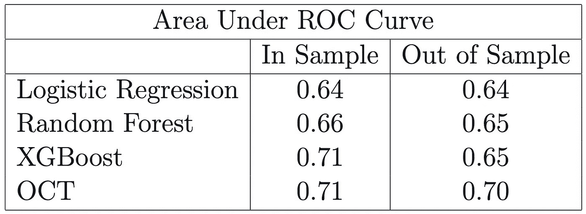
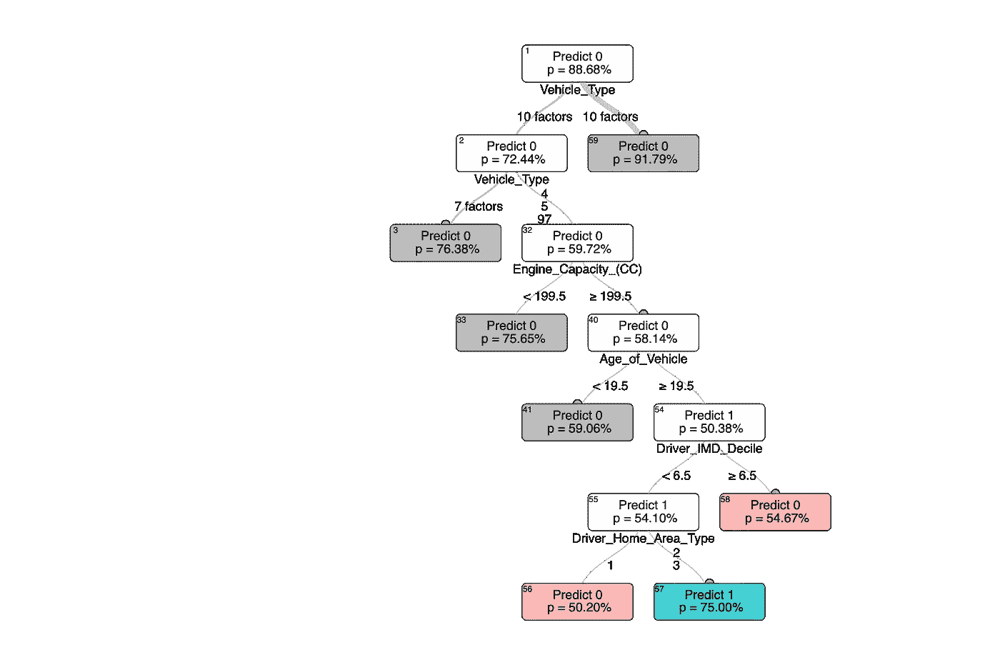
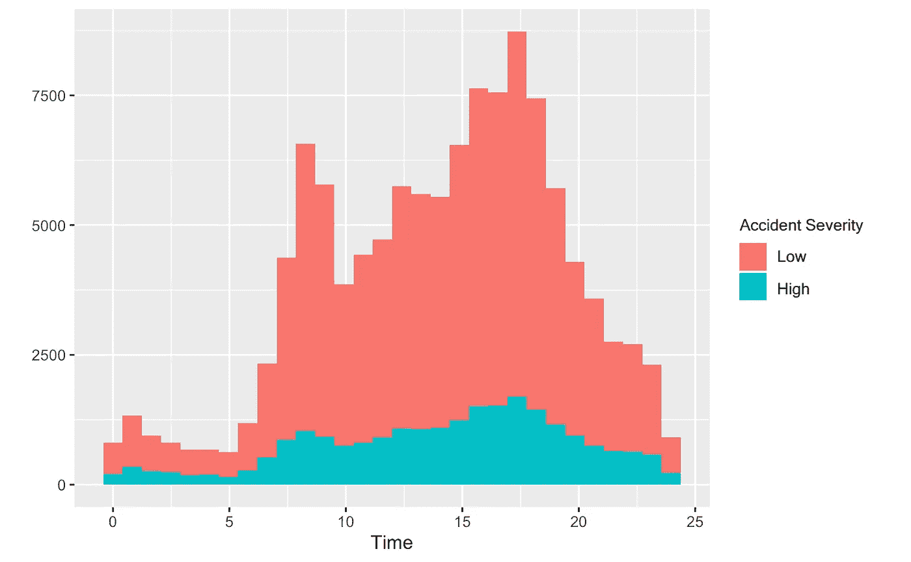
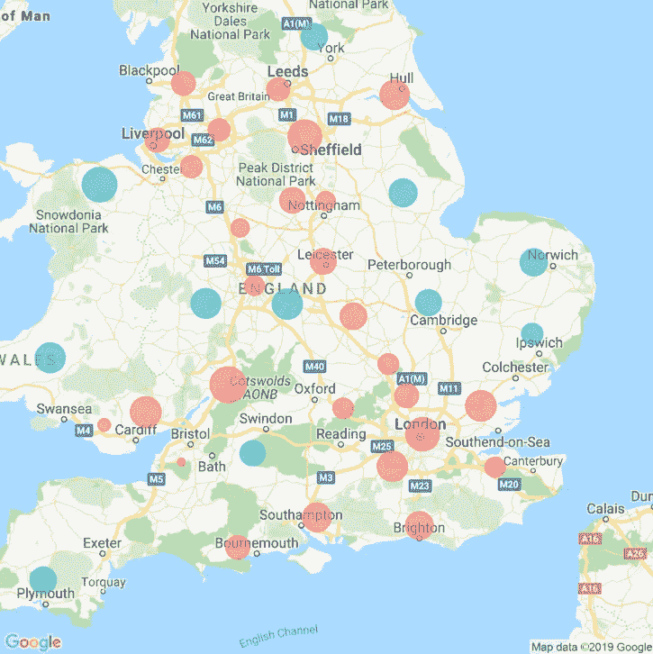

# 使用机器学习来预测车祸

> 原文：<https://towardsdatascience.com/using-machine-learning-to-predict-car-accidents-44664c79c942?source=collection_archive---------14----------------------->

来源:[朱利安·刘](https://unsplash.com/@batbatju)

## 一个用例

R 道路交通事故在每年报告的严重伤害事故中占有相当大的比例。然而，确定导致此类事件的具体条件往往具有挑战性，这使得地方执法部门更难以应对道路事故的数量和严重程度。我们都知道，车辆的某些特性和周围环境起着关键作用(发动机容量、路况等。).然而，许多问题仍然悬而未决。这些因素中哪些是主导因素？与司机的技术相比，有多少是外部因素造成的？

我们利用机器学习和英国的[道路事故数据库](https://data.gov.uk/dataset/cb7ae6f0-4be6-4935-9277-47e5ce24a11f/road-safety-data)来澄清这些问题，并具体提供对两个主要领域的影响:

1.  首先，**我们开发了一个风险评分，该评分仅基于从个人和车辆数据中收集的信息，量化了驾驶员发生致命/严重事故的可能性**。该分数可用于影响驾驶规则和规定，并告知驾驶员增加其事故风险的因素。
2.  其次，**我们分析了情境信息**(如道路类型、天气状况等。)来估计事故的严重程度。这些见解将有助于政府更好地理解事故的根源，并采取措施减少事故。

# 数据

我们使用英国交通部的 22 万+事故报告，涵盖 2018 年。对于每份报告，我们都有在事故现场收集的信息，包括:

*   **伤亡特征**(如*性别*、*年龄*、*所属地区类型*)
*   **情境变量**(如*天气*、*道路类型*和*光照条件*)
*   **事故描述符**(例如*严重性*、*警察在场*)
*   **车辆描述符**(如*年龄*、*动力*、*类型*、*型号*)

总的来说，运输部提供的数据可以分为驾驶员信息和外部信息(例如*事故位置*和*光线条件*)，驾驶员信息可以进一步细分为车辆和个人数据。

# 驾驶员得分

为了了解驾驶员风险因素，我们使用每位驾驶员的独特特征创建了一个驾驶员得分。每个司机都可以输入信息，包括他们的年龄和车辆类型，以获取描述他们发生严重事故风险的值。此外，该模型能够告知驾驶员有关其风险的主要因素。

例如，对于一些司机来说，风险的主要原因可能是拥有一辆旧车，而对于其他人来说，可能是他们生活在农村地区，那里的道路条件通常很差。有了这些信息，个别司机可以做出更明智的决策，例如，购买风险较低的车辆。

为了开发一个估算该分数的模型，我们只关注事前特征，这些特征在事故发生之前是已知的。如果观察到的事故严重性较低或没有造成人员伤亡，我们将目标变量定义为 0，如果事故造成严重或致命后果，我们将目标变量定义为 1(有关如何制定风险评分的更多信息，请查看[本文](https://blog.usejournal.com/risk-score-estimation-9c99c59364d0))。我们针对驾驶员和车辆特征训练了多个模型，以便能够比较它们的性能。

使用的模型有:

*   逻辑回归
*   随机森林
*   XGBoost
*   [最优分类树(OCT)](https://docs.interpretable.ai/stable/IAI-Python/quickstart/ot_classification/)

模型性能的比较。由于类别分布严重不平衡，我们使用 ROC 曲线下面积(AUC)来比较模型的性能。

从上表可以看出，最优分类树实现了最高的样本外性能。此外，与 Random Forest 和 XGBoost 不同，oct 提供了近乎完全的可解释性，因为它不是一种集合方法。在下图中，我们可以看到 OCT 决策树的一个分支，它提供了合理的标准，并且与人类的直觉预期相似。在这个例子中，确实，模型显示如果事故涉及发动机容量高于 200cc 的摩托车，并且车辆的车龄超过 20 年，那么事故很可能是严重的。

决策树的最高分支之一。预测 1 表示致命事故，0 表示非致命事故。

通过预测发生严重事故的概率，我们可以将该概率用作风险得分，该得分将成为驾驶员得分。通过这个分数，我们能够突出风险较高和风险较低的驱动因素。通过使用高度可解释的模型，我们可以通过检查决策树和变量重要性来理解驱动大部分得分的特征。

# 描述统计学

然而，驾驶员风险只是故事的一部分。然后，我们继续分析与事故相关的描述性统计数据。特别是，我们使用了事故发生时的天气状况、道路上的照明状况和道路状况本身等事后信息，以更好地了解英国各地发生事故的司机。通过这样做，我们不仅能够了解驾驶员如何降低风险(部分使用他们的驾驶员得分)，还能够了解外部因素如何发挥作用。

通过了解驱动事故风险的外部因素，政府可以通过首先瞄准事故的主要驱动因素来优先考虑支出。例如，如果我们发现照明条件比道路条件本身更重要，交通部可以分配其有限的预算，优先考虑照明条件，然后是道路质量。

我们使用了相同的目标变量，但这次不是在预测设置中，也使用了不同的模型。与上一节类似，我们在使用 5 重交叉验证训练模型时进行了分层采样:

## 逻辑回归

*   *套索*和*脊*正则化器，超参数网格在 1.0 和 3.0 之间，步长为 0.1。

## 手推车

*   *最小样本分割*在 3 和 11 之间变化
*   *最小样本叶数*在 5 和 13 之间
*   *每次分割的最大特征数*“无”、“sqrt”或“log2”。

## 随机森林

*   *自举*等于“真”
*   *最大特性*或者“sqrt”或者“log2”
*   *最小样本叶数*5 或 10
*   *树木数量*400、800 或 1000。

## XGBoost

*   *学习率*在 0.001，0.01 和 0.1
*   *树木数量*分别为 2500、2000 和 1500 棵
*   *最小样本叶数*在 4、8 或 12。

在训练模型之后，我们选择使用梯度增强分类器，其样本外 AUC 为 0.72，准确度为 0.87，这实现了最佳性能。分析决策树和从中得出的见解，我们可以突出一些关键方面。首先，从下图可以看出，光事故因一天中的时间不同而不同，在高峰时段发生的频率更高。不同的是，无论一天中的哪个小时，严重或致命事故的分布都比较均匀。

全天事故严重程度直方图。

此外，我们报告了英国每个警察辖区的严重事故与轻微事故的比率，蓝色的农村地区和红色的大都市地区突出显示了这一比率。相对于轻微事故的数量，圆圈越大的位置发生的严重事故越多，反之亦然。直观地说，像伦敦这样的城市比一般的圈子要大，因为在这样一个大城市，交通和拥堵水平更高，导致更严重的事故。

英国严重事故与轻微事故的比率。圆圈越大，比率越高。城市用红色标出，农村用蓝色标出。

然而，有趣的是注意到英国不同的地方，尽管是农村，却有和伦敦一样高的严重到轻微事故的比率。这可以为地方政府和更广泛的政府提供有用的见解，显示英国哪些地区风险最高，哪些地方的改善和政策需要优先考虑。例如，靠近英格兰边境的兰开夏郡和威尔士北部地区。我们的模型显示，这些地区是最容易发生严重事故的地区，最近不同的新闻媒体也证实了这些地区是最危险的地区。

# 摘要

*   我们分析了英国各地的交通事故数据，以寻找能够推动旨在拯救生命的决策的见解。
*   我们解决了这个问题，首先开发了一个驱动因素分数，给每个驱动因素分配一个风险等级。然后，每个司机能够了解他们是否处于危险中，最重要的是，什么特征是主要因素。
*   其次，我们分析了驾驶员无法控制的外部信息，比如路况。我们能够突出全英国应该优先考虑的领域，将政府资金集中在这些高度优先的领域。
*   这两项分析让我们进一步了解事故的根本原因，让司机和政府能够防患于未然。

*要阅读更多类似的文章，请关注我的*[*Twitter*](https://twitter.com/jayzuccarelli)*[*LinkedIn*](https://www.linkedin.com/in/ezuccarelli)*或我的* [*网站*](https://eugeniozuccarelli.com/) *。**