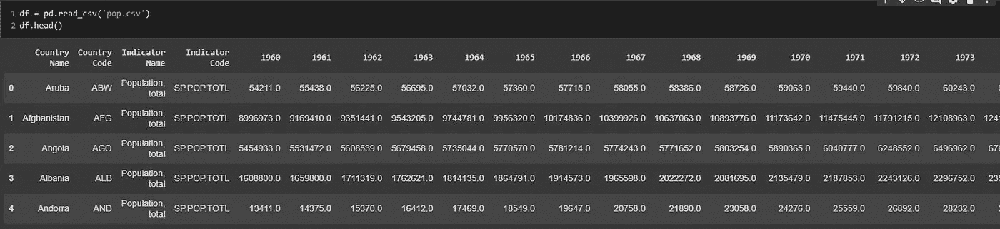
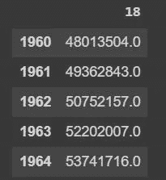
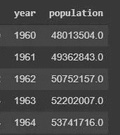
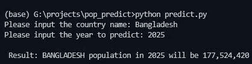
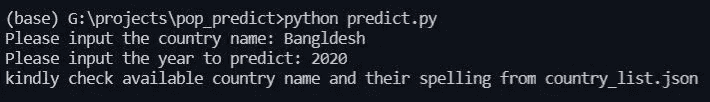

# 使用机器学习预测国家人口

> 原文：<https://towardsdatascience.com/using-machine-learning-to-predict-country-population-550f9e5f3e24?source=collection_archive---------23----------------------->

## 基于 50 多年的人口记录来预测下一年人口的简单线性回归模型。


照片由[岩田良治](https://unsplash.com/@ryoji__iwata?utm_source=unsplash&utm_medium=referral&utm_content=creditCopyText)在 [Unsplash](/s/photos/people?utm_source=unsplash&utm_medium=referral&utm_content=creditCopyText) 上拍摄

机器学习已经成为最近的热门话题之一。有很多开发和研究正在进行，以保持这一领域向前发展。在本文中，我将演示一个简单的线性回归模型，该模型将预测一个国家未来几年的人口。

我不打算在这里详细解释线性回归，因为在 Medium 中有许多文章和许多在线课程提供了对线性回归的深入讨论。我将简单地展示和解释一个使用 python 中的线性回归开发的小项目。这个项目中使用的数据集是从[世界银行](https://data.worldbank.org/indicator/SP.POP.TOTL)收集的。

此项目需要以下库。

```
import pandas as pd
import numpy as np
*from* sklearn.linear_model *import* LinearRegression
*import* re
*import* json
```

要忽略代码输出中的警告，可以使用警告模块，但这是可选的。

```
*import* warnings
warnings.filterwarnings("ignore")
```

导入必要的库之后，现在是将数据加载到熊猫数据报的时候了。下载后我把人口文件保存为 pop.csv。

```
df = pd.read_csv('pop.csv')
df.head()
```

这将产生以下结果:



df.head()

从上图可以看出，在将数据传递给线性回归模型之前，还需要进行一些预处理。有几个不必要的列，如指标代码、指标名称和本项目不需要的其他列。在此之前，我想根据国家名称列选择一个国家。

```
bd=df.loc[df['Country Name']=='Bangladesh']
bd.drop(['Country Name','Country Code','Indicator Name','Indicator Code'],axis=1,inplace=True)
bd = bd.T
bd.head()
```

我以前在这里。loc 选择孟加拉国，选择后，我删除了四列，这样我就有了所有年份的列和人口的行。我调换了数据框架，这样我就只有两列，即年份和人口。下图是上述代码的结果。



但是没有显示列名，而是显示 18。此外，年份显示为一个索引。对于自回归(AR)模型来说，如果年份被显示为指数，那就很好了。但是对于线性回归，我希望 year 作为一个不同的列，而不是一个索引。因为

```
y = mx + c
```

这是一个简单的线性回归公式，其中 *y* 是预测变量或因变量， *x* 是自变量， *m* 是斜率或系数， *c* 是截距。在这个项目中， *x* 是年份， *y* 是预测人口。因此，下面的代码将帮助我准备过程和重命名列。

```
bd.dropna(inplace=True)
bd=bd.reset_index().rename(columns={18:'population','index':'year'})
bd.head()
```

这将产生以下结果:



现在，我可以使用这个数据框架来训练线性回归模型，并获得所需的输出。

```
x = bd.iloc[:, 0].values.reshape(-1, 1)
y = bd.iloc[:, 1].values.reshape(-1, 1)
model = LinearRegression().fit(x, y)
y_pred = model.predict([[2019]])
y_pred
```

在这段代码中，我将我的年份和人口转换为 2D 数组，这是 LinearRegression 中需要使用的。然后我简单的调用了模型，在模型中拟合 x 和 y。之后我用 model.predict()预测了下面这个结果。

```
array([[1.65040186e+08]])
```

现在，所有这些都很好，但我有 100 多个国家的人口信息，我只限于一个国家使用上面的代码块。上面的代码块将作为下面代码块的主干，它将显示原始项目的实现。这个项目将接受国家和年份的用户输入，之后，我可以像以前一样做一些预处理，稍微调整一下，并使用线性回归模型来显示预测的结果。

```
def main():
    country = input("Please input the country name: ").lower()
    year = int(input("Please input the year to predict: "))
    df = pd.read_csv('pop.csv')
    lists, df = country_list_gen(df)
    if country in lists:
        df = selecting_country(df, country)
        model = prediction_model(df)
        result = prediction(model,year)
        print(f"\n Result: {country.upper()} population in {year} will be {result:,d}")
    else:
        print('kindly check country name spelling from country_list.json')

if __name__ == "__main__":
    main()
```

上面的代码是我的脚本的主要功能。首先，它接受用户输入的国家名称，并将其转换成小写字符串。之后它也会以年份为输入，转换成整数。然后使用 pandas read_csv()将原始 CSV 文件加载到 dataframe 中。然后，它执行下面的函数。

```
def country_list_gen(df):
    df.rename(columns={'Country Name':'country_name'},inplace=True)
    df['country_name'] = df['country_name'].apply(lambda row: row.lower())
    lists = df['country_name'].unique().tolist()
    with open('country_list.json','w', encoding='utf-8') as f:
        json.dump(lists, f, ensure_ascii=False,indent=4)
    return lists, df
```

这是一个将所有唯一的国家名称存储在 JSON 文件中的功能，这将帮助用户检查该国家是否可用，以及是否有任何拼写错误。该函数将原始数据帧作为输入参数，并重命名 country_name 列。之后，它将使用。应用()和 lambda 函数。然后，所有唯一的国家名称被转换成列表，并保存为 country_list.json 文件。最后，它将列表和修改后的数据帧返回给主函数。为了便于阅读，我再次给出了主要的函数代码。

```
def main():
    country = input("Please input the country name: ").lower()
    year = int(input("Please input the year to predict: "))
    df = pd.read_csv('pop.csv')
    lists, df = country_list_gen(df)
    if country in lists:
        df = selecting_country(df, country)
        model = prediction_model(df)
        result = prediction(model,year)
        print(f"\n Result: {country.upper()} population in {year} will be {result:,d}")
    else:
        print('kindly check available country name and thier spelling from country_list.json')
```

现在，返回的列表包含可用的国家名称，因此执行一个简单的 if-else 语句。如果用户输入的国家名称在列表中不可用，或者如果我的列表中有拼写错误，那么它会指示用户查看 country_list.json 文件。但是，如果名称已经匹配，那么它将执行以下功能。

```
def selecting_country(df,country):
    df = df.loc[df['country_name']==country]
    df.drop(['country_name','Country Code','Indicator Name','Indicator Code'],axis=1,inplace=True)
    df = df.T
    df.dropna(inplace=True)
    df = df.reset_index()
    return dfdef prediction_model(df):
    x = df.iloc[:, 0].values.reshape(-1,1)
    y = df.iloc[:, 1].values.reshape(-1,1)
    model = LinearRegression().fit(x,y)
    return modeldef prediction(model, year):
    return int(model.coef_[0][0] * year + model.intercept_[0])
```

selecting _ country 函数获取国家名称并过滤数据帧，然后丢弃不必要的字段，转置并重置数据帧的索引，并将其返回给主函数。然后，主函数调用 prediction_model，并将数据帧作为参数发送。在这里，我不关心重命名列名，因为我将它们转换为 x 和 y 的 2D 数组。之后，调用 LinearRegression()并用 x 和 y 拟合模型。然后，拟合的模型被发送到主函数。然后，主函数将这个模型与用户在预测函数中提示的年份一起传递。该预测函数只需从模型中获取系数和截距，并使用“y=mx+c”来导出预测的人口。

下面给出了两种不同场景的示例输出，一种是正确的国家名称，另一种是错误的拼写。



正确名称



拼写错误

这是我在一小时内完成的项目。这是一个非常简单和容易实现的项目，并且对线性回归模型有实际的理解。我来自孟加拉国，这就是我在这篇文章中使用孟加拉国作为国名的原因。你可以从 [GitHub](https://github.com/aesutsha/population-prediction) 访问并查看完整代码。你可以在这里看到我以前的文章，它是关于使用免费 API 从公共 IP 地址获取地理位置信息的。

非常感谢您阅读我的文章。我希望，当我做这个项目和写这篇文章的时候，你学到了一些新的东西。