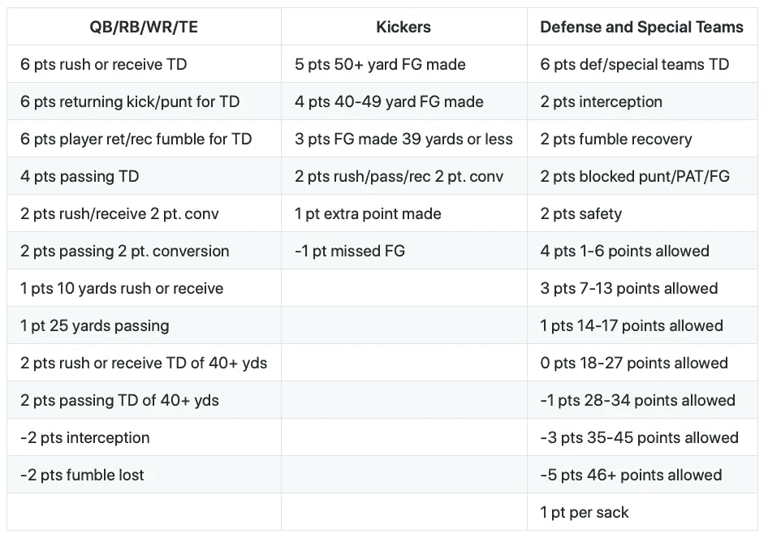
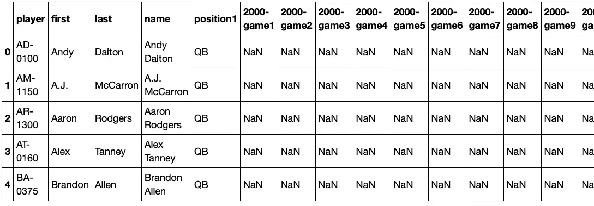
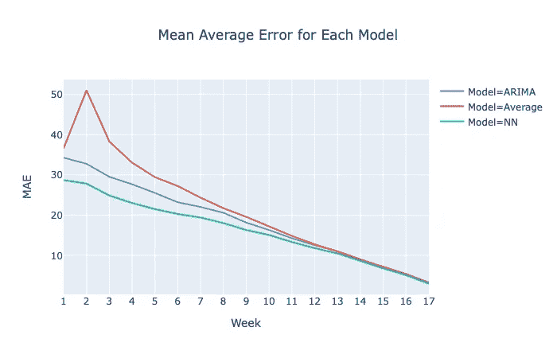
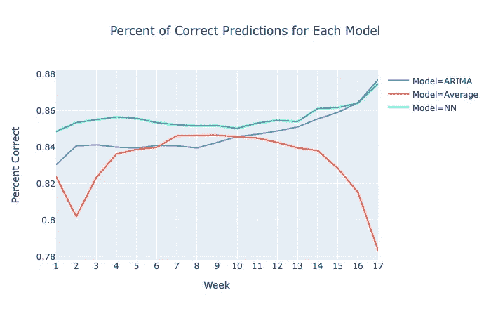

# 利用机器学习预测梦幻足球积分

> 原文：<https://towardsdatascience.com/using-machine-learning-to-predict-fantasy-football-points-72f77cb0678a?source=collection_archive---------16----------------------->


## 一个幻想足球贸易分析仪使用 RNN LSTM，ARIMA，XGBoost 和破折号

NFL 梦幻足球是一种游戏，其中足球迷扮演职业足球队的教练或总经理的角色。参与者起草他们的初始球队，选择每周比赛的球员，并交易球员，以便在一个赛季中每周与其他球队比赛。获胜队是由职业运动员的真实统计数据决定的。

## **交易分析器的目标**

交易分析器的目标是确定在 2019 年足球赛季的任何一周，一名或多名球员的拟议交易是“好”还是“坏”交易。一笔好的交易被定义为用你队中的一名球员交换一名有着更高期望的梦幻足球分数的球员。因此，目标是确定 2019 赛季每个星期每个职业足球运动员的预期梦幻足球积分。然后可以在玩家之间比较期望的分数。

[点击这里看 2019 NFL 奇幻足球交易分析](https://nfl-trade.herokuapp.com)

## **积分制**

交易分析器使用 ESPN 标准联盟规则来确定梦幻足球点数。一支球队由 7 个位置的 9 名先发球员组成。这 7 个位置是四分卫(QB)，跑卫(RB)，外接员(WR)，紧逼端(TE)，踢球者(K)和团队防守(DF)。在虚拟足球中，一支球队的防守阵容被认为是一个“球员”。



积分制

## **数据**

用于建模的数据来自 [*、ArmchairAnalysis.com*](https://www.armchairanalysis.com/)。该数据由 28 个不同的 excel 表格中的 700 多个数据点组成，提供了自 2000 年以来 NFL 中每个球员的 20 年详细统计数据。

原始数据最初在 Excel 中进行处理，以便链接和提取所有 2019 年 NFL 球员的相关数据。经过处理的数据构成了初始建模数据的基础。根据初始建模数据，为每个 2019 年球员的每个赛季的每场比赛计算实际的梦幻足球积分。模型的训练数据使用了截至 2018 赛季每个球员的所有可用数据，2019 年的数据用作测试数据。例如，如果一名球员在 2014 年开始职业生涯，那么 2014-2018 年的数据用于训练数据，2019 年的数据用于测试数据。

## **建模**

共有四个模型被用于预测 653 名 2019 年 NFL 球员的预期梦幻足球积分。这些数据本质上是时间序列数据，玩家拥有 0 到 20 年(20 个赛季 x 16 场比赛= 320 个数据点)的数据。

**平均值:**使用每个 2019 年球员的平均值建立基线测量。第一周的平均值是使用 2018 赛季球员(不包括新秀)的平均每场比赛分数建立的。第 2 周到第 17 周是使用他们前几周实际绩效的平均值计算的(例如，第 2 周使用第 1 周的实际绩效，第 3 周使用第 1 周和第 2 周实际绩效的平均值，等等)。).这将被认为是天真的方法，也是普通的梦幻足球参与者经常使用的方法。

**XGBoost:** 一个 XGBoost 模型被用来预测 2019 赛季第一周新秀球员的表现。2019 年的 106 名新秀很难预测，因为他们没有专业经验。使用 515 名非新秀球员(不包括防守)的新秀年统计数据作为训练数据，计算 2019 赛季第 1 周预期幻想点数，验证 MAE 为 28.93，R 平方为 0.49，测试 MAE 为 30.75，R 平方为 0.43。这些是微弱的结果，但需要一个起点。第 2 周到第 17 周是使用他们前几周实际绩效的平均值计算的，与基线相同(例如，第 2 周使用第 1 周的实际绩效，第 3 周使用第 1 周和第 2 周实际绩效的平均值，等等。).

**ARIMA:**ARIMA 模型最初用于预测 2019 赛季每周的老将表现。只有经验超过 3 年且在这 3 年中至少获得 50 分的资深玩家才使用 ARIMA 运行，因为模型需要大约 50 个数据点(3 个赛季 x 16 场比赛= 48 个数据点)才能表现良好。使用 ARIMA 对大约 246 名资深玩家进行建模，虽然结果非常好(参见评估选项卡)并且超过了基线，但神经网络模型显示出更好的结果。

**递归神经网络，长短期记忆(RNN-LSTM):**RNN-LSTM 模型用于预测 2019 赛季每周的老将表现。只有拥有 3 年以上经验和 3 年内至少 50 分的资深球员才使用 RNN-LSTM 进行比赛，因为该模型需要尽可能多的数据，3 年似乎是一个很好的平衡。大约 246 名经验丰富的球员使用 RNN-LSTM 模型，并将结果与 ARIMA 模型进行比较。RNN-LSTM 模型优于基线平均值和 ARIMA 模型，是最终应用程序中使用的模型。

**备注:**

**最终结果:**最终结果综合了新秀成绩(XGBoost+平均— 106 人)、3+年的老将(RNN-LSTM —包括防守在内 278 人)和剩下的有< 3 年经验的老将(平均— 269 人)。这在“评估”选项卡中被称为“神经网络”模型，而“ARIMA”是对 3 年以上的退伍军人仅使用 ARIMA 的相同结果组合。

**每周预测:**每个模型都计算本季度剩余几周的预测。然后将剩余的每一周相加，得出玩家期望的梦幻足球点数。例如，在第 1 周
中，预期的梦幻足球分数是所有 16 场比赛预测(整个赛季)的总和，在第 2 周中，分数是剩余 15 场比赛的总和，等等。

**再见周:**一个足球赛季实际上有 17 周，每个球队在赛季中都有一个随机的再见周。在“再见周”,每个玩家前一周的预测都会被简单地继续下去。

**伤病:**伤病在梦幻足球中起着巨大的作用。当一名球员受伤时，他的分数基本上降到零。没有可靠的方法来预测运动员是否或何时会受伤。虽然原始数据确实提供了一些关于伤病的细节，但它仍然没有提供球员何时从伤病中恢复的良好信息。在所有的模型中，当一名球员处于受伤的预备队状态时，他被认为是缺席了整个赛季。

**代码**

该项目的所有代码、数据和相关文件都可以在我的 GitHub repo 中访问。自述文件提供了 repo 目录和文件的详细信息。

## **RNN-LSTM 模型**

虽然预测梦幻足球积分的完整代码相当复杂，但让我们以一名球员为例，仔细看看核心的 RNN-LSTM 代码。我们要用艾伦·罗杰斯，绿湾包装工队的四分卫。Aaron 是一个优秀的测试案例，因为他在 2005 年开始了他的 NFL 职业生涯，提供了 15 年的数据。此外，他在 2019 赛季没有受到任何重大伤害。

每个 2019 NFL 球员的实际积分存储在 **original_df** 数据帧中。数据帧的前五列包含每个玩家的描述性特征。接下来的 320 列包含每个球员从 2000 年到 2019 年每场比赛的实际梦幻足球积分(每个赛季 16 场 x 20 个赛季= 320 个数据点)。这些值是 NaN 直到球员的第一个 NFL 赛季。所以 Aaron Rodgers 的实际数据直到第 85 栏才开始(16x 5 = 2005 赛季前的 80 场比赛加上 5 个描述栏)。



原始 _ 测向数据帧

对 RNN-LSTM 预测函数 **lstm_pred** 的初始调用发生在名为 **main** 的函数中。该功能的输入包括:

**player**=‘Aaron Rodgers’(这是玩家的名字)
**n_periods** = 16(在本例中，我们从赛季初开始，预测 2019 赛季的所有 16 场比赛)
**col** = 85 (Aaron 的 2005 年数据从数据帧的第 85 列开始)

```
pred_points = lstm_pred(player, n_periods, col)
```

利用这三个输入，让我们仔细看看 lstm_pred。

```
def lstm_pred(p, np, c):
    series = make_series(p, c)
    X = series.values
    supervised = timeseries_to_supervised(X, 1)
    supervised_values = supervised.values

    # Split data into train and test-sets
    train, test = supervised_values[0:-np], supervised_values[-np:]

    # Transform the scale of the data
    scaler, train_scaled, test_scaled = scale(train, test)

    # Fit the model
    lstm_model = fit_lstm(train_scaled, 1, 100, 1)

    # Forecast the entire training dataset to build up state
    train_reshaped = train_scaled[:, 0].reshape(len(train_scaled), 1, 1)
    lstm_model.predict(train_reshaped, batch_size=1)

    # Walk-forward validation on the test data
    yhat_sum = 0
    for i in range(len(test_scaled)):
        # Make one-step forecast
        X, y = test_scaled[i, 0:-1], test_scaled[i, -1]
        yhat = forecast_lstm(lstm_model, 1, X)
        # Invert scaling
        yhat = invert_scale(scaler, X, yhat)
        # Sum the weekly forecasts
        yhat_sum = yhat_sum + yhat

    return yhat_sum
```

让我们浏览一下这段代码，以便更好地理解它是如何工作的。前四行只是为模型准备数据。

```
series = make_series(p, c)
X = series.values
supervised = timeseries_to_supervised(X, 1)
supervised_values = supervised.values
```

函数 **make_series** 只是将 Aaron 从 2005 年到 2019 年存储在 dataframe 中的实际点数转换成一个 python 序列。然后，系列值存储在 **X** 中。现在, **X** 值代表了 Aaron 的梦幻足球点数的时间序列。函数 **timeseries_to_supervised(X，1)** 获取时间序列 **X** 并创建一个包含 **X** 我们的监督学习输入模式和 **y** 我们的监督学习输出模式的数据帧。 **y** 值只是将 **X** 系列向后移动一个周期。然后将 **X** 和 **y** 值存储在 numpy 数组 **supervised_values** 中。我们对这四行代码(及其功能)所做的是从原始 _df 数据帧中提取 Aaron 的 fantasy football point production，并将其转换为监督学习的形式。代表 2019 赛季的 s**supervised _ values**的尾端在下面。第一列代表 **X** 值，第二列代表 **y** 值。

```
....
 [ 1.04 12.92]
 [12.92 14.36]
 [14.36 14.3 ]
 [14.3  25.48]
 [25.48  9.42]
 [ 9.42 18.32]
 [18.32 44.76]
 [44.76 28.1 ]
 [28.1  12.94]
 [12.94 10.02]
 [10.02  9.46]
 [ 9.46 28.12]
 [28.12 11.4 ]
 [11.4  14.42]
 [14.42  9.34]
 [ 9.34 19.02]]
```

下一行代码将 **supervised_values** 拆分为 **train** 和 **test** 将最近 16 场比赛(2019 赛季)拆分为测试集，并将 2005-2018 赛季作为训练集。

```
train, test = supervised_values[0:-np], supervised_values[-np:]
```

一旦代码被拆分，使用 **scale** 函数对数据进行标准化。scale 函数使用范围为(-1，1)的 MinMaxScaler。建议对数据进行规范化，因为这将使神经网络的学习更容易，并应确保值的大小或多或少相似。

```
scaler, train_scaled, test_scaled = scale(train, test)
```

我们现在准备通过函数 **fit_lstm** 拟合 RNN-LSTM 模型，参数如下:
**train:**train _ scaled
**batch _ size:**1
**nb _ epochs:**100
**神经元:** 1

```
lstm_model = fit_lstm(train_scaled, 1, 100, 1)
```

fit_lstm 函数是 RNN-LSTM 魔术发生的地方。简而言之，该函数使用一个连续的 Keras API，包括一个 LSTM 层和一个密集层。使用的损失函数是具有“adam”优化算法的“均方误差”。该函数的实际机制相当复杂，对于那些希望获得进一步信息的人，请参见杰森·布朗利 的文章 [*中的 LSTM 模型开发部分中关于该函数的详细描述。*](https://machinelearningmastery.com/time-series-forecasting-long-short-term-memory-network-python/)

为了获得更好的结果，文章建议使用更大数量的历元(1000–4000)和神经元(1–5)，但是由于运行数百个玩家的预测需要时间和资源，100 个历元和 1 个神经元以资源较少的方式提供了非常好的结果。

我们现在准备使用模型的 **lstm_model.predict** 函数进行预测。

```
train_reshaped = train_scaled[:, 0].reshape(len(train_scaled), 1, 1)
lstm_model.predict(train_reshaped, batch_size=1)
```

该函数需要一个 3D numpy 数组作为输入，在我们的例子中，这将是一个一个值的数组(前一个时间步长的观测值),并输出一个一个值的 2D numpy 数组。在预测测试数据之前，我们需要通过预测训练数据中的所有值来播种初始状态。上面代码的第一行将数据重新整形为单值 3D numpy 数组，第二行使用训练数据设置网络的初始状态。

我们所剩下的就是逐步通过测试数据，对 16 场比赛进行单独的预测，并反转比例以得出最终的单独预测。然后将个人预测相加，以创建亚伦 2019 赛季的预测幻想足球积分。

```
yhat_sum = 0
for i in range(len(test_scaled)):
    # Make one-step forecast
    X, y = test_scaled[i, 0:-1], test_scaled[i, -1]
    yhat = forecast_lstm(lstm_model, 1, X)
    # Invert scaling
    yhat = invert_scale(scaler, X, yhat)
    # Sum the weekly forecasts
    yhat_sum = yhat_sum + yhat
```

亚伦罗杰斯赛季的预测结果如下。本赛季的总预测是 293 分(四舍五入)，他的实际得分是 282 分——本赛季 4%的误差还不错！(每次运行代码时，结果会略有不同)

```
yhat =  13.550041856765747
yhat =  15.615552995204924
yhat =  17.195858060121534
yhat =  18.015674024820328
yhat =  20.544238206744193
yhat =  18.375679302811623
yhat =  19.83470756918192
yhat =  18.937192922234534
yhat =  21.3260236287117
yhat =  20.56778145074844
yhat =  18.166402292251586
yhat =  16.316439254283903
yhat =  19.98121999800205
yhat =  18.90507374048233
yhat =  18.95989200234413
yhat =  16.812043523192404

yhat_sum =  293.10382082790136
```

## 对模型预测的评估

递归神经网络— LSTM 模型(NN)优于基线平均值和 ARIMA 模型。虽然 NN 和 ARIMA 模型都具有较低的 MAEs，但它们都在赛季中途开始收敛，因为所有模型都包含当前赛季的实际点，并且未来预测的数量减少，从而增加了所有模型的准确性。

模型的真实准确性显示在*正确预测百分比*图中。每个星期，每个玩家的“好”或“坏”交易的预测结果都要与其他玩家的交易结果进行比较，并与实际结果进行比较。神经网络显然比其他模型做出了更好的预测，2019 赛季的总体平均正确率为 85.59%，而 ARIMA 模型为 84.72%，基线平均模型为 83.17%。



## **Dash App**

由于本文侧重于该项目的机器学习方面，Dash 应用程序的细节将不被涵盖。有关创建 Dash 应用程序的详细信息，请参见我的文章 [*如何创建交互式 Dash Web 应用程序*](/how-to-create-an-interactive-dash-web-application-11ea210aa6d9) 。

我欢迎建设性的批评和反馈，请随时给我发私信。

在推特上关注我

这篇文章最初出现在我的 GitHub Pages 网站上

梦幻足球原始数据来源:*[*ArmchairAnalysis.com*](https://www.armchairanalysis.com/)
RNN-LSTM 模型开发:[*用 Python 中的长短期记忆网络进行时间序列预测作者:杰森·布朗利*](https://machinelearningmastery.com/time-series-forecasting-long-short-term-memory-network-python/)图片来源: *Pixabay**