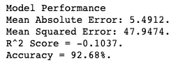
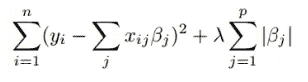
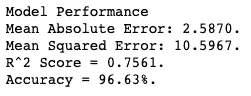
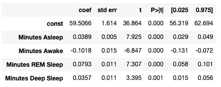
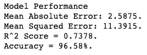
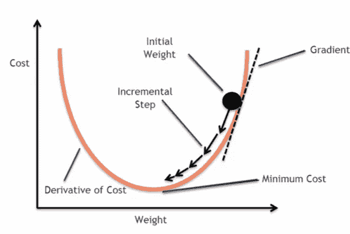
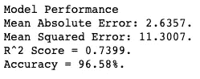

# 使用机器学习来预测 Fitbit 睡眠分数

> 原文：<https://towardsdatascience.com/using-machine-learning-to-predict-fitbit-sleep-scores-496a7d9ec48?source=collection_archive---------8----------------------->

凯特·斯通·马西森在 [Unsplash](https://unsplash.com?utm_source=medium&utm_medium=referral) 上的照片

## 随机森林、极端梯度推进以及它们在预测 Fitbit 睡眠分数时的表现

在本文的第 1 部分的[中，我解释了我们如何从 Fitbit 获取睡眠数据，将其加载到 Python 中，并对数据进行预处理，为进一步的分析做好准备。在这一部分中，我将解释我们如何以及为什么将数据分为训练集、验证集和测试集，我们如何为我们的机器学习模型选择特征，然后训练三个不同的模型:多元线性回归、随机森林回归器和极端梯度推进回归器。我将简要解释这些模型是如何工作的，并定义性能度量来比较它们的性能。让我们开始吧。](https://medium.com/@bennerjonas10/how-to-obtain-and-analyse-fitbit-sleep-scores-a739d7c8df85)

## 将数据分为训练集、验证集和测试集

在我们使用我们的数据做任何进一步的分析之前，我们需要将整个数据集分成三个不同的子集:训练集、验证集和测试集。下图很好地展示了这一过程:

培训、验证和测试数据

测试集也被称为保留集，一旦我们从剩余数据中分离出来，我们就不会再接触它，直到我们训练和调整我们的机器学习模型，达到我们认为它们会在他们从未见过的数据上表现良好的程度。

我们将剩余的数据分成训练集和验证集。这允许我们根据训练数据训练我们的模型，然后根据验证数据评估它们的性能。理论上，我们可以调整我们的模型，并根据验证数据再次评估它们，从而找到提高模型性能的方法。这一过程通常会导致过度拟合，这意味着我们过于关注训练我们的模型，使其在验证集上表现良好，但在从未见过的数据集(如测试集)上表现不佳。

在本文的第 3 部分，我解释了我们如何减少过度拟合，同时确保模型仍然表现良好。现在，我们将遵循上述方法，将数据集简单地分为训练集、验证集和测试集。

我希望以这样的方式分割数据，即训练集占总数据集的 60%，验证集和测试集各占 20%。此代码实现了正确的百分比拆分:

在第一次测试拆分中，test_size 参数设置为 0.2，这将数据拆分为 80%的训练数据和 20%的测试数据。为了将 80%的训练数据分成训练和验证数据，并确保验证数据是原始数据集大小的 20%，test_size 参数需要为 0.25 (20%是 80%的四分之一，即 0.25)。

在继续之前，我想强调一件重要的事情。在执行任何进一步的转换(例如缩放数据)之前拆分数据是至关重要的，因为我们希望防止任何关于测试集的信息溢出到我们的训练和验证集中。数据缩放通常使用关于数据集整体的统计数据来完成，例如均值和标准差。因为我们希望能够衡量我们的机器学习模型在他们从未见过的数据上的表现，所以我们必须确保来自测试数据的信息不会影响缩放或任何其他转换的完成方式。

# 扩展功能、定义性能指标和基线

虽然对于本项目中的机器学习模型，不需要进行特征缩放，但在比较不同模型及其性能时，缩放特征被认为是最佳实践。

在这段代码中，我使用了 MinMaxScaler，它适合于训练数据，然后用于缩放训练、验证和测试数据:

## 绩效指标

接下来，让我们定义一些可以用来评估和比较我们的模型的性能度量。因为睡眠分数是一个连续的变量(虽然只有整数睡眠分数是可能的)，手头的问题是一个回归问题。对于回归问题，有许多不同的性能指标，在此分析中，我将使用平均绝对误差、均方误差和 R 平方。此外，我计算模型预测的准确性。

准确性通常用作分类问题中的性能度量，而不是回归问题中的性能度量，因为它指的是模型做出的正确预测的比例。在这个分析中，我使用回归模型的准确性的方式是不同的。回归模型的准确性是预测的睡眠得分与实际睡眠得分平均相差多远(以百分比计)的量度。例如，如果实际睡眠得分为 80，模型的准确度为 96%，这意味着平均误差为 4%，则模型预计会对睡眠得分做出 76.8(80-(80 x 0.04))到 83.2 (80 + (80 x 0.04))的预测。

下面是评估模型性能的函数，它将手头的模型、测试特征和测试标签作为输入:

但是我们如何知道这些不同的度量标准的分数是好是坏呢？比如 90%的准确率是好是坏？R 平方呢？为了有一个参考点，我们将首先提出一个基线模型，我们可以比较所有后来的模型及其性能。

## 基线性能

为了评估我们将要建立的机器学习模型，我们希望有一个基线，以便我们可以比较它们的性能。通常，基线是一种基于简单规则生成预测的简单方法。对于我们的分析，基线模型总是预测训练集的中值睡眠分数。如果我们的机器学习模型不能超越这个简单的基线，它将是相当无用的。

让我们看看基线的性能是什么样的:

虽然准确性看起来不错，但看看其他绩效指标就会发现一个非常不同的故事。R 平方为负，这强烈表明模型性能极差。

现在，我们已经将数据分成不同的子集，扩展了功能，定义了性能指标，并提出了一个基线模型，我们几乎准备好开始训练和评估我们的机器学习模型。在我们继续我们的模型之前，让我们首先选择我们想要在那些模型中使用的特性。

# 使用套索回归的特征选择

阅读完标题后，您可能会有两个问题:为什么我们需要选择要素以及 Lasso 回归到底是什么？

## 特征选择

仅选择可用功能的子集有多种原因。

首先，特征选择使机器学习算法能够更快地训练，因为它使用更少的数据。其次，它降低了模型的复杂性，使解释模型变得更容易。在我们的案例中，这很重要，因为除了准确预测睡眠得分，我们还希望能够了解不同的特征如何影响睡眠得分。第三，特征选择可以减少过拟合，从而提高模型的预测性能。

在本文的第 1 部分中，我们看到睡眠数据集中的许多特性是高度相关的，这意味着我们使用的特性越多，模型中出现的多重共线性就越多。一般来说，如果我们只关心模型的预测性能，这不是问题，但如果我们希望能够解释模型，这就是问题。特征选择也将有助于减少一些多重共线性。

有关功能选择的更多信息，请参见这篇文章。

## 套索回归

在我们继续讨论套索回归之前，让我们简要回顾一下线性回归的作用。拟合线性回归通过为每个特征变量选择系数来最小化损失函数。这样做的一个问题是，大系数会导致过度拟合，这意味着该模型在训练数据上表现良好，但在从未见过的数据上表现不佳。这就是正规化发挥作用的地方。

Lasso 回归是一种正则化回归，它通过损失函数中的附加项来惩罚回归系数的绝对大小。套索回归的损失函数可以写成这样:

Lasso 回归的损失函数

损失函数的第一部分相当于线性回归的损失函数，它使残差平方和最小。附加部分是惩罚项，它惩罚系数的绝对值。从数学上讲，这相当于最小化残差平方和，同时约束绝对系数值之和必须小于预先指定的参数。此参数决定正则化的量，并导致某些系数收缩到接近或完全为零。

在上面的等式中，λ是决定罚分强度的调整参数，即收缩量。设置λ=0 将导致线性回归的损失函数，并且随着λ增加，越来越多的系数被设置为零，因此剩余的系数被 Lasso 回归“选择”为重要的。

对训练数据拟合套索回归，并绘制结果系数，如下所示:

Lasso 回归算法将床上时间和浅睡分钟的系数降低到接近于零，认为它们没有其他四个特征重要。这很方便，因为如果我们在模型中包含所有要素，我们将面临主要的多重共线性问题。让我们从数据集中去掉这两个特征:

现在我们已经选择了一组四个特征，我们可以继续建立一些机器学习模型，这些模型将使用这四个特征来预测睡眠分数。

# 多元线性回归

总之，多元线性回归(MLR)用于估计一个因变量和两个或更多自变量之间的关系。在我们的例子中，它将被用来估计睡眠分数与睡眠分钟数、清醒分钟数、快速眼动睡眠分钟数和深度睡眠分钟数之间的关系。注意，MLR 假设这些变量之间的关系是线性的。

让我们训练一个 MLR 模型并评估它的性能:

所有的性能测量都比基线模型好得多(感谢上帝)。尤其是精度似乎非常高，但这可能会产生误导，这就是为什么考虑多种测量方法非常重要。回归性能最重要的度量之一是 R 平方。一般来说，R 平方度量的是由自变量解释的因变量方差的比例。因此，在我们的情况下，这是一个衡量睡眠分数差异有多少是由我们的特征解释的。大约 0.76 的值已经很不错了，但是让我们看看是否可以通过使用不同的模型做得更好。

## 回归统计

在我们继续学习其他机器学习模型之前，我想看一下我们训练数据的多元线性回归的回归输出:

关于回归输出，需要注意以下几点:

1.  所有 p 值都具有统计学意义。
2.  睡眠分钟数、快速眼动睡眠分钟数和深度睡眠分钟数具有正系数，这意味着这些变量的增加会增加睡眠分数。
3.  醒着的分钟数有一个负系数，表明醒着的时间越长，睡眠得分越低。
4.  根据系数的大小，快速眼动睡眠似乎比深度睡眠对睡眠分数有更大的积极影响。

回归输出为理解不同的睡眠统计如何影响睡眠得分提供了一个良好的起点。睡眠时间越长，睡眠得分越高。这是有道理的，因为更多的睡眠(直到某一点)通常是有益的。同样，更多的快速眼动和深度睡眠时间也会增加睡眠得分。这也是有意义的，因为这两个睡眠阶段都提供了重要的恢复益处。对于睡眠分数的计算，Fitbit 似乎认为 REM 睡眠比深度睡眠更重要(系数的数量级更高)，这对我来说是回归分析最有趣的结果之一。最后，醒着的时间越长，睡眠得分越低。再说一遍，这完全有道理，因为在一个人的睡眠窗口期花更多的时间醒着表明坐立不安，并剥夺了睡眠时间提供的恢复能力。

对于那些有兴趣了解不同睡眠阶段和睡眠重要性的人，我强烈推荐马修·沃克的[《我们为什么睡觉》](https://www.amazon.com.au/Why-We-Sleep-Unlocking-Dreams/dp/1501144316#:~:text=%22In%20Why%20We%20Sleep%2C%20Dr,with%20our%20sleep%2Ddeprived%20society.)。这是一本写得非常精彩的书，有着引人入胜的实验和见解！

尽管如此，需要注意的是，由于要素之间的相关性，上述输出的可解释性有些有限。在多元线性回归中，系数告诉你当自变量增加一个单位时，在所有其他自变量保持不变的情况下，因变量预计会增加多少。在我们的例子中，因为独立变量是相关的，我们不能期望一个变量改变而其他变量不变，因此不能以这种方式可靠地解释系数。在解释你的模型时，总是要注意多重共线性！

让我们看看其他机器学习模型的表现是否优于多元线性回归。

# 随机森林回归量

随机森林是最受欢迎的机器学习模型之一，因为它们能够在分类和回归问题上表现良好。简而言之，随机森林是一种通过引导聚合利用多个决策树的集成技术，也称为“装袋”。那到底是什么意思？

为了更好地理解这一点，我们首先需要理解决策树回归是如何工作的。

## 决策树回归

顾名思义，决策树以树状结构的形式构建预测模型，可能如下所示:

预测游戏时间的决策树

在上面的例子中，决策树基于各种特征迭代地分割数据集，以便预测玩游戏将花费多少小时。但是树如何知道首先分割哪些特征，以及在树的更下面分割哪些特征呢？毕竟，如果我们改变用于进行分割的特征的顺序，预测可能会不同。

在回归问题中，决定在特定结点上分割数据集的最常用方法是均方误差(MSE)。决策树尝试使用不同的特征来分割数据集，并计算得到的 MSE。导致最低 MSE 的特征被选择用于手边的分割。这个过程一直持续到树到达一片叶子(一个端点)或预定的最大深度。最大深度可用于减少过度拟合，因为如果允许决策树继续直到它找到一片叶子，它可能会严重过度拟合训练数据。以这种方式使用最大深度被称为树的“修剪”。

决策树有两个主要限制:

1.  贪婪——决策树并不总是全局最优的，因为我们假设创建决策树的最佳方式是找到将导致 MSE 最大程度降低的特征，而不考虑次优分割是否会导致更好的分割(“贪婪”策略)。
2.  过度拟合-树的结构通常过于依赖于训练数据，经常修剪树不足以克服这个问题。

随机森林解决了这两个限制。

## 随机森林

正如随机森林中的“森林”所暗示的那样，它们由许多决策树组成，并且它们的预测是通过对森林中每个决策树的预测进行平均而得到的。把这想象成一种民主。在一个重要问题上只有一个人投票可能不能代表整个社区的真实感受，但从社区中随机选择的许多成员那里收集投票可能会提供准确的代表。

但《随机森林》中的“随机”到底代表了什么？

在随机森林中，每个决策树都是使用训练集中随机选择的数据点子集创建的。这样，每棵树都是不同的，但是所有的树仍然是从相同的训练数据的一部分创建的。子集通过替换随机选择，这意味着数据点被“放回袋子”中，并且可以再次被挑选用于另一个决策树。

除了为每棵树选择不同的随机子集，随机森林中的决策树在每次分裂时只考虑随机选择的特征的子集。为即将进行的分割选择最佳特征，并且在下一个节点，评估一组新的随机特征，等等。

通过使用这些“打包”技术构建决策树，随机森林很好地解决了单个决策树的局限性，并设法将孤立的弱预测器转变为组中的强预测器，类似于投票示例。

## Python 中的随机森林回归

使用 Python 中的 scikit-learn 库，大多数机器学习模型都是以同样的方式构建的。首先，您初始化模型，然后在训练集上训练它，然后在验证集上评估它。代码如下:

与多元线性回归类似，随机森林的表现远远好于基线模型。也就是说，它的 R 平方和精度低于 MLR。那么，围绕随机森林的所有宣传是关于什么的呢？

这个问题的答案可以在这里找到(提示:超参数优化):

 [## 交叉验证和超参数调整:如何优化你的机器学习模型

### 非常准确地预测 Fitbit 的睡眠分数

medium.com](https://medium.com/@bennerjonas10/cross-validation-and-hyperparameter-tuning-how-to-optimise-your-machine-learning-model-13f005af9d7d) 

# 极端梯度推进回归器

与随机森林类似，梯度增强是一个集成学习器，这意味着它基于一组单独的模型(通常是决策树)来创建最终模型。与随机森林相比，梯度增强的不同之处在于集合方法的类型。随机森林使用“Bagging”(前面描述过)，梯度增强使用“Boosting”。

## 梯度推进

梯度推进背后的一般思想是，通过对具有错误预测和高误差的实例赋予更多权重来依次构建各个模型。因此，该模式“从过去的错误中吸取教训”。

该模型通过梯度下降最小化成本函数。在每一轮训练中，弱学习者(决策树)做出预测，并与实际结果进行比较。预测和实际结果之间的距离代表模型的误差。然后，误差可用于计算梯度，即损失函数的偏导数，以计算出在哪个方向上改变模型参数以减小误差。下图显示了这是如何工作的:

梯度下降

这些调整的速率(上图中的“增量步幅”)可通过超参数“学习速率”进行设置。

## 极端梯度推进

极端梯度增强通过计算成本函数的二阶偏导数来改进梯度增强，这有助于获得成本函数的最小值，并使用类似于使用 Lasso 回归描述的高级正则化，这改进了模型的泛化。

在 Python 中，训练和评估极端梯度增强回归变量遵循与随机森林回归变量相同的拟合和评分过程:

性能指标非常接近随机森林，也就是说，它的表现还不错，但仍然不如我们过去的多元线性回归。

# 从这里去哪里？

到目前为止，我们还没有在随机森林或极端梯度推进回归中提供任何超参数。各自的库为每个模型的超参数提供了合理的默认值，但没有一个尺寸适合所有情况。通过调整一些超参数，我们有可能极大地提高这两个模型的性能。

此外，对于我们的性能评估，到目前为止，我们只依赖于模型在一个相对较小的验证集上的性能。因此，性能在很大程度上取决于该验证集在整体上对睡眠数据的代表性。

在本文的第三部分，我解决了这两个问题，并提高了随机森林和极端梯度推进回归器的性能。看这里:

 [## 交叉验证和超参数调整:如何优化你的机器学习模型

### 非常准确地预测 Fitbit 的睡眠分数

medium.co](https://medium.com/@bennerjonas10/cross-validation-and-hyperparameter-tuning-how-to-optimise-your-machine-learning-model-13f005af9d7d)