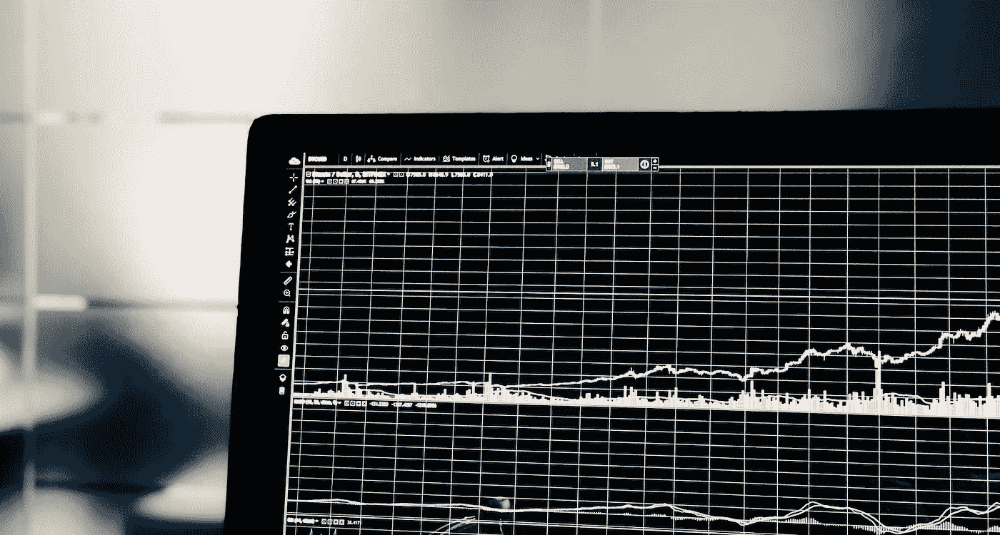
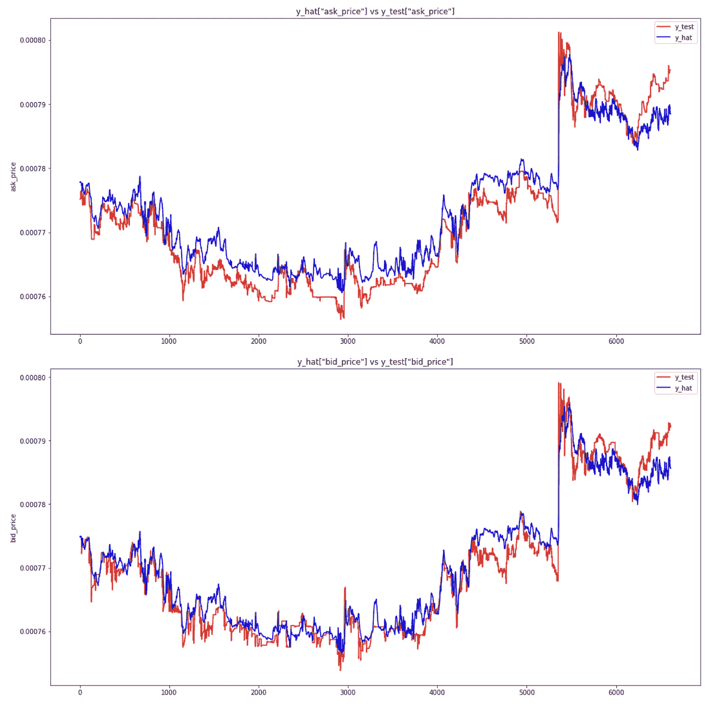
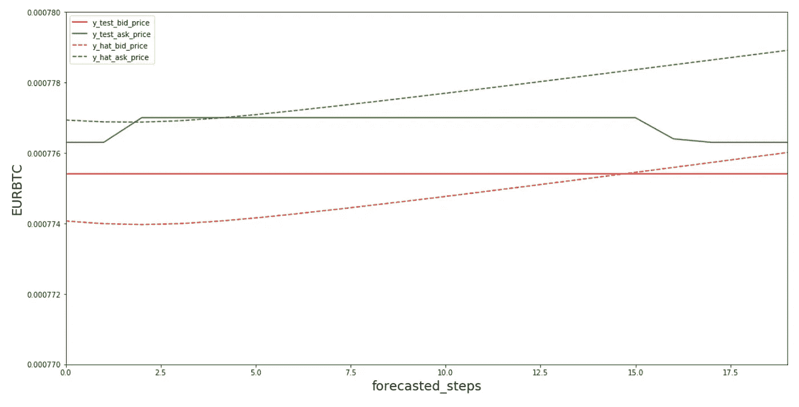
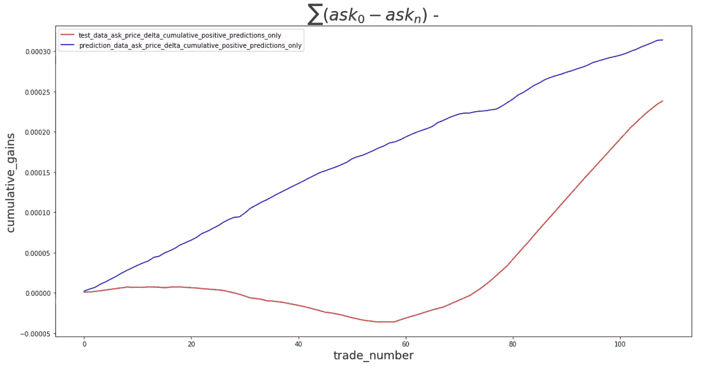
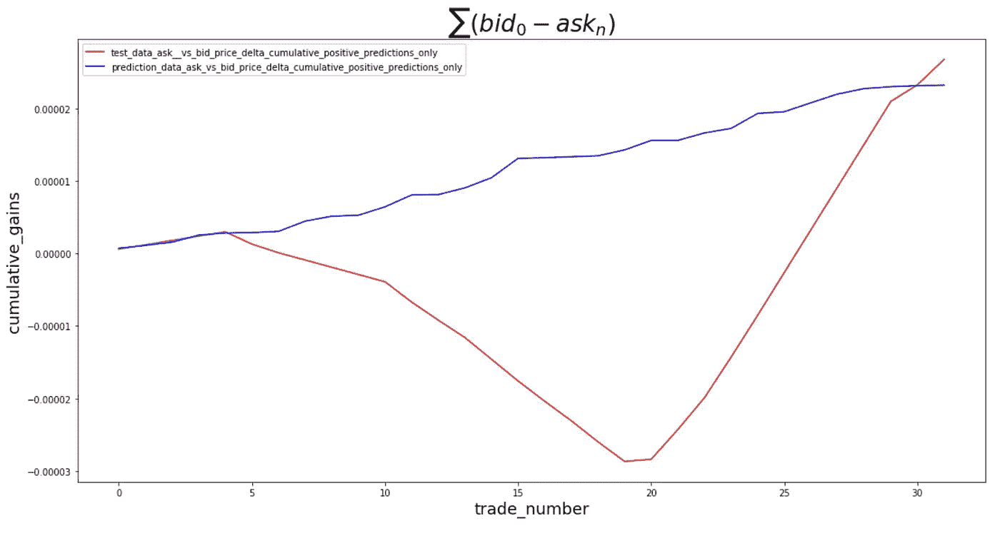
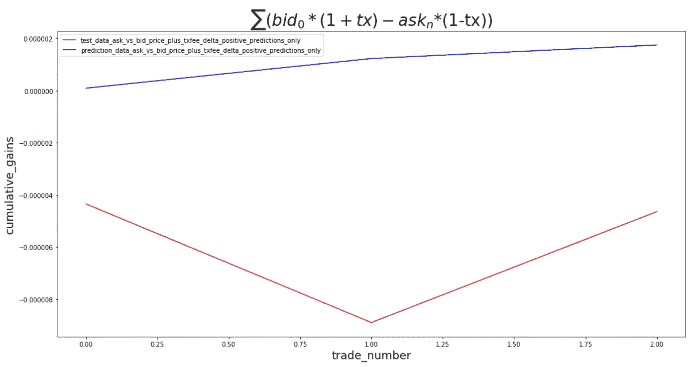

# 利用机器学习预测未来比特币价格

> 原文：<https://towardsdatascience.com/using-machine-learning-to-predict-future-bitcoin-prices-6637e7bfa58f?source=collection_archive---------5----------------------->

## 如何利用深度学习预测未来

克里斯·利维拉尼在 [Unsplash](/s/photos/data?utm_source=unsplash&utm_medium=referral&utm_content=creditCopyText) 上的照片

有没有可能预测明天的比特币价格？或者如果这个跳跃太远，那么 20 分钟后的价格呢？

我将使用[长短期记忆](https://www.bioinf.jku.at/publications/older/2604.pdf) (LSTM) RNN 机器学习模型来预测 20 分钟后的比特币价格，仅仅依靠简单的历史金融数据。

我写这篇文章，部分是作为一个指南，部分是作为一个练习，探索 LSTM 模型在比特币价格预测中的潜在用途。因此，我可能会跳过一些基本原理，因为这些很容易在其他地方找到。

免责声明:我的经验主要来自好奇心、个人和专业能力的实际应用，以及对有效市场的兴趣。这可能意味着使用的一些术语和方法可能与其他术语和方法不同。

# LSTM 模式简介

LSTM 模式到底是什么？简而言之，这是一种能够学习长期依赖性的递归神经网络。与我们使用以前的经验来告知(最好是更好的)未来结果类似，LSTM 模型使用更新门和遗忘门来随机记住和忘记历史信息片段，以告知他们的预测。

像这样使用历史“背景”的能力使得这些模型在许多其他应用中特别适合于预测目的。

为了建立更深入的理解，请看一看[这个](https://colah.github.io/posts/2015-08-Understanding-LSTMs/)伟大的资源，它深入研究了这种类型的神经网络的确切机制。

# 我们将使用什么工具

对于这个练习，我使用 [Numpy](https://numpy.org/install/) 和 [Pandas](https://pandas.pydata.org/getting_started.html) 来处理数据，使用 [Keras](https://keras.io/) / [Tensorflow](https://www.tensorflow.org/) 来实现机器学习功能。为了调试和更好地呈现代码，我使用了 Jupyter 笔记本。

# 收集所需的数据

为了训练我们的模型，我们需要训练数据。任何金融定价数据在这里都足够了，只要它可以以分钟为间隔获得，并且大小合理。我使用的是大约 23 天的财务数据，时间间隔为一分钟。

我自己使用[北海巨妖 API](https://www.kraken.com/features/api) 收集了这些数据，所以它很可能包含缺口。但这只是为了举例说明。你可以在这里找到我的数据和完整的源代码。

# 数据准备

首先，我们从导入所有必需的包开始，加载数据集并删除我们不感兴趣的行。

我们将数据集分成训练集和测试集，并标准化其特征。标准化是很好的实践，因为它减少了在某些特征的方差可能高于其他特征的情况下的过度拟合。

LSTM 模型要求我们按块组织数据。我们的数据以一分钟为间隔进行分组，我们将使用 50 分钟的数据块来预测下一个数据块。

# 模型

现在是时候训练我们的模型了。我们选择我们想要使用的模型类型；在这种情况下是连续的，我们决定超参数。

我使用的模型相对简单，包含 5 个隐藏层，每个隐藏层有 50 个神经元，每个隐藏层之间有一个漏失。我们使用均方误差损失函数，Adam 优化器，将批量大小设置为 32，并遍历该网络 10 个时期。

决定超参数更多的是艺术而不是科学，值得测试出多种选择，以了解什么最适合您的测试数据和生产。优化你的超参数超出了本文的范围，但是网上有一些很好的资源。

现在我们有了一个可以用来建立预测的模型，我们可以看看它在测试数据中的表现。下图绘制了要价和出价的测试数据(y_test)预测(y_hat)。正如我们可以看到的，预测值与训练数据非常匹配。

酷！所以这意味着我现在可以预测比特币的价格了？

不，不是真的。不幸的是。

这些模型的预测能力绝对令人印象深刻，但如果你仔细观察预测，你会发现它与测试数据非常接近。这种预测似乎密切跟踪价格的变化，但往往不能正确预测这些变化发生时的价格。这对于任何你想用它的交易策略来说都不是非常有用。

# 预测未来

如果我们想预测 20 分钟后的价格，一种选择是在最近的历史数据间隔内运行模型，将预测连接到历史数据数组的末尾，然后将该数组反馈到模型中，继续这一过程，直到我们有 20 个预测的价格预测块。

下面的代码正是这样做的，并根据测试数据绘制了买价和卖价。不出所料，它并没有真正告诉你太多，这个特定的预测错误地预测了价格上涨。

但是对于剩余的测试数据来说，情况会是这样吗？由于测试数据由 6，661 行组成，我们有 133 个窗口可以预测交易。

让我们预测剩余的 20 分钟，并对 n=4 和 n=0 时的 ask_price 的累积差值求和。

下图显示了预测的*有利可图的*交易和实际交易的累积收益，其中一个人以 n=0 的要价买入，以 n=4 的要价卖出。

有趣的是，给你带来实际净收益的交易似乎超过了会导致亏损的交易。有了 100 美元的本金，你将获得 31 美元。仅仅过了 4.5 天。那可是天文数字的回报！

好得难以置信。

任何曾经在交易所购买 BTC 或任何金融工具的人现在都会告诉我，你实际上不能在市场上以要价卖出。买卖价差会阻止我们从价格上涨中获利，只有当资产的增值高于价差时，我们才能从交易中获利。

一旦我们把这个模型应用到我们的预测中，我们的金鹅开始失去一些羽毛。我们同样的 100 美元仍将升值约 3.40 美元！仍然是令人印象深刻的 1318%的年回报率。

现在让我们加入交易成本。我们将采取自由的假设，我们可以在市场上交易，只收取 0.1%的低费用——这是为交易量非常大的交易者保留的。

很快就会发现，我们的金鹅根本不是金子。我们的模型只能识别 3 个潜在的盈利交易，同样的 100 美元现在会变成 2.26 美元的亏损。

# 结论

上面的练习表明，简单的金融数据在预测价格的短期变化方面具有一定的预测能力，但是由于没有从这些信息中获利的实际机会，所以从交易的角度来看，这种特定的模型是相对无用的。

LSTM 模型等工具正变得越来越容易获得，大型团体和机构正在通过更好的数据和卓越的处理能力来拓展这些模型的能力。这导致市场将越来越多的信息整合到资产价格中，使得套利机会变得很少。

建立一个具有战胜市场的预测能力的模型不是一件简单的事情，如果有人能够轻松地使用这些工具赚钱，我肯定不会在这里与你分享。

***注来自《走向数据科学》的编辑:*** *虽然我们允许独立作者根据我们的* [*规则和指导方针*](/questions-96667b06af5) *发表文章，但我们不认可每个作者的贡献。你不应该在没有寻求专业建议的情况下依赖一个作者的作品。详见我们的* [*读者术语*](/readers-terms-b5d780a700a4) *。*