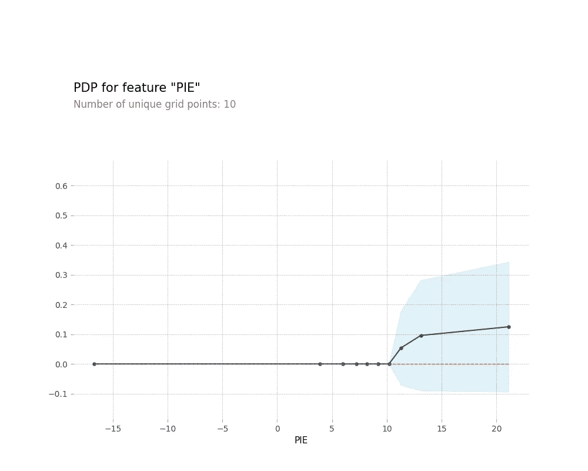

# 使用机器学习预测 NBA 全明星赛，第 2 部分:建模

> 原文：<https://towardsdatascience.com/using-machine-learning-to-predict-nba-all-stars-part-2-modelling-a66e6b534998?source=collection_archive---------43----------------------->

## 一个端到端的深度调查，以定量研究 NBA 全明星选拔。

照片由科利昂·布朗(Unsplash)拍摄

# 回顾

这是由两部分组成的系列文章的第 2 部分*,我们的目标是将数据科学方法应用于 NBA 全明星选拔流程。在[第一部分](https://medium.com/@cjporteo/using-machine-learning-to-predict-nba-all-stars-part-1-data-collection-9fb94d386530)中，我们使用`BeautifulSoup`和`Selenium`使用网络搜集技术来收集这些数据。*

在这一部分，我们将探索模型的构建、评估和解释。虽然建立一个准确而精确的模型是我们的主要任务，但是我们最终还是希望能够从系统中获得某种程度的可解释性，也就是说*看到它所看到的*。

我将在本文中介绍许多关键概念，但为了简洁起见，我不会覆盖每一行代码。完整的笔记本(有详细的评论)可以在我的 GitHub 上的[这里](https://github.com/cjporteo/ml-NBA-asg-predictor)找到。

# 预处理

## 处理异常值

我们的首要任务是解决训练数据中的统计异常值。在这种情况下，一个离群值是任何球员的选择决定不被他们在那个赛季的表现所证明，经常导致球迷和媒体的广泛反对。

如果留在训练集中，这些记录可能会混淆模型，并对我们的预测和洞察力产生负面影响。

这些玩家分为以下两类(或两类都有):

> **答:**这位球员有着漫长而辉煌的职业生涯，在暮年被选为告别球员，尽管他没有达到全明星级别(例如，德克·诺维茨基入选 2019 年 ASG，这是一个非常尊重/致敬的选择)
> 
> **B:** 该球员在赛季中缺席了太多比赛，只是因为压倒性的球迷偏爱才被选中(例如，姚明在 2010-2011 赛季，在可能的 44 场比赛中只参加了 5 场)

训练数据中符合这些标准中的任何一个的全明星(由异常低的 PIE 分数或所玩游戏的数量来表示)被从训练集中清除。由于数据集非常小，这是我们可以手动执行的事情——否则我们将求助于类似于 [Tukey 异常值检测](https://en.wikipedia.org/wiki/Outlier#Tukey's_fences)的东西。

总共， **13 个球员赛季被取消**——完整的名单(包括理由)可以在笔记本中找到[。](https://github.com/cjporteo/ml-NBA-asg-predictor)

## **调整游戏统计数据**

本质上，这不是一个时间序列预测问题，但我们仍然有一些不随时间静止的特征。如果任其发展，这有可能扭曲模型并导致更差的结果。

平均速度由球队每场比赛使用的控球次数来定义，这在不同的 NBA 时代有所不同(例如，04 年的 90 比 18 年的 100)。因此，2018 年场均 30 分的球员应该和 2004 年场均 27 分的球员保持同样的标准。

因此，我们将所有速度相关的特征(得分、篮板、助攻、抢断、盖帽、失误、3pm)除以该赛季的联盟平均速度，以纠正这一问题。这样，我们就不会拿苹果和橘子做比较了。

在这一点上，我们创建了 *Play Pct。*特征，通过将个人在赛季中参加的比赛除以团队的比赛。我们还删除了赛季中少于 7 场比赛的所有记录，因为这些会导致其他比赛数据的极端值，可能会破坏模型。

我们现在有 15 个候选特征用于建模。作为一个剧透，并不是所有这 15 个都被证明是有帮助的预测者，但为了完整起见，我会把它们都列在这里。未绑定的特性最终在最终模型中被删除。

*   **调整后的分数(调整后的点数)**
*   **调整后的篮板球**
*   **调整后的 AST(调整后的助攻)**
*   调整后的 STL(调整后的抢断)—丢弃
*   **调整后的 BLK(调整后的块)**
*   调整后的 TOV(调整后的失误)—下降
*   调整后的下午 3 点(调整后的 3 个指针)—丢弃
*   **DEFWS(防御性赢股)**
*   TS%(真实投篮命中率)—下降
*   **USG%(使用率)**
*   **PIE(玩家影响估计器)**
*   **打百分之。**
*   **团队会议排名**
*   **ASG 之前的亮相**
*   和去年一样？—已丢弃

# 探索性数据分析

在我们开始将机器学习算法应用于这个问题之前，了解我们的数据很重要。这包括比较全明星和非全明星之间的属性分布，以及查看不同变量如何相互作用。

为了孤立地查看每个特性，我们可以使用来自`seaborn`库中的`violinplot`方法。我将展示 15 个图中的 2 个，以及用于生成它们的代码。

为每个要素生成分类分隔的小提琴图。

这里最有趣的是团队等级*绝对*重要。入选全明星赛的球员更有可能来自一支好球队，而不是一支差球队。

理论上，这似乎是合理的。一个“明星”球员应该能够将他们的天赋转化为团队的成功，但这种思路可能会让我们对一个球员过于挑剔，因为有些事情超出了他们的控制，比如队友和教练。如何处理个人和团队成功的分歧是 NBA 球迷争论的话题，尤其是在试图就联盟 MVP 达成一致的时候。

稍后，我们将进一步探讨这一点。

我们可以使用成对散布矩阵来查看我们的特征如何相互作用。为此，我们使用`pairplot`。

最后，我们可以使用[主成分分析](https://en.wikipedia.org/wiki/Principal_component_analysis)来粗略地看看我们的两个类实际上有多不同。我们应用主成分分析将特征空间的维数从 15 降低到 2，同时保留尽可能多的信息和可变性。绘制这两个主要组成部分揭示了我们数据中的一些内在结构和类别分离。

我们使用来自`sklearn`的`pca`方法来实现这一点。为了减少主成分的随意性，我们将输入特征缩放到单位方差并移除平均值。

仅使用两个主成分，我们仍然能够保留来自 15 个原始特征的总可变性的一半以上。从这个二维投影来看，这两个类别似乎彼此合理地分开了。

为了澄清，我们在这里仅使用 PCA 进行数据可视化——我们不会使用这些主要成分进行建模。PCA *可以用于提高模型训练速度，因为特征较少，但由于我们的数据集相对较小，训练运行时间在这里不是问题。*

# 系统模型化

## 对标记数据集进行分区

我们将标记的数据集分成 3 组:训练、验证和测试。

模型将直接使用训练数据来调整其内部参数。验证数据将用于指导该过程，监控学习过程，并帮助避免过度拟合。然后，一旦模型被冻结，我们可以转向测试数据来评估模型并计算不同的基准。

## 关于 SMOTE 的快速注释

在处理任何分类问题时，我们必须确保我们的类是平衡的。如果我们不考虑阶级的不平衡，这个模型将会对大多数阶级产生固有的偏见——这是我们绝对不想看到的。

在我们数据集的训练分区中，我们有 **368 名全明星**和 **5409 名非全明星**。随之而来的是，给每个球员贴上非全明星标签的粗略的一揽子策略仍然可以达到 **93.6%** 的准确率。很明显，我们想劝阻模型不要这样做，所以我们应该平衡这两个类。

为此，我们有三个选择:

*   欠采样多数类(丢弃数据点)
*   对少数民族类进行过采样(创建合成数据点)
*   欠采样和过采样的组合

就性能而言，这些技术实际上没有太大区别，但过采样是实践中最常见的方法。

对于这种情况，我们将采用一种叫做 [SMOTE](https://en.wikipedia.org/wiki/Oversampling_and_undersampling_in_data_analysis#SMOTE) 的方法——合成少数过采样技术。SMOTE 通过在随机数据点和邻近数据点之间进行线性插值，在一个类内创建合成数据点。重复这一过程，直到类别达到平衡。实际上，我们将使用 SMOTE 的一个变体，称为 Borderline SMOTE，它专注于类边界附近的过采样数据点。

这将有望使模型更精确地辨别边缘情况。

至关重要的是，我们只对训练数据进行过采样，而不去碰验证和测试集。分割之前的过采样将导致信息在我们的三个分区之间泄漏，并导致模型具有夸大的准确性指标。

## 调整 XGBoost 超参数

对于这个监督学习问题，我们将调用的机器学习算法是 XGBoost，它是梯度推进决策树的一种实现。对于涉及非结构化数据的数据集，人工神经网络通常会优于其他算法。但是对于包含表格数据的较小数据集(就像这个)，像 XGBoost 这样的决策树框架通常占主导地位。XGBoost 的文档可以在[这里](https://xgboost.readthedocs.io/en/latest/tutorials/model.html)找到。

与许多其他 MLA 一样，XGBoost 需要几个不同的超参数来控制学习过程，如学习速率、最大树深度和树的数量。我们将应用一个简单的网格搜索来找到最优的学习率，并使用*提前停止轮次*来对抗过度拟合。对于这个问题，我们将耐心参数设置为 10。如果验证 AUC 分数达到 10 个周期而没有改善，我们终止该学习率的训练并记录最高 AUC。

> AUC 是二元分类问题的综合性能度量。AUC 代表曲线下面积，特别是 [ROC](https://en.wikipedia.org/wiki/Receiver_operating_characteristic) (受试者操作特征)曲线。ROC 曲线比较了不同阈值设置下的 TPR(真阳性率)和 FPR(假阳性率),说明了分类器在不同区分水平下的诊断能力。
> 
> AUC 可以采用[0，1]范围内的值。AUC 为 1 表示该模型能够很好地区分阳性和阴性类别，而 AUC 为 0.5 是我们从随机猜测的模型中预期的值，它没有区分能力。AUC 为 0 意味着模型一直在反转类别(完全区分，但方向错误)。

我们希望我们的模型实现尽可能接近 1 的 AUC。

## 模型性能和评估

该模型在对训练集中的数据点进行分类方面做得更好，因为这是直接从中学习的数据。通过验证性能，可以了解模型在处理以前从未见过的数据时表现如何。

然而，验证集仍然影响我们在模型调整过程中所做的决定(通过*早期停止回合*)。当我们计算 F1 分数等分类指标时，我们希望使用在训练期间完全隔离的数据，这就是测试集发挥作用的地方。这些指标将代表模型如何推广到“野生”数据。

在测试数据集上运行该模型，我们获得以下混淆矩阵、ROC 曲线和分类度量:

蓝色虚线表示预测能力为零(随机猜测)的模型的预期性能。红色曲线说明了我们调优的 XGB 模型在不同阈值水平下的诊断能力。由于我们的 AUC 非常接近 1，我们的模型在区分这两个类别方面非常强大。

## 指标:

*   *精度:* **0.975151**
*   *精度:* **0.784314**
*   *召回:* **0.842105**
*   *F1 得分:* **0.812183**
*   *日志。损失:* **0.103545**
*   *ROC AUC:***0.989187**

这些指标是使用二进制分类阈值 **0.835** 计算的(针对最高 F1 分数进行了优化)。

# 2019-2020 赛季全明星预测

现在我们有了一个工作模型，我们可以将它应用于当前赛季的球员数据集。这里使用的分类模式*略有不同*——我们将从每场会议中选择 12 名预测当选概率最高的球员，而不是使用我们的静态阈值 0.835。

> **小细节:**实际上，这 12 个花名册位置的细分是有限制的:6 个前场球员(F/C)，4 个后卫(G)，2 个通配符。然而，有了这两个通配符，再加上不断增加的球员位置之间的流动性，这个限制是相当不重要的。安排 12 名球员扮演这些角色几乎总是可能的。

事不宜迟，以下是预测:

## 东部联盟:

## 西部联盟:

## 我们做得怎么样？

由于 2020 年全明星赛早已过去，我们可以看看我们有多少选择是正确的。

在每次会议中，我们有 11 个选择是正确的，一个选择是错误的。

在东部，我们的模型错误地选择了扎克·拉文作为全明星球员，这将是他有史以来的第一次选择。相反，特蕾·杨被选中了。有趣的是，我们的模型真的不喜欢 Trae 被选中的前景，他在会议中排名第 21 位，甚至低于托拜厄斯·哈里斯和尼古拉·武切维奇。我们将在下一节研究这个问题。

看看西方的预测，这个模型选择了保罗·乔治作为花名册上的一个位置，却错过了克里斯·保罗。实际上，如果我们看一下克里斯·保罗的预计概率，模型 ***真的*** 没有想到他会被选中。同样，我们将在下一步探讨这些决策。

所以总的来说，我们得到了正确的 **22/24** 选秀权，这对 **91.67%** 有利。不可怕，考虑到我们没有纳入社交媒体指标或球员对那个赛季的叙述。

# 模型解释

我们有一个满意的模型，它似乎能做出相当准确的预测。但到目前为止，模型本身相当不透明。我们可以观察它的最终输出概率，但是这个模型实际上是如何工作的呢？哪些特性在决定输出方面起着最大的作用？为什么模特不喜欢克里斯·保罗和特蕾·杨的全明星前景？

本质上，有些模型比其他模型更容易直接解释。例如，对于线性回归模型，每个特性的影响由其 beta 系数表示。但是对于更复杂的模型，比如 XGBoost，就没有这么简单了。

幸运的是，已经有成熟的技术来评估每个特性在这些模型中的影响。

这里我们将使用的是 [SHAP 值](https://shap.readthedocs.io/en/latest/)。SHAP(SHapley Additive explaints)是“一种解释任何机器学习模型输出的博弈论方法”。我们将用 PDP(部分相关性图)来补充这一分析，以了解当我们保持其他输入不变时，不同的特征究竟如何改变预测。

毫不奇怪，**派**(玩家影响评估者)的分数对预测有最大的平均影响。**得分**紧随其后，这正说明了得分对于在 NBA 获得“明星”地位是多么重要。

但是这里真正有趣的是**团队会议等级**特性。对于 NBA 球迷来说，众所周知，一个球员在团队中的成功在他们的印象中扮演着重要的角色，尤其是当他们和其他球员比较时。如果球员 X 和球员 Y 都有相同的数据，但是 X 的球队在联盟中排名第一，而 Y 的球队排名第 13，那么很难证明 Y 是更好的球员。显然这是一个广泛的概括，但这一点仍然成立。

最吸引人的部分(至少对我来说)是这个特征在决定全明星地位上的绝对份量。也许我们不应该谴责表现不佳的球队中的明星球员，就像我们谴责他们希望为更好的球队效力一样。对粉丝的忠诚是重要的，但这真的应该优先于一个球员努力争取他们无可否认应得的认可吗？

这一发现(以及其他发现)在 SHAP 细节和部分依赖图中得到了进一步的支持。

测试数据集中的每个玩家在图中的每一行添加一个点。圆点的颜色表示该玩家的属性是高还是低，横向位置表示该属性值对预测概率的影响程度。

PIE 得分在 10 到 13 之间的模型影响增加非常显著。这个范围可以说是成为全明星的一个“驼峰”。

随着球队排名越来越差，全明星入选概率很快就会减少。

颜色代表基于饼图和团队会议等级交互的模型影响。

上面的情节真的很能说明问题。控制所有其他特征，该模型将以大致相同的方式处理以下两个玩家:

*   馅饼值为 20 的玩家(例如卢卡·东契奇)，团队排名为 15
*   一个馅饼值为 11(例如德文特·格雷厄姆)而团队排名为 1 的玩家

当然，这两个特性并不是完全独立的；举起更高的馅饼应该有助于你的球队攀升排名，我认为这是选民和记者在忽视糟糕球队的球员时下意识坚持的逻辑——“如果他们真的是明星，他们的球队就不会在第 15 名。”我认为这个论点是正确的，但它有可能被过度应用。最近记忆中的许多冷嘲热讽都属于这一类，一个主要的例子是过去几年的德文·布克。(是的，他参加了今年的比赛，但最初没有入选——只是作为伤病替补。)

回到我们的模型，这就是为什么 Trae Young 在我们的东部联盟预测中排名如此不利。亚特兰大老鹰队在东部排名倒数第一，历史上像这样的垫底球员很少出现全明星。

然而，Trae Young 是这个模型没有考虑到的一个非常独特的例子。老鹰队在赛季前半段饱受伤病困扰，约翰·科林斯因 PED 禁赛 25 场也于事无补。所有这些都加上一个潜在的事实，老鹰队是一支年轻，缺乏经验的球队，压倒性的失败似乎是不可避免的。用联盟中几乎任何一个非一线队的球星来交换特蕾·杨，他们都不太可能做得更好。

Trae Young 今年的全明星选择得到了几乎一致的认可，但出于上述原因，这就是为什么模特错过了他。

如果一名球员在赛季中长时间缺阵，他们被选中的可能性开始下降。

## 特定玩家的 SHAP 力情节

我们可以进一步扩展 SHAP 分析，研究特定玩家的模型决策。通过使用 force plots，我们可以为联盟中的每个球员生成*个性化的成绩单*，概述他们赛季的哪些方面帮助或阻碍了他们的全明星概率。

这些是最有见地的边缘案例——在全明星边界附近的球员，他们有可能以任何一种方式做出案例。

菲尼克斯太阳队在联盟中排名第 11 位，这对德文布克的模型输出产生了重大的不利影响。

## 探索克里斯·保罗的独特情况

不可否认，克里斯·保罗是一名伟大的球员。虽然他已经接近职业生涯的暮年，但他仍然不断地为他适合的任何球队增加重要的价值。许多分析家将保罗列入了西部全明星预备队的候选名单，而*他们是对的*——他得到了一个当之无愧的位置。但他的表现和价值在历史上很难跨越到统计表上——所以，在纸面上，他的数据通常不会非常令人印象深刻。因为“数字”几乎是我们的模型所看到的全部，所以他的选择概率很低也就不足为奇了。

此外，本赛季围绕克里斯·保罗有一个引人注目的故事。当他在 7 月份从休斯顿火箭队被交易到 OKC 雷霆队以换取拉塞尔·维斯特布鲁克时，每个人都立即否定了雷霆队的这个赛季。人们预计雷霆队将进入一个重建和重组的时代，并将在接下来的几年里萎靡不振。

但这并没有发生。相反，克里斯·保罗带领雷霆成为了臭名昭著的西部联盟中最好的球队之一，并得到了广泛的赞誉。当然，整个团队和组织都应该为这一成就而受到赞扬，但保罗无疑在翻转雷霆队本赛季的剧本中扮演了首席指挥官的角色。

我们在这里开发的预测模型显然无法捕捉像这样的失败者的叙述。虽然该模型通常是准确的，但重要的是要意识到它的缺点，并找出哪里可能出错。

# 总之…

这整个项目仅仅源于好奇。作为一个长期的 NBA 球迷，宣布全明星阵容是我每个赛季都期待的事情。但是这些年来，一些精选(和非精选)让我挠头，想要答案。这种好奇心最终达到了一个临界点，于是我决定将这个问题框定为一个数据科学问题，并揭示一些情况。

这个项目对我个人来说是一次很好的学习经历，尤其是在模型解释和可解释性方面。应用技术将“黑盒”模型分解成更有意义和更容易理解的东西是一项非常有价值的努力，并真正丰富了它所提供的见解。从动态网页中抓取数据也是一个有趣的挑战。

感谢您花时间阅读这篇文章，并跟随我从头到尾研究这个问题。如果您对这个项目有任何问题，或者对潜在的改进有任何建议，请在评论部分告诉我-我总是渴望拓宽我的数据科学技能集，探索新的想法。