# 使用机器学习预测莱茵河水位

> 原文：<https://towardsdatascience.com/using-machine-learning-to-predict-rhine-water-levels-44afce697074?source=collection_archive---------11----------------------->

## **LSTM 模型如何极大地改善了我的预测**

长短期记忆(LSTM)模型是一种功能强大的神经网络，非常适合预测与时间相关的数据。莱茵河的水位正好属于这一类:它们随着时间的推移而变化，取决于一系列变量，如雨水、温度和阿尔卑斯山的积雪。

莱茵河是欧洲的命脉。几个世纪以来，它一直是将货物运往德国、法国、瑞士和中欧的主要通道。然而，随着气候变化，河流水位可能会变得更加多变。因此，准确预测河流水位是从航运公司到大宗商品交易商和工业集团等一系列行为者的首要关切。


一艘满载煤炭的驳船在莱茵河航行(来源:[https://commons . wikimedia . org/wiki/File:Coal _ barge _ Chilandia _ on _ Rhine _-_ looking _ south . jpg](https://commons.wikimedia.org/wiki/File:Coal_barge_Chilandia_on_Rhine_-_looking_south.jpg)

与经典的基于回归的模型不同，LSTMs 能够捕捉不同变量之间的非线性关系；更准确地说，这些变量之间的序列相关性。这篇博客关注的是使用 LSTMs 预测莱茵河的问题，而不是这些模型背后的理论。

## 眼前的问题

我们在这里寻求解决的问题如下:我们希望尽可能精确地预测德国西部关键阻塞点 Kaub 的第二天水位。

我们有从 2000 年 1 月 2 日到 2020 年 7 月 27 日的历史每日数据，相当于 7513 次观测。数据集包括 15 个不同的类别，显示为列:

*   “日期”:观察的日期
*   “Kaub”:Kaub 水位每天的差异，以厘米为单位——这是我们试图预测的“y”值(来源:WSV)
*   莱茵费尔登:瑞士莱茵费尔登的水流量的绝对值，单位为立方米每秒(来源:符拔)
*   “Domat”:靠近莱茵河源头的 Domat 的水流量的绝对值，单位为立方米每秒(来源:符拔)
*   “precip_middle”:莱茵河沿岸 20 个气象站记录的平均日降雨量，单位为毫米(来源:DWD)
*   “avgtemp_middle”:在相同站点记录的平均温度，单位为摄氏度
*   “最高温度 _ 中间值”:在相同站点记录的最高温度
*   “mintemp_middle”:相同站点记录的最低温度
*   “precip_main”:莱茵河主要支流美因河沿岸 8 个气象站记录的平均日降雨量，单位为毫米(来源:DWD)
*   “avgtemp_main”:在相同站点记录的平均温度，单位为摄氏度
*   “maxtemp_main”:在相同站点记录的最高温度
*   “mintemp_main”:在相同站点记录的最低温度
*   precip _ neck ar:neck ar 沿岸 7 个气象站记录的平均日降雨量，也是莱茵河的主要支流，单位为毫米(来源:DWD)
*   “avgtemp_neckar”:在相同站点记录的平均温度，单位为摄氏度
*   “maxtemp_neckar”:在相同站点记录的最高温度
*   “mintemp_neckar”:在相同站点记录的最低温度

请注意，变量的选择完全是我的，是基于我处理莱茵分析的经验。无论是使用经典回归模型还是神经网络，选择正确的输入是时间序列分析中最重要的步骤之一。如果选择的变量太少，模型可能无法捕捉数据的全部复杂性(这称为欠拟合)。相比之下，如果选择太多输入，模型很可能会过度适应训练集。这很糟糕，因为这可能意味着模型很难归纳到一个新的数据集，而这个数据集对于预测是必不可少的。

首先，让我们加载本练习所需的所有库:

```
import datetime
import matplotlib as mpl
import matplotlib.pyplot as plt
import numpy as np
import pandas as pd
import seaborn as sns
import tensorflow as tf
from sklearn.preprocessing import LabelEncoder
from sklearn.preprocessing import StandardScaler
from sklearn.metrics import mean_squared_error
import joblib
```

下面是数据集前几行的示例。我们可以通过熊猫图书馆轻松加载它:

```
# first, we import data from excel using the read_excel function
df = pd.read_excel('RhineLSTM.xlsx')
# then, we set the date of the observation as the index
df.set_index('date', inplace=True)
df.head()
```

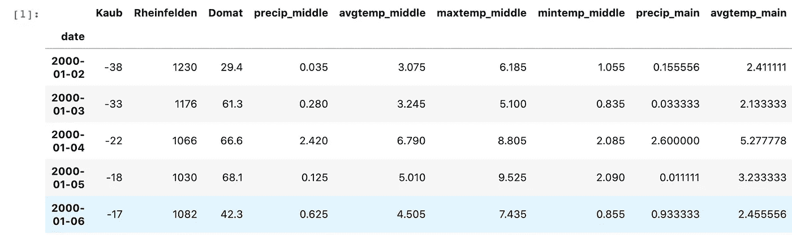

加载后，我们可以使用 Matplotlib 库绘制数据集:

```
# specify columns to plot
columns = [0, 1, 2, 3, 5, 6, 7, 8, 9, 10, 11, 12, 13, 14]
i = 1
values = df.values# define figure object and size
plt.figure(figsize=(9,40))
# plot each column with a for loop
for variable in columns:
     plt.subplot(len(columns), 1, i)
     plt.plot(values[:, variable])
     plt.title(df.columns[variable], y=0.5, loc='right')
     i += 1
plt.show()
```

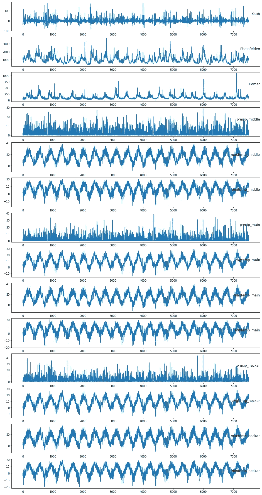

绘制变量直方图通常也是一个好主意:

```
# histograms of the variables
df.hist(figsize=(9,18))
plt.show()
```

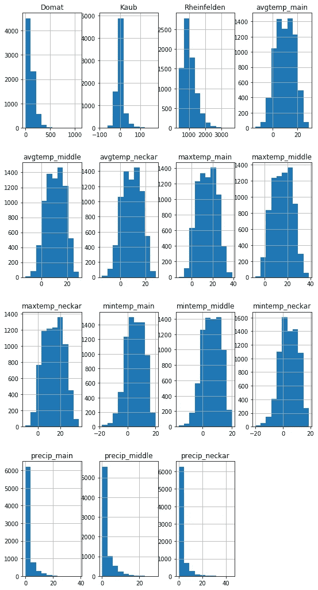

使用 Seaborn 库，您可以创建一个 violin 图来了解每个变量的分布:

```
# calculate dataset mean and standard deviation
mean = df.mean()
std = df.std()
# normalise dataset with previously calculated values
df_std = (df - mean) / std
# create violin plot
df_std = df_std.melt(var_name='Column', value_name='Normalised')
plt.figure(figsize=(12, 6))
ax = sns.violinplot(x='Column', y='Normalised', data=df_std)
_ = ax.set_xticklabels(df.keys(), rotation=90)
```

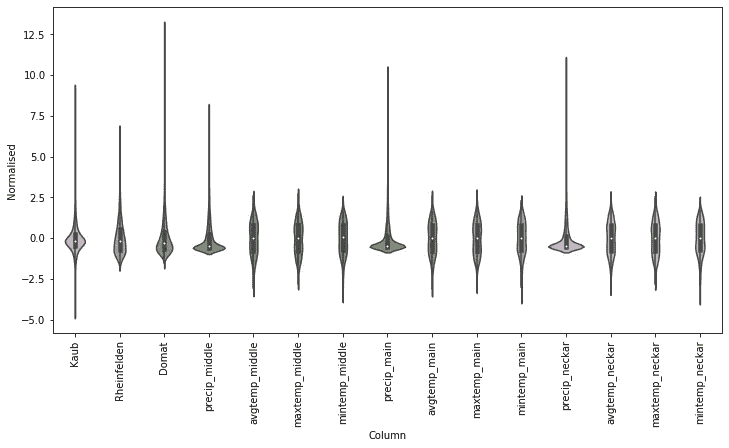

## 评估不同的模型

我在莱茵数据集上训练了不同类型的模型，以确定哪一个最适合:

*   基线模型，也称为持久性模型，返回 Kaub 水位的当前变化率作为预测(本质上预测“无变化”)。这是一个合理的基线，因为莱茵河水位通常会因更广泛的天气现象而在几天内发生变化(例如，阿尔卑斯山的缓慢融化逐渐向下游移动)。
*   您可以训练的最简单模型假定输入变量和预测输出之间存在线性关系。与更复杂的模型相比，它的主要优点是易于解释，但是它的性能只比基线网络稍好。
*   密集网络更强大，但看不到输入变量如何随时间变化。多步密集和卷积神经网络解决了这一缺点，它采用多个时间步作为每次预测的输入。
*   LSTM 模型名列前茅，在验证和测试集上具有较低的平均绝对错误率。

创建这个图表所需的 Python 代码对于这个博客来说太长了，但是你可以在这里访问它[，应用于不同的数据集。](https://www.tensorflow.org/tutorials/structured_data/time_series)

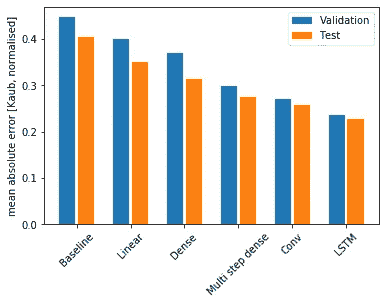

## LSTM 回归模型

LSTM 网络是一种可以学习长数据序列的递归神经网络。它们不是神经元，而是由通过层相互连接的记忆块组成。内存块包含管理其状态和输出的门(输入、遗忘、输出)，使其比典型的神经元更聪明。

它们在学术界被广泛用于预测河流高度，并被证明在某些情况下[优于](https://arxiv.org/abs/1907.08456)经典水文模型。

让我们从本文开头的代码重新开始加载 Rhine 数据库:

```
import datetime
import matplotlib as mpl
import matplotlib.pyplot as plt
import numpy as np
import pandas as pd
import seaborn as sns
import tensorflow as tf
from sklearn.preprocessing import LabelEncoder
from sklearn.preprocessing import StandardScaler
from sklearn.metrics import mean_squared_error
import joblib# first, we import data from excel using the read_excel function
df = pd.read_excel('RhineLSTM.xlsx', sheet_name='Detailed4_MAIN’)
# then, we set the date of the observation as the index
df.set_index('date', inplace=True)
```

***数据准备***

要构建正常运行的 LSTM 网络，第一步(也是最困难的一步)是准备数据。

我们将把问题框定为根据今天和前 6 天的天气和瑞士上游流量(backward_steps = 7)预测今天 Kaub 水位(t)的变化率。

使用 Scikit-Learn 库中的 StandardScaler()函数对数据集进行标准化。对于数据帧的每一列，该列中的每个值减去平均值，然后除以整列的标准偏差。对于大多数机器学习模型来说，这是一个非常普通的步骤，并允许整个网络更快地学习(下面将详细介绍)。

然后，数据帧通过一个转换函数。对于每一列，我们为前 7 天的值创建一个副本(15 * 7 = 120 列)。得到的数据帧的形状是 7506 行×120 列。

很多代码都是受这篇精彩的[博客文章](https://machinelearningmastery.com/multivariate-time-series-forecasting-lstms-keras/)的启发。

```
# load dataset
values = df.values
# ensure all data is float
values = values.astype('float32')
# normalise each feature variable using Scikit-Learn
scaler = StandardScaler()
scaled = scaler.fit_transform(values)
# save scaler for later use
joblib.dump(scaler, 'scaler.gz')# specify the number of lagged steps and features
backward_steps = 7
n_features = df.shape[1]# convert series to supervised learning
def series_to_supervised(data, n_in=1, n_out=1, dropnan=True):
     n_vars = 1 if type(data) is list else data.shape[1]
     df = pd.DataFrame(data)
     cols, names = list(), list()
     # input sequence (t-n, ... t-1)
     for i in range(n_in, 0, -1):
          cols.append(df.shift(i))
          names += [('var%d(t-%d)' % (j+1, i)) for j in range(n_vars)]
     # forecast sequence (t, t+1, ... t+n)
     for i in range(0, n_out):
          cols.append(df.shift(-i))
          if i == 0:
                names += [('var%d(t)' % (j+1)) for j in range(n_vars)]
          else:
               names += [('var%d(t+%d)' % (j+1, i)) for j in range(n_vars)]
      # put it all together
      agg = pd.concat(cols, axis=1)
      agg.columns = names
      # drop rows with NaN values
      if dropnan:
          agg.dropna(inplace=True)
      return agg# frame as supervised learning
reframed = series_to_supervised(scaled, backward_steps, 1)
```

***定义训练和测试数据集***

我们必须将准备好的数据帧分成训练和测试数据集，以便对我们的结果进行公正的评估。训练数据集代表 80%的值，我们将使用剩余的 20%进行评估。当我们处理按时间顺序排列的数据时，打乱数据集的顺序是一个非常糟糕的主意，所以我们让它保持原样。接下来，我们将训练和测试数据集重塑为三维，以备后用。

```
# split into train and test sets
values = reframed.values
threshold = int(0.8 * len(reframed))
train = values[:threshold, :]
test = values[threshold:, :]
# split into input and outputs
n_obs = backward_steps * n_features
train_X, train_y = train[:, :n_obs], train[:, -n_features]
test_X, test_y = test[:, :n_obs], test[:, -n_features]
print(train_X.shape, len(train_X), train_y.shape)
# reshape input to be 3D [samples, timesteps, features]
train_X = train_X.reshape((train_X.shape[0], backward_steps, n_features))
test_X = test_X.reshape((test_X.shape[0], backward_steps, n_features))
print(train_X.shape, train_y.shape, test_X.shape, test_y.shape)
```

***拟合模型***

最后，我们能够适应我们的 LSTM 网络。多亏了 TensorFlow/Keras 库，这只需要几行代码。我选择了 64 个内存块，批量大小为 72。我使用 Adam 优化算法，它比经典的梯度下降法更有效。

```
# design network
model = tf.keras.models.Sequential()
model.add(tf.keras.layers.LSTM(64, input_shape=(train_X.shape[1], train_X.shape[2])))
model.add(tf.keras.layers.Dense(1))
model.compile(loss='mae', optimizer='adam')
# define early stopping parameter
callback = tf.keras.callbacks.EarlyStopping(monitor='loss', patience=3)
# fit network
history = model.fit(train_X, train_y, epochs=25, callbacks=[callback], batch_size=72, validation_data=(test_X, test_y), verbose=2, shuffle=False)
# plot history
plt.figure(figsize=(12, 6))
plt.plot(history.history['loss'], label='train')
plt.plot(history.history['val_loss'], label='test')
plt.ylabel('mean absolute error [Kaub, normalised]')
plt.legend()
plt.show()
```

## 模型结果

模型拟合后，我们可以启动预测并反转比例以获得最终结果。然后，我们可以计算模型的误差分数。在这里，该模型实现了 6.2 厘米的均方根误差(RMSE)，这是很好的，但可能还可以改进。

```
# make a prediction
yhat = model.predict(test_X)
test_X = test_X.reshape((test_X.shape[0], backward_steps*n_features))
# invert scaling for forecast
inv_yhat = np.concatenate((yhat, test_X[:, -(n_features - 1):]), axis=1)
inv_yhat = scaler.inverse_transform(inv_yhat)
inv_yhat = inv_yhat[:,0]
# invert scaling for actual
test_y = test_y.reshape((len(test_y), 1))
inv_y = np.concatenate((test_y, test_X[:, -(n_features - 1):]), axis=1)
inv_y = scaler.inverse_transform(inv_y)
inv_y = inv_y[:,0]
# calculate RMSE
rmse = np.sqrt(mean_squared_error(inv_y, inv_yhat))
print('Test RMSE: %.3f' % rmse)
```

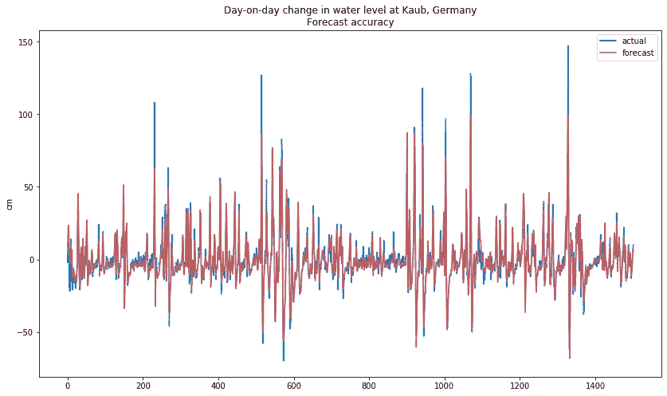

我还检查了该模型在极端天气事件中的性能，例如 2016 年 5 月至 6 月在欧洲记录的大范围洪水，仅在巴伐利亚就造成了超过 10 亿欧元的损失。该模型通常能够跟踪水位的上升，但是在两个特定的高峰期间(一个在 4 月中旬，另一个在 6 月初)，它给出的数字很低。

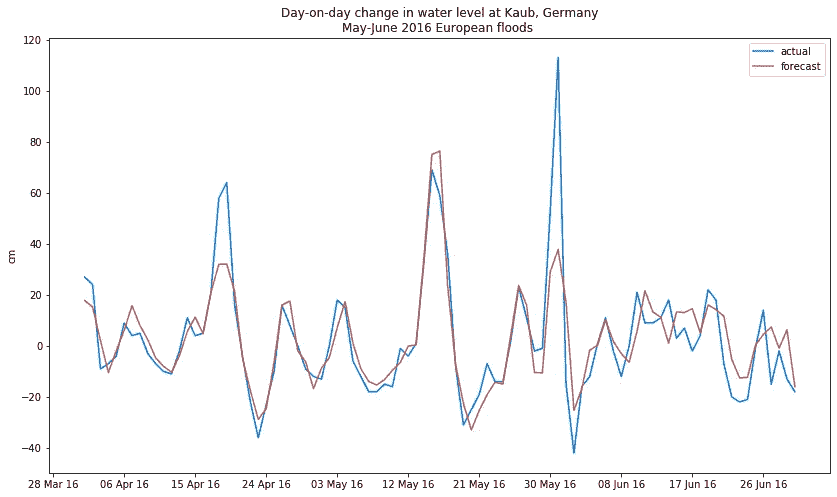

经过训练的 LSTM 网络在 2019 年 5 月的阿克塞尔风暴期间也表现良好，该风暴导致连续两天水位高度快速上升超过 1 米。然而，当洪水达到峰值时，它再次给出了比实际数字略低的估计。

在这两种情况下，我怀疑低的数字是由于一个主要的莱茵河支流，摩泽尔河，它被排除在分析之外，因为缺乏可靠的气象数据。摩泽尔河在考布以北的科布伦茨与莱茵河汇合。这是未来可能改进的领域。

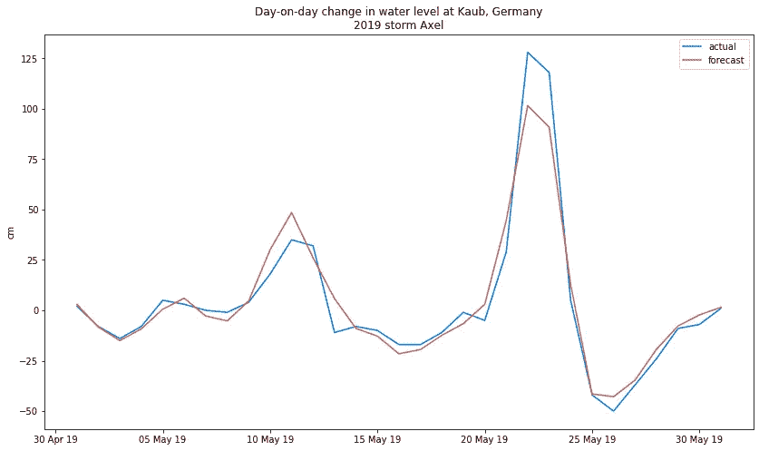

## 模型性能

寻找最佳超参数是机器学习中最重要(也是最耗时)的任务之一。为了找到最佳设置，我运行了许多不同版本的网络:

*   *预处理:*对于那些熟悉 Scikit-Learn 的人来说，我发现 StandardScaler()比 MinMaxScaler()更适合莱茵数据集，后者将所有值归一化到 0 到 1 之间。使用 MinMaxScaler()对值进行归一化会产生不稳定的性能。快速浏览一下本文开头绘制的直方图可以发现，大多数莱茵输入变量遵循高斯分布，因此这是合乎逻辑的。
*   *倒退:*我发现 7 天是天气分析的合理时间框架，并给出了水从阿尔卑斯山流下所需的时间。增加超过这个数字的步骤对模型的性能没有有意义的改进。
*   *神经元:*由 16 个记忆细胞组成的小型网络表现不佳，但由 32 个或更多神经元组成的大型网络则相当相似。我为我的模型选择了 64 个记忆单元。

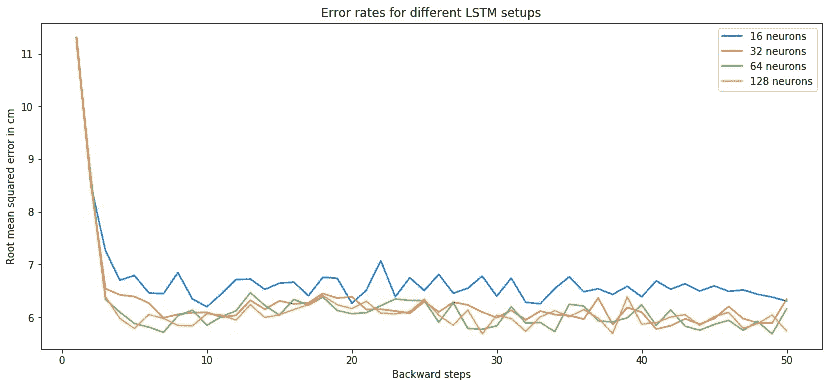

*   *Epochs:* 一旦算法遍历数据集 25 次，我就选择停止训练。超过这个阈值，性能开始趋于平稳，模型开始过度适应训练集。

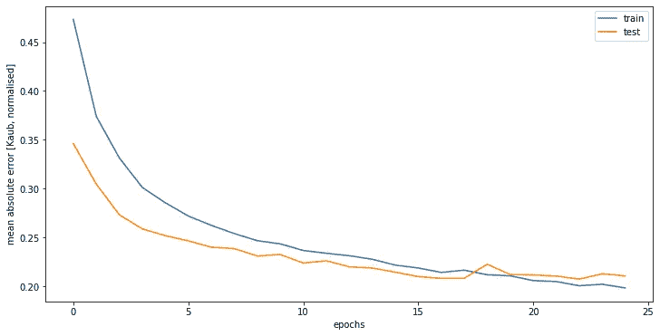

我已经在网上部署了这个模型的一个版本。其性能可以在[这里](http://www.rhineforecast.com/)进行监控。

我将在未来通过添加/删除变量和进一步调整超参数来尝试改进这个模型。如果你有任何想法，不要犹豫[与我联系](mailto:%20oliv.lejeune@gmail.com)。

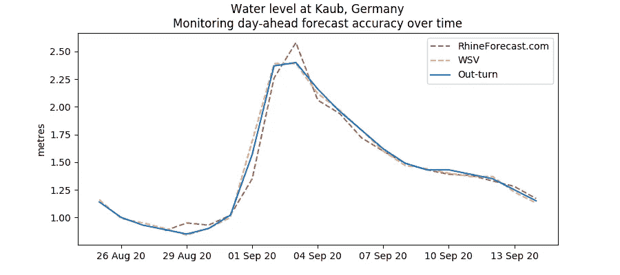