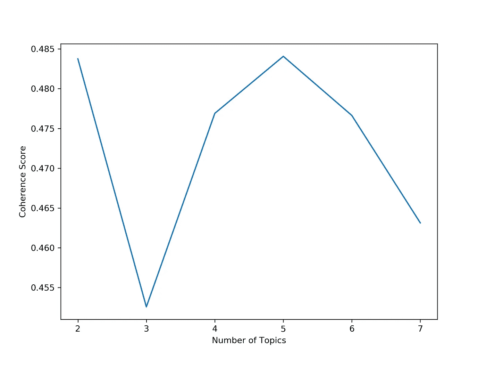
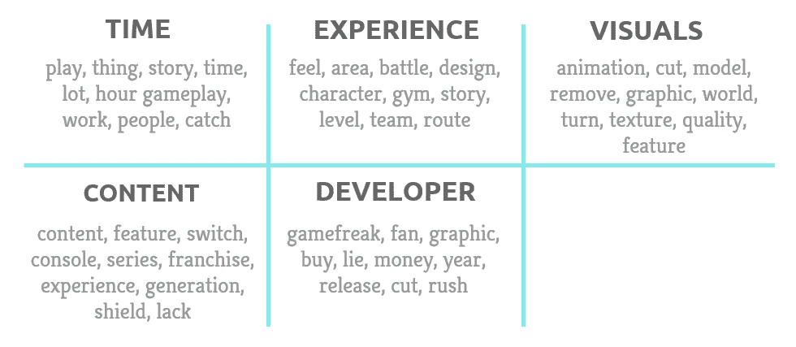

# 使用 MALLET LDA 了解玩家讨厌神奇宝贝剑/盾的原因

> 原文：<https://towardsdatascience.com/using-mallet-lda-to-learn-why-players-hate-pok%C3%A9mon-sword-shield-23b12e4fc395?source=collection_archive---------23----------------------->

## 简单介绍 MALLET LDA 如何用于主题模型，解释玩家不喜欢神奇宝贝剑/盾的原因。


在 [Unsplash](https://unsplash.com?utm_source=medium&utm_medium=referral) 上由 [Kamil S](https://unsplash.com/@16bitspixelz?utm_source=medium&utm_medium=referral) 拍摄的照片

任天堂 Switch 最新的神奇宝贝游戏大张旗鼓地推出了，承诺用令人惊叹的视觉效果和开放世界的冒险让粉丝们惊叹不已。尽管受到了评论家的赞扬，但这场比赛还是让大多数玩家失望了。在这篇文章中，我将带你了解我如何使用[槌潜狄利克雷分配(LDA)](http://mallet.cs.umass.edu/) 来找出玩家不喜欢这个游戏的关键原因。

## 数据收集

我用 BeautifulSoup 从 Metacritic 上报废了 Pokémon [剑](https://www.metacritic.com/game/switch/pokemon-sword/user-reviews)和[盾](https://www.metacritic.com/game/switch/pokemon-shield/user-reviews)用户评论(我已经在这里详述了步骤[)。Metacritic 评论有评级分数，表明用户对游戏的总体评价。这让我们的生活更轻松，因为我们不需要运行一个单独的情绪分析来寻找负面评论。](/web-scraping-metacritic-reviews-using-beautifulsoup-63801bbe200e)

我总共收集了 2019 年 11 月 15 日至 28 日发布的 3，261 条用户评论。数据集包含以下特征:

*   *姓名*:审核人的用户名
*   *日期*:审核日期
*   *评分*:从 0 到 10 的数字分数，给出游戏的总体评价。较高的分数意味着更积极的体验。
*   *评审*:实际评审文本

## 包装

以下软件包用于数据清理和分析:numpy、pandas、regex、string、nltk、langdetect、sklearn、spaCy、gensim、pprint(可选)、matplotlib 和 collections。

你还需要[安装](https://radimrehurek.com/gensim/models/wrappers/ldamallet.html) gensim 的 MALLET LDA 的包装器，如果你还没有的话。

导入日志记录也是可选的，但这是一个最佳实践，因为它使您能够了解模型运行时幕后发生的事情。

```
import numpy as np 
import pandas as pdimport re 
import stringimport nltkfrom langdetect import detectfrom sklearn.feature_extraction.text import CountVectorizer import spacy
from spacy.lang.en.stop_words import STOP_WORDSimport gensim
from gensim import corpora, models, matutils
from gensim.models import CoherenceModelimport os
from gensim.models.wrappers import LdaMalletmallet_path = '/Users/adelweiss/mallet-2.0.8/bin/mallet'from pprint import pprint #optionalimport matplotlib.pyplot as plt
%matplotlib inlinefrom collections import Counterimport logging #optional
logging.basicConfig(format='%(asctime)s : %(levelname)s : %(message)s', level=logging.INFO)
```

## 特征工程

1.  给评论贴上正面、负面或褒贬不一的标签。Metacritic 将低于 5 的分数视为负面，将 5 到 7 的分数视为混合分数，将高于 7 的分数视为正面。在下面的代码中，我定义了一个函数来根据这些规则标记评论。

```
def sentiment(x):
    if x > 7:
        return 'positive'
    if x < 5:
        return 'negative'
    else: return 'mixed'df['sentiment'] = df['rating'].apply(lambda x:sentiment(x))
```

## 数据清理

1.  **删除重复的用户评论。**一些用户对《神奇宝贝之剑》和《盾牌》发表了相同的评论(这是意料之中的，因为这两款游戏在内容上仅略有不同)。

```
df.drop_duplicates(subset='name', keep = 'first', inplace = True)
```

2.**过滤掉非英文评论。** 为了做到这一点，我使用了 *langdetect* 包，它依赖于 Google 的语言检测库，支持 55 种语言。 *detect* 函数读取文本输入，计算文本使用支持语言的概率，并返回概率最高的语言。

```
def language_detection(x): 
 result = detect(x)
 if result == 'en':return x 
 else: return np.NaN 

df['review'] = df['review'].apply(lambda x:language_detection(x))
```

3.**删除停用词。** 我结合了 nltk 和 spaCy 的停用词，加入了‘游戏’、‘口袋妖怪’、‘神奇宝贝’等自定义停用词。

在检查每个单词的评论频率后添加自定义停用词(例如，频率为 5 表示该单词出现在 5 次评论中。在第 6 步中会有更多的介绍。).自定义停用词出现在大多数评论中。它们在评论中的高频率意味着它们对主题建模没有用。因此，我在后续运行中删除了它们，以提高模型性能。

该代码创建了一个停用词列表。这些词将在下一步从评论中删除。

```
nltk_stop_words = nltk.corpus.stopwords.words('english')stop_words = list(STOP_WORDS)
stop_words.extend(['game','pokemon','pokémon']) 
### these are common words that appear in almost all reviewsfor word in nltk_stop_words:
 if word in stop_words: continue
 else: stop_words.append(word)
```

4.**文字清理。**这是主要使用正则表达式的标准文本清理步骤列表:

*   将所有单词转换成小写
*   从列表中删除单词(我们将使用它来删除停用词，以及出现在少于 4 条评论中的罕见单词)
*   删除数字
*   删除标点符号
*   替换单词(标准化我注意到的拼写不一致，如“游戏狂”和“游戏怪胎”)
*   移除“\r”字符串文字
*   从单词中去除多余的空格(即一行中有两个空格)，这是由删除数字、标点符号和字符串文字的函数产生的

```
def make_lower(text):
 return text.lower()def remove_words(text,wordlist):
 for word in wordlist:
 if word in text.split():
     text = re.sub(r'\b{}\b'.format(word), '', text) 
 return textdef remove_digits(text):
 return re.sub('\d', ' ', text)def remove_punctuation(text):
 text = re.sub('[%s]' % re.escape(string.punctuation), ' ', text) 
 return re.sub(r'[^\w\s]', ' ', text)def strip_extraspace(text):
 return re.sub('\s\s+',' ', text)def replace_word(text,word,replacement):
 return text.replace(word,replacement)def remove_r(text):
 return text.replace('\r',' ')
#df['review'] = df['review'].apply(lambda x:remove_punctuation(x))def clean_text(text):
 text = make_lower(text)
 text = remove_punctuation(text)
 text = remove_digits(text)
 text = replace_word(text,'game freak','gamefreak') 
 text = replace_word(text, 'game play', 'gameplay')
 text = remove_words(text,stop_words)
 text = remove_r(text)
 text = strip_extraspace(text)
 return textdf['review'] = df['review'].apply(lambda x:clean_text(x))
```

5.**词汇化**。我使用 spaCy 的词类标注分类器来减少对名词和动词的评论。只使用名词和动词更容易辨别主题是关于什么的。

下面的代码遍历评论中的每个单词，并返回标记为“名词”或“动词”的单词。它会跳过已被词条化为“-PRON-”的单词(当单词是代词时，spaCy 会返回这个词)，以及停用词列表中已被词条化的单词。

```
sp = spacy.load('en_core_web_sm')def lemmatize_words(text, allowed_postags=['NOUN', 'ADJ', 'VERB', ‘ADV’]):
 text = sp(text)
 lemmed_string =''
 for word in text:
     if word.pos_ in allowed_postags:
         if word.lemma_ == '-PRON-' or word.lemma_ in stop_words: 
 ### skip words that are not in allowed postags or becomes a    stopword when lemmatised 
             continue 
         else: lemmed_string = lemmed_string+' '+word.lemma_
     return lemmed_string.lstrip()df['review'] = df['review'].apply(lambda x:lemmatize_words(x, allowed_postags=['NOUN', 'VERB']))
```

6.**去除生僻字。**没有出现在大量评论中的罕见单词对于主题建模也是无用的。与停用词一样，我删除了它们以提高模型性能。

这段代码计算一个单词在评论中出现的次数，并将出现次数少于 4 次的评论添加到一个列表中。

```
word_frequency = Counter()for text in df.review:
 text = text.split()
 word_frequency.update(set(text))rare_words = []for key, value in word_frequency.items():
 if value < 4:
 rare_words.append(key)df['review'] = df['review'].apply(lambda x:remove_words(x,rare_words))
```

7.仅选择负面评论，并创建令牌。最后，由于我们只对负面评论感兴趣，我根据评论的情感标签过滤了评论，并应用 *sklearn 的计数矢量器*来创建单词标记。

*CountVectorizer 的 token_pattern* 参数指定只包含至少 3 个字符的单词。我的假设是 1 和 2 个字母的单词信息不多，对主题建模用处不大。另外， *ngram_range* 参数被设置为(1，2)以包含二元模型作为标记。

```
negative = df[df['sentiment']=='negative']vectorizer = CountVectorizer(stop_words=stop_words, ngram_range = (1,2), token_pattern="\\b[a-z][a-z][a-z]+\\b") 
```

## 为 MALLET LDA 奠定基础

要使用 MALLET LDA，我们需要使用矢量器拟合和转换数据，并创建模型需要的一些变量。首先，我们将*计数矢量器*与负面评论相匹配。然后，我们创建一个文档-单词矩阵，并将其从稀疏矩阵转换为 gensim 单词语料库。接下来，我们创建 *word2id* 和 *id2word* 变量，将单词与其数字令牌 id 进行匹配，反之亦然，并将这些变量保存到字典中。

```
vectorizer.fit(negative.review)
doc_word = vectorizer.transform(negative.review).transpose()corpus = matutils.Sparse2Corpus(doc_word)word2id = dict((v, k) for v, k in vectorizer.vocabulary_.items())
id2word = dict((v, k) for k, v in vectorizer.vocabulary_.items())dictionary = corpora.Dictionary()
dictionary.id2token = id2word
dictionary.token2id = word2id
```

## 选择主题的数量

为了选择主题的数量，我们将计算每个指定数量的主题的一致性分数。

连贯性分数通过检查每个主题的热门单词之间的语义相似度来评估主题的质量。分数越高，模型越好。

为了计算每个模式的一致性分数，我使用了下面的代码，我在第 17 节的中找到了[。代码循环遍历一系列数字，代表应用于模型的主题数量，计算每个模型的一致性分数，保存分数并绘制它们。](https://www.machinelearningplus.com/nlp/topic-modeling-gensim-python/#14computemodelperplexityandcoherencescore)

```
def compute_coherence_values(dictionary, corpus, texts, limit, start=2, step=3):
    """
    Compute c_v coherence for various number of topics

    Parameters:
    ----------
    dictionary : Gensim dictionary
    corpus : Gensim corpus
    texts : List of input texts
    limit : Max num of topics

    Returns:
    -------
    model_list : List of LDA topic models
    coherence_values : Coherence values corresponding to the LDA model with respective number of topics
    """
    coherence_values = []
    model_list = []
    for num_topics in range(start, limit, step):
        model = gensim.models.wrappers.LdaMallet(mallet_path, corpus=corpus, num_topics=num_topics, id2word=id2word)
        model_list.append(model)
        coherencemodel = CoherenceModel(model=model, texts=texts, dictionary=dictionary, coherence='c_v')
        coherence_values.append(coherencemodel.get_coherence())

    return model_list, coherence_values# Can take a long time to run.
model_list, coherence_values = compute_coherence_values(dictionary=id2word, corpus=corpus, texts=data_lemmatized, start=2, limit=40, step=6)# Show graph
limit=40; start=2; step=6;
x = range(start, limit, step)
plt.plot(x, coherence_values)
plt.xlabel("Num Topics")
plt.ylabel("Coherence score")
plt.legend(("coherence_values"), loc='best')
plt.show()
```

根据图表，2 或 5 是可供选择的好数字，因为它们的一致性得分最高。然而，选择 2 个主题可能会过于简单，所以我们选择 5 个。



描述 MALLET LDA 在多个主题上的一致性分数的图表

## 探索主题

为了查看与每个主题最相关的前 10 个单词，我们重新运行指定 5 个主题的模型，并使用 *show_topics。你可以使用一个简单的 print 语句来代替，但是 pprint 让事情更容易阅读。*

```
ldamallet = LdaMallet(mallet_path, corpus=corpus, num_topics=5, id2word=id2word, random_seed = 77)# Show Topics
pprint(ldamallet.show_topics(formatted=False))
```

下面是每个话题的热门词汇，以及我给它们的标签。大部分话题都和游戏性有关，除了最后一个。因为我们只看了负面评论，我们可以假设这些是问题领域。



表格描述了每个主题的前 10 个单词，以及建议的主题标签

检查完评论后，下面是每个主题的快速概述:

*   **时间:**上场时间太短。许多玩家在 10 到 25 小时内完成了游戏
*   体验:故事缺乏，整体游戏太简单。此外，大肆宣传的野生区域缺乏活力，而且大多是空的。
*   **视觉效果:**动画、图形和模型缺乏质量和质感。对视觉效果的期望非常高，因为游戏狂认为这是从游戏中删除这么多神奇宝贝的原因。
*   **内容**:玩家经常将 switch 游戏与 3DS 游戏相比较，后者有更多的功能、内容和可用的神奇宝贝。
*   开发者:玩家们感觉被 Game Freak 背叛了，因为它并没有兑现其承诺的惊人的视觉效果。他们觉得《游戏怪胎》欺骗了他们，而且《神奇宝贝》的删减是不合理的。

## 结论

LDA 是一种在文本中寻找主题的好方法，尤其是当它用于探索性目的时。我认为 MALLET LDA 很好地概括了为什么玩家讨厌这个游戏。我快速浏览了一下正面评论，发现了两个广泛的话题:游戏性和正面感受。也许，这可能是在 switch 上开始玩神奇宝贝的新玩家(因此使用 Let's Go 作为基准)与更习惯复杂游戏的经验丰富的玩家之间的情况。

**代码可在此处找到* *