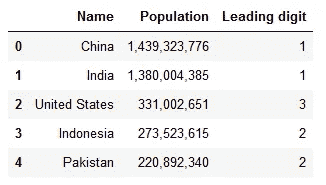
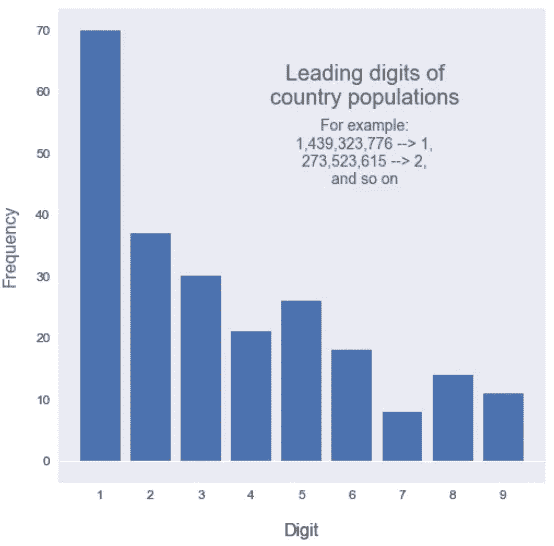
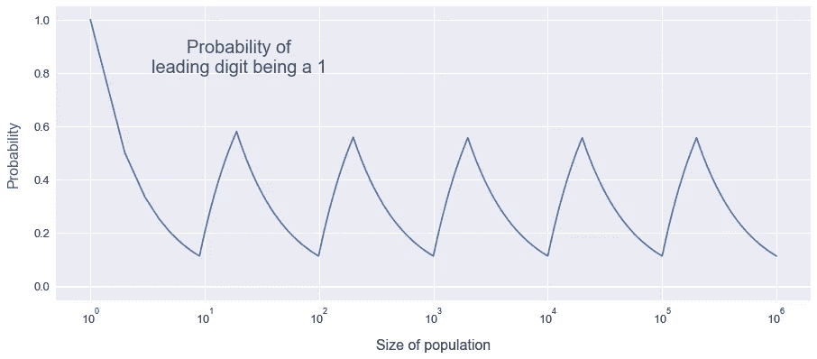
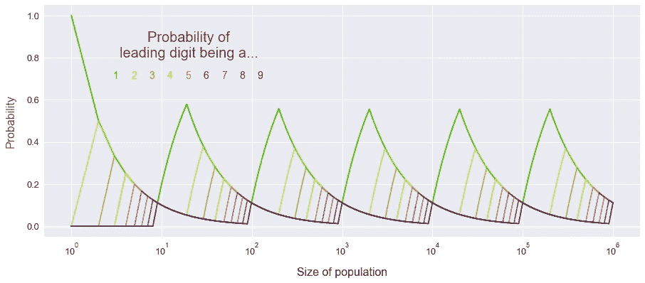

# 利用数学操纵选举

> 原文：<https://towardsdatascience.com/using-maths-to-rig-elections-e4e88b694c60?source=collection_archive---------51----------------------->

## 为什么你需要知道本福特定律

唐在 [Unsplash](https://unsplash.com/s/photos/politics?utm_source=unsplash&utm_medium=referral&utm_content=creditCopyText) 上的照片

声明:我不赞成用数学来操纵选举！但是为了争论的缘故…

想象一下，你不是一个道德高尚的人，你的任务是编造一组数字。你需要对这些数据进行加工，让它们代表一个有利的结果，同时不引起任何可能碰巧看到它们的人的怀疑。

你决定随机选择它们——或者更好——使用随机数发生器来消除你可能无意中带来的任何无意识的偏见。带着肆无忌惮的窃笑，你用更合适的结果取代了令人不快的结果。销毁证据后，那天晚上你上床睡觉，安全地知道你不可能被抓住。

不幸的是，我可能有些消息要告诉你。

## 令人不安的分布

我们上面的歪门邪道的同谋者认为他们随机选择的数字将是均匀分布的，这是正确的，因为每个结果都是同样可能的，因此是无模式的。然而，他们犯了一个错误:人口、街道地址、出现在英国《金融时报》上的数字、树上的叶子数量——任何自然的数字群体——也遵循一个不太直观的规则，这需要更多的工作来伪造。

为了说明这一点，让我们以世界各国的人口为例，这些国家的人口从几千到十多亿不等。现在，让我们把所有这些数字的第一个数字切掉。像这样:

数据来源: [Worldometer](https://www.worldometers.info/world-population/population-by-country/)

重要的问题来了:*你觉得这些前导数字会怎么分布？*

认为没有一个数字会比其他任何一个数字出现得更频繁似乎是合乎逻辑的。假设有 9 个可能的数字，每个数字出现的概率应该是九分之一，对吗？让我们看看这个预测是否会在实践中得到证实:

现在，这有点令人惊讶——等可能性的看似直观的结论实际上是完全错误的！这种模式不仅仅在人群中观察到——你会在房价、河流长度、建筑高度中发现它…

这种现象被称为**本福特定律**，在任何人群中都可以发现:

*   *不受人为约束；*和
*   *跨越足够数量的数量级*。

违反上述第一点，电话号码必须以某些数字(区号)开头。家庭中洗衣机的数量不倾向于取大范围的值，违反了第二条(如果我冒犯了任何收藏者，对不起)。结果是这些群体不一定会表现出这种行为。

## 究竟为什么

为了帮助你对为什么会发生这种情况有一点直觉，让我们举一个例子。考虑一个均匀分布的人口(从 1 到某个上限的数字)，观察随机选择的数字以某个数字开头的概率如何随着人口规模的增加而变化。

在最左边，人口仅仅是{1}，因此选择一个前导数字为 1 的数字的概率是 100%。随着人口规模的增长，获得前导数字 1 的概率会降低，直到达到九分之一，约为 0.11，此时人口规模为 9，每个数字都有一个。

但是当我们开始数到十的时候——获得前导 1 的可能性又开始变大了！当我们数到 99 时，概率像以前一样降低，其中每个前导数字都有同样的可能性再次出现——然后模式重复。

我们可以观察到，当人口规模为 9、99、999 等时，每个前导数字的概率确实是相等的。但是对于所有其他的人口规模，你得到 1 的可能性比其他任何数字都大。整洁！

回到我们的世界各国人口的例子，在数字上没有模式——一些国家很大，像印度，一些国家很小，像图瓦卢。一个典型国家的人口将介于 0 和最大国家(中国，有 14 亿居民)的人口之间——随机选取一个国家的人口基本上就像从 1 到 1，400，000，000 中随机选取一个数字。如果我们上面的图表延伸到 14 亿，我们会发现领先 1 的概率是 36.5%！在此范围内，前导 1 比 2 多，前导 2 比 3 多，依此类推。这就是为什么我们在本文的第一张图中发现了这种特殊的模式。

如果我们为所有不同的前导数字绘制一条类似于上图的曲线，我们将得到如下结果:

我们可以看到，随着我们越往上走，我们得到它的机会越来越小。可怜的 9 号最多有九分之一的几率，1 号最差也有九分之一的几率！

## 如何不操纵选举

那么这又和操纵选举有什么关系呢？所有这些在现实世界中很重要的原因是，除非他们非常仔细地准备，否则虚构的数字不会遵守本福特定律——它们不会在前导数字中显示这种频率模式。这给了我们一个工具来检测那些为了欺骗人们而伪造的数字..这里有几个例子:

*   法务会计师和审计师利用本福德定律来发现社会经济数据中的欺诈行为。过去会计丑闻的数据被发现不符合这一规则。
*   **2004 年，希腊政府承认伪造经济数据以加入欧洲货币联盟。**这种数据的欺诈性质可以从其违反本福特法则中看出。
*   **在 2009 年的伊朗选举中，**一名候选人在伊朗不同选区的票数并不遵循本福特定律。事实上，以 7 开头的数字太多了。这种反常现象发生在六个最大的投票区中的三个。

值得一提的是，单凭本福特法则不足以*证明*一组数字是否被伪造——就像任何统计分析一样，它只能告诉我们这些数字不太可能*是真实的。尽管有这样的警告，起初似乎是一个有趣而无害的数学规则，结果却成为识别和防止犯罪和欺诈行为的强大而有用的工具。*

如果你正在监狱里读这篇文章，因为你被一个特别倾向于数字的侦探抓到在你的纳税申报单上说猪肉馅饼——祝你下次好运。

# 更多信息和积分

**Andrew Hetherington** 是英国伦敦的一名见习精算师和数据爱好者。

*   在 [LinkedIn](https://www.linkedin.com/in/andrewmhetherington/) 上与我联系。
*   看我在 [GitHub](https://github.com/andrewhetherington/python-projects) 上摆弄什么。
*   用来制作本文情节的笔记本可以在[这里](https://github.com/andrewhetherington/python-projects/blob/master/Blog%E2%80%94Using%20Maths%20to%20Rig%20Elections/Benford's%20Law.ipynb)找到。

图片:大本钟照片由[丹尼尔·h·唐](https://unsplash.com/@danieltong?utm_source=unsplash&utm_medium=referral&utm_content=creditCopyText)在 [Unsplash](https://unsplash.com/s/photos/politics?utm_source=unsplash&utm_medium=referral&utm_content=creditCopyText) 上拍摄。

各国人口数据来自世界人口统计。2020 年 5 月 16 日访问。