# IBM 人力资源流失案例研究

> 原文：<https://towardsdatascience.com/using-ml-to-predict-if-an-employee-will-leave-829df149d4f8?source=collection_archive---------10----------------------->

Unsplash:马尔泰克·比约克

## 预测某个员工是否会离开组织？

在任何组织中，自然减员都是一个主要问题。在培训新员工上投入的时间、金钱和精力、工作依赖性和其他因素会导致公司在员工离职时遭受巨大的整体损失。此外，自然减员会导致现有员工之间的不信任，这本身会成为组织管理的一个主要困难。

IBM 人力资源流失案例研究是一个虚构的数据集，旨在确定可能影响决定哪些员工可能离开公司的重要因素。本文提供了深入的分析和预测模型，以了解重要的因素并做出准确的预测。

***目录***

1.  数据准备和理解。
2.  特征工程。
3.  特征选择。
4.  模型拟合
5.  模型比较
6.  建议和结论。

# 数据准备和理解

IBM 人力资源流失案例研究可以在 [Kaggle](https://www.kaggle.com/pavansubhasht/ibm-hr-analytics-attrition-dataset) 上找到。 *Python 3.3* 用于分析和模型拟合。使用的 IDE 是 *Spyder 3.3.3* 。

为了正确理解数据集，让我们看看它的一些基本特性。这包括数据集的形状和数据中存在的特征/变量的类型。此外，我们还将查看丢失的值(如果有的话)。

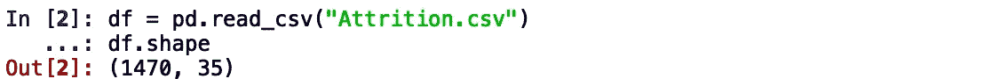

数据集的形状

*损耗*数据集有 1470 个观察值和 35 个变量。在 35 个变量中，存在一个目标变量*损耗*，可能的结果*是*和*否*。其他 34 个变量是独立变量，只有一个变量是独立变量，即*员工号*，它表示员工号或标识号。

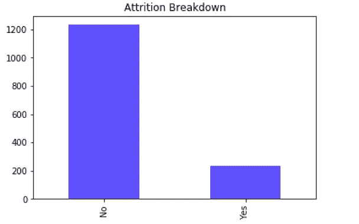

消耗

上图显示了目标变量的分布。在总共 1470 个观察结果中，1233 个是否定的，而 167 个是肯定的。我们将在将数据分成*训练*和*测试集*后处理这种不平衡。

数据集没有缺失值。因此，不需要对缺失值进行进一步处理。让我们用箱线图来观察异常值。

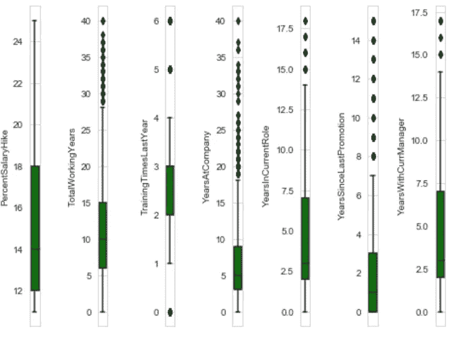

箱形图(1)

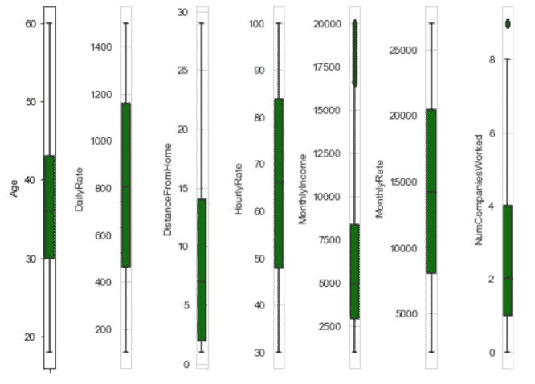

箱形图(2)

*年龄*、*日工资率*、*离家距离*、*小时工资率*、*月工资率*、*百分比工资率*倾向于没有任何异常值。

*NumCompaniesWorked* ， *TrainingTimesLastYear* ， *YearsWithCurrManager* ，*years incurentrole*有中等数量的异常值。

*月收入*、*总工作年数*、*年就职*、*年晋升*有大量异常值。

解决这个问题的一种方法是缩放变量，以减少其对模型的影响。Python 的 *Scikit-learn* 库中的 *StandardScaler()* 可用于此目的。

继续之前的最后一步是检查多重共线性。为此，我们绘制了一个相关矩阵。

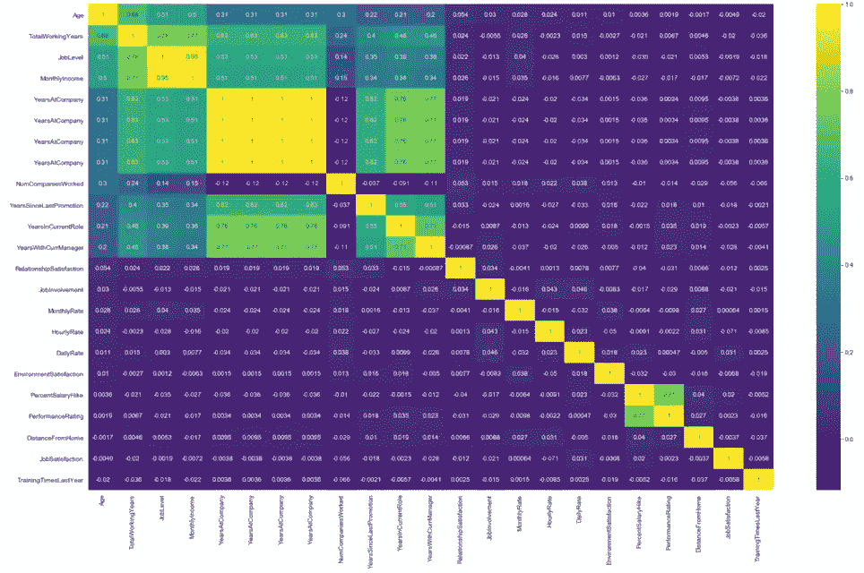

相关矩阵

上图显示了独立变量之间的相关性。我们这样做是为了检查多重共线性。多重共线性遵循的经验法则是，如果*相关系数(r)* 接近 **0.80** 。基于此，我们确定以下变量具有高度相关性:

*月收入*与*工作级别*的相关性为 0.95。这是非常高的相关性。

*总工作年限*与*工作级别*的相关性为 0.78，也非常接近 0.80。

所有其他变量似乎具有小于 0.80 的相关性。

了解了数据和初步分析后，我们现在可以更深入地了解*特征工程。*

# 特征工程

特征工程是指在使用机器学习或统计建模(如深度学习、决策树或回归)创建预测模型时选择和转换变量的过程。该过程包括数据分析、应用经验法则和判断的结合。

出于模型的目的，从现有的独立变量中创建了两个特征:

**整体性:**

取*环境满意度*、*工作参与度*、*工作满意度、*、*人际关系满意度*四个因素，其总和即为*整体满意度*。最高分“16”表示完全的整体满意度，而“4”被认为是最低的整体满意度。该变量的设计基于给定的图表:

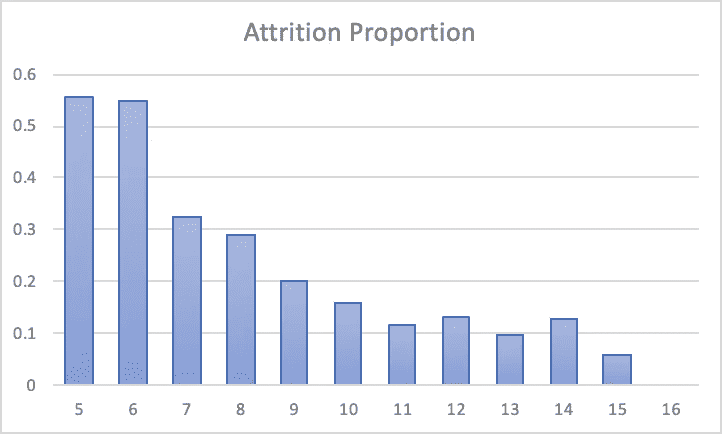

流失比例与整体满意度

横轴表示*整体满意度*，纵轴表示对应于给定水平的比例损耗。可以清楚地得出结论，随着年级的增加，自然减员的比例减少，即从 5 年级的 0.56 减少到 16 年级的 0.00。

**BelowAverageIncome**

另一个特性，即 *BelowAverageIncome* 是根据员工所在的部门、该部门的平均收入以及员工的*百分比工资收入*创建的。如果员工的月收入低于该部门的平均收入，且加薪百分比小于 16，则该员工的等级为 1，否则为 0，表明该员工最有可能离职。

# 特征选择

基于探索性数据分析和描述性统计分析，我们选择和取消某些对我们的模型没有显著贡献的变量。根据以下情况取消选择变量:

1.  可变类型
2.  数据点的不变性
3.  目标变量和自变量之间的独立性
4.  多重共线性

**变量类型:**

分析中不使用标称变量，因为它不为模型构建过程提供任何输入。然而，它被保留，以便识别对其进行研究的员工。

**数据点的不变性:**

某些变量没有任何可变性。这些变量是:

1.  *员工计数*:这只是对员工的计数，其取值始终为 1。
2.  *18 岁以上*:该变量描述员工是否超过 18 岁。在所有情况下，它都采用值“Yes”。
3.  *标准小时数*:员工一周工作的标准小时数。它的常数值是 80

**目标变量和自变量之间的独立性:**

检查目标变量和自变量之间的相关性是很重要的。如果两者之间的关系不显著，就不应该选择那个自变量进行建模。

为了确定自变量和目标变量之间的相关性，我们使用卡方检验。我们设定假设:

H0:这两个变量之间没有联系

H1:变量之间有关联。

如果 *p 值*小于显著性水平(a)或计算值大于表中值，我们拒绝零假设。出于本研究的目的，我们选择 LOS (a)为 5%。

基于卡方检验，取消选择以下变量:

从模型构建中移除的变量

**多重共线性:**

多重共线性是指输入变量之间的强关系或相关性。如果两个变量之间的相关系数大于 0.80，则称之为多重共线性。去除这些变量是很重要的，因为这会导致模型中的方差膨胀，从而增加模型中的误差。

基于我们的分析，我们去除了以下变量:

1.  *工作级别*:与*月收入*的相关系数为 0.95，与*总工作年限*的相关系数为 0.78。
2.  *总工作年数* : 0.77 与*月收入的相关性。*

**主成分分析**

对于特征提取，我们也可以使用主成分分析(PCA)。特征提取是一个降维的过程，通过该过程，原始数据的初始集合被减少到更易管理的组以便处理。

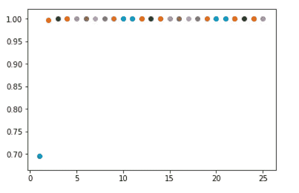

主成分数量对比例变化的解释

创建了两个主要组件来解释所考虑的 26 个变量的可变性。运行一个循环，从 1 到 26 取成分，并测量所解释的可变性。只有一个主成分，解释的可变性约为 68%。这在两个主成分的情况下增加到大约 99%，在三个主成分的情况下接近 99.99%。任何进一步的增加都增加了解释不明显的百分比。

# 模型拟合

经过预处理后，我们将数据分为训练、验证和测试数据集。从总共 1470 个观察值中，我们选择:

1.  *训练数据集的 80%观察值。*
2.  *验证数据集的 14%观察值。*
3.  *测试数据集的 6%观察值。*

选择的算法是*带*线性核的支持向量机*。*选择的参数如下:

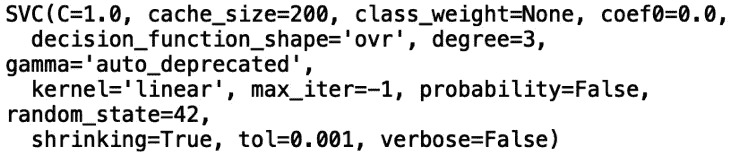

在这种情况下，*内核*等重要参数选择为“*线性*”。 *random_state* 取 42 作为种子，模型拟合 1176 个观测值。

下一个过程是根据验证和测试集的拟合模型来预测值。为了计算准确度、精确度、召回率、真阳性和真阴性，我们创建了混淆矩阵。

验证集的混淆矩阵如下所示:

混淆矩阵(验证集)

测试集的混淆矩阵如下所示:

混淆矩阵(测试集)

我们现在计算 2 个数据集的准确性参数:

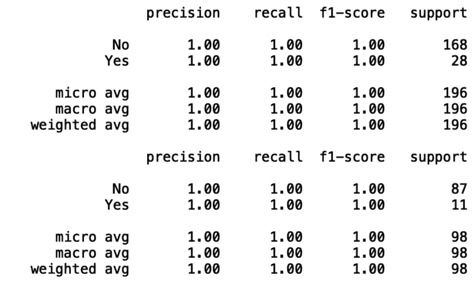

验证和测试集的评估指标

第一组信息属于验证集。我们得到的加权准确度为 1.00，精度为 1.00，召回率为 1.00。

第二组信息与测试集有关。我们得到的加权准确度为 1.00，精度为 1.00，召回率为 1.00。

我们现在来看看科恩的卡帕评分。Cohen 的 kappa 系数(κ)是一个统计量，用于测量评分者对定性(分类)项目的一致程度。一般认为这是一个比简单的百分比一致计算更稳健的方法，因为κ考虑了偶然发生一致的可能性。

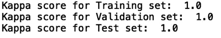

科恩的卡帕评分

训练、验证和测试集的 Kappa 分数表明，绝对不存在偶然预测的可能性。因此，该模型的结果是完全可信的，也可用于进一步的分析。

*注*:还使用了其他几个分类器，这里解释其中最好的一个。其他分类器包括*支持向量机(RBF 核)*、*随机森林(1000 棵树)*和*逻辑回归*。

# 模型比较

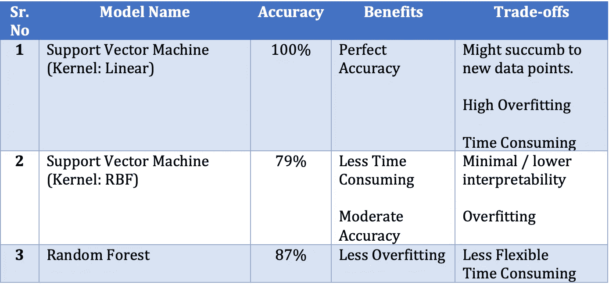

如上所述，使用了几个分类器，并选择了最好的一个。然而，看看每个分类器的优点和缺点是值得的。 *SVM(线性核)*给出的准确率最高(100%)，其次是*随机森林* (87%)和 *SVM* *(RBF 核)。*过度拟合可能是最佳模型的一个问题，因为它可能屈服于新的数据点。此外，模型拟合需要时间。另一方面，随机森林有助于分类中的新数据点。

# 建议和结论

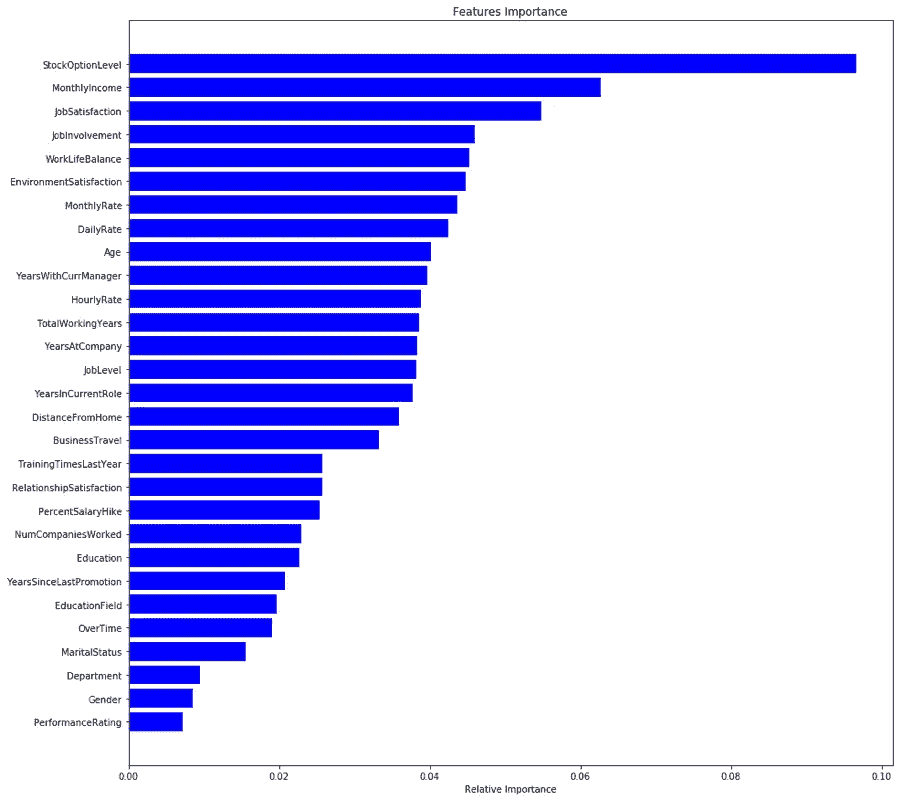

根据上面的图表，我们可以得出结论,*股票期权级别*在决定员工流失方面起着非常重要的作用。除此之外，*月收入、工作满意度、工作投入度*也位列前茅。另一方面，诸如*绩效等级、性别、部门*之类的因素往往影响不大(卡方检验也证明了这一点)。

基于整个项目，为了从模型中获得最佳输出，需要保持某些点。

人力资源部门可以关注那些在决定一个员工是否离开一个组织时起重要作用的重要变量。这些变量是:

StockOptionLevel

每月收入

工作满意度

工作投入

工作生活平衡

环境满意度

基于上述变量，人们可以清楚地注意到一种模式。员工更关心他们直接拿到手的物质物品。然后是决定员工是否会离开组织的心理变量。

因此，HR 可以关注这些方面，从员工的角度去理解。一旦遵循了这一点，被称为流失项目的项目就可以被用作保留项目。这可以极大地帮助组织。

其次，当收到新的数据集时，需要不时地调整模型。如果引入任何新的输入变量，重要的是检索参与初始研究的员工的信息。

我们因此结束了这个项目。

*感谢您的阅读。我真诚地希望你觉得这篇文章很有见地，我一如既往地欢迎讨论和建设性的反馈。*

给我发邮件:**icy.algorithms@gmail.com**

你可以在 [LinkedIn](https://www.linkedin.com/company/enka-analytics/?viewAsMember=true) 上找到我。