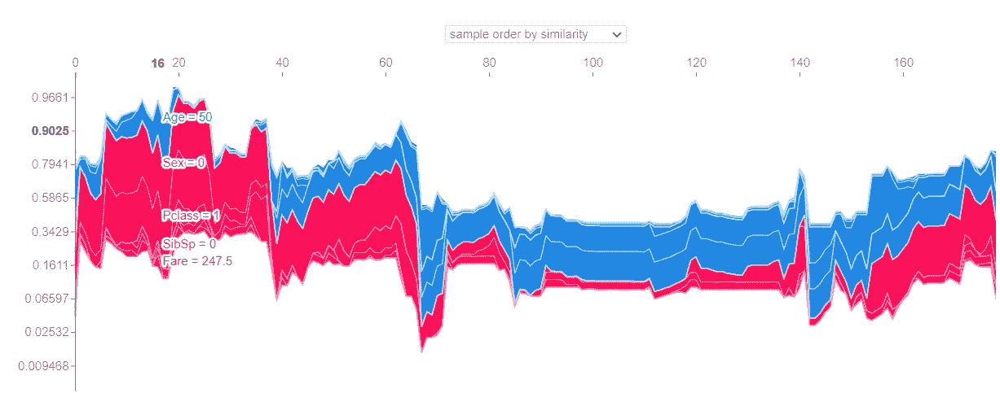
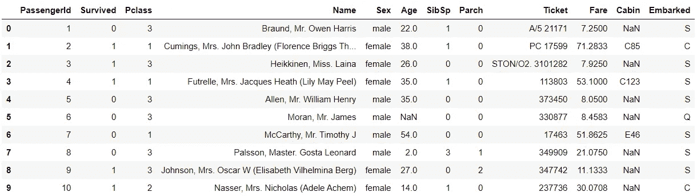
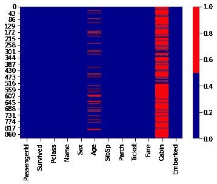
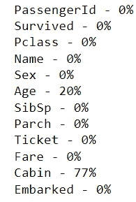
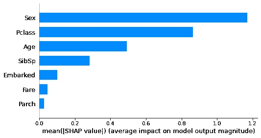
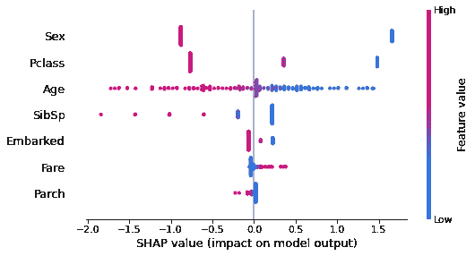
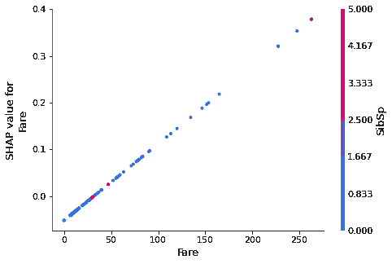
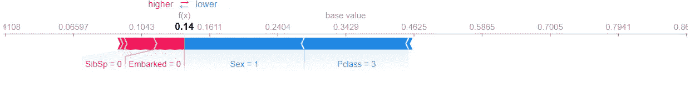
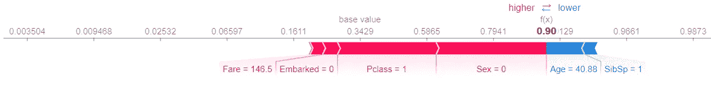

# 用 SHAP 的模型解释来理解泰坦尼克号上发生的事情

> 原文：<https://towardsdatascience.com/using-model-interpretation-with-shap-to-understand-what-happened-in-the-titanic-1dd42ef41888?source=collection_archive---------37----------------------->



作者图片

**注意**:这是关于分析和理解泰坦尼克号数据集的两部分中的第二部分。请在这里找到第一部分。

# 介绍

在过去的帖子中，我对泰坦尼克号数据集进行了统计分析，以回答乘客的社会经济阶层是否对他们的生存概率有影响的问题。统计显著性检验表明，“Pclass”变量，即我用来表示社会经济地位的每个个体的类别，对人们的生存有显著影响，p 值为 2.24e-147。你可以在这里阅读[的帖子。](https://medium.com/datadriveninvestor/hypothesis-testing-intuitively-explained-using-the-titanic-dataset-in-python-5afa1e580ba6)

在这篇文章中，我将建立一个机器学习模型，并用 SHAP 来解释这个模型。这将揭开泰坦尼克号上发生的一些隐藏的秘密，并帮助我们想象社会经济阶层对存活率的影响。

# 数据清理和预处理

让我们从查看[数据集](https://www.kaggle.com/c/titanic/data)开始，看看是否需要任何数据预处理。

```
df = pd.read_csv('train_titanic.csv')
df.head(10)
```



作者图片

让我们看看是否有大量数据丢失:

```
cols = df.columns 
colours = ['darkblue', 'red'] 
sns.heatmap(df[cols].isnull(), cmap=sns.color_palette(colours))
```



作者图片

在上面的热图中，x 轴显示列名，y 轴显示行的索引。红色小条表示该行的特定列中缺少某个值。似乎“年龄”和“客舱”这两个特性缺少很多值。让我们看看百分比:

```
pct_list = []
for col in df.columns:
    pct_missing = np.mean(df[col].isnull())
    if round(pct_missing*100) >0:
        pct_list.append([col, round(pct_missing*100)])
    print('{} - {}%'.format(col, round(pct_missing*100)))
```



作者图片

特征“小屋”丢失了 77%的数据。所以我要去掉这个特征。然而，年龄丢失了 20%的数据。在这种应用中，年龄应该是一个重要的变量，因为它肯定影响了存活的概率(例如，老年人或儿童可能被给予优先权)。通常，我会用其他人的平均年龄来填充缺失的值。然而，在这个特定的数据集中，人们来自不同的阶层，因此将他们作为一个群体来对待并不是一个好主意。数据集具有特征“姓名”，该姓名具有人的头衔(例如“先生”、“小姐”…等)。这个标题应该是这个时代的一个重要标志。此外，我应该记住，在事件发生时(1912 年)，社会经济地位影响人们的头衔，而不考虑年龄(例如，年轻的富人可以获得头衔，而同龄的普通穷人则不能)。因此，我将根据人们的头衔和级别对他们进行分组，然后将每组的平均年龄分配给每组中的缺失年龄。

```
# extracting the title from the name:
Title = []
for name in  df.Name:
    Title.append(name.split(",")[1].split(".")[0])

df["Title"] = Title#grouping people with pclass and title
df.groupby(["Pclass", 'Title'])['Age'].agg(['mean']).round(0)# adding the mean of the age of each group to the missing values
df["Age"] = df.groupby(["Title", "Pclass"])["Age"].transform(lambda x: x.fillna(x.mean()))
```

现在，我还可以删除不需要的特征，如姓名(从中提取标题之后)、机票 ID、乘客 ID。

```
df = df.drop(columns = ["Name"])
df = df.drop(columns = ["PassengerId"])
df = df.drop(columns = ["Ticket"])
```

最后一步，我将把分类特征编码成数字:

```
df.Sex = pd.Categorical(df.Sex)
df.Embarked = pd.Categorical(df.Embarked)df["Sex"] = df.Sex.cat.codes
df["Embarked"] = df.Embarked.cat.codes
```

我将从 x 数据集中删除“生存”结果变量

```
target = df.Survived.values
df = df.drop(columns =["Survived"])
```

# 构建线性模型

最后，我要建立模型。我将使用一个简单的逻辑回归模型，因为这里的目标是看特征如何影响结果，而不是在预测中获得高分。

```
from sklearn.model_selection import train_test_split
x_train, x_test, y_train, y_test = train_test_split(df, target, test_size=0.2, random_state=0)
from sklearn.linear_model import LogisticRegression
LR = LogisticRegression()
LR.fit(x_train, y_train)
LR.score(x_test, y_test)
```

该模型达到了 82%的准确率，这对于我们的目标来说是合理的。

现在，我们可以开始有趣的部分了。我将用 SHAP 来解释这个模型，看看这些特征是如何影响泰坦尼克号的发生的。

# SHAP 的模型解释

SHAP 是一个伟大的模型解释工具。尽管这是一个复杂的模型，但理解起来很直观。SHAP 的目标是提供每个特征对结果变量影响的可视化。为了做到这一点，SHAP 将建立一个模型，使用所有的功能，除了一个感兴趣的功能，看看这个模型没有这个功能会怎么样。然后，它将再次构建模型，并使用该特征进行预测。那么特征的效果将是两个值之间的差。但是将特征传递给模型的顺序会影响输出(尤其是在基于树的模型中，其中模型遵循由特征排序的示意图方法)。因此，SHAP 计算了所有可能的排列，不同的特征以这些排列传递给模型。这似乎有巨大的计算成本，但 SHAP 优化了算法，使其对特定的机器学习模型更快。

让我们看看 SHAP 的地图:

```
import shap
explainer = shap.LinearExplainer(LR, x_train, feature_perturbation="interventional")
shap_values = explainer.shap_values(x_test)
shap.summary_plot(shap_values, x_test)shap.summary_plot(shap_values, x_train, plot_type="bar")
```



作者图片



作者图片

正如我进行的统计推断所预期的，Pclass 对乘客的存活率有显著的影响。这是仅次于“性”的第二大特征。我们从上面的图中看到，对应于 1 级(较富裕的人)的 Pclass 的低值(蓝色)对人的存活率有积极影响，而对应于第三级的较高值(红色)对存活率有消极影响。我们还可以看到，“性别”是最重要的特征，表明作为“女性”(蓝色)对存活率有积极的影响。特征“年龄”也显示较低的值(蓝色)对存活率有积极的影响。

让我们来看看可变票价，即每个人支付的票价。这个变量应该是对人们财富的连续描述:

```
shap.dependence_plot("Fare", shap_values, x_test)
```



作者图片

我们看到，人们付出的多少和他们生存的机会之间存在线性关系。他们越富有，生存的可能性就越大。

最后，让我们更仔细地看看几位乘客:

```
shap.force_plot(explainer.expected_value, shap_values[0,:], x_test.iloc[0,:], link="logit")
```



作者图片

那是一个没有活下来的乘客的情节。情节表明，他的“性别”(作为男性)和他的“阶级”(处于第三阶级)正在降低他的存活率。该图还显示，兄弟姐妹的数量(“SibSp”)为 0 会略微增加他的机会。似乎没有家人陪伴独自在船上的人能够不受干扰地跑得更快。

让我们来看看一个幸存的人:

```
shap.force_plot(explainer.expected_value, shap_values[3,:], x_test.iloc[3,:], link="logit")
```



作者图片

不出所料，她是一班付了高价车费的女生。这给了她更高的生存机会。此外，她有一个兄弟姐妹，而且年纪大了，这也减少了她的机会。

这些结果可以用下面的力图来总结:


作者图片

该图显示了积极(蓝色)或消极(红色)影响每位乘客存活率的特征。

# 结论

根据我进行的统计分析和模型解释，我可以对泰坦尼克号上发生的事情做出以下归纳。当船开始下沉时，富人有优先离开船的权利。那些兄弟姐妹较少的人速度更快，因为他们不必寻找他们的家人。当他们发现救生艇数量有限时，他们决定优先考虑儿童和妇女。所以优先顺序如下:有钱的女人和孩子，有钱的男人，然后是其他人。非常有趣的是，这种见解是如何从数据集中完全提取出来的。

请在这里找到我的笔记本。你必须下载并运行笔记本来载入 SHAP 的地图，因为它们依赖于 Javascript **。**

# 参考文献

*   【https://www.kaggle.com/c/titanic/data 
*   [https://github.com/slundberg/shap](https://github.com/slundberg/shap)
*   [https://towards data science . com/explain-your-model-with-the-shap-values-BC 36 AAC 4 de 3d](/explain-your-model-with-the-shap-values-bc36aac4de3d)