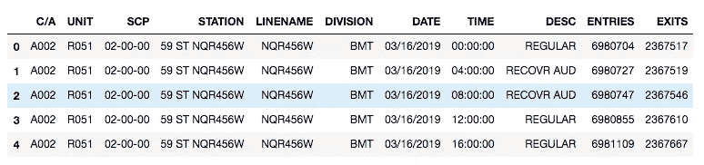
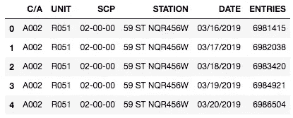
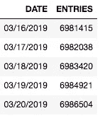
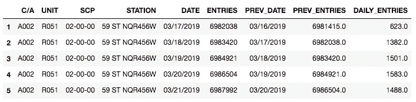
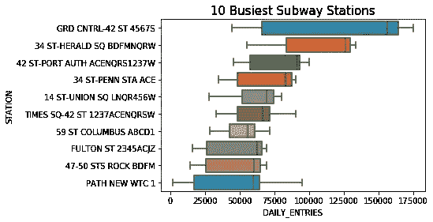
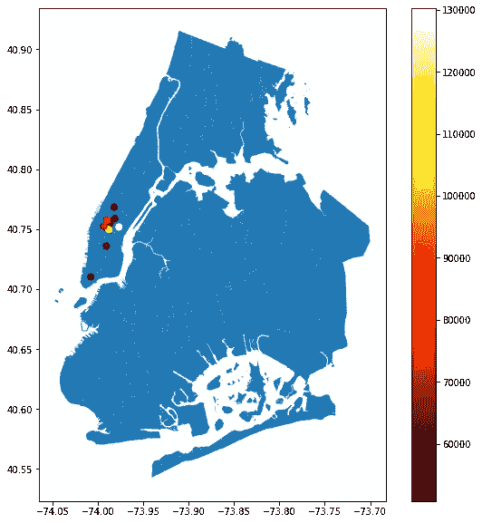
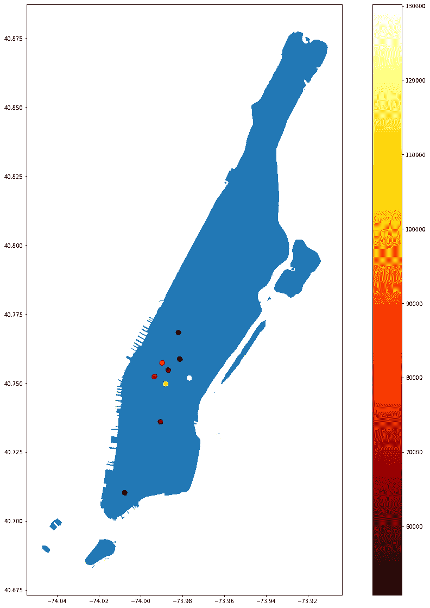
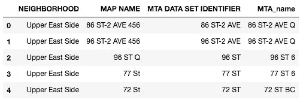
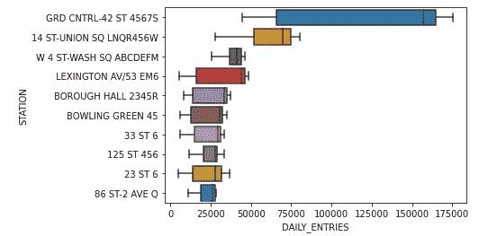

# 利用地铁数据安置志愿者——深入研究数据科学

> 原文：<https://towardsdatascience.com/using-mta-turnstile-data-to-place-optimize-placement-of-volunteers-and-start-a-career-in-data-1bece6a33f56?source=collection_archive---------41----------------------->

# 介绍

我最近开始了一个 [Metis](https://www.thisismetis.com/) 数据科学训练营，加入了大约 55 名其他有抱负的数据科学家，为期 12 周，充满了编码、讲座、挑战和项目。我有生物学背景。我在一月份完成了旧金山州立大学海洋生物学的硕士学位。我进入 2020 年时，计划做一名实验室技术员或其他一些低级别的移液器猴子，同时我找到了一条具体的职业道路，但新冠肺炎全球疫情完全打乱了这个计划。作为一个住在新城市(俄勒冈州波特兰市)的 26 岁年轻人，我发现自己在寻找一些职业方向和日常目标。我对编码产生了浓厚的兴趣，并很快开始利用这些技能研究职业。我很快找到了 Metis，正式开始了我的数据科学之旅。

# 该项目

在这里，我描述了我在 Metis 课程中的第一个项目的经历——也是我的第一个数据科学项目(查看[回购](https://github.com/njaffe/Project_1_v))。任务是分析纽约市 MTA 地铁数据，以便安排志愿者招募客人参加虚构公司 WomenTechWomenYes 举办的年度晚会。

许多人已经分析了这个数据集(google it)，当我着手这个项目以及一个新的博客时，我想知道自己:我能贡献什么？作为一名数据科学新手，我怎么能希望提供其他更有经验的数据科学家错过的启示呢？这似乎不太可能。相反，我想通过我自己的视角与你分享这个项目:作为一个全新的、天真无邪的数据科学家，他希望深入到数据科学的本质、数学和 Python 驱动的世界中。

通过分享我在这个项目中的思考过程，我希望能阐明为什么我认为数据科学如此有用——如此彻头彻尾的*酷*。当我分享我的分析的代码片段和输出时，我希望其他新兴的数据科学家能够跟随并受到启发，去挖掘许多*许多*等待分析的可用数据集。因为归根结底，我的目标是让更多的人对数据科学感兴趣，数据科学是一套广泛适用的技能，以解决问题和帮助人们为中心。让我们开始吧。

该项目的第一步是找到并导入数据集，以便我们可以进行一些 EDA(首字母缩写词在数据科学中非常重要)。

从 MTA 网站加载了数周的十字转门数据:

```
df_1 = pd.read_csv('http://web.mta.info/developers/data/nyct/turnstile/turnstile_190323.txt')
df_2 = pd.read_csv('http://web.mta.info/developers/data/nyct/turnstile/turnstile_190330.txt')
df_3 = pd.read_csv('http://web.mta.info/developers/data/nyct/turnstile/turnstile_190406.txt').
.
.df_12 = pd.read_csv('http://web.mta.info/developers/data/nyct/turnstile/turnstile_190608.txt')
df_13 = pd.read_csv('http://web.mta.info/developers/data/nyct/turnstile/turnstile_190615.txt')
df_14 = pd.read_csv('http://web.mta.info/developers/data/nyct/turnstile/turnstile_190622.txt')Mta_2019_df_input_1 = pd.concat([df_1, df_2, df_3, df_4, df_5, df_6, df_7, df_8, df_9, df_10])mta_df = pd.concat([Mta_2019_df_input_1, df_10, df_11, df_12, df_13, df_14])
```

由此产生的数据帧非常壮观:



作者图片

我一点也不知道清理和使用这个数据集会有多么困难！但这是有趣的部分。

清理的第一步是添加一些列并清理列名:

```
mta_df['DATETIME'] = pd.to_datetime(mta_df['DATE'] + ' ' + mta_df[“TIME”], format=”%m/**%d**/%Y %H:%M:%S”)mta_df['TURNSTILE'] = mta_df['C/A'] + ' ' + mta_df['UNIT'] + ' ' + mta_df['SCP'] + ' ' + mta_df['STATION']
```

然后删除一些重复项:

```
mta_df.drop_duplicates(subset=['C/A', 'UNIT', 'SCP', 'STATION', 'DATETIME'], inplace=**True**)
```

然后我们制作了一个新的框架，它由四个属性组成，这四个属性共同代表了一个独特的十字转门:C/A、Unit、SCP 和 Station(每一个都是 MTA 十字转门的标识符)。

```
mta_daily = (mta_df.groupby(['C/A', 'UNIT', 'SCP', 'STATION', 'DATE'],as_index=**False**).ENTRIES.first())mta_daily.head()
```



作者图片

清理工作完成后，我们准备开始分析，这将有助于我们实现目标:通过瞄准最繁忙的车站和十字转门，最大限度地发挥志愿者的影响力。但是我们看到了另一个问题:十字转门的入口和出口是累积的，而不是代表自上次观察以来的乘客(每四小时观察一次)。



作者图片

我不知道如何解决这个问题，并得到我们的进入和退出总数在尼斯四个小时的增量。这对我来说是这个过程中的一个重要时刻。我甚至对这个简单的问题感到不知所措，觉得自己缺乏真正成为数据科学家的技能(有人告诉我，冒名顶替综合症是许多技术领域的常见疾病)。我感到很沮丧。

然而，我并不是独自进行这项分析:这毕竟是一个团队项目，而且最重要的是，我们有愿意提供帮助的导师。经过一天左右的努力，我们的一位导师向我们展示了一个真正优雅的解决方案，它允许我们将累积的进出变成每日的进出:

```
# Adding previous date and previous entries, so that we can look at the deltas:mta_daily[["PREV_DATE", "PREV_ENTRIES"]] = (mta_daily.groupby(["C/A", "UNIT", "SCP", "STATION"])["DATE","ENTRIES"].apply(lambda grp: grp.shift(1)))# Dropping top row of NaN's:
mta_daily.dropna(subset=["PREV_DATE"], axis=0, inplace=True)# Where is the counter going the wrong way?
mta_daily[mta_daily["ENTRIES"] < mta_daily["PREV_ENTRIES"]].head()# Fixing counter
def get_daily_counts(row, max_counter):
    counter = row["ENTRIES"] - row["PREV_ENTRIES"]
    if counter < 0:
        # Counter reversed?
        counter = -counter
    if counter > max_counter:
        # Counter reset to 0? 
        counter = min(row["ENTRIES"], row["PREV_ENTRIES"])
    if counter > max_counter:
        # Still too big?
        return 0
    return counter# finally adding our daily entries column!
mta_daily["DAILY_ENTRIES"] = mta_daily.apply(get_daily_counts, axis=1, max_counter=40000)mta_daily.head()
```



作者图片

耶！现在我们有了一个每日条目的专栏(我们只关注项目剩余部分的条目)。

除了有助于我们继续分析之外，这种合作干预揭示了一个极其重要的启示:**在解决这个问题时，我不是一个人。**这是一个团队项目，我们的教练已经表明他会在那里帮忙。

事后看来，这似乎是一个显而易见的观察。Metis 强调项目的协作性，我确实在这个项目上与一个小组一起工作。但我想强调这一系列事件，因为我真的觉得这是一个“水平上升”的时刻。我从来没有合作编写过代码，在进入一个新的程序时，我想向自己和他人证明我有能力去执行和竞争。然而，我觉得更多的人应该牢记一起工作和*寻求帮助*的教训。

带着一种“一切都会好起来”的新感觉，我们继续分析。我们现在有每个车站的每日入口和出口，我们想找到最繁忙的车站。我们首先按电台对数据帧进行分组，并按每日条目进行排序，以查看前 10 名:

```
top10_stations = \
    (stations_daily.groupby(['STATION'])['DAILY_ENTRIES'].sum()
                   .reset_index()
                   .sort_values(by='DAILY_ENTRIES',ascending=**False**) 
                   .STATION.head(10)) 
```

然后，我们提取了数据帧中属于前 10 名的部分:

```
station_daily_top10 = \
    stations_daily[stations_daily['STATION'].isin(top10_stations)].sort_values(by = 'DAILY_ENTRIES', ascending = **False**)
```

最后在 [Seaborn](https://seaborn.pydata.org/) 用标准的箱线图绘制出来:

```
sns.boxplot(x='DAILY_ENTRIES', y='STATION', data=station_daily_top10, order = top10_stations, \
            showfliers = **False**).set_title('10 Busiest Subway Stations', size = 15);
```



作者图片

厉害！通过几行代码，我们从一个庞大、杂乱的数据集中提取了对我们的客户有价值的第一条信息:纽约市 10 个最繁忙的地铁站！接下来，我们使用 geo_pandas 在地图上显示了最繁忙的车站:

```
top10_stations_geo = combined_df[combined_df['STATION'].isin(top10_stations)]fig, ax = plt.subplots(1, figsize=(10, 10))
districts_geo.plot(ax=ax)
top10_stations_geo.plot(ax=ax, column = top10_stations_geo['DAILY_ENTRIES'], \
                        legend=True, cmap = 'hot', markersize = 50)
```



作者图片

聚焦曼哈顿:

```
manhattan = districts_geo[districts_geo['boro_cd'].astype(int) <200]
fig, ax = plt.subplots(1, figsize=(20, 20))
manhattan.plot(ax=ax)
top10_stations_geo.plot(ax=ax, column = top10_stations_geo['DAILY_ENTRIES'], \
                        legend=True, cmap = 'hot', markersize = 80)
```



作者图片

漂亮！根据我们的分析，我们现在可以向客户展示最佳目标站的准确位置。

在这一点上，我们几乎完成了，我觉得完成了。该项目进展顺利，我们几乎准备好交付最终演示。

我们项目的最后一个方面是将人口统计数据整合到我们的分析和推荐中。首先，我们阅读从 data.cccnewyork.org 获得的人口统计数据，这是一个专注于追踪纽约市收入的网站。我们把注意力集中在纽约最富裕社区的名单上，理由是越富裕的人越有可能在晚会上捐款。

```
bougie_df = pd.read_csv('Income_Stations_by_Neighborhood.csv')
bougie_df.head()
```

然后，我们编写了一个函数，将人口统计数据框架中的电台名称与“电台 _ 每日”框架中的电台名称进行匹配。

```
def get_station_name(row, col_name, station_names, check_length = False):
    """
    Takes in a row of a dataframe and matches the value of the column labeled by 
    col_name with the values in station_names
    """
    row_name = row[col_name]
    row_name = re.sub('th', '', row_name)
    row_name = re.sub('rd', '', row_name)
    row_name = re.sub('nd', '', row_name)
    row_name = re.sub('-', '', row_name).upper()
    similarity = 0
    similar_name = ''
    for name in station_names:
        if check_length:
            if len(name) < 14:
                name += "".join(['-' for i in range(len(name), 14)])
        ratio = SequenceMatcher(None, row_name, name).ratio()
        if ratio > similarity:
            similarity = ratio
            similar_name = name.strip('-')
    return similar_name
```

我们将这些站名添加到我们的人口统计数据框架中:

```
bougie_df['MTA_name'] = bougie_df.apply(get_station_name, axis = 1, col_name = "MAP NAME", \
                                        station_names = stations_daily['STATION'].unique())bougie_df.head()
```



然后我们交叉参考这些车站，找出富裕社区中最繁忙的车站:

```
bougie_list = bougie_df['MTA_name']bougie_stations = \
    stations_daily[stations_daily['STATION'].isin(bougie_list)].sort_values(by = 'DAILY_ENTRIES', ascending = False)
bougie_top10 = \
    (bougie_stations.groupby(['STATION'])['DAILY_ENTRIES'].sum()
                   .reset_index()
                   .sort_values(by='DAILY_ENTRIES',ascending=False) 
                   .STATION.head(10))
```

最后，我们绘制了这些社区中最繁忙的 10 个车站:

```
sns.boxplot(x='DAILY_ENTRIES', y='STATION', \
            data=bougie_stations[bougie_stations['STATION'].isin(bougie_top10)], \
            order = bougie_top10, showfliers = False);
```



作者图片

原来如此！最后一个交付给我们客户的东西:纽约最富裕社区的十大最繁忙地铁站。

# 最后的想法

在完成了我的第一个数据科学项目之后，我感觉自己已经跨越了一个里程碑。不是戏剧性的，但在 Metis 的筹备和第一周期间，我有无数次合理地不确定自己是否能做到，我的数学、编码和分析技能是否达到 Metis 为学生设定的高标准。完成这个项目后([回购！](https://github.com/njaffe/Project_1_v))，我感觉我可以在数据科学方面取得成功，我真的很兴奋能继续这个训练营。

我最近开始着手我的第二个项目(我很快会写博客，别担心)，从第一个项目中获得的信心支撑着我。如果您没有从这篇博客文章中获得任何其他东西，我希望您可以将我的数据科学之旅的开始视为灵感，以真正涉足您正在做的任何事情，并知道您周围总有人可以帮助和支持您！下次见。