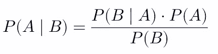

# 使用朴素贝叶斯从零开始创建国际象棋人工智能

> 原文：<https://towardsdatascience.com/using-naive-bayes-to-create-a-chess-ai-from-scratch-e35bc64ef109?source=collection_archive---------53----------------------->


皮奥特·马科夫斯基在 [Unsplash](https://unsplash.com/s/photos/chess?utm_source=unsplash&utm_medium=referral&utm_content=creditCopyText) 上的照片

国际象棋一直被认为是智力和智力的测试。1996 年，在国际象棋大师加里·卡斯帕罗夫和 IBM 的深蓝之战后，它也成为了人工智能的一块基石。因为它的重要性，我认为尝试创造一个有能力的象棋人工智能会很有趣。

为了实现创建一个有能力的国际象棋人工智能的目标，我开发了一个朴素贝叶斯分类器，使用概率来寻找最佳可能的移动。

我使用的数据集有超过 20，000 个游戏。可惜我再也找不到源头了。如果你正在寻找数据集，你可以联系我在 victorwtsim@gmail.com。

# 朴素贝叶斯分类器:

朴素贝叶斯分类器依赖于使用从数据集收集的概率来做出最佳决策。对于国际象棋，这是如何实现的？以下是一个逐步指南:

**第一步**:统计每一步棋在输赢游戏中出现的次数。

**第二步**:将每一个计数值，除以输局的总棋数和赢局的总棋数，变成一个概率。

**第三步**:利用贝叶斯定理计算出获胜概率最高的招式。

# 代码:

**第一步**:在一场输和赢的游戏中，每出现一个招式，就数一次。

```
from pandas import read_csv
import chess
file = '/Users/XXXXXXX/Desktop/Files/Data/chess.csv'
csv = read_csv(file)outcomes = list(csv['winner'])
moves = list(csv['moves'])
for i in range(len(moves)):
    moves[i] = moves[i].split()
white_moves = 0
black_moves = 0
```

在进入实际程序之前，这些是我用来访问我的数据的先决条件。如果您可以访问数据集，您可以复制它。

```
def initialize_dictionaries():
    white = {}
    black = {}
    all_moves = []
    for game in moves:
        for move in game:
            if not(move in all_moves):
                all_moves.append(move)
    for move in all_moves:
        white[move] = 1
        black[move] = 1
    return white,blackdef initialize_data(white,black):
    white_moves = 0
    black_moves = 0
    for outcome in outcomes:
        index = outcomes.index(outcome)
        if outcome == 'white':
            work_dict = white
            white_moves += len(moves[index])
            ip2 = 0
        elif outcome == 'black':
            work_dict = black
            black_moves += len(moves[index])
            ip2 = 1
        for move in moves[index]:
            if moves[index].index(move) % 2 == ip2:
                if move in work_dict:
                    work_dict[move] += 1
    return white,black,white_moves,black_moveswhite,black = initialize_dictionaries()
white,black,white_moves,black_moves = initialize_data(white,black)
```

这两个函数查看数据，将游戏的结果与移动匹配，并相应地添加每个移动在输赢游戏中出现的次数。我以 Python 字典的形式存储数据，以支持基于文本的索引。

**第二步**:将每一个计数值除以输局的总棋数和赢局的总棋数，变成一个概率。

```
def to_probability(dictionary,length):
    for term in dictionary:
        dictionary[term] = dictionary[term]/length
    return dictionary
white = to_probability(white,white_moves)
black = to_probability(black,black_moves)
```

这个函数非常简单，几乎不需要解释:用一个移动出现的次数除以移动的总数，得到一个概率。

**第三步**:利用贝叶斯定理计算出获胜概率最高的招式。



贝叶斯定理指出，假设 B 发生了，A 发生的概率是 B 发生的概率，当 A 发生时，乘以 A 发生的概率，除以 B 的概率。

让我们用赢来代替 A，用移动 X 来代替 B。赢的概率，给定移动 X 被使用，可以计算为:移动 X 在赢的配置中出现多少次，乘以总的赢的概率，再乘以移动 X 被使用的概率。

```
PA = outcomes.count('white')/len(outcomes)
PB = 1
PBgiveA = white[move]/outcomes.count('white')
whitePAgiveB = (PBgiveA * PA) / PB
```

这里的代码是这个概念的应用，给出了白棋赢的概率。请注意，移动 X 的概率是 1，如果我们想移动，移动有 100%的机会发生。

完整的功能是:

```
def calculate_probability(side,board,white,black,white_moves,black_moves):
    len_white = white_moves
    len_black = black_moves
    if side == True:
        color = 'white'
    else:
        color = 'black'
    legal_moves = str(board.legal_moves)[36:-2].replace(',','').split()
    probs = []
    for move in legal_moves:
        if not(move in white):
            len_white += 1
            white[move] = 1/len_white
        PA = outcomes.count('white')/len(outcomes)
        PB = 1
        PBgiveA = white[move]/outcomes.count('white')
        whitePAgiveB = (PBgiveA * PA) / PB
        if not(move in black):
            len_black += 1
            black[move] = 1/len_black
        PA = outcomes.count('black')/len(outcomes)
        PB = 1
        PBgiveA = black[move]/outcomes.count('black')
        blackPAgiveB = (PBgiveA * PA) / PB
        if color == 'white':
            probs.append(whitePAgiveB-blackPAgiveB)
        elif color == 'black':
            probs.append(blackPAgiveB-whitePAgiveB)
    final_move = legal_moves[legal_moves.index(max(legal_moves))]
    return white_moves,black_moves,final_move
```

# 结果:

我试着用这个算法和它自己玩。它对开局和理想位置有很好的感觉(比如确保中路)，但在捕捉棋子时有问题。

我认为这是因为朴素贝叶斯分类器只知道合法的移动，而不掌握棋盘上的整体状态。