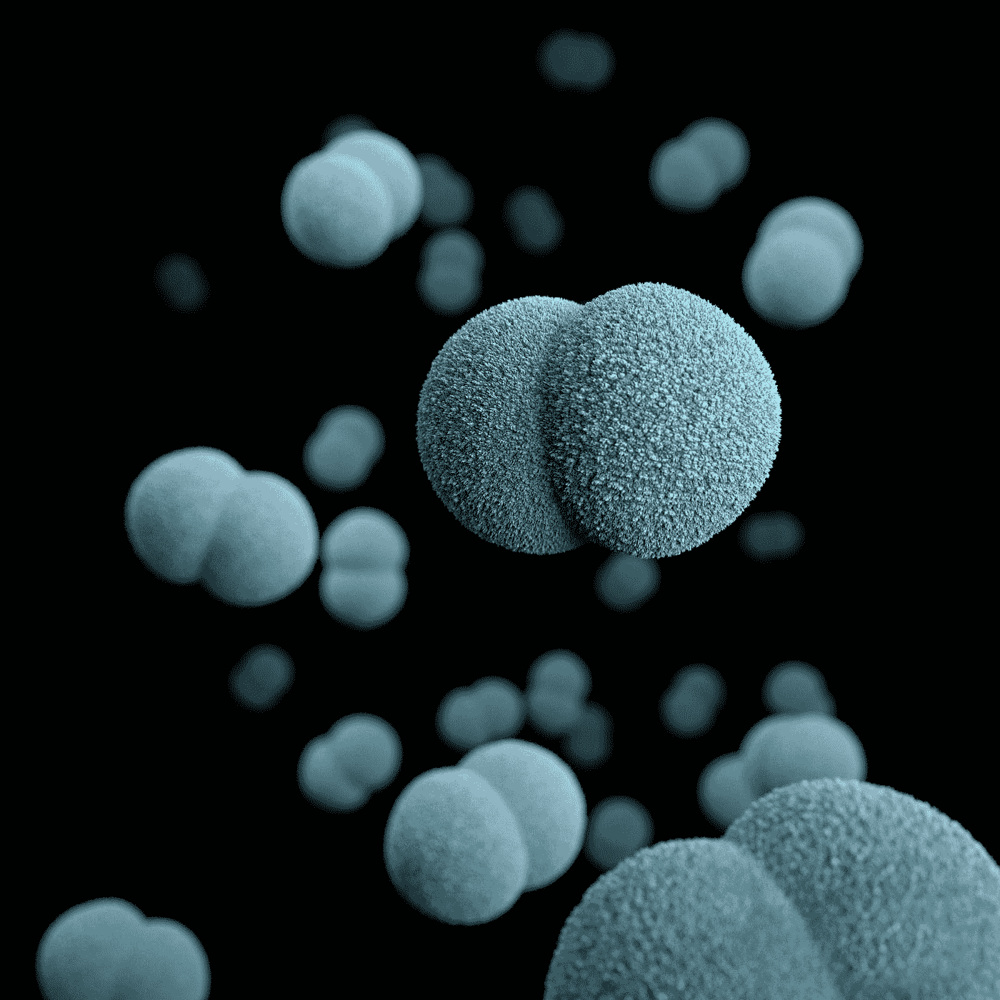
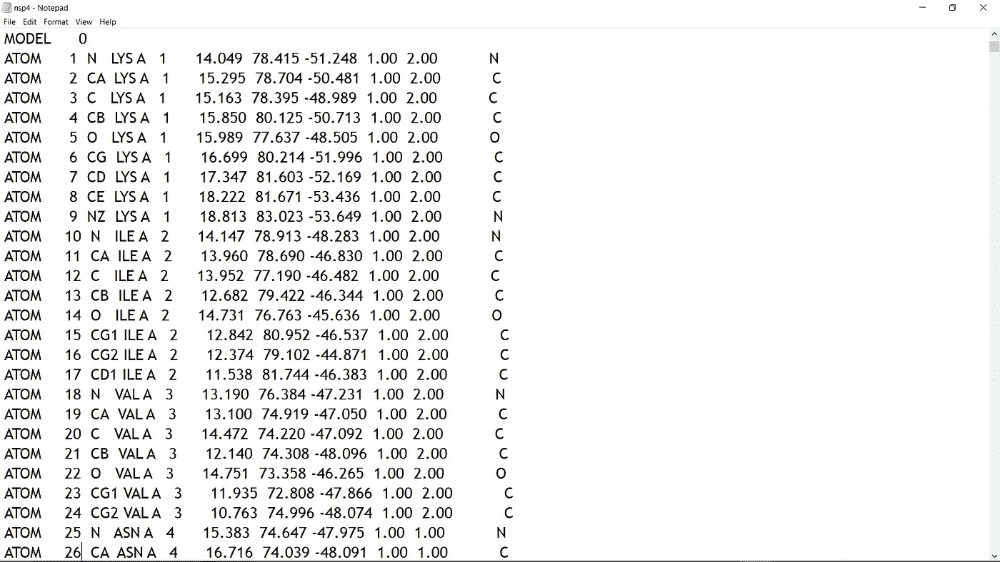
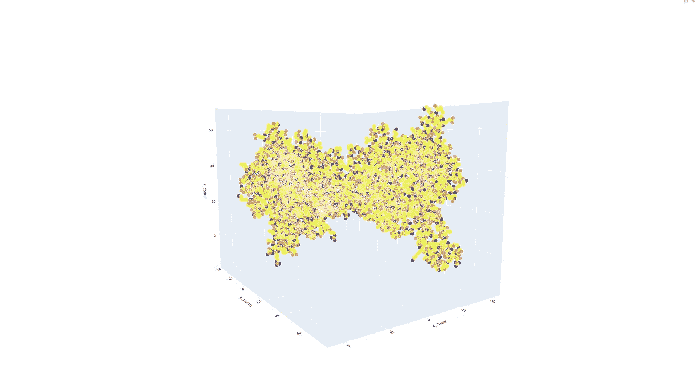
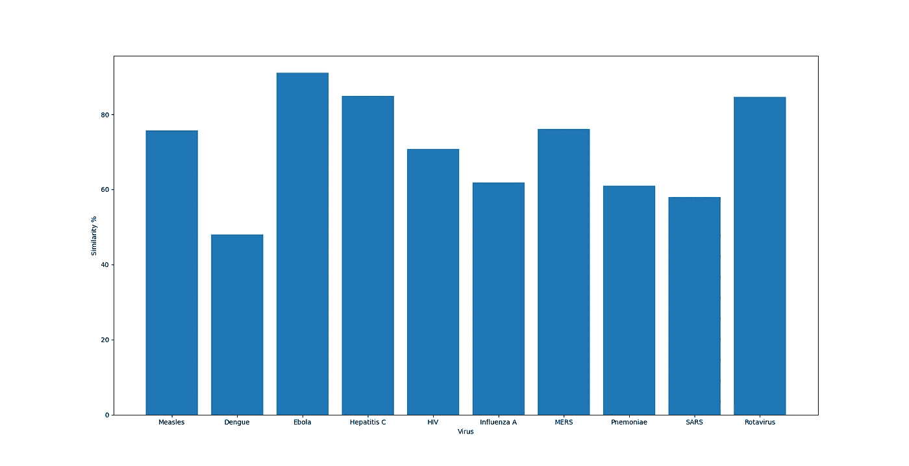

# 使用自然语言处理来比较病毒

> 原文：<https://towardsdatascience.com/using-natural-language-processing-to-compare-viruses-6a281311d9a?source=collection_archive---------75----------------------->

## 可能加速病毒疫苗开发的研究



[疾控中心](https://unsplash.com/@cdc?utm_source=medium&utm_medium=referral)在 [Unsplash](https://unsplash.com?utm_source=medium&utm_medium=referral) 拍摄的照片

N ***编者按:*** [*走向数据科学*](http://towardsdatascience.com) *是一份以研究数据科学和机器学习为主的中型刊物。我们不是健康专家或流行病学家，本文的观点不应被解释为专业建议。想了解更多关于疫情电晕病毒的信息，可以点击* [*这里*](https://www.who.int/emergencies/diseases/novel-coronavirus-2019/situation-reports) *。*

2019 年 12 月，世界开始了解一种新病毒，俗称冠状病毒，科学上称为**新冠肺炎。**

当冠状病毒被宣布为全球疫情时，开发疫苗的竞赛就开始了。

假设:这篇文章提供了我对自己参与的一项研究的见解。提供的图片是我个人电脑的截图。我要感谢 Nikhil Malhotra 和 Akshit Kothari 给我这个机会参与这个研究项目。

本文旨在提供两种病毒与其蛋白质结构之间的简单可能的比较，并为加速病毒的分析提供可能的基础。

# 那么我是怎么做到的呢？


[弗兰基·查马基](https://unsplash.com/@franki?utm_source=medium&utm_medium=referral)在 [Unsplash](https://unsplash.com?utm_source=medium&utm_medium=referral) 上拍摄的照片

数据是 AI 中最重要的实体！

但是病毒的数据大部分是一系列的化学化合物，这将超出我这个计算机专家的理解范围；).所以我花了一些我的互联网数据来建立一个病毒学的基础。

## 我的病毒学竞赛…

1.  什么化合物导致病毒攻击人体？
2.  它们形成什么类型的联系？(因为我知道一些…但不多)
3.  病毒遗传对疫苗开发有影响吗？(我知道这似乎是显而易见的，但我想确定一下)
4.  我能得到蛋白质结构的 3D 图吗？
5.  我如何利用蛋白质结构来比较两种病毒？

所以，是的…这些是我的一些主要问题。我必须从某个地方开始，所以我从**向量空间映射**开始。

## 好的……那么什么是向量空间映射，我该如何使用它呢？


由[埃文·丹尼斯](https://unsplash.com/@evan__bray?utm_source=medium&utm_medium=referral)在 [Unsplash](https://unsplash.com?utm_source=medium&utm_medium=referral) 上拍摄

简单来说，**自然语言处理**中的向量空间映射就是将文本处理成‘向量’(耶…字面意思)。更简单的说法是**字嵌入**。在单词嵌入中，通过给单词分配标记，将单词转换成数字。在我的例子中，我有像 C，O，N(碳，氧，氮)这样的原子，所以我标记了每个原子。

到了完成矢量化的部分…

我需要文本格式或任何可读格式的病毒蛋白质结构。蛋白质数据库(PDB)通过建立不同病毒的各种蛋白质结构的巨大数据库来解决这个问题。“pdb”格式。

[](https://www.rcsb.org/search) [## RCSB·PDB

### 作为 wwPDB 的成员，RCSB PDB 根据公认的标准管理和注释 PDB 数据。RCSB PDB…

www.rcsb.org](https://www.rcsb.org/search) 

这是. pdb 文件的样子…



我的电脑截图

1.  CA '-α碳，' CB '-β碳
2.  赖氨酸、ILE 等是氨基酸(一些化学术语)

我感兴趣的是三列中的浮点数。这些数字代表作为第一个肽链“1”一部分的相应原子的“x”、“y”、“z”**坐标**，依此类推。

为了获得这些坐标(如上所述)，我需要一些能够读取每一列的包或任何阅读器。我偶然发现了 **Biopython，**一个处理 PDB 文件的 python 模块。

[](http://biopython.org/DIST/docs/tutorial/Tutorial.html#htoc162) [## Biopython 教程和食谱

### Biopython 项目是免费 python 开发者的国际协会(https://www.python.org…

biopython.org](http://biopython.org/DIST/docs/tutorial/Tutorial.html#htoc162) 

我开始从他们的 PDB 文件中获取蛋白质结构中每个原子的坐标，并通过将数据添加到数据框中来绘制坐标图。我有这样的东西…



“plotly”获得的麻疹病毒蛋白质结构截图

## 现在我们有了一个结构…一个 3D 结构，但是下一步呢？

现在最重要的部分——向量空间映射…

PDB 文件包含含有在 3D 空间中不同位置的原子的残基序列。我把每个原子组合成一个残数，然后把它转换成一个 NumPy 数组。

```
if(extension=='pdb'):
  data = parser.get_structure("pdb",main_virus_needed+'\\'+filename)
  initial_models = data.get_models()
  models = list(initial_models)
  for model in models:
    chains = list(models[0].get_chains())

    for chain in chains:
      residues = list(chains[0].get_residues())

      for residue in residues:
       atoms = list(residue.get_atoms())

       for atom in atoms:
         store_residue(atom)
```

`store_residue()`是一个函数，定义为通过以下方式获得矢量形式的原子坐标

```
<Atom object>.get_vector()
```

 [## 生物。PDB，亚当，亚当

### object — + | Atom 定义 Atom 类。atom 对象存储 Atom 名称(有和没有空格)、坐标、B…

biopython.org](https://biopython.org/DIST/docs/api/Bio.PDB.Atom.Atom-class.html#get_vector) 

看起来我已经准备好了，但是我考虑了一个问题，如果一些蛋白质结构比另一些更小或更大，那么需要多一个步骤来解决这个问题……**填充！**

所以我决定添加**零填充**并匹配向量的形状，并使用`np.ravel()`得到一个连续的扁平 1D 数字数组。

为了**比较，**我决定用余弦相似度…

## 为什么余弦相似？

作为一个有计算机背景的人，我没有任何病毒学背景，也不知道病毒学家用来比较两种病毒的方法。所以为了建立基础，我用**余弦相似度。我知道这不是最理想的方法，但它让我可以根据一些计算得出一些不准确的结论。**


余弦相似度的基本公式

 [## 余弦相似性

### 余弦相似性是内积空间的两个非零向量之间的相似性的度量。它被定义为…

en.wikipedia.org](https://en.wikipedia.org/wiki/Cosine_similarity) 

# 一些结果…

以下是使用 **Matplotlib…** 与冠状病毒的蛋白质结构比较的不同病毒 I 的一些蛋白质结构的统计

1.  麻疹
2.  登革热
3.  埃博拉病毒
4.  丙型肝炎
5.  艾滋病病毒
6.  甲型流感
7.  中东呼吸综合征
8.  肺炎
9.  严重急性呼吸综合征
10.  轮状病毒



使用 Matplotlib 绘制

通过观察上面的统计，我对 **SARS 和新冠肺炎的比较结果**惊讶**为 57.95%，**因为他们来自同一个家族，相似度应该很高。但是**伊波拉和轮状病毒**也像新冠肺炎一样引起呼吸困难、咳嗽、胸痛等呼吸系统疾病，分别有 **91.03%和**84.71%的相似链。因此，只比较蛋白质链可能是加速疫苗开发的起点。

D 是声明者**:结果需要实验室和从业者的验证**。

**下面是解决问题的不同方法的链接—**

[](https://www.linkedin.com/pulse/covid-19-protein-comparison-analysis-nikhil-malhotra/) [## 新冠肺炎蛋白质比较分析

### 计算分析:微生物的世界我们生活在一个世界，这个世界在一月份受到了一场…

www.linkedin.com](https://www.linkedin.com/pulse/covid-19-protein-comparison-analysis-nikhil-malhotra/) 

> “开头是作品最重要的部分！”

> 谢谢你通读这篇文章，我将非常乐意回应你的反馈