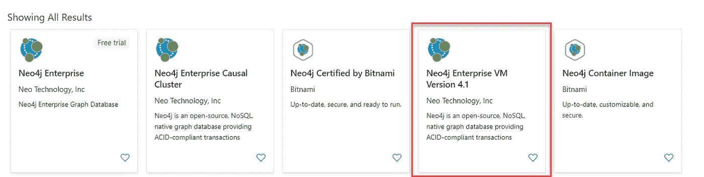
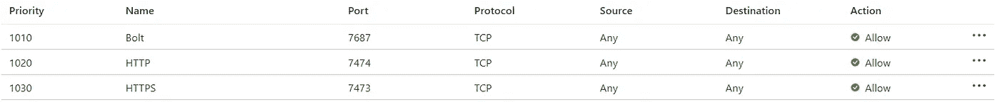
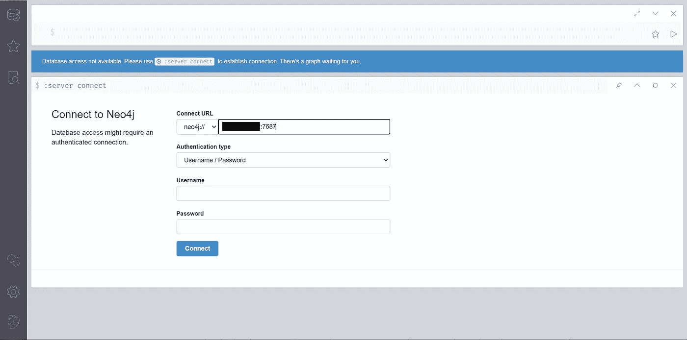
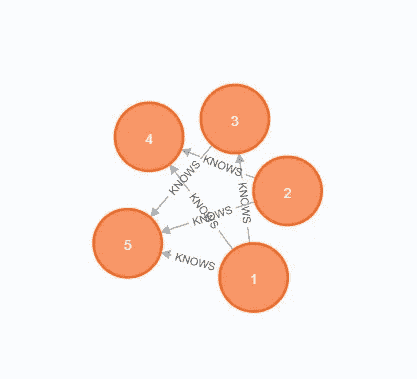
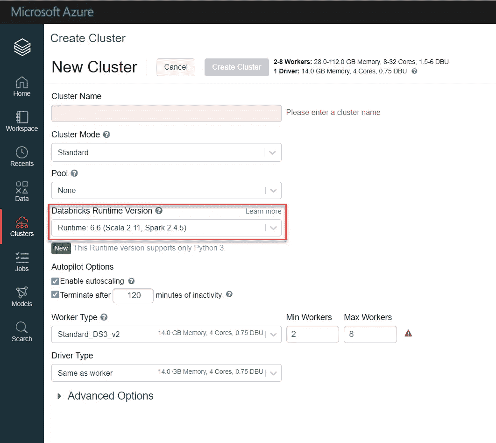
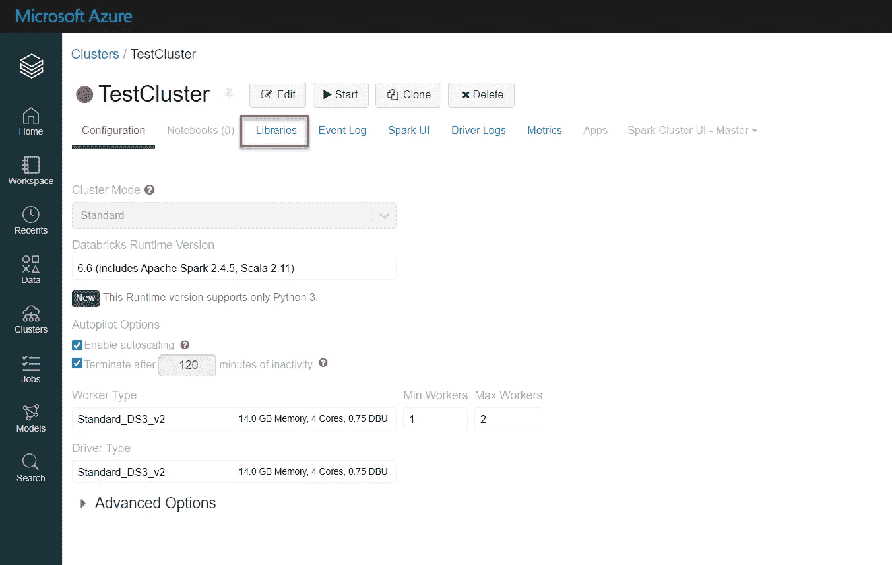
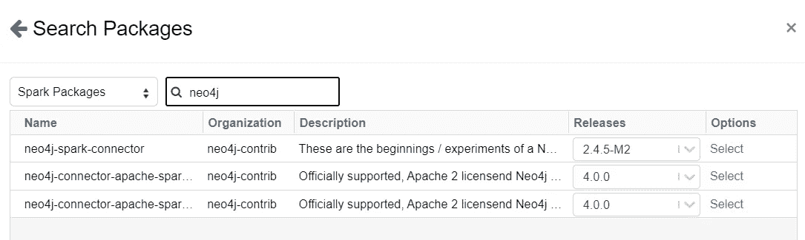
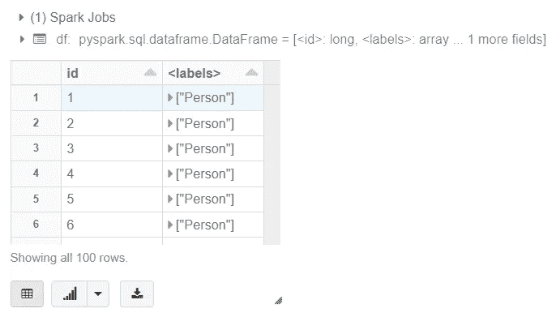
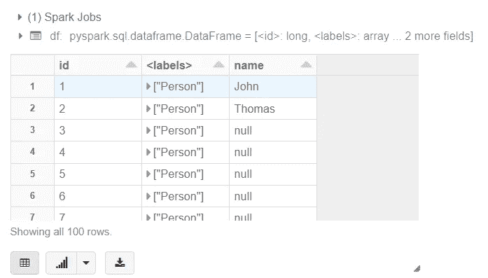

# 在数据块上使用 Neo4j 和 PySpark

> 原文：<https://towardsdatascience.com/using-neo4j-with-pyspark-on-databricks-eb3d127f2245?source=collection_archive---------16----------------------->

## [理解大数据](https://towardsdatascience.com/tagged/making-sense-of-big-data)

## 释放 Spark 和图形数据库携手工作的全部潜力


由 [Fernand De Canne](https://unsplash.com/@fernanddecanne) 在 [Unsplash](https://unsplash.com/?utm_source=medium&utm_medium=referral) 上拍摄的照片

随着最近发布的利用 Spark 数据源 API 的 Apache Spark 官方 Neo4j 连接器，在 Apache Spark 环境中查询 Neo4j 数据的方式发生了根本性的变化。除了这一变化，[以前的 Neo4j Spark 连接器被标记为不推荐使用](https://neo4j.com/developer/apache-spark/)。在本文中，我想分享一个更新的**端到端工作流，该工作流设置 Neo4j 和 Spark** 的完全互连配对，该配对利用了新连接器的功能。

在这个过程中，我们将首先使用 Azure 虚拟机设置一个 Neo4j 云实例。之后，我们将设置一个运行 Spark 的 [Azure Databricks](https://azure.microsoft.com/en-us/services/databricks/) 实例，然后使用 Apache Spark 的新 [Neo4j 连接器](https://github.com/neo4j-contrib/neo4j-spark-connector)在两个资源之间建立连接。如果您已经有了一个运行良好的 Neo4j 或 Databricks 实例，那么您当然可以跳过相应的步骤。但是，请注意每个步骤顶部的兼容性信息。

# 步骤 1:设置 Neo4j 云实例

首先，简单说一下兼容性:我们将使用的连接器支持 Neo4j 及更高版本。**不支持 3.5 之前的版本**。但是，它支持 Neo4j 企业和社区以及单实例虚拟机、因果集群和 Neo4j Aura。本文将关注单实例虚拟机的工作流。

作为我们的 Neo4j 实例，我们将使用正式的 Neo4j 企业虚拟机映像。最新版本在 Azure marketplace 中被列为 *Neo4j Enterprise VM 版本 4.1* 。如果你没有企业许可证，有 Websoft9 提供的社区版本的图片以及 Bitnami 提供的容器图片:



Azure marketplace 上 N **eo4j** 的搜索结果(作者截图)

虚拟机部署后，导航到它的 Networking 选项卡，确保它的端口设置是正确的:为了从 Spark 查询它，一个 [*螺栓*端口](https://en.wikipedia.org/wiki/Bolt_(network_protocol))必须允许入站流量。默认情况下，这是端口 7687。此外，我们将使用 Neo4j Web 接口来填充数据库，为此我们需要一个开放的 *HTTP* 或 *HTTPS* 端口。默认情况下，它们映射到端口号 7474 和 7473。如果缺少这些端口规则中的任何一个，点击*添加入站端口规则*按钮添加它们。



Neo4j 实例的入站端口设置(作者截图)

## 用数据填充 Neo4j 实例

验证端口设置后，从其概述选项卡中获取虚拟机的公共 IP，并通过导航到 *http://YOUR。VM.IP.ADDRESS:7474* 。对于新启动的虚拟机，Neo4j 可能需要几分钟才能启动并接受入站连接。如果您使用 VPN 或代理，请确保对它们进行了相应的配置，否则您可能会收到“*此站点无法访问*”错误。

如果所有设置都正确，将弹出 Neo4j 浏览器 Web UI:



Neo4j Web UI(浏览器)(作者截图)

系统将提示您输入登录凭据。输入登录数据库的默认用户名和密码:

*   用户名: *neo4j*
*   密码: *neo4j*

第一次访问时，出于安全原因，您必须立即更改默认密码。选择一个可靠的密码并登录后，就可以填充数据库了。在本指南中，我们将使用 Cypher 查询语言通过在命令行中键入以下内容来创建一个简单的虚拟数据集:

```
UNWIND range(1,100) as id
CREATE (p:Person {id:id}) WITH collect(p) as people
UNWIND people as p1
UNWIND range(1,10) as friend
WITH p1, people[(p1.id + friend) % size(people)] as p2
CREATE (p1)-[:KNOWS {years: abs(p2.id - p2.id)}]->(p2)
```

因此，将创建一个类似于下面的数据结构，其中每个 *Person* 节点都用一个 ID 标记，每个 *KNOWS* 关系都有一个附加的(任意的)属性 *years* ，它描述了双方认识多久了:



结果数据结构，限于 5 个节点(作者截图)

就是这样！我们的 Neo4j 图形数据库已经启动并运行，迫不及待地想从 Spark 中查询。我们现在将继续设置一个合适的 Spark 环境。

# *步骤 2:* 配置火花环境

再次，关于兼容性的重要说明:在撰写本文时， [**Neo4j 不支持 Spark 3.0**](https://neo4j.com/developer/spark/overview/) 的连接器。因此，我们将不得不退回到 Spark 2.4 环境，以便与 Neo4j 通信。

对于我们的设置，我们将使用 Azure Databricks 实例。在 Azure marketplace 上搜索*数据块*并创建一个新资源。除了通常的设置(资源组、名称、位置和定价层)，不需要任何特殊的配置设置。

部署完成后，通过导航到 Azure 资源的概述选项卡并单击*启动工作区*按钮，打开 Databricks 工作区。


(作者截图)

首先，我们需要一个集群。导航到集群选项卡并单击*创建集群*按钮以显示集群配置工具:



Databricks 集群创建屏幕(作者截图)

选择集群名称和可用性模式，并根据您的喜好配置工作节点的大小和数量。现在，请记住，我们被迫使用 Spark 2 设置——幸运的是，Databricks 仍然提供各种 Spark 2.4.5 发行版。确保在 *Databricks 运行时版本*字段中选择其中之一，例如**运行时版本 6.6** 运行 **Spark 2.4.5** 和 **Scala 2.11** 。

启动您的集群，一切就绪！

# *步骤 3:* 在 Neo4j 和 Spark 之间建立连接

既然我们现在已经启动并运行了 Neo4j 和 Databricks，那么是时候关注它们之间的联系了。为此，我们需要将 Apache Spark 的 Neo4j 连接器添加到我们的 Databricks 集群中。

在数据块中，导航到集群选项卡。选择先前创建的集群并访问其库选项:



Databricks 集群视图(作者截图)

现在，通过点击*安装新的*按钮，选择 Maven 并点击*搜索包*，为 Apache Spark 添加 Neo4j 连接器。键入“neo4j”查看所有可用选项。在撰写本文时，搜索中出现了三个包:



(作者截图)

*   **neo4j-spark-connector** :这是[弃用的连接器版本(2.4)](https://neo4j.com/developer/apache-spark/) 。它不再受到开发者的积极支持。
*   **neo4j-connector-Apache-spark _ 2.11**:这是当前的连接器版本(4.0)，也是我们将要使用的。
*   neo4j-connector-Apache-spark _ 2.12:这也是当前的连接器版本，唯一的区别是它是为 Scala 版本 2.12 编写的。因为我们的 Databricks 环境运行 Scala 2.11，所以这个不适合我们的目的。

根据开发人员的说法，由于 API 的不同，将两个连接器分开是必要的:

> 由于 API 的差异，不同的 scala 版本需要不同的 JAR 文件。确保您有适合您的环境的 JAR 文件。

## 阅读 Neo4j

连接器安装完成后，在工作区选项卡中创建一个新的 Jupyter 笔记本(右击→ *新建*)。在插入 Neo4j 虚拟机的 *IP、用户名*和*密码*后，通过运行以下命令尝试读取 Neo4j 数据库的节点数据:

```
df = spark.read.format("org.neo4j.spark.DataSource")\
 .option("url", "bolt://***XXX.XXX.XXX.XXX***:7687")\
 .option("authentication.type", "basic")\
 .option("authentication.basic.username", "***neo4j"***)\
 .option("authentication.basic.password", "***password"***)\
 .option("labels", "Person")\
 .load()
display(df)
```

如果您收到*无法连接*错误，请确保您的 Neo4j 虚拟机仍在运行，并且其 Bolt 端口接受入站流量。如果查询返回

```
java.lang.NoSuchMethodError: scala.Product.$init$(Lscala/Product;)V
```

您很可能为错误的 Scala 版本安装了连接器——确保您选择的是 Scala 2.11 版本(见上文)。

如果一切都解决了，查询将返回如下所示的数据帧:



演示查询以数据帧格式返回的结果(作者截图)

作为 Python 的替代，您也可以通过在笔记本单元格顶部添加 *%scala* [魔法命令](https://docs.databricks.com/notebooks/notebooks-use.html#mix-languages)来使用 Scala 进行查询:

```
%scalaimport org.apache.spark.sql.{SaveMode, SparkSession}val spark = SparkSession.builder().getOrCreate()val df = spark.read.format("org.neo4j.spark.DataSource")
 .option("url", "bolt://***XXX.XXX.XXX.XXX***:7687")
 .option("authentication.type", "basic")
 .option("authentication.basic.username", "***neo4j"***)
 .option("authentication.basic.password", "***password"***)
 .option("labels", "Person")
 .load()display(df)
```

## 写入 Neo4j

写入图形数据库的工作方式类似。在下面的查询中，我们将更新原始数据，以包括前两个节点的名称:

```
df = spark.createDataFrame(
 [(1, "John"),(2, "Thomas")],
 ["id", "name"]
)df.write.format("org.neo4j.spark.DataSource")\
 .option("url”, "bolt://***XXX.XXX.XXX.XXX***:7687")\
 .option("authentication.type", "basic")\
 .option("authentication.basic.username", "***neo4j***")\
 .option("authentication.basic.password", "***password***")\
 .option("labels", ":Person")\
 .option("node.keys", "id")\
 .mode("Overwrite")\
 .save()
```

请注意，我们使用了*“Overwrite”*模式，并将 *node.keys* 选项设置为 DataFrame 的 *id* 列，以便将新值附加到现有节点。事实上，再次运行 read 查询将返回我们之前的结果，该结果用前两个节点的 name 属性进行了更新:



写入数据库后读取查询的结果(作者截图)

就是这样！🎉您已经成功地建立了一对完全基于云的互联 Apache Spark 和 Neo4j，使您能够充分利用“传统”大数据和图形数据库的潜力。

要获得更多的查询示例和语法概述，请深入阅读官方的 [Neo4j 连接器 for Apache Spark 文档](https://neo4j.com/developer/spark/overview/)或查看快速指南[阅读](https://neo4j.com/developer/spark/reading/)和[编写来自/到 Neo4j 的](https://neo4j.com/developer/spark/writing/)。其他示例可以在 [Zeppelin 笔记本示例库](https://github.com/utnaf/neo4j-connector-apache-spark-notebooks)中找到。连接器还支持 Cypher 查询，允许您重用 Neo4j 桌面/ Web 应用程序中的现有查询。密码查询示例可在[官方密码页面](https://neo4j.com/developer/cypher/)上找到。