# 利用网络科学探索 Instagram 上的标签文化

> 原文：<https://towardsdatascience.com/using-network-science-to-explore-hashtag-culture-on-instagram-1f7917078e0?source=collection_archive---------12----------------------->

## 如何从 Instagram 中抓取标签，并使用 NetworkX 建立标签之间的关系模型


来源:[https://www . digital ambience . com/insta gram-light-forest-by-hey-hush/](https://www.digitalambiance.com/instagram-light-forest-by-hey-hush/)

# 摘要

该项目提出，网络科学和图论可以用来有效地分析 Instagram 上的标签文化。Instagram 标签的关系特征可以通过这些技术实现，这允许更深入地理解跨标签的对话和主题。

## 方法

为了演示这个想法，我写了一个实用的技术演练，演示如何使用 Python 和 NetworkX 来实现这一点。

大约有 37000 条 Instagram 帖子至少提到了一次#happiness，这些帖子都是从 Instagram 上删除的。语料库中所有唯一的标签(除了# happy)代表图中的**节点**。**如果标签在同一篇文章中被提到，它们之间就会形成边缘**。

这产生了一个无方向的“幸福”图，然后使用社区检测和各种中心性测量进行分析。

## 调查的结果

社区检测确定了三个集群，解释为:

*   快乐的方面似乎是关于人们**所做的事情和经历**(例如:’*#摄影*，*#夏天，**#旅行*，*#家庭*)
*   幸福的方方面面似乎大体上是关于人们如何思考和感受的(例如:生活、动机、T21、灵感、名言)
*   第三个非常独特的集群完全是关于*#婚礼、#庆典*和*#派对*

## 结论和应用

这种方法表明，图论可以成为探索社交媒体元数据(如标签)的一种非常直观和有用的方法。它可以应用于两个直接领域:

1.我们可能希望绘制主题实体的图形，例如，发布可持续发展、英国退出欧盟、冠状病毒的人

2.我们可以使用图表来模拟和理解围绕特定品牌、事件和地点的对话

*(我们需要记住 Instagram 上内容的性质，因为这将指导什么是合适的应用)*

可以在我的 GitHub 上找到复制该任务的所有功能代码:

[](https://github.com/kitsamho/Instagram_Scraper_Graph) [## kitsamho/insta gram _ Scraper _ Graph

### 这里有两个 Python 文件，每个文件都包含一个自定义的 Instagram 类。您需要有一个 Instagram 帐户…

github.com](https://github.com/kitsamho/Instagram_Scraper_Graph) 

# 内容


乔安娜·科辛斯卡在 [Unsplash](https://unsplash.com?utm_source=medium&utm_medium=referral) 上的照片

## 1)背景和背景

*   Instagram 是巨大的
*   标签文化:让数据科学家的生活更轻松！
*   一张图片胜过千言万语…还是一堆标签？
*   Instagram 上的‘快乐’对人意味着什么？

## 2)网络科学和图论

*   什么是图？
*   我们可以在分析中使用图论的哪些方面？
*   关于图表的进一步阅读

## 3)在 Python 中构建功能

*   使用 Selenium WebDriver 在 Instagram 上搜索标签
*   捕捉独特的 Instagram URL
*   使用多线程处理从 html 解析标签和其他内容
*   特征生成和探索性分析
*   数据选择
*   图形构建
*   可视化/分析和解释

# 1)背景和背景


照片由 [Noiseporn](https://unsplash.com/@noiseporn?utm_source=medium&utm_medium=referral) 在 [Unsplash](https://unsplash.com?utm_source=medium&utm_medium=referral) 上拍摄

# Instagram 是巨大的

Instagram 成立于 2006 年，是一个创意表达的小众场所。早期用户蜂拥而至，热衷于分享他们的城市涂鸦、豆奶拿铁和拉面的照片。iPhone 1 + Instagram 是酷的标志——数码潮人的黄金时代。

唉，这并没有持续多久。Instagram 的中产阶级化是不可避免的，当脸书在 2012 年收购 Instagram 时，他们迅速通过广告将其货币化，并将 Instagram 变成了一棵巨大的摇钱树。

2020 年，Instagram 不再酷，它是一个商业巨兽。


来源:[https://www . statista . com/statistics/253577/number-of-monthly-active-insta gram-users/](https://www.statista.com/statistics/253577/number-of-monthly-active-instagram-users/)

据估计 [**有 10 亿活跃月用户**](https://instagram-press.com/our-story/) 和 [**5 亿**](https://instagram-press.com/our-story/) 每日故事，Instagram 的崛起和影响力令人印象深刻。

随后，Instagram 在许多方面已经成为主流消费文化的可靠晴雨表，这意味着它本身是一个潜在的有用工具，可以用来了解人们的情况。

虽然有理由假设 Instagram 的图片和视频将是主要的“首选”数据来源，但我发现**分析 Instagram 的标签文化**是一种更有效的方式来了解 Instagram 上出现的主题和话题。再加上从网络科学中借用的分析技术，意味着主题和话题之间的关系可以更容易理解。

# 标签文化:让数据科学家的生活更轻松！


照片由[布丽娜·布鲁姆](https://unsplash.com/@brina_blum?utm_source=medium&utm_medium=referral)在 [Unsplash](https://unsplash.com?utm_source=medium&utm_medium=referral) 上拍摄

数据科学家工作的一个更重要的部分是能够投入时间来确保我们的数据符合目的，这包括彻底清理我们的数据。这可能会占用大量时间，尤其是社交媒体数据往往非常**非结构化**并且经常夹杂着“噪音”。

> 如果没有足够的预处理，我们对社交媒体数据使用的自然语言处理技术可能会导致难以解释和洞察的输出。

我们可以使用各种方法来清理和组织我们在社交媒体上发现的原始语言，但当用户为我们做这件事时，它变得更加容易。Instagram 上的标签文化——本质上是有组织的、正常的和不那么喧闹的——是一种文化现象，为我们做了所有这些艰苦的工作。

# 一张图片胜过千言万语。还是一堆标签？


乔治·帕甘三世在 [Unsplash](https://unsplash.com?utm_source=medium&utm_medium=referral) 上的照片

> 由 octothorpe 符号(#)引入的标签是一种元数据标签，用于 Twitter 和其他微博服务等社交网络。它允许用户应用用户生成的动态标签，帮助其他用户轻松找到具有特定主题或内容的邮件"

人们经常用一系列标签来结束 Instagram 帖子。标签可以提供那个人当时在想什么、感觉什么、观察什么的简明摘要。标签提供了图片本身无法提供的上下文和含义。

让我们找一个例子来说明这一点。

# Instagram 上的‘快乐’对人意味着什么？


蒂姆·莫斯霍尔德在 [Unsplash](https://unsplash.com?utm_source=medium&utm_medium=referral) 上的照片

社交媒体越来越有可能被抨击为让人痛苦的东西。可悲的是，这是事实。

让我们逆势而为，翻转这个真相，在 Instagram 上探索**的快乐**。

以下 Instagram 帖子在帖子正文中包含了**#幸福**。从这篇文章中，我们可以单从图片中解读出什么？


[https://www.instagram.com/thatdesivegangal/](https://www.instagram.com/thatdesivegangal/)—包含#幸福的公众号

不多。也许和音乐有关？

除了显而易见的以外，从这张照片上几乎看不出什么。当他们发布这个的时候，他们还在想什么/感觉什么？

现在，当我们查看这个人在**和**他们的帖子旁边制作的所有标签时，我们对这个人以及他们在那个时刻与**#快乐**的联系有了更多的了解。


[https://www.instagram.com/thatdesivegangal/](https://www.instagram.com/thatdesivegangal/)—包含#幸福的公众号

对这个人来说，快乐与积极、动力、改变和减肥联系在一起。

> 虽然 Instagram 图片能告诉我们一些东西，但人们使用的标签能告诉我们更多的东西。

## 扩大标签分析

现在，这只是一个 Instagram 帖子，包含了**#幸福**。当我们看到周围其他人的帖子的标签提到**#幸福时会发生什么？**

如果我们扩大分析范围，查看成千上万条包含快乐的帖子，会发生什么？


Instagram 上所有包含# happy 的帖子

很快我们就会有大量的标签需要导航。什么样的可扩展方法可以让我们理解所有这些数据？

这就是我们可以使用**网络科学和图论**来帮助我们的地方。

# 2)网络科学和图论


照片由[安娜斯塔西娅·杜尔吉尔](https://unsplash.com/@dulgier?utm_source=medium&utm_medium=referral)在 [Unsplash](https://unsplash.com?utm_source=medium&utm_medium=referral) 上拍摄

> [网络科学是一个蓬勃发展且日益重要的跨学科领域，其重点是将复杂的社会、生物和技术系统表示、分析和建模为网络或图形](http://tuvalu.santafe.edu/~aaronc/courses/5352/)

来源:http://tuvalu.santafe.edu/~aaronc/courses/5352/

我喜欢把网络科学和图论看作是让我们理解**事物如何联系的方法。**我们可以借用网络科学和图论的一些基本原理来理解**insta gram 上的 hashtags 是如何连接的。**

与网络科学和图论相关的主题非常密集，需要很长时间才能涵盖。这将分散项目的实际重点。然而，有一些简单但基本的概念需要解释。

# 什么是图？

一个**图** ***(G)*** 是一个网络的抽象表示。图是由**顶点 *(V)*** 和 ***边(E)*** 其中***【𝐺=(𝑉,𝐸】***

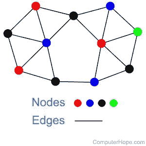

来源:[https://www.computerhope.com/jargon/n/node.htm](https://www.computerhope.com/jargon/n/node.htm)

*   图中的**节点 *(V)*** 代表我们数据中存在的唯一数据点。在 hashtag 分析的情况下，hash tag 表示我们网络中的节点是有意义的。因此，如果我们的 **#happiness** 数据集只有两个标签，即 **#A** 和 **#B** ，我们将有两个节点

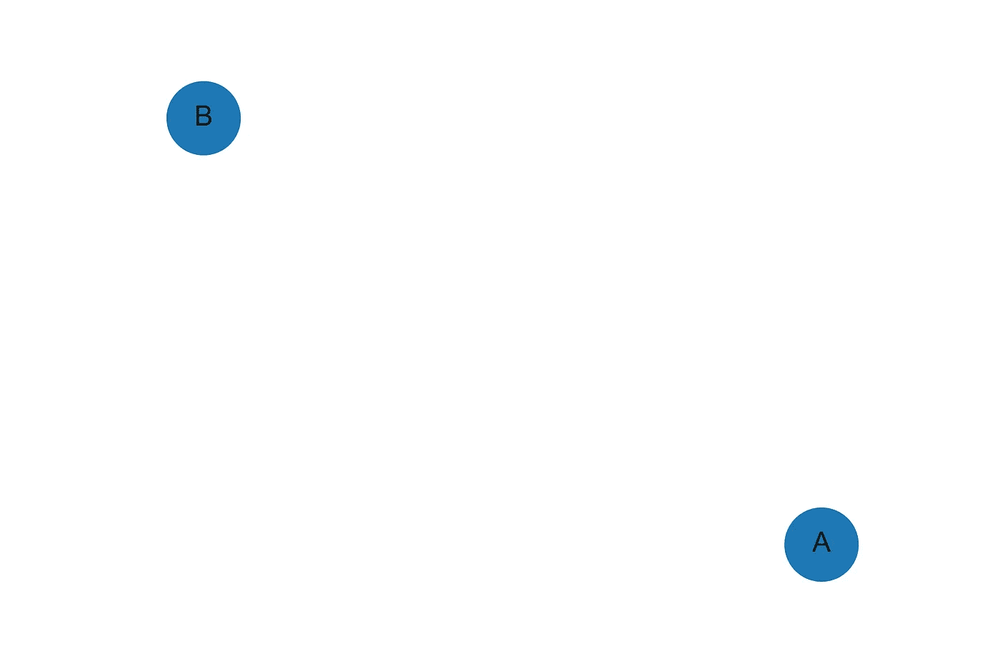

代表两个 hashtags 的两个节点

*   **边 *(E)*** 是表示节点间某种关系的连接。在分析标签的情况下，将这种关系表示为某种事件可能是有意义的，即，如果标签 **#A** 在与# B 相同的帖子中被提及，我们将假设在 **#A** 和 **#B** 之间存在关系，因此我们将**在这两个节点之间创建一条边**

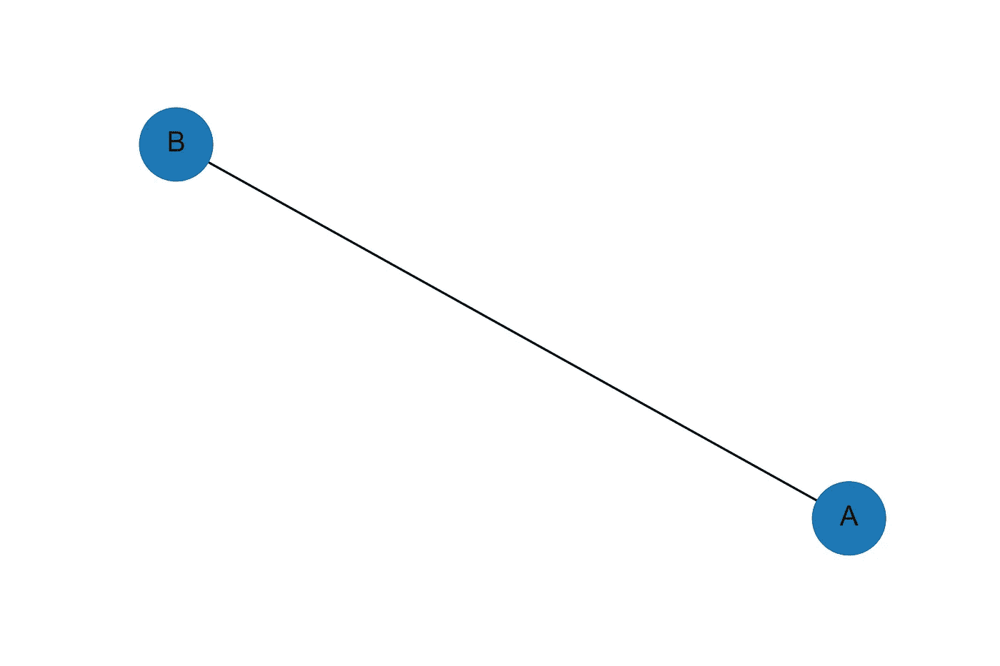

如果两个标签在同一篇文章中被同时提及，那么它们之间就会形成一条边

当我们将其他帖子的标签添加到图表中，并模拟它们与之前所有帖子的关系时，我们开始看到结构形式。

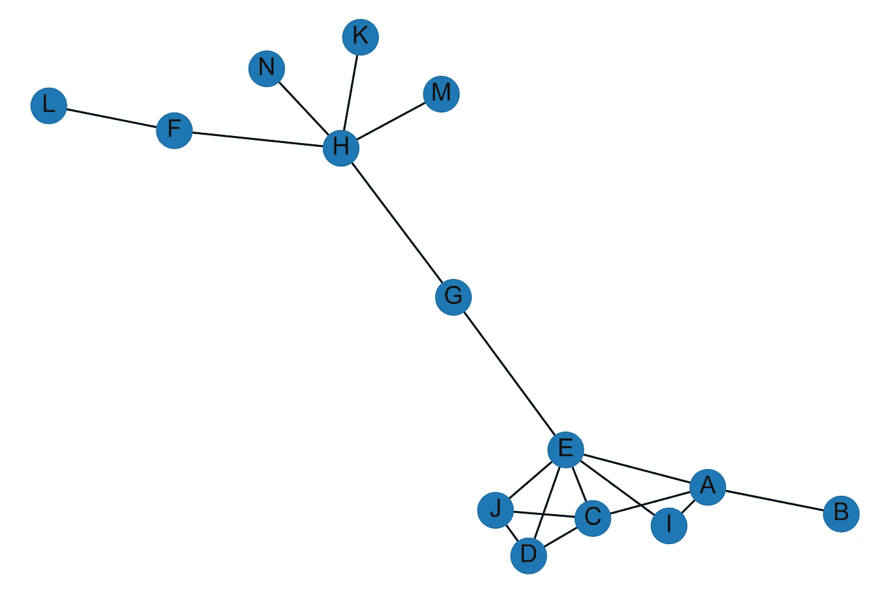

随着更多的标签被添加到图表中，我们可以看到哪里有联系，我们可以开始看到结构形式

# 我们可以在分析中使用图论的哪些方面？

*   **社区检测**。我们可以使用算法来识别和标记与**#快乐相关的**主题群**。**在这个例子中，我们有 14 个标签，它们都以不同的方式连接在一起，但是形成了不同的簇。

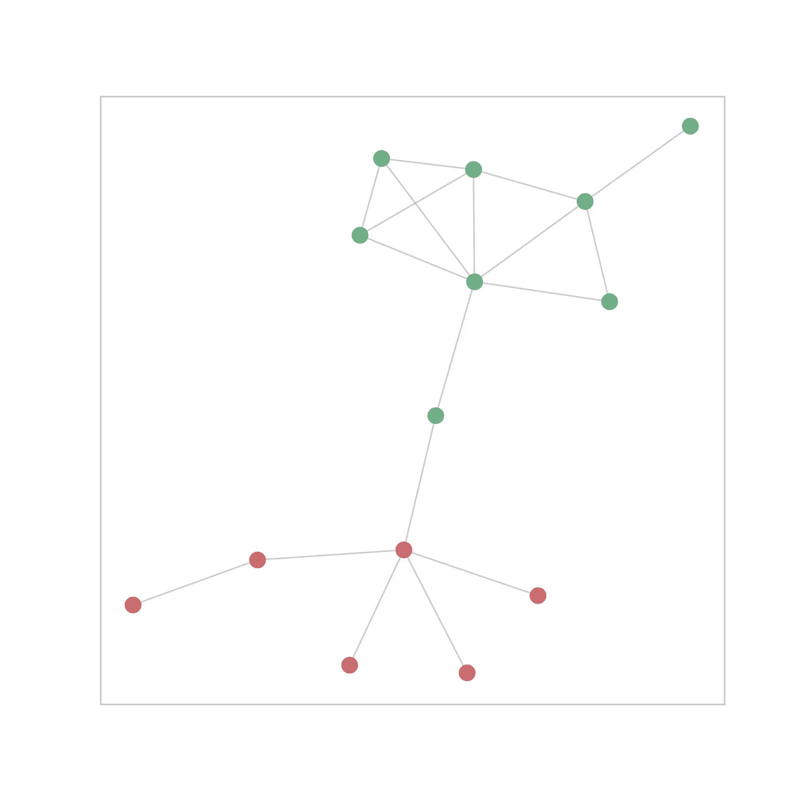

识别图中的标签社区

*   **度中心性/中介中心性。我们可以计算出网络中哪些标签在连接整个网络时特别重要。就像希思罗机场连接了很多世界一样，什么标签连接了**#幸福**“风景”？**

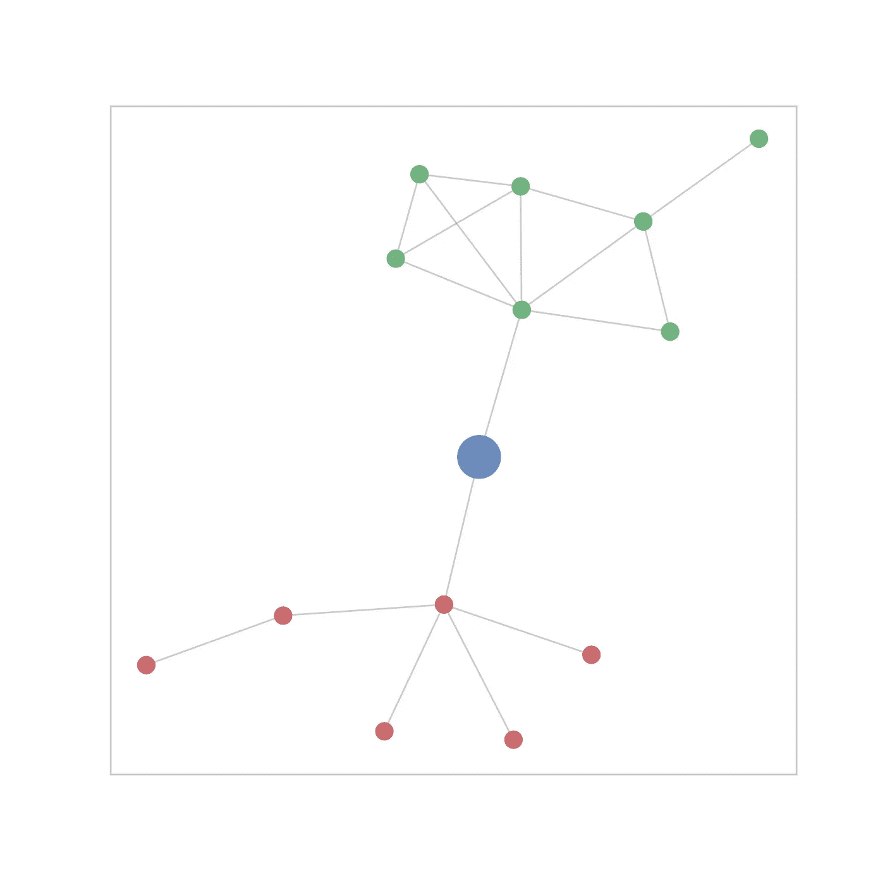

确定哪些标签在图表中起着核心作用

*   **可视化。如果我们用散点图来绘制网络，这是一种非常引人注目的方式来可视化大量关于幸福的信息**

# 关于图表的进一步阅读

[*迈尔·杨奇煜*](https://medium.com/u/ddcee06de4c8?source=post_page-----1f7917078e0--------------------------------) *写了一整个系列，很好地涵盖了图论的内容。如果你觉得这个话题有趣，我强烈建议你在某个时候读一读这篇文章。*

[](/introduction-to-graphs-part-1-2de6cda8c5a5) [## 图表介绍(第一部分)

### Python 中的主要概念、属性和应用

towardsdatascience.com](/introduction-to-graphs-part-1-2de6cda8c5a5) 

现在，让我们看看构建网络需要采取的实际步骤。

# 3)在 Python 中构建功能


凯文·Ku 在 [Unsplash](https://unsplash.com?utm_source=medium&utm_medium=referral) 上拍摄的照片

我构建了两个 Python 类，处理从捕捉数据到构建、可视化和分析幸福图的所有过程。每个类别中的关键管道概述如下。

```
**class InstagramScraper()**
```

*   **使用 Selenium WebDriver 在 Instagram 上搜索标签**
*   **捕捉唯一的 Instagram URL 的**
*   **使用多线程处理从 post html 解析标签和其他内容**

```
**class InstagramGraph()**
```

*   **特征生成&探索性分析**
*   **数据选择**
*   **图形构建**
*   **可视化**

您可以在这里访问这些类的完整代码及其相关的自述文档:

[https://github.com/kitsamho/Instagram_Scraper_Graph](https://github.com/kitsamho/Instagram_Scraper_Graph)

# InstagramScraper 类()


来源:[https://hacker noon . com/how-to-scrape-a-website-not-get-black-list-271 a605 a0d 94](https://hackernoon.com/how-to-scrape-a-website-without-getting-blacklisted-271a605a0d94)

```
**class InstagramScraper()**
```

*   **使用 Selenium WebDriver 在 Instagram 上搜索标签**
*   **捕捉独特的 Instagram 网址**
*   **使用多线程处理从 html 解析标签和其他内容**

这一阶段结合使用自动网页浏览和 html 解析从 Instagram 帖子中抓取内容。我构建了一个定制的 Python 类 *InstagramScraper t* ,它包含了一系列抓取和数据提取方法，可以返回抓取的 Instagram 数据的 Pandas DataFrame。

我将用几个示例代码块向您展示下面的主要过程，以突出所涉及的主要步骤。

## 使用 Selenium WebDriver 在 Instagram 上搜索标签

Instagram 上有一个功能，用户可以搜索特定的标签，Instagram 会返回包含该标签的所有帖子。这是我们获取所需数据的第一步；使用 [Selenium webdriver](https://chromedriver.chromium.org/downloads) 让 Instagram 为我们完成这项工作。

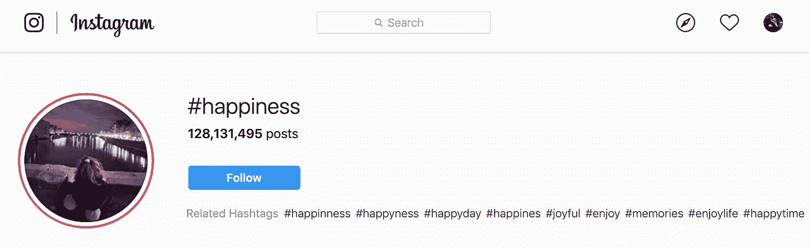

在 Instagram 上搜索包含# happy 标签的 Instagram 帖子

## 捕捉独特的 Instagram URL


使用 Selenium WebDriver 捕获独特的 Instagram URLs

Instagram 上的每个帖子都有自己的**唯一网址**。在我们搜索了所有包含特定标签的文章之后，第一步是获取所有包含该标签的文章的唯一 URL。

我发现最好的方法是结合使用 Selenium WebDriver 和动态解析 html，当我们滚动浏览所有内容时，提取每个 posts href 属性到一个数据结构。

由于 Instagram 网站的这一部分是高度动态的，需要一致的滚动来加载新图像，使用某种基于浏览器的自动化，如 Selenium WebDriver，是捕捉数据的唯一可行的方法。这意味着获取所有链接可能需要一点时间。

## 捕捉唯一的 Instagram URL 示例代码

使用 Selenium web driver & Beautiful Soup 捕捉独特的 Instagram URL。来源:[https://github.com/kitsamho/Instagram_Scraper_Graph](https://github.com/kitsamho/Instagram_Scraper_Graph)

## 解析标签和其他内容

一旦你有了所有链接的列表，你就可以结合使用 **urlopen** 和 html 解析(我用的是 **Beautiful Soup** )来获取每个 Instagram 帖子的数据。

一旦你有了每个帖子的 html 并解析了它的内容，你会发现 Instagram 帖子的数据有一个类似字典/ JSON 风格格式的一致结构

## 解析标签和其他内容—示例代码

每个 Instagram 帖子都包含 dictionary / JSON 类型结构的数据。我们使用单独的函数迭代每个帖子，提取我们想要的数据。来源:https://github.com/kitsamho/Instagram_Scraper_Graph

# *InstagramScraper* 输出

InstagramScraper 类的主要输出是一个 Pandas 数据帧，其中包含大量 post 变量。

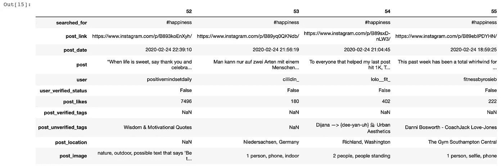

来自 InstagramScraper 类的熊猫数据帧输出

这些变量中的大部分都是自解释的，并且提供了各种各样的选项来进行 hashtags 之外的探索性分析。

现在我们有了收集的数据和一个漂亮整洁的熊猫数据框架，我们可以开始考虑处理我们的数据，为建立我们的网络和可视化我们的图表做准备，这是事情变得真正有趣的地方。

# InstagramGraph()类


来源:[https://TechCrunch . com/WP-content/uploads/2017/12/insta gram-hash tags . png？w=730 & crop=1](https://techcrunch.com/wp-content/uploads/2017/12/instagram-hashtags.png?w=730&crop=1)

我构建了第二个 python 类，名为 *InstagramGraph* ，它也包含一系列方法，允许您分析 Instagram 数据集，并最终使用 Plotly 可视化将 hashtag 数据建模为 NetworkX graph 对象的实例。

```
**class InstagramGraph()**
```

该类别中的关键流程包括:

*   **特征生成&探索性分析**
*   **数据选择**
*   **图形构建**
*   **可视化/分析&解读**

# **特征创建&探索性分析**


由[瓦迪姆·谢尔巴科夫](https://unsplash.com/@madebyvadim?utm_source=medium&utm_medium=referral)在 [Unsplash](https://unsplash.com?utm_source=medium&utm_medium=referral) 上拍摄的照片

下面的代码块概述了来自 *InstagramGraph* 类的管道，该类包含一套在我们的数据中创建新特征的方法。

一系列方法在我们收集的 Instagram 数据中生成新特征。来源:[https://github.com/kitsamho/Instagram_Scraper_Graph](https://github.com/kitsamho/Instagram_Scraper_Graph)

这里有几种方法，一些是语言学的(例如确定帖子的语言)，尽管这种方法中的大多数过程产生额外的描述性指标，例如按用户的平均帖子计数、按帖子的总标签计数和按用户的平均标签使用。

虽然这些新特性/指标中的一些与图形构建没有直接关系，但总是值得生成更多的数据点，因为它提供了对主题进行一些探索性分析的机会，这可能会提供更多关于我们的图形模型所揭示的内容的上下文。它也可能激发一些你最初没有考虑过的其他分析想法。

让我们来探索其中的一些。

## 语言

Python 中的 [langdetect](https://pypi.org/project/langdetect/) 库允许我们通过 API 访问谷歌翻译库，并赋予我们在文本中识别语言的能力。

***注意——由于谷歌云 API 请求的限制，在处理大量数据时，运行速度会非常慢。出于举例的目的，这很好；如果你想生产这个，你可能会想一个更快的选择，并考虑支付。***

包含# happy 的帖子的语言分布

正如我们所看到的，Instagram 上大多数关于 **#happiness** 的帖子都是英文的——超过我们数据集的 80%。

## 用户发布频率

对一些分布的观察表明，关于用户发布频率的数据是非常正偏的；有少数异常帐户发布非常频繁(多达 140 次)，而大多数发帖者只发布一次。

在我们的数据中，用户发帖的频率——正常化为 1

## **提取标签**

为了提取我们的标签，我创建了两个方法来完成这项工作。一种方法接受一个字符串输入并返回一个 hashtags 列表。如果人们没有在他们的标签串之间加入空格，代码会考虑到这一点，并将它们“解包”到单独的标签中。

从字符串中提取标签。来源:[https://github.com/kitsamho/Instagram_Scraper_Graph](https://github.com/kitsamho/Instagram_Scraper_Graph)

## 分析

对帖子的标签频率的分析表明，虽然帖子的频率倾向于遵循*均匀分布*，但是有一些异常的帖子包含异常高数量的标签。进一步的研究表明，这部分似乎是由在数据集上多次发帖的人驱动的(高频发帖者)。所以从广义上来说，那些经常发帖的人也倾向于在他们的帖子中使用更多的标签。

虽然标签使用的分布基本一致，但高频发帖者在帖子中使用更多的标签

## 词条匹配标签

然后，第二种方法获取这个 hashtags 列表，并在适当的时候查看输入的 **lemmatise** 。对于那些不熟悉词条满足的人来说，这是我们将一个单词简化为其词根形式的过程。例如，如果我们有标签**#最快乐的**和**#更快乐的**——这些都是动词**#快乐的变形。**因此，lemmatisation 将这些变化还原为 **#happy。我已经使用了一个空间模型的实例来执行引理满足。**

## lemmating hash tags—示例代码

使用空间匹配标签。来源:[https://github.com/kitsamho/Instagram_Scraper_Graph](https://github.com/kitsamho/Instagram_Scraper_Graph)

# 数据选择


[维多利亚诺·伊斯基耶多](https://unsplash.com/@victoriano?utm_source=medium&utm_medium=referral)在 [Unsplash](https://unsplash.com?utm_source=medium&utm_medium=referral) 上拍摄的照片

好了，下一步是选择我们想要建模的数据。代码概述了来自 InstagramGraph 类的管道，该类包含一套允许我们选择我们想要的数据的方法。

在我们构建图表之前，选择数据的子集。来源:[https://github.com/kitsamho/Instagram_Scraper_Graph](https://github.com/kitsamho/Instagram_Scraper_Graph)

## 选择语言

虽然 Instagram 是一个国际平台，但为了简单起见，我们可能会考虑过滤掉非英语帖子。正如我们之前看到的，超过 80%的关于**#幸福**的数据是英文的，所以关注这些数据的子集是有意义的。

## 删除已验证的用户

经过验证的用户往往是品牌、名人或网上商店，即不代表 Instagram 普通用户的“人”。根据您的分析目标，您可能需要考虑从数据中删除已验证的用户。

## 移除高频海报

对高频海报的粗略检查显示，这些有时是未经验证的账户，在未经验证的状态下使用 Instagram 出售东西。我们觉得这代表了我们想了解的观众吗？如果是，我们可以把它们留在里面，如果不是，我们可以在构建图表之前把它们过滤掉。

## 使用 lemmatised 标签？

我认为在可能的情况下选择 lemmatise 抓取的标签是有意义的，因为它减少了构建图表所需的数据量——我们不一定需要所有额外的数据。

# **图形构建**


兰迪·法特在 [Unsplash](https://unsplash.com?utm_source=medium&utm_medium=referral) 上的照片

既然我们已经选择了要建模的数据，我们就可以构建图表了。我们为此使用的管道如下:

InstagramGraph 类中的方法，包含允许创建包含 hashtag 数据集的边和节点数据的 Graph 对象的进程管道。来源:https://github.com/kitsamho/Instagram_Scraper_Graph

这条管道中有三个主要流程:

# 编译一个列表列表

这只是将 hashtags 从我们的数据帧提取到一个列表列表中——每个子列表代表我们的 **#Happiness** 数据集中的一篇文章。通过将输入作为列表的简单列表，我们可以很容易地将这种图形构建方法重新用于将来的其他数据源，在那里我们可以以类似的结构/列表格式的列表来争论原始数据

## *编译列表列表—示例代码*

编辑一个由 n 个列表组成的列表，其中每个列表包含一个人的标签，n 是 Instagram 帖子的总数。默认的停用词被删除，并可选择添加更多停用词。资料来源:https://github.com/kitsamho/Instagram_Scraper_Graph

## 编译列表列表—示例输出

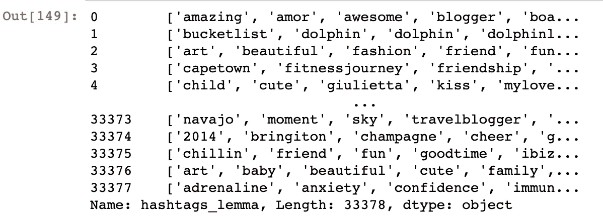

从一系列标签中提取一个列表列表

# 识别边和节点

下一步是获取我们的列表列表，并使用它来生成存在于整个数据集的节点和边。请记住，节点是数据集中唯一的标签，如果任意两个标签在同一篇文章中同时出现，就会创建一条边。

## 识别边和节点—示例代码

计算 hashtag 数据中存在的所有节点和边——保留几个数据帧作为属性。来源:[https://github.com/kitsamho/Instagram_Scraper_Graph](https://github.com/kitsamho/Instagram_Scraper_Graph)

## 识别边和节点-示例输出

该方法将两个生成的数据帧保存为属性—一个包含所有节点的数据帧和一个包含所有边的数据帧。

## 节点数据框架

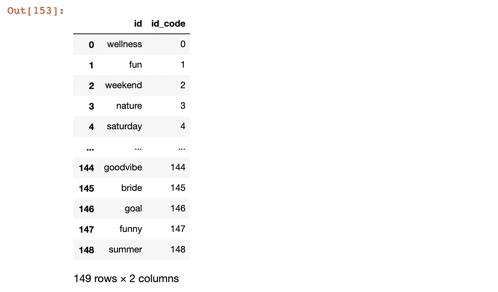

节点数据帧——每一行代表#Happiness 数据集中存在的一个唯一的标签

## **边缘数据帧**

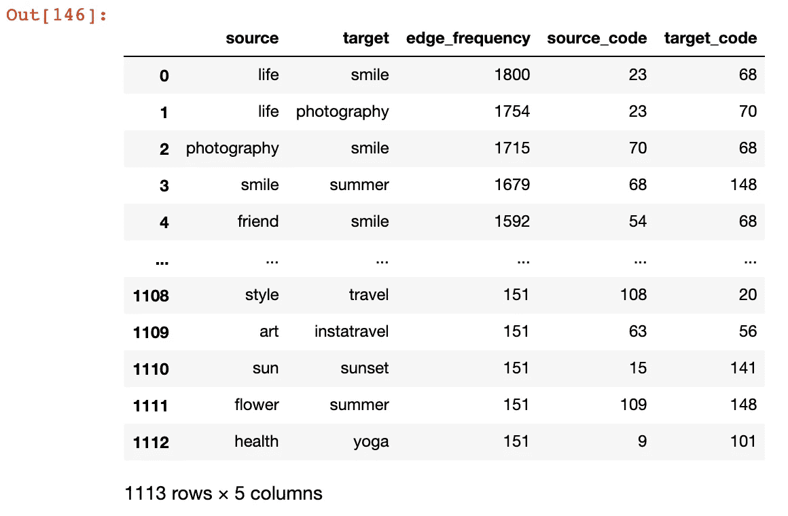

边缘数据框-每行代表#Happiness 数据集中存在的唯一边缘。边缘频率是指该配对在#Happiness 数据集中出现的次数

# 构建图表

下一步是将这些节点和边添加到 NetworkX 图形对象(G)的实例中。

## 构建图表—示例代码

获取边和节点数据并将其添加到 NetworkX graph 对象的实例中。来源:https://github.com/kitsamho/Instagram_Scraper_Graph

## 构建图表—示例输出

一旦我们创建了 NetworkX 图形对象，我们就可以使用各种计算出的图形属性来进一步增强我们的节点数据。

*   **中间中心性**
*   **邻接频率**
*   **聚类系数**
*   **社区**

## **用图形属性增强的节点数据框架**

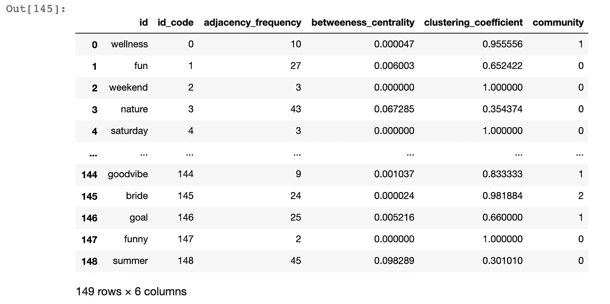

使用来自 NetworkX 的新指标增强了节点数据框架

# **可视化**


照片由 [russn_fckr](https://unsplash.com/@russn_fckr?utm_source=medium&utm_medium=referral) 在 [Unsplash](https://unsplash.com?utm_source=medium&utm_medium=referral) 上拍摄

现在我们有了一个 NetworkX graph 对象的实例，它是用从我们的 **#Happiness** 数据集中提取的节点和边数据构建的。

## **曲线图**

我们现在可以使用 Plotly 将 hashtag 图可视化为一个相连的散点图。

在 Plotly 中将 hashtag 图绘制成散点图，带有各种参数，允许定制显示的数据。来源:[https://github.com/kitsamho/Instagram_Scraper_Graph](https://github.com/kitsamho/Instagram_Scraper_Graph)

我提出了几个论点，允许对视觉化进行一定程度的定制。

```
**def plotGraph**(node_size=’adjacency_frequency’,colorscale=’Viridis’)
```

我认为使用节点大小来传达一些其他变量是有意义的——默认为“邻接频率”,即一个节点与多少个其他节点有边连接。在这种情况下，较小的节点将代表具有较少边的 hashtag，相反，较大的节点将具有较多边。我们可以通过应用与节点大小相关的色标来进一步强调这一点。

```
**def plotGraph**(layout=nx.kamada_kawai_layout)
```

NetworkX 有一些不同的图形布局。kamada kawai 布局以尽可能少的重叠边的方式排列节点。因此，这有一种趋势，节点的排列方式传达集群…但最重要的是，往往是最容易解释的布局。还有其他选择，如圆形布局、随机布局，但根据我的经验，这些更难理解。

```
**def plotGraph**(light_theme=True)
```

有两种颜色主题，浅色和深色。

# 调用绘图函数…

#幸福图的网络图可视化——节点的大小与它们到其他节点的边的频率正相关。来源:https://github.com/kitsamho/Instagram_Scraper_Graph

我们可以很容易地看到在**#幸福**图中有几个连接良好的标签(有更多节点连接的标签)。**微笑**、**生活**、**家庭**、**动机、聚会**……这些都是网络上经常被提及的标签。

正如我们所看到的，force directed 布局倾向于将连接良好的标签组推到一起。如果我们再次绘制图表，但使用社区标签对节点进行着色，我们可以更好地可视化社区是如何脱离的。

```
**def plotGraph(**community_plot=True)
```

#幸福图的网络图可视化——节点的颜色代表使用 NetworkX 计算的社区，节点大小代表邻接频率。来源:[https://github.com/kitsamho/Instagram_Scraper_Graph](https://github.com/kitsamho/Instagram_Scraper_Graph)

## 旭日图

在**#幸福**网络中似乎有三个容易识别的社区。我们可以使用 sunburst 可视化来探索哪些特定的标签有助于每个社区。单击滚轮与集群互动。

在#幸福图中检测到的社区的交互式旭日可视化。来源:[https://github.com/kitsamho/Instagram_Scraper_Graph](https://github.com/kitsamho/Instagram_Scraper_Graph)

社区检测确定了三个群集，解释为:

*   快乐的方面似乎是关于人们**做什么和经历什么**(例如，*#摄影*，*#夏天，**#旅行*，*#家庭*)(片段 0)
*   快乐的各个方面似乎大体上是关于人们如何思考和感受的(例如:生活、动机、灵感、引语)
*   第三个非常独特的集群完全是关于*#婚礼、#庆典*和*#派对*(第 3 部分)

# 结束语


Artem Beliaikin 在 [Unsplash](https://unsplash.com?utm_source=medium&utm_medium=referral) 上拍摄的照片

我希望你喜欢这个关于如何从 Instagram 中提取标签数据，并使用从网络科学中借鉴的原理进行分析的实践练习。

我这个项目的主要目标是:

1.  试图证明社交媒体数据中蕴藏着丰富的可访问性和潜在的深刻内容。
2.  向你展示在你可能意想不到的地方几乎总是有有趣的模式

我选择了**#幸福**作为案例研究，因为希望这是我们都能涉及到的事情。然而，代码适用于任何标签。只要你能收集足够多的数据来建模，任何事情都有可观察到的关系。你可以考虑品牌、地点、事件甚至人。

你甚至不需要使用 Instagram 这些代码可以很容易地被重新利用，以使用 Instagram 之外的各种元数据。Twitter、LinkedIn 甚至抖音都有可能。

正如我之前提到的，代码在我的 [GitHub](https://github.com/kitsamho/Instagram_Scraper_Graph) 上可用，所以请随意**拿**、**用、**、**进化**和**改进**。我很想看看人们用这个做什么。

下次见！🚀

山姆干杯

# 参考和链接

*   我的 GitHub:[https://github.com/kitsamho/Instagram_Scraper_Graph](https://github.com/kitsamho/Instagram_Scraper_Graph)
*   https://maelfabien.github.io/machinelearning/graph_1/#[马尔·杨奇煜](https://maelfabien.github.io/machinelearning/graph_1/#)的图表介绍
*   https://www.instagram.com
*   硒网络驱动:[https://chromedriver.chromium.org/downloads](https://chromedriver.chromium.org/downloads)
*   美丽的汤:【https://www.crummy.com/software/BeautifulSoup/bs4/doc/】T21
*   网络 x:[https://networkx.github.io/documentation/stable/](https://networkx.github.io/documentation/stable/)
*   阴谋地:[https://plot.ly/python/](https://plot.ly/python/)