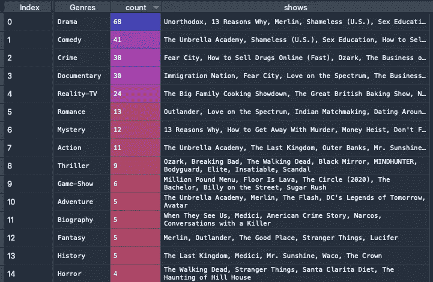
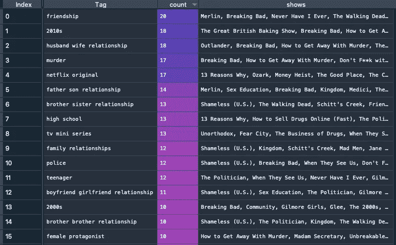
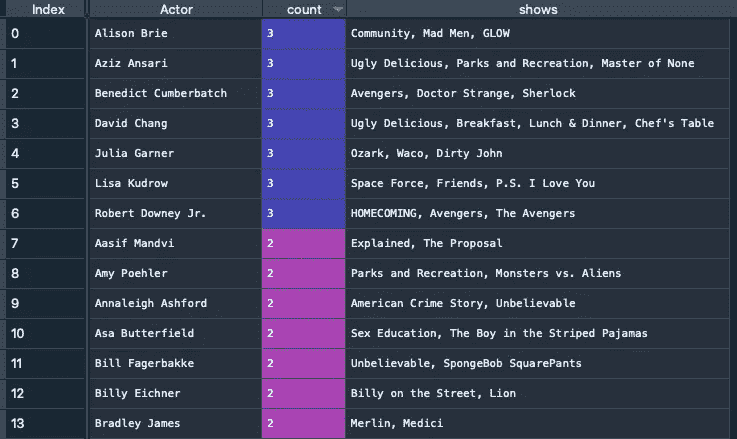
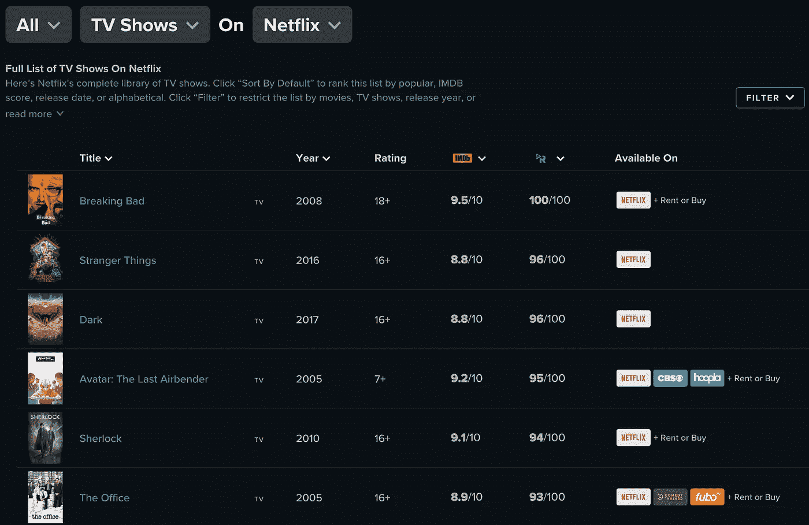

# 使用神经网络推荐网飞的节目

> 原文：<https://towardsdatascience.com/using-neural-nets-to-recommend-shows-on-netflix-d4fbecffe0b0?source=collection_archive---------55----------------------->

## 机器学习应用

## 训练模型来预测上瘾的概率

> 没有什么比在网飞开始做一些事情，然后意识到 20 分钟内你不感兴趣更令人痛苦的了。在这个项目中，我试图通过计算在给定特定表演特征的情况下，我将完成一个表演的概率，将事情掌握在自己手中。

隔离 5 个月后，我非常确定我已经看完了我想在网飞看的所有东西。从积极的角度来看，能够在凌晨 2 点睡觉，9 点起床去工作对我的工作效率并不是很好。曾几何时，我真的很喜欢每个工作日步行 30 分钟到加州火车站，然后再回来。对我慢慢陷入彻底的无精打采的唯一安慰是，我一直在努力阅读网飞的原著。没什么可看的了，再加上决定让自己的时间变得更有效率，这两个因素促使我尝试使用神经网络来预测我接下来应该看什么。


来自 [Unsplash](https://unsplash.com/photos/11SgH7U6TmI) 的[自由股票](https://unsplash.com/@freestocks)的照片

# 步骤 1:获取数据

这个项目的第一步是获得我的观察活动。我喜欢网飞使这很容易访问，甚至下载为. csv 文件。

这是我在过去 3 年里看过的关于网飞的完整列表(只看超过 1 集的节目，我看过 100-200 个关于网飞的节目)。这让我有可能开发一个更加个性化的推荐系统。如果你是网飞的新用户，该平台通过使用与你相似的人的观看模式，避开了缺乏你观看活动数据的问题。

然后，我从 IMDb.com 搜集了一些数据，这些数据包含了很多电视剧的特征，比如类型、演员、创作者、剧集长度和标签。这里有一些快速汇总表，显示了我在网飞观看的节目中最受欢迎的流派、演员和标签。



观看的热门类型(由 IMDb.com 定义的类型)，按作者分类的图片



热门观看标签(IMDb.com 定义的标签)，作者图片

我决定不使用 actors，只是因为数据中可能有太多的变化来提供任何有用的信息——这最终会创建太多没有任何真正预测能力的特征(也称为过度拟合)。



顶级演员观看(演员在 IMDb.com 上搜索)，图片由作者提供

有了一大堆用来预测我想看什么节目的特征(或自变量)，接下来我需要创建一个因变量。因变量只是一个 1 或 0 的指示器，它描述了在我开始的情况下，我是否完成了一个节目。

# 步骤 2:预处理和特征选择

在这一步中，我们试图将我们的数据转换成一种可以用来运行神经网络的格式。我的数据集中的每个观察都是电视节目和季节的组合。比如《十三个为什么》第一季。我添加到数据集的特征包括作为分类变量的流派、标签和季节号，以及作为数值变量的剧集长度。

为了创建有用的东西，我必须将数据集转换成一个包含各种虚拟变量的大数据集。例如，对于“戏剧”类型，像“13 个原因”，“非正统”这样的节目以及该类型的其他 18 个节目的值为 1，而所有其他节目的值为 0。

因为我有大量的标签，所以我最终得到了一个包含 2000 多个特征的大数据集，但只有 200 多个观察值！这导致我不得不削减功能，以防止严重的过度拟合。为了做到这一点，我创建了一个相关性矩阵，查看所有特征之间的相关性。这使我能够删除那些不会提供任何新信息的高度相关的特征。例如，类别“犯罪”将与标签“谋杀”高度相关，因此“谋杀”将被移除。下面是实现这一点的一些示例代码:

```
X_corr = X.corr() columns = np.full((X_corr.shape[0],), True, dtype=bool) #Keep only columns with correlation less than 0.9 for i in range(X_corr.shape[0]): 
    for j in range(i+1, X_corr.shape[0]): 
        if X_corr.iloc[i,j] >= 0.9: 
            if columns[j]: columns[j] = False selected_X = X[X.columns[columns]]
```

使用上述相关矩阵作为特征选择方法的一个限制是，它不会拾取相关单词的相关性。例如，像“高中”和“高中生”这样的标签可能不会被上面的算法选中。如果有的话，这两者之间可能存在非常小的相关性(因此，在我项目的下一个实现中，我希望尝试一些单词关联算法来改进特征选择过程)。

# 第三步:型号选择

我使用 Keras API 运行 TensorFlow。有了我可以指定的一大堆参数，我决定尝试几个不同的参数，看看在将训练好的模型应用于测试集时，什么会产生最高的准确性。我决定关注以下杠杆:节点数、正则化系数和压差值。总之，这些杠杆可以提供一个最不可能欠拟合或过拟合的模型。

下面是一个代码示例，它创建了一个简单的参数矩阵，我希望执行网格搜索来确定最佳模型:

```
#Generate list of nodes to search over
nodes = np.arange(12, 61, 24)#Generate list of dropout values to search over
dp = np.arange(0.2, 0.81, 0.3)#Generate list of regularization coefficients to search over
reg = np.array([1e-4, 1e-5, 1e-6])params = list(product(nodes, dp, reg))
```

关于网格搜索的完整实现，请点击这里的链接！

以下是我在这个网格搜索过程中获得的一些经验:

*   **在开始前尝试几个型号；观察损失函数:**当我第一次开始运行几个测试模型时，我观察到我的测试集的损失函数在增加，这对于一个旨在最小化损失函数的模型来说是非常奇怪的。这个奇怪的现象是通过指定一个较小的步长来解决的，这样梯度下降就不会“跨过”最小值。下面是一些如何实现较小步长的示例代码:

```
from keras.callbacks import LearningRateScheduler#define when you want to reduce your step size by setting n
n = 50def lr_scheduler(epoch, lr):
    if (epoch > n):
        #define your step size here
        lr = 1e-5 
    return lr...model.fit(X_train, Y_train, epochs = 200, batch_size = 32,\                    callbacks = [LearningRateScheduler(lr_scheduler, verbose=1)])
```

*   **使用“提前停止”功能**:这似乎是常识，但 Keras 中默认的“拟合”命令不会提前停止你的神经网络，即使下一次迭代没有在最小化你的损失函数方面提供显著的改善。此外，它不使用导致最低损失的权重，除非您使用`keras.callbacks.EarlyStopping`功能。下面是一个实现示例:

```
from keras import callbacksearlystopping = callbacks.EarlyStopping(monitor =”val_loss”,\ 
mode =”min”, patience = 30, restore_best_weights = True)
```

*尽管你可能受到诱惑，但你不希望指定一个“val_accuracy”作为停止标准，因为这可能会导致过度拟合。*

*   **k 倍交叉验证的重要性**:由于我的训练和测试集非常小，仅在一种类型的训练和测试集上尝试许多模型很可能会导致过度拟合。因此，对于每个模型，我在 10 个不同的训练测试集组合上进行尝试，并取平均准确度来选择一个模型。有许多包可以实现这一点，但是我实现了一个简单的 for 循环，并为训练测试分割的每次迭代使用了不同的种子。

```
for i in range (0, 10):     X_train, X_test, Y_train, Y_test = train_test_split(X, Y,\ test_size = 0.2, random_state = 1234 + i, stratify = Y)...#Fit your model here
```

*   **添加层的危险**:一开始，我根据自己对神经网络功能的直觉，给我的模型添加了许多层。由于神经网络基本上试图创建新的特征，在给定现有特征的情况下最好地预测结果，所以我假设有更多的层会更好。然而，这导致了严重的过度拟合。因为我已经面临着适应太多特性的危险，所以创建一个更复杂的模型会加剧这个问题。
*   **并行处理的重要性:**当我第一次开始网格搜索来寻找参数的最佳组合时，我计算了一次运行的时间，然后意识到，对于我想要尝试的大约 729 个不同的模型，依次运行每个模型需要大约 14 个小时。使用`multiprocessing`包，我可以同时运行大约 12 个模型，将我的总处理时间减少到 2 个多小时。

```
#Always time your code first before running all your different models! Assume here that train_model is a function I created to train my model.start = time.time()
train_model(params)
end = time.time()
print(f"Runtime of the program is {end - start}")#Here is some simple code to perform parallel-processing for a grid searchimport multiprocessing as mp
pool = mp.Pool(processes = 12)
test = pool.map(train_model, params)
```

# 第四步:预测在网飞看什么

在想出一个模型来训练我的数据后，我导出了这组参数和权重，开始生成一个概率，即我将完成网飞上的每一场演出。

为了得到网飞所有的节目，我从 Reelgood.com 搜集了一些数据。事实证明，大约有 1700 个来自网飞所有版本(本地和外国)的电视节目。然后，我再次搜集了 IMDb.com 的数据，寻找所有这些节目的特征。



在[Reelgood.com](https://reelgood.com/tv/source/netflix)的网飞演出的完整列表(作者截图)

最后，我将我的模型和权重应用到我的网飞头衔的完整列表中，我最终得到了我将获得每个网飞头衔的预测概率。

我的首选是一些我从未听说过，但听起来确实有点有趣的节目。以下是我的模型极力推荐的一些节目(括号中的概率指的是在我开始的情况下，我完成一个节目的概率):

*   ”[她一定要得到它](https://www.imdb.com/title/tt3713588/?ref_=ttmi_tt)(97.3%的可能性)，根据斯派克·李的热门电影改编，讲述了一个年轻的黑人女性如何驾驭自己的爱情生活。听起来像是我喜欢的“亲爱的白人”!
*   我通常不喜欢韩剧，但“[之声](https://www.imdb.com/title/tt6212854/?ref_=nv_sr_srsg_9)”(96.1%的概率)——这是一个关于侦探解决谋杀案件的故事——听起来很有趣！
*   《丽塔》(94.5%的可能性)——这是一个关于直言不讳、叛逆的老师的故事，她需要掌控自己的个人生活？这听起来有点像威廉姆·H·梅西在《无耻之徒》中扮演的角色，我非常崇拜他。此外，它来自丹麦，这使得它更加迷人！
*   “[多莉·帕顿的心弦](https://www.imdb.com/title/tt8509922/?ref_=nv_sr_srsg_0)”(93.9%概率)——关于家庭的节目设置为多莉·帕顿音乐？听起来像是“这是我们”遇到了“小美国”,我就是为此而来的。

最后，我实际上看到了一些我最喜欢的节目与推荐节目的相似之处，这是一个很好的健全性检查，表明该模型是有效的。

总之，如果再来一次，我会做下面这些事情:

*   **模型中查看的构建日期:**人是会变的，所以模型需要跟上！我会喜欢 3 年前看的东西吗？从这个意义上来说，我最近看的电视节目的重量可能会增加，或者如果我厌倦了某个类型，重量可能会减少？不过，总的来说，我确实有轻微的强迫症，比如，只有去年感恩节去伦敦的时候，我才会看英剧。因此，在这种情况下，加权显示我刚刚完成的可能是有意义的。
*   **获取更多数据:**没有什么比更多数据更能帮助模型了。尤其是因为我总是处于过度适应我所拥有的功能的危险之中。也是看更多网飞的借口(尽管我刚刚订阅了 Apple TV+,相信我，当我告诉你你需要它的时候)。
*   **收集更多有见地的特征:**我是否忽略了其他比类型和标签更具描述性的特征？例如，烂番茄分数？(我认为这通常能很好地预测我的观看活动，但也有一些明显的例外，比如《13 个为什么》第三季——我对此没有借口，也不知道为什么我会如此上瘾)。
*   **执行文本关联:**如果我有一些 NLP 经验，我会使用比相关矩阵更复杂的算法来选择我的特征。但是，嘿，这是另一个项目的想法，不是吗？
*   **选择基于高召回率的模型:**我稍微想过这个问题，但是考虑到任务的性质，选择召回率更高的模型不是更好吗？虽然这可能会在推荐的节目中产生很多噪音，但有更多的假阳性几乎没有什么代价。

然而，这些都是以后的想法。今晚，请原谅我回去完成“13 个为什么”的原因，这样我才能继续我的生活。

*在我的 Github 上可以看到这个项目的完整代码:*

[](https://github.com/bryanchiaws/netflix_ml_project) [## Bryan chaws/网飞 _ml_project

### 机器学习项目-使用神经网络来预测显示，我会喜欢基于过去的观看活动。01 …

github.com](https://github.com/bryanchiaws/netflix_ml_project)